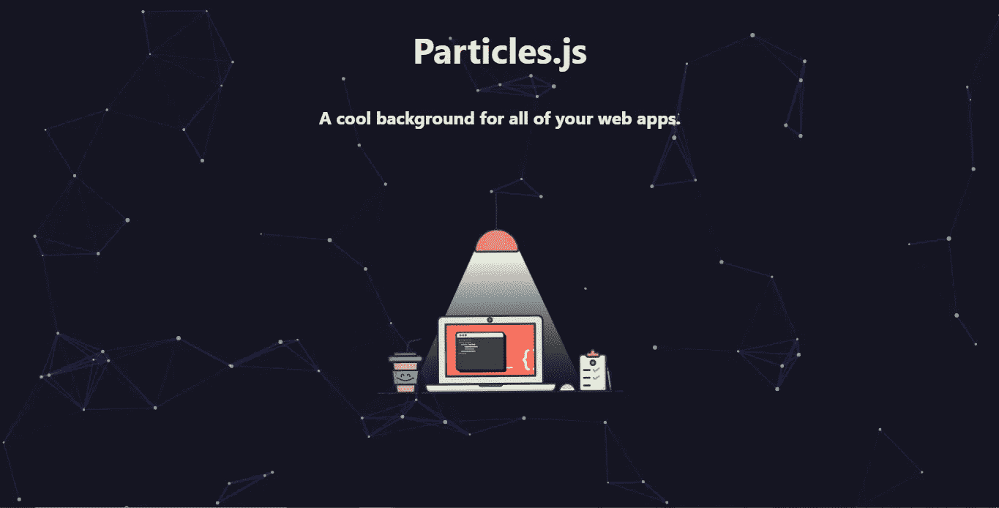
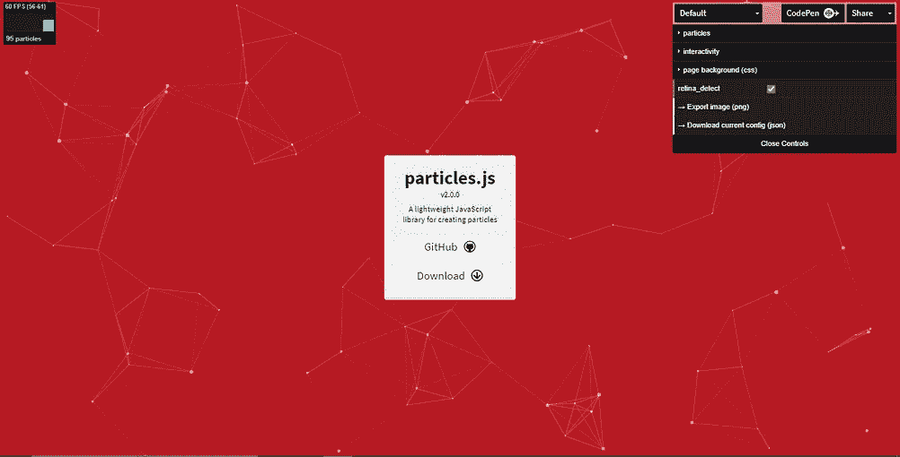
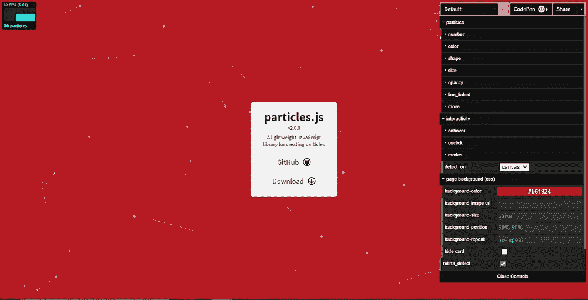
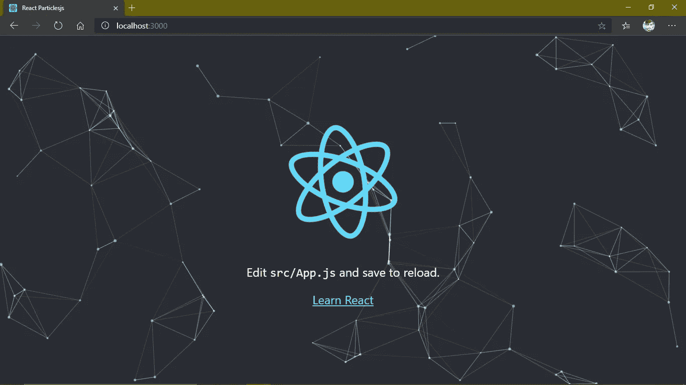

# 在 React with Particles.js 中创建交互式背景

> 原文：<https://javascript.plainenglish.io/creating-an-interactive-background-in-react-with-particles-js-263c2dec30df?source=collection_archive---------0----------------------->

## 一个教程，用几个简单的步骤制作出反应灵敏、优雅的交互背景。



Image by Author

当我开始做一名网页开发人员时，我总是对所有拥有如此令人惊叹的交互背景的网站感到惊讶。我总是对自己说，也许有一天，我也会学着这样做。但这将需要一些时间，因为这意味着只有非常有经验的网页开发人员。

> 一年半下来，我在我的兼职项目中制作了所有这些互动背景，如果我说实话，这让我很开心。
> 
> 如果有一件事让我感到遗憾的话，那就是我以为这些设计只能由专业开发人员来完成，而我却做不到。这使我的进步推迟了几个月。

在这篇文章中，我想帮助你制作一个交互式背景，而不必了解它的特殊性。看看下面你马上要做的互动背景，你可以很容易地在你所有的网络应用中使用它。

Particles.js Demo

# 设置项目

## 先决条件

1.  `Node.js`安装在您的系统上
2.  `create-react-app`套餐
3.  优选地，IDE
4.  需要背景/愿意学习

## 创建 React 应用程序

首先，我们将在`create-react-app`包的帮助下创建一个 React 应用程序，因此我们运行以下命令:

```
npx create-react-app react-particles
cd react-particles
```

## 清理杂物并设置应用程序(可选)

现在，您已经创建了您的应用程序，在 IDE 中打开您的工作文件夹，您会看到许多文件已经存在，但是对于这个项目的范围(通常是所有小规模的项目)，我们可以删除一些文件，使您的项目文件夹看起来更好，更有条理。因此，删除项目的`src`文件夹中的这些文件:

1.  `App.test`
2.  `serviceWorker.js`
3.  `setupTests.js`

这将清空你的`src`文件夹，你所有的工作都将在那里完成。

现在，打开您的`public`文件夹并转到`index.html`，在文件中，将您的应用程序的`title`更改为 React Particlesjs(或您喜欢的任何东西)，即，将`<title>React App</title>`替换为:

```
<title>React Particlesjs</title>
```

现在，打开`src`文件夹中的`App.js`和`index.js`文件，删除不必要的行和导入(对于被删除的文件)，之后它们应该是这样的(虽然`React.StrictMode`是可选的):

Initial App.js and index.js

**但请注意，这是一个可选步骤，如果您不想从头开始创建应用程序，您可以省去整个步骤。**

# 开始项目

## 粒子. js

现在，我们来看看我们将要使用的 JavaScript 库，它叫做 **particles.js** ，由 Vincent Garreau 开发。可以在这里看一下演示[。](https://vincentgarreau.com/particles.js/)

正如你在下面的图片中看到的，有几个选项可供选择，首先是下拉菜单，默认为选中，在那里你可以从几个选项中进行选择，并为你未来的网络应用程序获得不同的外观。



Demo of the library from [https://vincentgarreau.com/particles.js/](https://vincentgarreau.com/particles.js/)

然后，如果你点击粒子或互动，不同的选项出现，如数字，点击它你会得到增加这些粒子密度的选项。你也可以改变颜色或形状或所有其他可以从图像中看到的东西。

接下来，你会看到交互性下拉菜单，你可以改变鼠标悬停或点击屏幕所产生的效果。之后，我们有页面背景，这基本上是库告诉我们放在我们的`.css`文件中的东西(并不是在所有情况下我们都需要这样做，正如本文后面将演示的)。

> 总而言之，这个演示网站是你的，你可以尝试所有的东西，看看它有什么效果，而不必了解它是如何工作的。

最后，在你完成实验并最终对设计满意后，点击*下载当前配置(JSON)。*这将下载您当前的设计配置。

## 在 React 项目中使用 Particles.js

为了将这个库集成到您的 React web 应用程序中，我们需要`react-particles-js`包，所以首先我们使用这个命令:

```
yarn add react-particles-js
```

安装完成后，我们进入 IDE 并开始编辑。

> 旁注—
> 
> `react-particles-js`从`3.0.0`版本开始使用 [tsParticles](https://github.com/matteobruni/tsparticles) 作为核心库，而不是 particles.js.
> 你可以在这里找到更多细节:[https://dev . to/matteobruni/react-particles-js-ts particles-3 okk](https://dev.to/matteobruni/react-particles-js-tsparticles-3okk)。
> 还有一个官方的 tsParticles react 库:`react-tsparticles.` 看这里:[https://particles.js.org](https://particles.js.org)。

首先，我们打开刚刚下载的`json`文件，复制它的全部内容。然后，我们在`src`文件夹中创建一个新文件夹`config`，并在其中创建一个名为`configParticles.js`的新文件。

现在，在这个文件中，创建一个名为`configParticles`的`const`，并给它分配您刚刚复制的内容。

particlesConfig.js

在这里，只需将`json`文件的内容粘贴到注释的位置，即，而不是`/* ... */`粘贴您的内容。所以，现在你的配置文件已经准备好了，现在你只需要导入并在你的`App.js`中使用它，你就有了你喜欢的背景。

## 完成项目

所以，我们到了项目的最后一部分，我们打开我们的`App.js`文件并导入这两样东西:

```
import Particles from 'react-particles-js';
import particlesConfig from './config/particlesConfig';
```

然后，在`App`函数中，我们给带有`className=“App”`的`div`一个内联样式(也可以在`App.css`文件中给它，但那只是额外的步骤)，在这个内联样式中我们设置它的`position: "relative"`和`overflow: "hidden"`。

在下一行中，我们创建了另一个`div`组件，并为它提供了一个内嵌样式，在其中我们设置了它的`position: "absolute"`。

最后，我们使用刚刚导入的`Particles`组件，并给它一个`height="100vh"`和`width="100vw"`。在这之后，我们使用导入的`particlesConfig`作为`Particles`组件的`params`。

App.js

我们只需更改/添加 6 行，即。，`6–7` & `11–14`除了使用`json`文件之外，我们已经成功地为我们的 web 应用程序制作了一个交互的、反应灵敏的、外观漂亮的背景。

# 运行我们的网络应用

最后，我们使用以下命令在 bash/命令提示符下运行我们的 web 应用程序:

```
yarn start
```

瞧，现在你有了我们自己的 web 应用程序，它有一个漂亮的背景，可以在任何地方使用。

# 演示

如果您从 Particles.js 库 demo 中复制了默认的配置代码，并遵循与教程相同的路径，那么 web 应用程序应该是这样的。



Demo for React-Particlesjs

如果你遇到任何困难，请随时联系我，或者你可以看看我的 GitHub 回购 [这里](https://github.com/shashankcic/react-particlesjs) *有任何疑问。*

*更多内容请看*[*plain English . io*](http://plainenglish.io/)