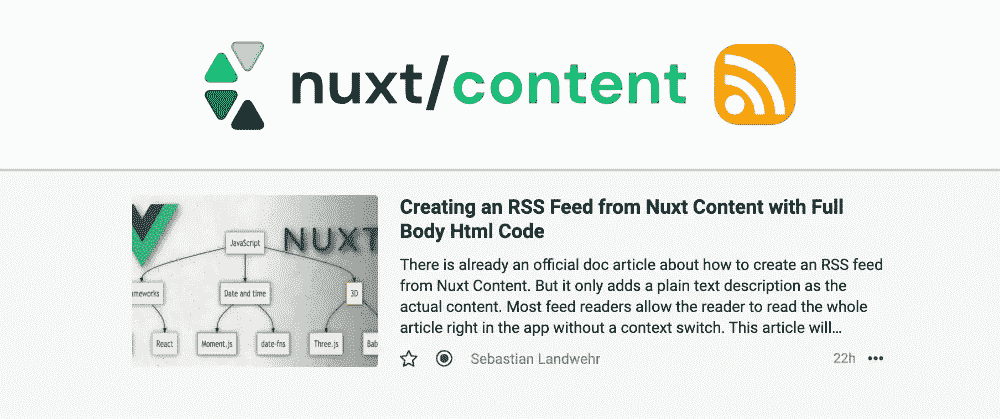
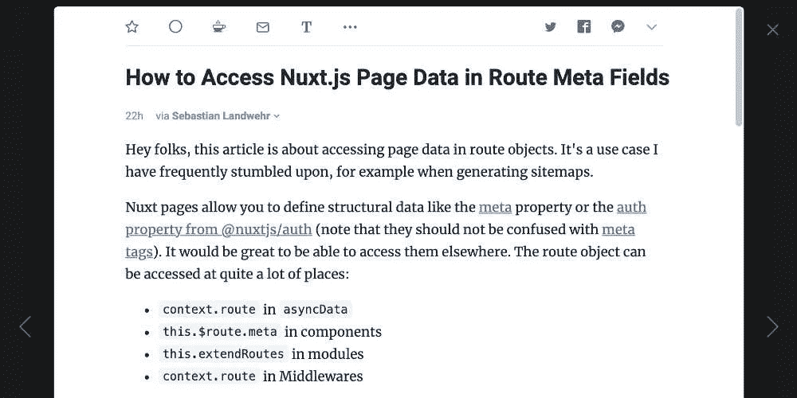
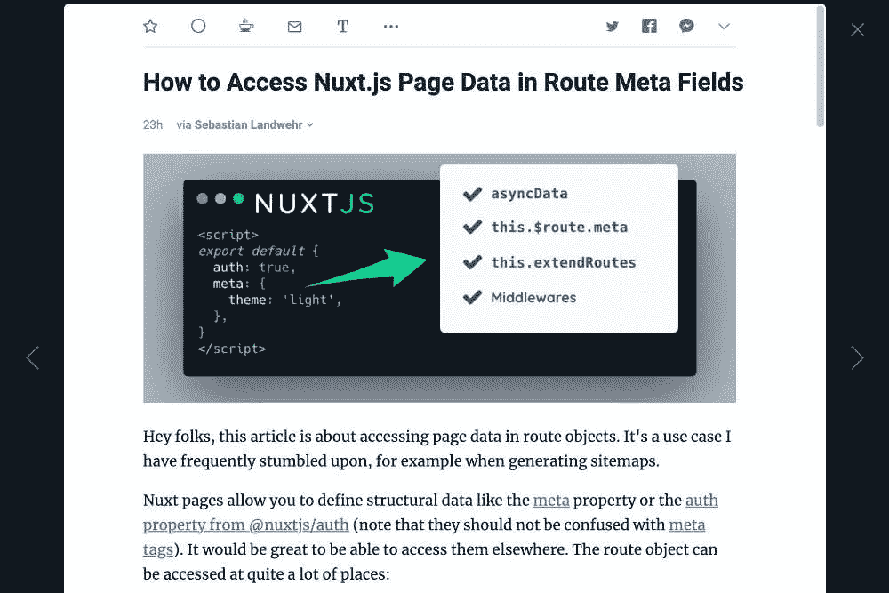
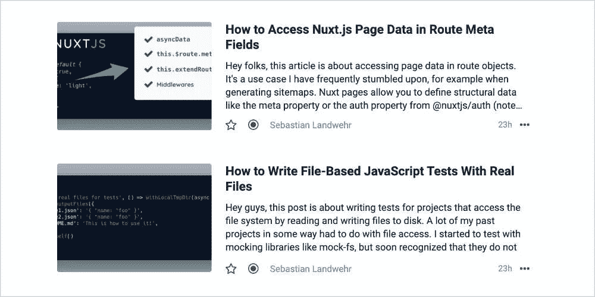

# 使用完整的 HTML 从 Nuxt 内容创建 RSS 提要

> 原文：<https://javascript.plainenglish.io/creating-an-rss-feed-from-nuxt-content-with-full-body-html-code-f83072a64092?source=collection_archive---------6----------------------->

## 如何通过添加简单的**插件模块**将文档添加到 RSS 提要中

已经有一篇关于如何从 Nuxt 内容创建 RSS 提要的官方文档文章。但它只是添加了摘录作为实际内容。大多数 feed 阅读器允许读者直接在应用程序中阅读**整篇文章**，无需切换上下文。本文将介绍一种通过添加一个简单的**插件模块**将整个文档添加到 RSS 提要的方法。

# nuxt-content 组件之外的 HTML 代码的问题

Nuxt Content 是一个很棒的静态 CMS，它使得建立一个基于 Markdown 的高性能博客变得非常容易，而不需要添加大量的第三方服务。

系统的核心是`nuxt-content`组件。该组件获取应该呈现的 Markdown 文档，然后运用大魔法将其制作成一个漂亮的博客页面😊。

到目前为止一切顺利。只要使用 Nuxt 内容进行渲染，就没什么好考虑的。但是一旦您想要访问和使用**实际生成的 HTML 代码**，您将不会在包含原始 HTML 代码的文档中找到任何字段。

原因是组件在内部生成了一个 **JSON 对象**，该对象随后被转化为 VDOM 节点。所以它是由 Vue.js 呈现的。没有本地方法让 Markdown 管道在其他地方运行并处理 HTML 代码。但这正是我们所需要的，因为我们希望将带有标记的文章文本放在我们的 RSS 提要中！

# 使用 nuxt-content-body-html 将其抽象出来

我构建了 [nuxt-content-body-html](https://github.com/dword-design/nuxt-content-body-html) ，它基本上为所有 markdown 文档添加了一个`bodyHtml`字段。它重新生成 Nuxt Content Markdown 管道来生成它，还使用模块配置中的 Remark 和 Rehype 插件，因此它输出与组件相同的 HTML。好的一面是，我们可以直接把它放进去，抽象出生成 HTML 代码的逻辑，这样我们就可以专注于提要的创建。

让我们通过运行`npm install nuxt-content-body-html`来安装这个模块。然后我们将它添加到我们的`nuxt.config.js`:

太好了！为了测试，你可以在博客页面上查看`post.bodyHtml`，它应该包含 HTML 代码。

现在，我们可以调整提要创建来实际使用该字段。你可能使用过类似于[Nuxt 内容文档](https://content.nuxtjs.org/integrations/#nuxtjsfeed)的方式来设置你的订阅源。以下是单个 RSS 提要配置的简化示例:

就这样，现在您应该有一个包含完整 HTML 内容的提要了！我推荐[in reader](https://inoreader.com)来测试它，你可以用重新加载按钮重新加载文章，然后你应该会看到变化。下面你可以看到一篇文章的例子:

# 额外提示:在顶部添加一张图片

提要阅读器不仅可以显示文章的内容，它们通常还会将第一张图片显示为文章列表中的摘要图片。对于读者来说，获得文章内容的第一印象是一件很棒的事情！只需在顶部添加一个图像，就可以了。像这样调整提要创建:

以下是 Inoreader 中的结果:

以及由此产生的摘要视图:

# 结论

本文是关于包含完整 HTML 的 Nuxt 内容的 RSS 提要。 [nuxt-content-body-html](https://github.com/dword-design/nuxt-content-body-html) 是一个快速简单的解决方案，可以向文档添加一个`bodyHtml`字段，用于 feed 创建功能。希望对你有点用！如果你喜欢，可以在 GitHub 的[星留下一颗星🌟。感谢阅读！](https://github.com/dword-design/nuxt-content-body-html)

如果你喜欢我正在做的事情，请在 [Twitter](https://twitter.com/seblandwehr) 上关注我或者查看我的[网站](https://sebastianlandwehr.com)。非常感谢！❤️

*最初发表于*[*sebastianlandwehr.com*](https://sebastianlandwehr.com/blog/creating-an-rss-feed-from-nuxt-content-with-full-body-html-code)

*更多内容看* [***说白了***](http://plainenglish.io)