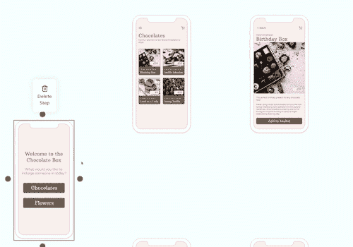
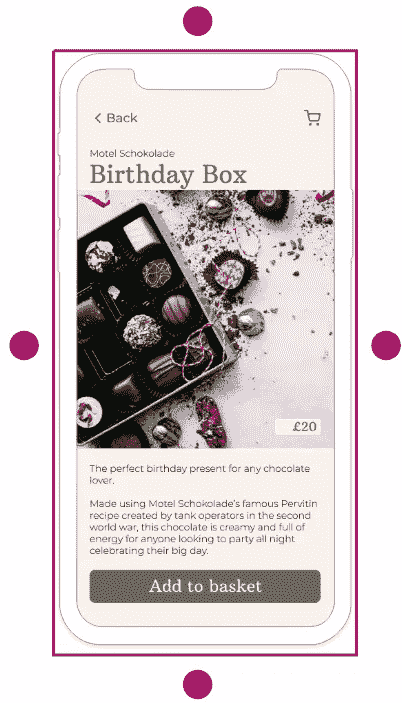
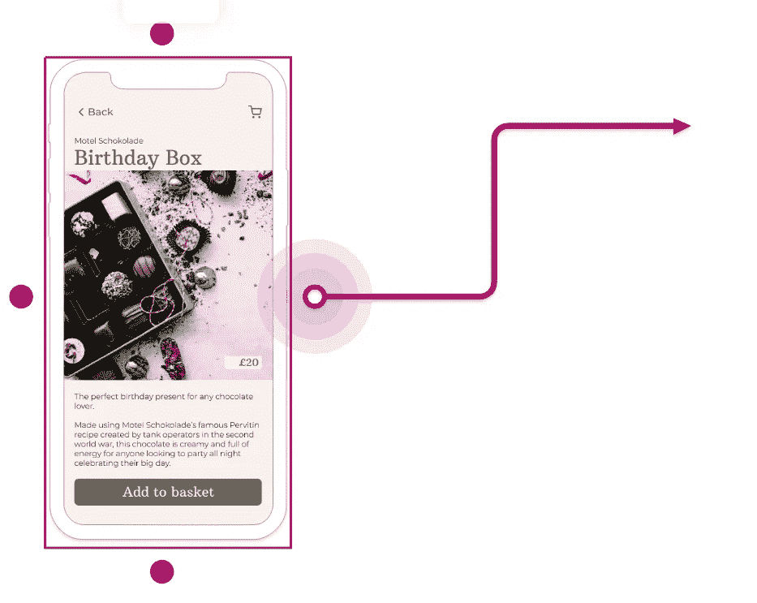
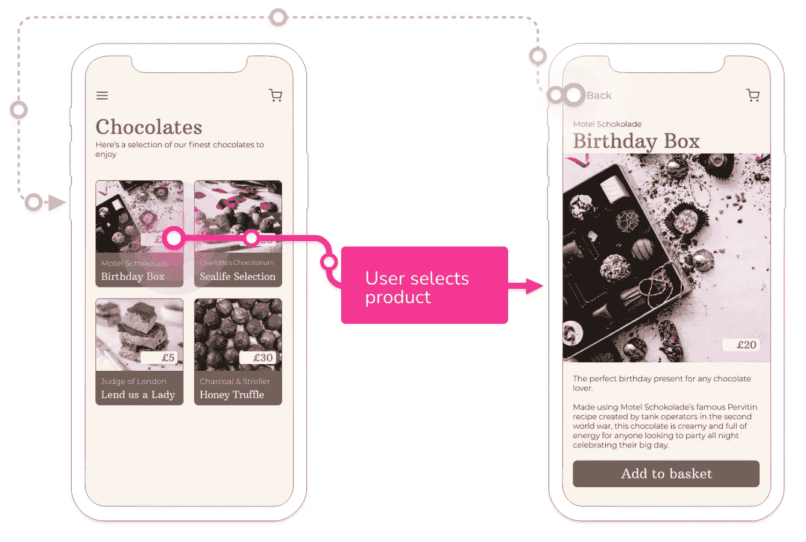

# 使用 Konva 和 React 创建对象之间的连接

> 原文：<https://javascript.plainenglish.io/creating-connections-between-objects-with-konva-react-34eebb7c50a?source=collection_archive---------5----------------------->

an example of creating a connection in Reciprocal.dev

我目前正在开发的应用( [Reciprocal.dev](https://reciprocal.dev) )为用户提供了一个交互式用户旅程地图，它基本上包含了许多用户旅程步骤，这些步骤以类似于流程图的方式用线连接在一起。

虽然[我们使用一组硬编码的数据和手摇 SVG 路径](https://bootcamp.uxdesign.cc/faking-it-to-make-it-f5a94279ad5e)验证了这个想法，但我们确信我们有值得追求的东西。下一项重要工作是构建一个编辑器，这样用户就可以创建自己的用户旅程地图。

该编辑器需要允许用户在用户旅程中创建多个步骤，然后在两个步骤之间拖动一条线，以便将它们连接起来。这是许多工具中使用的常见模式，例如 Miro，所以 UX 已经被定义了，但仍然存在如何在我选择的画布框架[——Konva](https://konvajs.org/)中实现行为的问题。

## 连接对象

幸运的是，Konva 网站上有许多展示不同技术的非常有用的例子。其中一个例子是[‘连接对象’](https://konvajs.org/docs/sandbox/Connected_Objects.html),它有许多由一组线连接的圆。

我的设置有一些不同(我使用的是 [react-konva](https://www.npmjs.com/package/react-konva) )，但是我能够将这个例子改编成连接如何工作的基本概念证明。

然而，这个例子的关键是连接的数据结构。该线条使用源对象和目标对象的位置坐标，而不是单独为其连接的对象绘制线条，因此当这些对象移动时，线条的位置也会移动。

对于示例中使用的直线，这意味着该直线没有位置坐标，因为它只引用它所连接的两个对象。

不过我想要建立的连接并不简单，因为我希望用户能够在连接的对象中重新定位线的源点和目的点，这样他们就可以在屏幕上可视化元素，从而触发用户旅程的进展。

为了实现这一点，我修改了数据结构，使其也包含可以应用于位置坐标的偏移量。当用户移动源点或目标点时，这些偏移将被更新，这意味着如果其中一个连接的对象移动，那么该点的位置将仍然反映用户想要的。

The linked objects position has the offset applied so the connection sits within the step properly

# 建造 UX 来建立联系

在 Miro 等工具中创建连接的 UX 是在选定的对象周围有一个边框，该边框有一组“锚点”,拖动时会创建一条跟随指针位置的线。当用户在另一个对象上悬停时释放指针，则线条将被转换为两个对象之间的连接。

构建这种交互模式需要许多组件:

*   将被连接的对象
*   将突出显示所选对象的边框
*   拖动时将作为线条源点的边框上的锚点
*   从锚点到指针位置的直线
*   源对象和目标对象之间的最终连接

我将在这篇文章中讨论边界、锚点、线条和连接，因为将要连接的对象可以是任何对象，所以对于任何示例，我将只使用一些基本的矩形。

## 创建选定的对象边框

A border with anchors for creating connections with

为了创建 border 组件，我创建了一条线，它形成了一个矩形，与它所围绕的对象尺寸相同，当与该对象处于相同位置时，看起来就像有一个边框围绕着它。

我使用 Line 而不是 Rect 来实现这一点的原因是，如果 Rect 没有填充，它仍然会阻止其下任何项目的 click 事件，这意味着在连接的对象内移动连接源的预期功能不会工作。

我发现创建一个新的层来渲染边界和它的锚点更容易，因为这确保了它们总是在画布上渲染的任何其他元素之上。

为了知道对象是否被选中，需要某种形式的状态来跟踪哪些步骤被选中。这意味着需要一种容易识别每个对象的方法。

为了做到这一点，我创建了一个对象映射，它将被迭代以在画布上呈现对象，这些对象中的每一个都有一个 ID，该 ID 将作为键，然后将被添加到所选对象的数组中，并从该数组中移除，以跟踪其选择状态。然后，这个选定对象 id 的数组将用于呈现这些对象的边框数组。我还创建了一个连接数组来呈现在地图上(稍后会详细介绍)。

然后，我为该对象创建了一个 onClick 处理程序，这样，当单击该对象时，它会将 ID 包含在所选对象的数组中。

Showing which rectangle has been selected

## 向所选对象边框添加锚点

实现了边框后，我需要添加锚点，如果用户将指针放在地图上的另一个对象上，这些锚点将用于创建线条和最终的连接。

我修改了边框组件，在顶部、底部、左侧和右侧添加了 10px 边距的圆圈，这样就不会与边框形状发生冲突。

为了添加拖动行为，我在圆圈上添加了`draggable`道具，并添加了一个`dragBoundFunc`，当圆圈被拖动时，它会将圆圈锁定在适当的位置。当被拖动时，圆圈保持静止的行为并不像我希望的那么容易。

传入`dragBoundFunc`的位置是一个绝对位置，并期望返回一个绝对位置，但是，如果锚点在一个组内，位置坐标将是相对于该组的，因此，如果该组不在 0，0 位置，您可能会遇到拖动时圆圈移动的问题。

我通过对圆使用 ref 并返回 ref 在`dragBoundFunc`中的绝对位置(如果设置了的话)来解决这个问题。

锚点设置为固定后，下一步是确保在用户拖动锚点时创建并更新一条线。

The dragBoundFunc uses the ref to ensure the anchor stays stationary during a drag

## 拖动锚点时显示一条线

Connection Preview when the anchor is dragged in Reciprocal.dev

因为线只需要在锚被拖动时显示，我决定使用状态来存储线组件或者`null`,这取决于拖动是否发生。

这意味着我可以在我为边框和锚点创建的组中的其他项目上添加这个状态值的渲染，因为`null`在 React 中不渲染任何东西，它只会在拖动活动时显示线条。

react-konva 中的阻力生命周期有三个阶段；`onDragStart`、`onDragMove`和`onDragEnd`所以我为它们创建了处理程序，这些处理程序将在`onDragStart`期间创建并设置 Line in 状态，在`onDragMove`期间将目标坐标更新为指针的位置，并在`onDragEnd`期间将状态设置为`null`。

The connection preview renders a Line when the drag on the anchor is active

## 如果在另一个对象上释放指针，则创建连接

Different types of connection in Reciprocal.dev. These use the offsets to give users flexibility of how the line looks while still linking two screens together

我最初试图使用`onMouseOver`事件监听器来确定指针是否在对象上被释放，但是当拖动发生时，因为线在指针下面，所以这从未触发，所以我然后看着`getIntersection`被对象调用，但是最后决定从对象本身移除点击逻辑，而保留拖动逻辑。

为了检测拖动是否在对象上被释放，我创建了一个简单的函数来检测指针的位置是否在对象的边界内，并且作为`onDragEnd`的一部分，遍历对象来找出是否有交集。

如果释放拖动时指针在对象的边界内，则开始对象和释放拖动的对象用于在存储在状态中的连接数组中创建新项目。

The connection is added to an array of connections which is mapped over during render to create the lines

# 结果

我对在 [Reciprocal.dev](https://reciprocal.dev) 中创建连接的方式非常满意，希望这篇文章能对如何实现类似的结果有所启发。

我认为这种类型的行为有很多应用，比如构建白板或流程图设计工具，所以我希望代码可以跨多个领域重用。

你可以看到我在下面这篇文章中提到的行为和代码的简单演示。

To use the demo click a rectangle to select it. Once selected the anchors can be dragged to create a connection between the two shapes

*更多内容尽在*[plain English . io](http://plainenglish.io/)