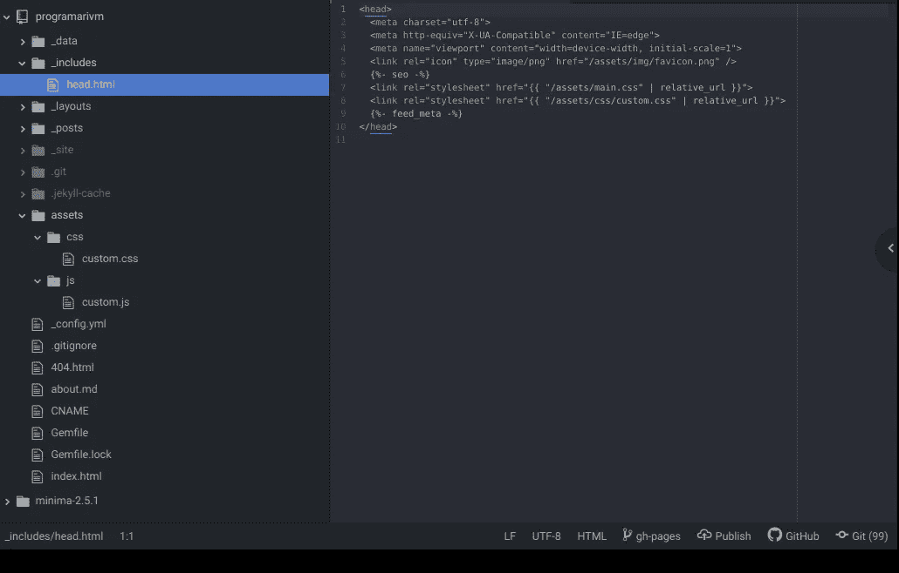

# 为基于宝石的 Jekyll 主题创建自定义资源

> 原文：<https://javascript.plainenglish.io/creating-custom-assets-for-your-gem-based-jekyll-theme-d488ac44195d?source=collection_archive---------12----------------------->

## 释放你的创造力，建立一个你的客户会喜欢的在线投资组合


你期待在 GitHub Pages 上免费托管一个令人惊叹的静态网站吗？如果是这样， [Jekyll](https://jekyllrb.com/) 绝对是一个值得使用的静态站点生成器。

[GitHub Pages 和 Jekyll](https://docs.github.com/es/pages/setting-up-a-github-pages-site-with-jekyll) 携手帮助你在眨眼之间建立和托管你的网站。有太多的 Jekyll 主题供你选择，很可能你会随意摆弄其中几个，最终按照你的意愿定制 CSS 和 JavaScript 代码。

花点时间做一个让每个人都印象深刻的决定，如果你真的想在没有任何警告的情况下在 GitHub 页面上托管你的站点，确保选择一个受支持的主题。

不要像我那样做。

最初，我决定坚持使用一个不受支持的主题，但是很快我就发现自己在处理关于页面构建过程的问题。

GitHub 支持人员给我发了一封莫名其妙的邮件，主题是:“页面构建警告。”

单击该消息时，正文将如下所示:

> 页面构建成功完成，但为“gh-pages”分支返回了以下警告:
> 
> 您正试图使用 GitHub 页面不支持的 Jekyll 主题“jekyll-theme-foo”。请访问[https://pages.github.com/themes/](https://pages.github.com/themes/)查看支持的主题列表。如果您将“theme”配置变量用于 Jekyll 主题以外的内容，我们建议您在整个站点中重命名该变量。有关更多信息，请参见[https://docs . github . com/github/working-with-github-pages/add-a-theme-to-your-github-pages-site-using-Jekyll](https://docs.github.com/github/working-with-github-pages/adding-a-theme-to-your-github-pages-site-using-jekyll)。
> 
> 有关 Jekyll 故障排除的信息，请参见:
> 
> [https://docs . github . com/articles/trouble shooting-Jekyll-builds](https://docs.github.com/articles/troubleshooting-jekyll-builds)
> 
> 如果您有任何问题，您可以在[https://support.github.com/request](https://support.github.com/request)提交请求

你可能已经注意到杰基尔主题有两种类型:基于宝石的和非基于宝石的。

创业板题材毕竟没那么可怕；相反，它们便于自动化站点的更新过程，允许您在控制台中编写一个简单的命令。

今天的帖子展示了如何将您的自定义 CSS 和 JavaScript 代码添加到 Jekyll 的默认主题 [Minima](https://github.com/jekyll/minima) ，这是 GitHub 页面支持的一个广泛使用的基于 gem 的主题。

事不宜迟，让我们像专业人士那样做吧！

首先，找出你的主题的安装路径:

```
$ bundle info --path minima
/home/standard/gems/gems/minima-2.5.1
```

然后在项目的根目录下创建`_includes`文件夹。

将主题的`_includes/head.html`文件复制到新的本地文件夹中，并通过添加您的创意 CSS 和 JavaScript 文件来覆盖该文件，如下所述。

最后，相应地创建两个文件。

在这个特殊的例子中，`assets/css/custom.css`和`assets/js/custom.js`被添加到 Jekyll 的`assets`文件夹中，如下图所示。



**Figure 1**. Create your CSS and JavaScript files in the assets folder

恭喜你。您刚刚学习了如何定制一个基于 gem 的 Jekyll 主题。

现在去 GitHub 页面上创建一个很棒的网站，并与你的朋友和同事分享。释放你的创造力，建立一个你的客户会喜欢的在线投资组合。

再次感谢您的阅读，并保持下去。

# 您可能也对…感兴趣

*   [一个反作用棋盘，棋盘上有几条线的圈圈和钩子](https://medium.com/geekculture/a-react-chessboard-with-redux-and-hooks-in-few-lines-6009cb724bb)
*   [如何轻松测试本地 React NPM 包](/testing-a-local-react-npm-package-with-ease-7d0668676ddb)

*更多内容请看*[***plain English . io***](http://plainenglish.io/)