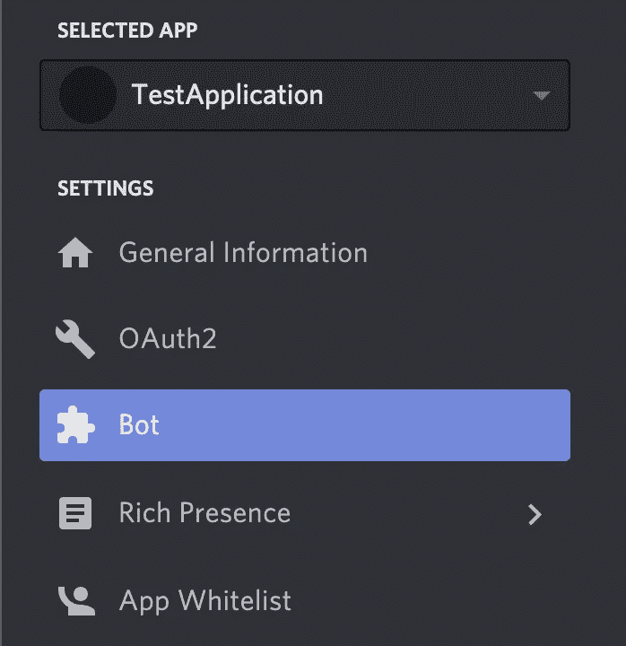
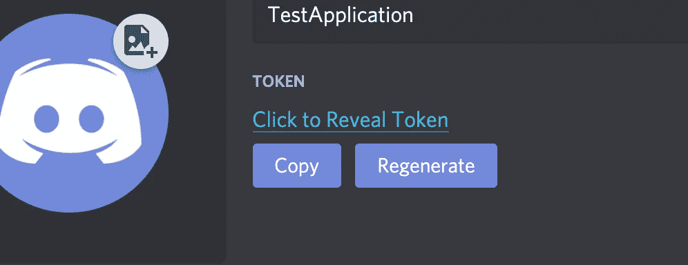
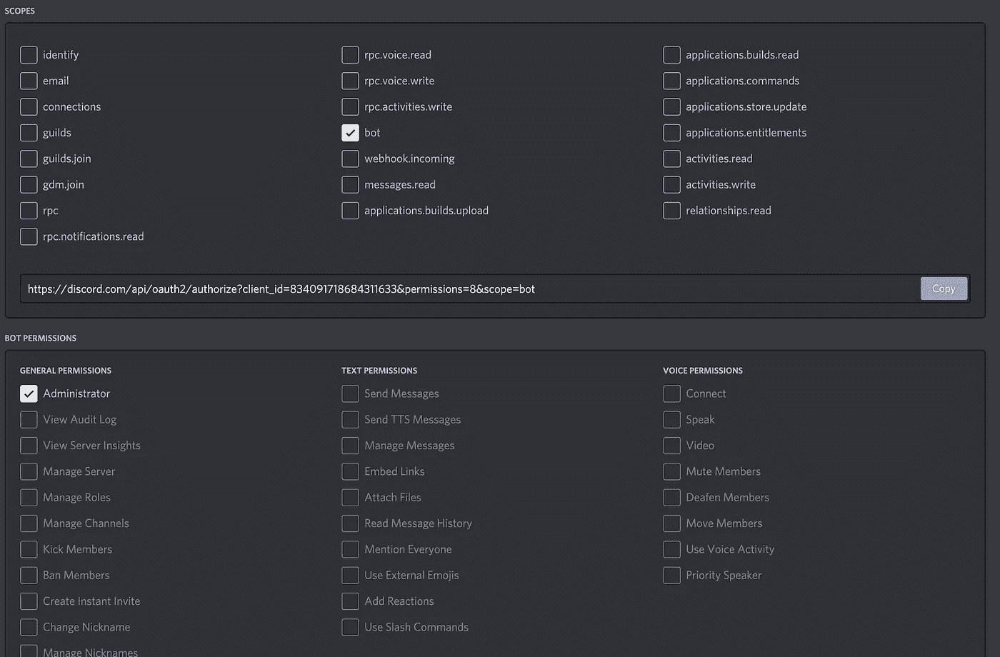
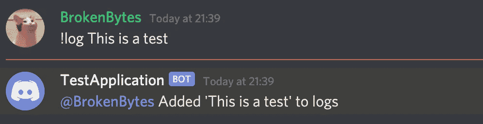
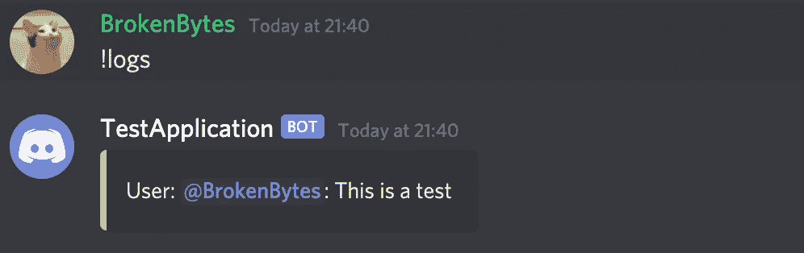
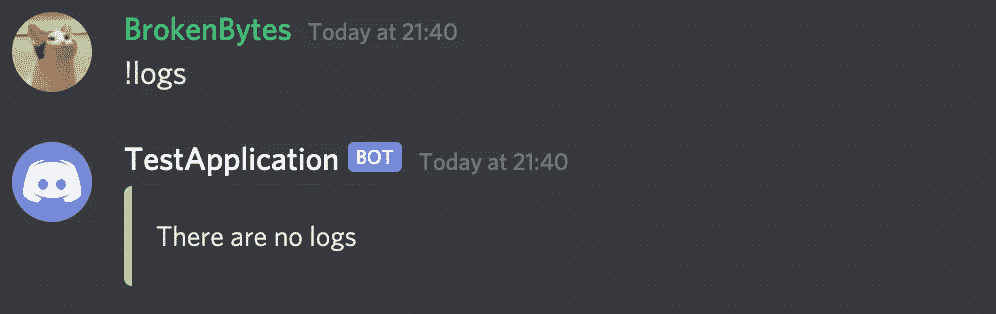

# 用 JavaScript ES6 和 Realm 创建动态不和谐机器人

> 原文：<https://javascript.plainenglish.io/creating-dynamic-discord-bots-with-javascript-es6-and-realm-fa51dea5af21?source=collection_archive---------10----------------------->


Photo by [Alexander Shatov](https://unsplash.com/@alexbemore?utm_source=medium&utm_medium=referral) on [Unsplash](https://unsplash.com?utm_source=medium&utm_medium=referral)

在疫情期间，Discord 的用户群大幅增加。虽然许多服务器都有通用的 bot，但是编写自己的 bot 才是服务器真正的改变点。

Discord 机器人是非常方便的工具，让用户在 Discord 上的生活变得更加容易和愉快。虽然周围有许多像 [YAG](https://yagpdb.xyz) 、 [MEE6](https://mee6.xyz) 等伟大的机器人，但从**开始写自己的**有许多**好处**。所以我们来探讨一下如何在 **JavaScript** 中创建一个 Discord bot。

# 项目

## 描述

我们将创建一个简单的 Discord bot，允许您将消息输入日志，其他用户可以阅读。

为此，用户将能够运行**命令** *！记录*消息。为了获得所有的日志，*！使用日志*命令。这也会清除所有以前的日志。

> **命令**是特定的消息**意为**对于不和谐**机器人**。机器人**解析**该消息，并从中获取**参数**。它们遵循一个定制的**模式**，由机器人程序员自由决定。

## 创建机器人

你要做的第**件事就是创建你的不和谐机器人。为此，请前往 [Discord 开发者](https://discord.com/developers/applications)并创建一个新的**应用**。您可以在下图中看到该按钮的外观。**


Clicking this creates your awesome discord application

当你完成这些后，移动到你的应用程序的“ **Bot** ”部分。再次，见下面的图片附上供参考。



The Bot Section found in the most left menu

现在你想点击“添加机器人”并继续。你将会被**提示**机器人不能被删除。**确认**并继续前进。


现在是时候复制**机器人令牌**了。这个文本序列被你的机器人用来登录。**千万不要**让任何人知道这个令牌。否则，入侵者可以代表你做机器人能够做的任何事情。点击“复制”进行复制。



Our unique token

最后但同样重要的一点是，请前往您的应用程序的“OAuth2”部分。

在“S **copes** 下选择“ **bot** ”。一个新的“Bot 权限”窗口将出现在 Scopes 下方。从那里选择**需要的**权限。首先，选择 administrator 是没问题的，但是您可能**而不是**稍后需要它。



The bot has administrator rights

现在，您已经完成了 bot 应用程序的配置。要邀请它加入您的服务器，请访问“ **Scopes** ”下显示的链接。

## Bot 项目

打开您选择的**终端**，输入:

```
npm init
```

根据你的喜好调整所有设置。如果你之前**没有**用过 Node.js，我**推荐**先读[安装 Node.js](https://nodejs.dev/learn/how-to-install-nodejs) 。

完成后，安装 [**discord.js**](https://discord.js.org/?source=post_page---------------------------#/) 和 [**领域**](https://github.com/realm/realm-js) ，输入:

```
npm install discord.js realm esm
```

打开您的 **package.json** 文件，编辑启动脚本，如下所示:

```
“scripts”: {“start”: “node -r esm index.js”}
```

> ESM 是一个几乎即插即用的模块，允许你立即运行 ES6 JS，而不需要 Babel 或任何其他 transpiler。你可以在这里阅读更多相关信息。

现在创建并打开您的 **index.js** 文件(或者您在上面输入的内容)。

## 陷入不和

在文件的开头，包含 discord.js 和 Realm:

```
import Discord from ‘discord.js’import Realm, { Results } from ‘realm’
```

完成后，创建真正的 [**客户端**](https://discord.js.org/?source=post_page---------------------------#/docs/main/stable/class/Client) ，它负责与您的服务器交互。

```
let client = new Discord.Client()
```

在某些情况下，你可能希望允许**意图**。这些可以在你的 **Bot 应用面板**中配置。关于它们的信息也在那里给出。此时，你很可能不再需要它们了。

为了让机器人对几乎任何事情做出反应，我们需要绑定 discord.js **事件监听器**。discord.js 模块公开了许多我们可以绑定机器人的**事件**。最重要的如下:

*   **消息** : 当连接的服务器收到消息时触发。消息事件只保存一个参数，即 [**消息**](https://discord.js.org/?source=post_page---------------------------#/docs/main/stable/class/Message) 对象
*   **messageReactionAdd** :收到反应时触发。该事件持有 [**反应**](https://discord.js.org/?source=post_page---------------------------#/docs/main/stable/class/MessageReaction) ，以及反应 [**用户**](https://discord.js.org/?source=post_page---------------------------#/docs/main/stable/class/User)

> 你可以在这里阅读更多关于 discord.js 事件[。这里的](https://discordjs.guide/event-handling/)列出了可用的赛事。

对于这个项目，只有消息事件是相关的。

为了**将我们的监听器**绑定到消息事件，我们调用客户端的方法上的**,它充当接受一个方法的**事件处理程序**。**

```
client.on(‘message’ , (msg) => { (…)})
```

每当机器人收到消息时，这个事件就会被调用。

## 解析命令

为了监听**命令**，我们需要检查我们的消息是否有自定义的**前缀**。

为此，我们可以利用字符串函数[***starts with(str)***](https://www.w3schools.com/jsref/jsref_startswith.asp)。因为 Message 通过 content 属性公开了它的内容，所以我们可以对它运行 startsWith。

```
client.on(‘message’ , (msg) => { if(!msg.content.startsWith(‘!’)) { console.log(‘Not a command, abort’) return }})
```

现在我们可以**从内容字符串中提取**我们的**命令**，而 ***substr(start，end)*** 是一个完美的选择。它可以取一个**开始**和**结束**(可选)的索引，并返回得到的 [**字符串**](https://www.w3schools.com/jsref/jsref_obj_string.asp) 。

```
let command = msg.content.substr(1)
```

将上面一行代码放在 if 语句下面。

由于我们想在日志中记录**消息，我们需要一种方法来**区分**我们的**命令**和我们的**参数**。一种方法是**用**空间**分隔**命令的各个部分，然后用于拆分参数。再次，JavaScript 对此有一个功能，叫做 [***拆分(character)***](https://www.w3schools.com/jsref/jsref_split.asp) 。查看下面的代码。首先，我们创建一个**数组****字符串**，当我们用空格分割时，它保存了我们信息的每个**子字符串**。第二，我们检查第一个参数(在“！”后面的那个 *)* 是*日志*，这是我们的第一个命令。将代码粘贴到我们插入的最后一行下面。**

```
let args = command.split(‘ ‘)if(args[0] == ‘log’) {}
```

**接下来，我们要检查第二个**参数，在这种情况下-我们的**信息**是否存在。为此，我们可以**检查**是否有**未定义的**。如果它存在，我们继续。如果它丢失，我们会向用户显示一条错误消息。将代码粘贴到前面 if 语句的括号中。****

```
**if (args[1] === undefined) { msg.channel.send(‘Missing message to log’)} else {}**
```

****在这里，我们利用先前创建的**参数**数组。但是这个代码有一个问题。因为我们要记录的消息可能包含空格。为了解决这个问题，我们可以从第二个参数**开始，将每个子字符串**连接起来。同样，JavaScript 对此有内置的方法。将以下代码添加到 else 分支。********

```
let content = args.slice(1).join(‘ ‘)
```

**[***数组。切片(索引)***](https://www.w3schools.com/jsref/jsref_splice.asp) 可以用来得到从**索引**开始的数组。一旦我们这样做了，我们就可以再次从所有的子字符串条目中创建一个字符串。这可以通过方便的方法[***array . join(str)***](https://www.w3schools.com/jsref/jsref_join.asp)来完成。它创建一个**组合的**字符串，用**字符串**分隔每个条目。**

> **对于数组和字符串，JavaScript 有很多更有用的方法。详见[阵](https://www.w3schools.com/jsref/jsref_obj_array.asp)和[串](https://www.w3schools.com/js/js_strings.asp)。**

## **存储数据**

**当我们想要持久化数据时， **Realm** 是 Discord bots 的绝佳选择。它是[](https://en.wikipedia.org/wiki/ACID)**的符合，既不是**的关系型**，也不是**的文档型**，特点是**的炽热**的快速存取，并且具有非常直观和简单的**语法**。关于**领域**的更多信息，请参见 [**领域快速入门**](https://docs.mongodb.com/realm/sdk/node/quick-start-local/) 。****

****为了**存储**数据，我们创建/打开一个**领域**并提供一个**对象定义**，该领域中的每个对象都必须符合该定义。我们的对象定义如下:****

```
**const LogEntry = { name: ‘LogEntry’, properties: { _id: ‘string’, user: ‘string’, message: ‘string’ }, primaryKey: ‘_id’,}**
```

****每个定义都需要一个主键。Realm 推荐命名为 *_id* 。****

****将对象定义粘贴到我们的导入下面。****

****现在，我们可以**打开**我们的领域了。领域**构造器**接受一个**配置**对象，我们提供了**路径**和要使用的**模式**(我们的对象定义)。****

```
**const logs = new Realm({path: `./realm/logs`,schema: [LogEntry]})**
```

****随着我们的领域打开并准备好使用，我们可以创建我们的第一个写操作。****

```
**logs.write(() => { logs.create(‘LogEntry’, { _id: msg.id, user: msg.author.id, message: content })})logs.close()msg.channel.send(`${msg.author} Added '${content}' to logs`)**
```

****写入完成后，我们向**通道**发送**确认**消息，我们**从该通道接收**日志。****

********

****Our bot reacts to our log command****

****Realm 中的写**动作**总是发生在提供给***Realm . write(callback)***的写**回调**中。当你**完成**写作、阅读或更新时，总是**关闭**领域。****

****我们教程的最后一部分涵盖了从我们的**领域**读取消息日志。****

****将这段代码粘贴到我们的第一个命令检查(检查“log”)旁边。****

```
**else if (args[0] === 'logs') { const logs = new Realm({ path: `./realm/logs`, schema: [LogEntry] }) let str = '' const result = logs.objects('LogEntry') result.forEach(element => { str += `User: <@${element.user}>: ${element.message}\n` }) if (str === '') { msg.channel.send({ embed: { description: 'There are no logs'}})} else { let logsEmbed = { description: `${str}`, color: 'AAFFAA' } msg.channel.send({ embed: logsEmbed }) logs.write(() => { logs.delete(result) // delete the Results collection }) }logs.close()}**
```

********

****Our bot lists all our stored logs****

********

****We don’t have any logs stored****

****这段代码和你已经学过的差不多。新的是在我们的领域中查询 ob 对象、删除条目和嵌入消息。****

****删除我们的领域是通过我们的领域公开的 ***delete()*** 消息来完成的。****

****发送 [***嵌入***](https://discordjs.guide/popular-topics/embeds.html#using-an-embed-object) (丰富消息)是通过**发送**消息方法完成的，提供了一个 **JSON** 对象，包含作为**嵌入**属性的嵌入。****

> ****当查询我们的领域时，我们可以查询所有对象，或者符合特定标准的对象。虽然本教程中没有使用过滤器，但这里提供了一个示例以供快速参考:****

```
**const result = logs.objects(‘LogEntry’)const userLogs = result.filtered(`user == ‘${msg.author.id}’`**
```

> ****这行代码将为请求用户过滤所有日志。****

****我们的简单机器人的最后一行登录我们的机器人，并使它准备好被使用。在这里插入您自己在本文开始时获得的令牌。****

```
**client.login(‘your-t-o-k-e-n’)**
```

****你的机器人现在应该已经准备好了。****

****以下是完整的代码:****

```
**import Discord from 'discord.js'import Realm from 'realm' const LogEntry = { name: 'LogEntry', properties: { _id: 'string', user: 'string', message: 'string' }, primaryKey: '_id',}let client = new Discord.Client()client.on('message', (msg) => { if (!msg.content.startsWith('!')) { console.log('Not a command, abort') return } let command = msg.content.substr(1) let args = command.split(' ') if (args[0] === 'log') { if (args[1] === undefined) { msg.channel.send('Missing message to log') } else { let content = args.slice(1).join(' ') const logs = new Realm({ path: `./realm/logs`, schema: [LogEntry] }) logs.write(() => { logs.create('LogEntry', { _id: msg.id, user: msg.author.id, message: content }) }) logs.close() msg.channel.send(`${msg.author} Added '${content}' to logs`) } } else if (args[0] === 'logs') { const logs = new Realm({ path: `./realm/logs`, schema: [LogEntry] }) let str = '' const result = logs.objects('LogEntry') result.forEach(element => { str += `User: <@${element.user}>: ${element.message}\n` }) if (str === '') { msg.channel.send({ embed: { description: 'There are no logs', color: 'AAFFAA' } }) return } else { let logsEmbed = { description: `${str}`, color: 'AAFFAA' } msg.channel.send({ embed: logsEmbed }) logs.write(() => { logs.delete(result) }) } logs.close() }})client.login('token')**
```

## ****概述****

****用 discord.js 和 Realm 创建动态强大的 bot 是一个非常快速直观的过程。有了整个 Node.js 生态系统和一个现代化的移动优化数据库，构建 Discord 机器人从未像现在这样简单和强大。****

****如果你想要更多的不和谐、领域和/或 JavaScript 教程，请在评论中告诉我。****

*****更多内容请看*[*plain English . io*](http://plainenglish.io/)****