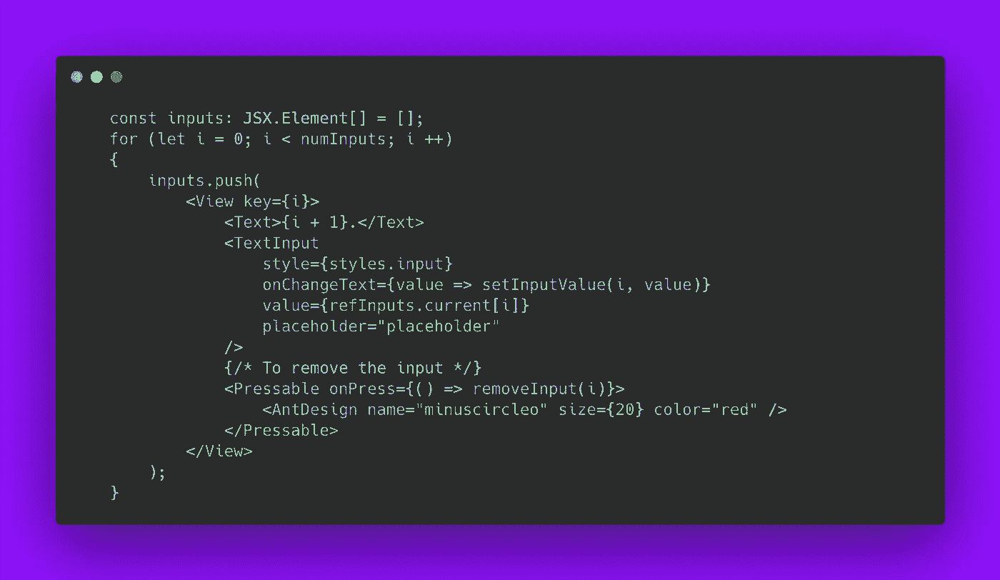
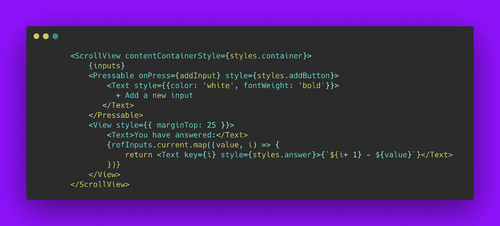
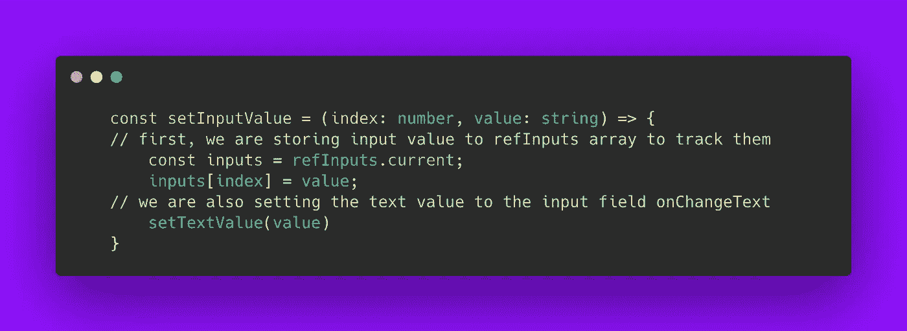
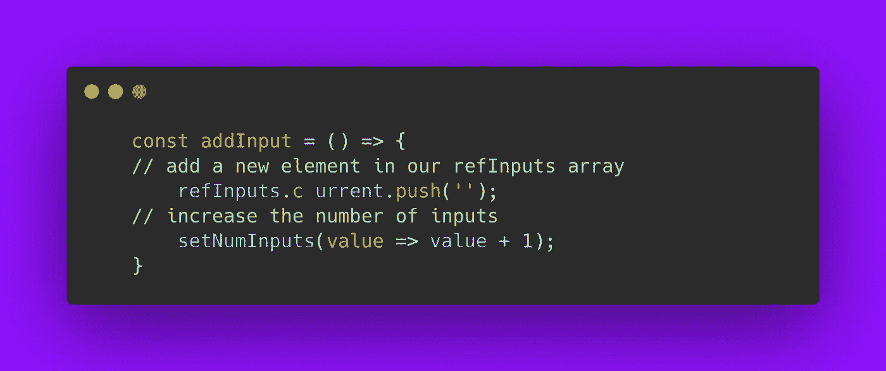
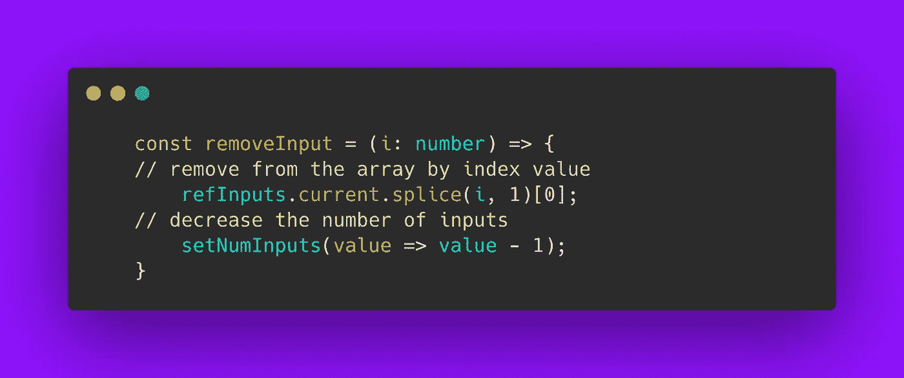
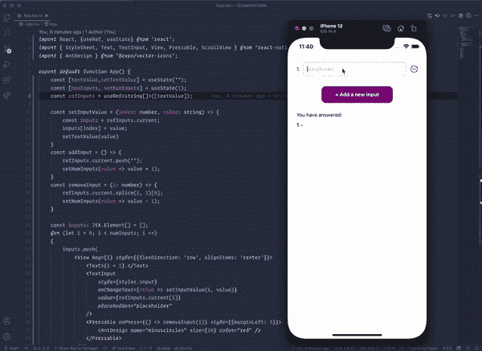

# 在 React Native 中创建动态输入字段

> 原文：<https://javascript.plainenglish.io/creating-dynamic-input-fields-in-react-native-514a3e8444fa?source=collection_archive---------1----------------------->


Photo by [Leon Dewiwje](https://unsplash.com/@elodiso?utm_source=unsplash&utm_medium=referral&utm_content=creditCopyText) on [Unsplash](https://unsplash.com/s/photos/forms?utm_source=unsplash&utm_medium=referral&utm_content=creditCopyText)

这可能是一个常见的需求，有时在我们的表单中，我们需要动态地添加或删除输入字段，并且每个输入字段都需要附加相应的值。最近我实现了这一点。我们可以用不同的方法做这件事。这就是我的实现。

为了首先实现这一点，我声明 2 个状态和 1 个引用。

```
// this will be attached with each input onChangeText
  const [textValue, setTextValue] = useState(''); // our number of inputs, we can add the length or decrease
  const [numInputs, setNumInputs] = useState(1);// all our input fields are tracked with this array
   const refInputs = useRef<*string*[]>([textValue]);
```

好了，现在我们需要一个循环来迭代，直到我们的 numInputs 和生成输入那么多次。



这是我们的渲染 JSX。这些是我们正在回复的观点。



因为最初，我们的 numInputs 是 1，我们得到 1 个 TextInput 和一个按钮来添加更多的输入。


initial state

酷，现在我们需要三个函数。

*   setInputValue ->是设置输入字段的值。



setting text input value

*   addInput ->当添加输入按钮被按下时，添加一个新的输入。



add a new input field

*   移除输入->当减号图标被按下时移除输入。



removing a text input field

我们完了！通过所有这些，我们得到以下输出



final demo

[这里的](https://snack.expo.io/@saad-bashar/dynamic-input-field)是一个工作演示供你玩。

*更多内容尽在*[***plain English . io***](http://plainenglish.io)