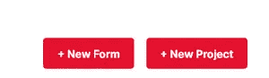
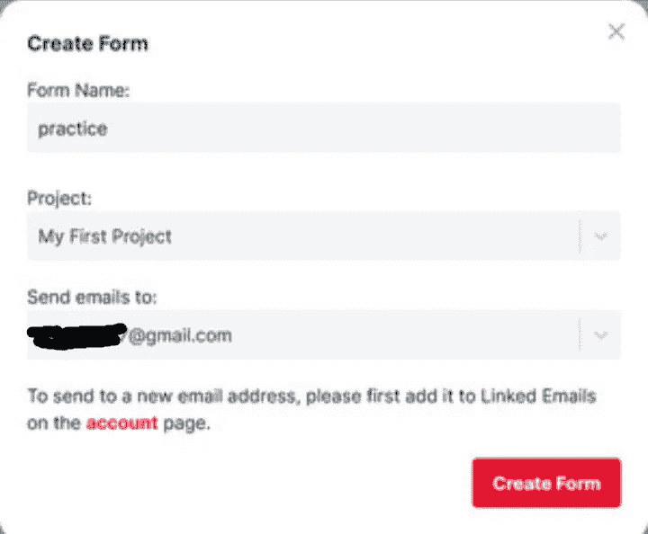

# 使用 HTML、JavaScript 和 CSS 中的 Formspree 创建一个完全响应的联系人表单

> 原文：<https://javascript.plainenglish.io/creating-fully-responsive-contact-form-using-formspree-in-html-javascript-and-css-b98f2513c263?source=collection_archive---------10----------------------->

## 如何在没有后端的情况下创建完全响应的联系人表单？


Photo by [Thomas Lefebvre](https://unsplash.com/@magellol?utm_source=medium&utm_medium=referral) on [Unsplash](https://unsplash.com?utm_source=medium&utm_medium=referral)

# 它是如何工作的

首先从[https://formspree.io/](https://formspree.io/)创建一个免费账户。然后选择一个新的表单。



选择新表单后，填写必填字段，然后单击“创建表单”。



复制您的表单端点，并将其粘贴到动作部分的表单代码中。还要确保你的表格使用了*方法。*

*确保每个输入都有一个名称属性。*

# ***创造你的形态***

为了创建我们的表单，我们将使用 HTML、CSS 和 JavaScript。您将学习如何在没有后端的情况下创建联系人表单。

## **我们开始**

让我们从编写 HTML 代码开始，它将定义我们的联系人表单的结构。

***index.html***

```
<html>
<head>
<title>Contact Form</title>
</head>
<body>
<section class="contact" id="contact-section">
    <h2 class="heading">Contact<span class="highlight"> me</span></h2>
    <p class="sub-heading">Lets connect. </p>
    <div class="seperator"></div><script src="[https://ajax.googleapis.com/ajax/libs/jquery/1.8.0/jquery.min.js](https://ajax.googleapis.com/ajax/libs/jquery/1.8.0/jquery.min.js)"></script>
<form action="[https://formspree.io/f/xxxx](https://formspree.io/f/xxxx)" method="post">
<input name="_gotcha" style="display: none" type="text">
<div class="contact-form">Name<input name="name" placeholder=" Name" id="name" required type="text">
</div>
<div class="contact-form">Topic<input name="topic" placeholder="topic" id="topic" required type="text">
</div>
    <div class ="contact-form">E-mail
    <input name="E-Mail Address" required placeholder="email" />
</div>
<textarea class="message" placeholder="message" required></textarea>
    <br/>
<button class="btn contact-btn" type="submit">contact me</button>
    <input type="hidden" name="referrer" id="referrer_field" /><input type="hidden" name="body" /></section>
</body>
</html>
```

确保用您在第一步中创建的端点替换该操作。

让我们添加 CSS 来设置联系人表单的样式，这样会更有吸引力。

***index.css***

```
.contact-form{
    width: 100%;
    margin-top: 20px;
    position: relative;
}.contact-form input, .message{
    width: 100%;
    display:block;
    height: 50px;
    margin:5px 0;
    padding: 10px;
    background: #000;
    color: #fff;
    outline: none;
    resize: none;
}
.message{
    margin:30px 0;
    height: 200px;
}.contact-form .name{
    display: flex;
    justify-content: space-between;
}.name input{
    width: 49%;
    margin: 0;
}
.contact-form .btn{
    display: block;
    margin: auto;
    cursor: pointer;
}
```

现在让我们添加一些功能性的 JavaScript。

**index.js**

```
$('form').submit(function () {// Get the Login Name value and trim it
    var fname = $.trim($('#fname').val());
    var lname = $.trim($('#lname').val());
    var email =$.trim($('#email').val());// Check if empty of not
    if (fname === '') {
        alert('First name is empty.');
        return false;
    }
    else if (lname === '') {
        alert('Last Name is empty.');
        return false;
    }
    else if (email === '') {
        alert('email is empty.');
        return false;
    }
```

查看以下链接中的结果:

[https://codepen.io/1-creator/pen/jOwyvzz](https://codepen.io/1-creator/pen/jOwyvzz)

快乐编码！

*多内容见于* [***中。注册我们的***](http://plainenglish.io/) **[***免费周报***](http://newsletter.plainenglish.io/) *。在我们的* [***社区纠纷***](https://discord.gg/GtDtUAvyhW) *中获得独家写作机会和建议。***