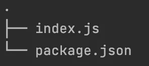
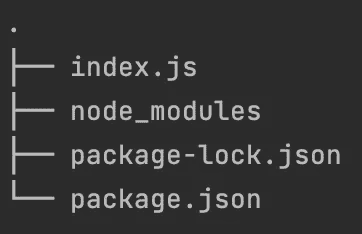
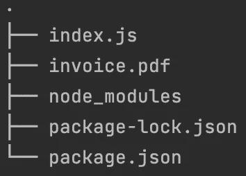
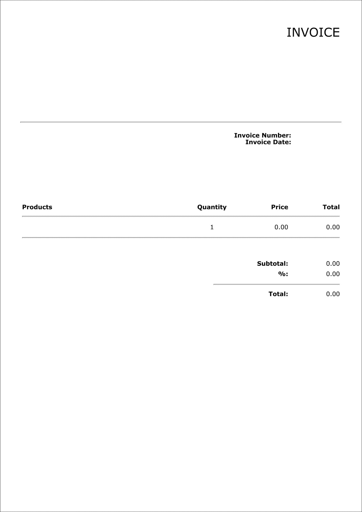
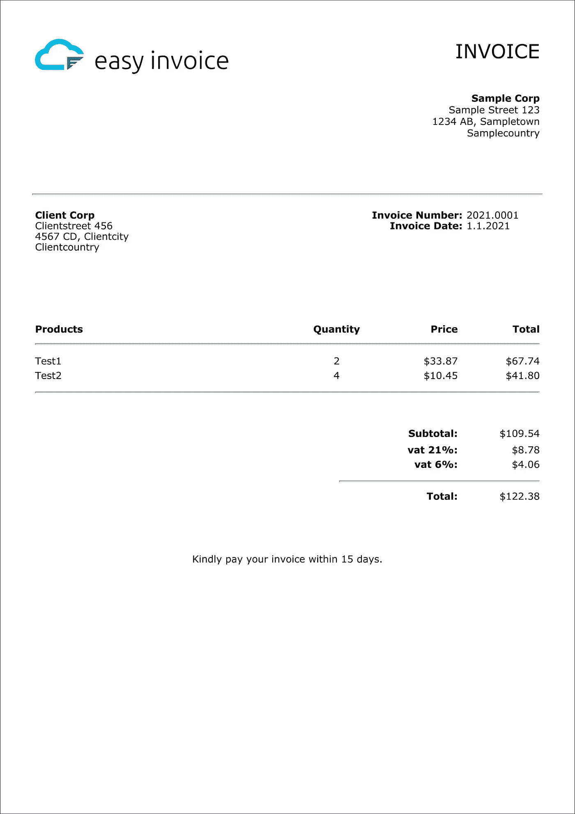

# 在 Javascript 和 Node.js 中创建发票

> 原文：<https://javascript.plainenglish.io/creating-invoices-in-nodejs-eaae01f0d3a4?source=collection_archive---------1----------------------->

在本文中，我们将以最简单的方式在 [Node.js](https://nodejs.org/) 中创建发票。我们将使用 [NPM](https://www.npmjs.com/) 库 [EasyInvoice](https://www.npmjs.com/package/easyinvoice) 。

*注意:本文基于* [*易开发票*](https://www.npmjs.com/package/easyinvoice) *版本 2.3.0*


请注意，EasyInvoice 库可用于:
- JavaScript(前端和后端)通过 [NPM](https://www.npmjs.com/package/easyinvoice)
- Python 通过 [PyPi/PIP](https://pypi.org/project/easyinvoice/)
- PHP 通过 [Packagist/Composer](https://packagist.org/packages/easyapis.io/easyinvoice)

# 1.先决条件

在准备这个例子时，确保您的操作系统上已经安装了 [Node.js](https://nodejs.org) 。

# 2.创建新的 Node.js 项目

继续在您喜欢的编辑器中启动一个新的 [Node.js](https://nodejs.org) 项目。我喜欢让这个过程尽可能精简。我们的示例只需要在一个文件夹中有两个文件，即 **index.js** 和 **package.json** :



Required files for our demo

我通常会手动创建一个空的 **index.js** 文件。接下来，我们将创建我们的 **package.json** 。这个文件将保存我们的应用程序信息和外部库。为此，使用您首选的命令行界面(CLI)在与您的 **index.js** 文件相同的目录中运行以下命令(从现在开始称为项目根目录):

```
npm init -y
```

对于这个演示，我在上面的命令中使用了'-y '参数，它将使用默认值创建 **package.json** 。如果您想要更高级别的定制，您可以运行' **npm init** '。

现在我们有了两个文件，我们可以继续将 [EasyInvoice](https://www.npmjs.com/package/easyinvoice) 安装到我们的项目中。

# 3.在我们的项目中安装 EasyInvoice

接下来，我们将在项目根目录下运行以下命令，将 [EasyInvoice](https://www.npmjs.com/package/easyinvoice) [NPM](https://www.npmjs.com/) 包安装到我们的项目中:

```
npm install easyinvoice --save
```

成功后，您会注意到一个文件夹和一个文件已经添加到您的项目中。文件夹名为 **node_modules** ，文件名为 **package-lock.json** 。你可以忽略这些，现在，它们是 NPM 为了我们的库正常工作所需要的。

您的项目文件树现在应该如下所示:



Our project file tree, including **node_modules** and **package-lock.json**

当您打开 **package.json** 文件时，您应该在依赖项部分看到 [**EasyInvoice**](https://www.npmjs.com/package/easyinvoice) 。像这样:

# 4.我们来开发票吧！

现在，让我们打开我们的 **index.js** 文件并添加一些代码:

> 就我个人而言，我是 NPM 异步 T21 库的超级粉丝，因为它让我们的代码更具可读性。幸运的是， [EasyInvoice](https://www.npmjs.com/package/easyinvoice) 支持 [Async](https://www.npmjs.com/package/async) ！请查看 [EasyInvoice](https://www.npmjs.com/package/easyinvoice) 文档，了解如何使用 [Async](https://www.npmjs.com/package/async) 的示例。

您可能已经注意到，在我们的编码示例中，我们将数据对象保持为空。所以运行上面的代码应该为我们提供一个基本的空白发票。让我们首先这样做，通过使用 CLI 在我们的项目目录的根目录中使用 NodeJS 运行我们的 **index.js** 文件:

```
node index.js
```

现在，如果一切正常，你会发现你的项目中出现了一个名为**invoice.pdf**的文件:



File tree including our invoice.pdf

继续打开文件。看一看！你会注意到我们的发票 PDF 仍然是空的。发票应该是这样的:



Sample blank invoice

让我们继续用一些数据填充它。

# 5.向我们的发票添加数据

现在，让我们回到我们的数据对象，我们在前面的例子中保持为空。是时候用我们希望在发票上看到的数据填充它了:

让我们运行我们用于第一张发票的代码，包括我们在上面创建的数据对象。这将为我们提供一张填得很好的发票，看起来应该是这样的:



Sample invoice filled with data

就是这样！你用最少的努力创造了一张漂亮的发票。

# 最终注释

让上面的例子工作起来有困难吗？别担心！我们上传了完整的工作样本代码到 Github。[点击此处](https://github.com/dveldhoen/easyinvoice-nodejs-demo)进入我们的回购样本。请确保遵循 README.md 文件中的说明。

如果这篇文章对你有所帮助，请给 Github 上的[简易发票一颗星，因为你做得很好。](https://github.com/dveldhoen/easyinvoice)

## 进一步阅读

[](https://plainenglish.io/blog/why-you-should-use-taggun-instead-of-general-purpose-ocr) [## 为什么应该使用 TAGGUN 而不是通用 OCR

### 亚马逊的 Textract、开源的 tesseract 或现成的 PDF 阅读器中的 OCR 非常适合数字化随机…

简明英语. io](https://plainenglish.io/blog/why-you-should-use-taggun-instead-of-general-purpose-ocr) 

*更多内容看* [***说白了就是***](https://plainenglish.io/) *。报名参加我们的* [***免费周报***](http://newsletter.plainenglish.io/) *。关注我们关于* [***推特***](https://twitter.com/inPlainEngHQ) ， [***领英***](https://www.linkedin.com/company/inplainenglish/) *，*[***YouTube***](https://www.youtube.com/channel/UCtipWUghju290NWcn8jhyAw)*，以及* [***不和***](https://discord.gg/GtDtUAvyhW) *。对增长黑客感兴趣？检查* [***电路***](https://circuit.ooo/) *。*