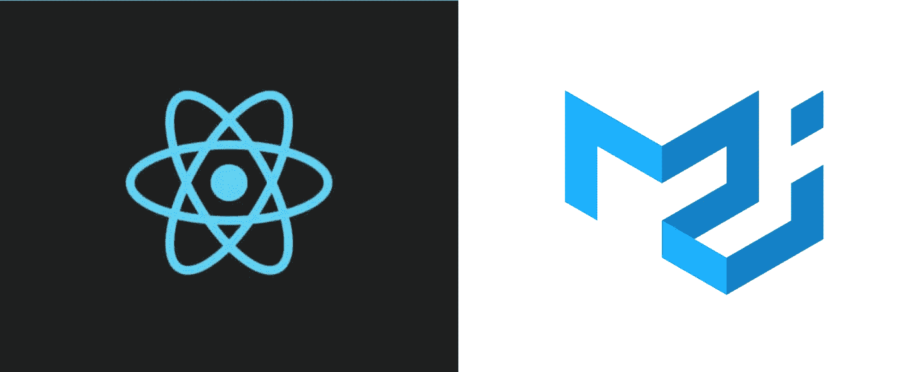

# 在 React 中创建材质 UI 主题

> 原文：<https://javascript.plainenglish.io/creating-material-ui-themes-in-react-cc839c9ee683?source=collection_archive---------11----------------------->

Material UI 是最流行的 React UI 框架之一。这使得与 React 一起工作变得非常愉快。开箱即用，它拥有构建现代 web ui 所需的所有必要组件以及更多。易于使用、易于设置，最重要的是易于配置。

材质 UI 的一个主要方面是主题化。它帮助我们为我们的项目创建一个全局和默认的风格。

让我们看看如何创建材料 ui 主题，并使用它们来构建可重用的 UI 页面。



React with Material UI

如果使用了`inline styles`或`makeStyles`，那么一些样式属性可能会非常频繁地重复。如果设计发生变化，这种方法很难更新样式。

例如，如果按钮变体“包含”和颜色“主要”是项目所需的样式，那么您可能会发现以下代码随处可见:

```
<Button variant="contained" color="primary"> Primary </Button>
```

如果设计只更改为`outlined`，可能需要在多个地方进行更改。

这可以在材质 UI 主题中照顾到。我们可以指定一个按钮的默认样式，它将应用于所有的按钮，除非另有说明。这有助于我们避免重复的代码，并在一个中心位置保持默认的 UI 风格。

调色板是大多数项目中都会改变的一个选项。这是应该在主题中配置的东西，而不是这样做:

```
<Button 
      variant="contained" 
      style={{ background: 'purple', color: 'white' }}> 
   Primary
</Button>
```

让我们来看一个非常简单的带有默认材质主题的 UI，看看我们如何使用主题来更新设计，而不触及实际的组件。

Basic UI using Material UI’s default theme.

## 创建材质 UI 主题

让我们从创建一个文件`Theme.js`开始。这将是我们添加所有主题配置的地方。Material UI 的主题定制最棒的地方在于，我们只需要使用 Javascript 的对象样式代码就可以创建漂亮的主题。

现在让我们从`@material-ui/core`导入`createMuiTheme`。我们将用它来创建一个主题。

## 改变调色板和排版

我们所要做的就是在`palette`下添加我们想要的颜色。这将覆盖材质 UI 附带的默认颜色。

```
const theme = createMuiTheme({
     palette: {
         primary: {
             main: '#2C5F2D',
         },
         secondary: {
             main: '#97BC62',
         }
      }        
});
```

现在，像颜色一样，我们也可以覆盖默认的主题。

```
const theme = createMuiTheme({
     typography: {
        fontFamily: 'Times New Roman',
        fontSize: 15,
        h1: { // incase h1 needs to have a separate fontFamily 
            fontFamily: 'Roboto',
            fontSize: 15,
        }
     },
});
```

所有的排版属性都可以随着需要为标签指定的任何样式一起更新。

## 改变组件的形状

如果你注意到，材质 UI 的默认卡片和按钮有一个轻微的边界半径。有些设计没有边界半径，而有些设计可能有更大的边界半径。这个默认的形状也可以使用主题来改变。该属性将更新所有组件的形状。我们一会儿将看一下特定于元件的形状。

```
const theme = createMuiTheme({
     shape: {
        borderRadius: 0
     },
});
```

## 用`ThemeProvider`将页面换行

这样做是为了让子组件无需显式指定就能获得主题属性。

```
import React from 'react';
import ReactDOM from 'react-dom';
import App from './App';
import { ThemeProvider } from '@material-ui/core';
import { theme } from './Theme';ReactDOM.render(
    <React.StrictMode>
       <ThemeProvider theme={theme}>
         <App />
       </ThemeProvider>
    </React.StrictMode>,
    document.getElementById('root')
);
```

让我们看看它的实际效果。

Basic UI using Material UI’s theme with custom palette, typography and shape.

让我们为组件提供一些默认属性，我们可能需要这些属性来适应我们的设计。例如，如果设计中的所有按钮都是`contained`，那么将它设为默认是有意义的，而不是在我们使用`Button`的任何地方都传递道具`contained`。

## 在主题中提供组件道具。

可以在`props`中分配组件属性。使用分配的组件时，这些值将用作默认值。在这个例子中，每当我们使用`Button`时，它总是带有`primary`颜色的按钮的包含变体。

```
export const theme = createMuiTheme({
    props: {
       MuiButton: {
         variant: 'contained',
         color: 'primary
       }
    }
})
```

如果你注意到，`Button`被用作`MuiButton`，它代表材质 UI 按钮。材质用户界面中可用的所有组件都可以在这里使用`Mui`组件进行样式化。比如:`MuiTextField`、`MuiCheckbox`、`MuiCard`等。

```
export const theme = createMuiTheme({
     props: {
       MuiButton: {
         variant: 'contained',
         color: 'primary',
       },
       MuiTextField: {
         variant: 'filled',
         InputLabelProps: {
             shrink: true
         }
      },
      MuiCard: {
        elevation: 5,
      },
      MuiCheckbox: {
        disableRipple: true
      }
   }
})
```

在上面的例子中，`Checkbox`的`ripple`效果被禁用，`Card`的仰角被增加，`TextField`的输入标签动画被移除，其样式被改变。

让我们看看它的实际效果。

Basic UI using Material UI’s theme with custom palette, typography, shape and component props.

现在，这些是对现有财产的一些可能的更新。我们还可以通过覆盖属性使用的样式类来重新设计组件的样式。例如，如果在我们的设计中按钮是药丸形状的，我们可以在主题本身中添加这种样式。

## 重新设计主题中组件的样式

这可以在主题的`overrides`属性下完成。这里也一样，`Mui`组件用于更新样式。

```
export const theme = createMuiTheme({
     overrides: {
        MuiButton: {
            root: {
              borderRadius: 30,
              textTransform: 'none',
              minWidth: '200px'
            }
        },
     },
})
```

在上面的例子中，按钮变成了药丸形状，去掉了“大写”文本转换，提供了最小宽度。默认情况下，项目中使用的所有按钮都将应用这些样式。

现在让我们看看主题，看看我们的立场。

Basic UI using Material UI’s theme with custom palette, typography, shape, component props and restyling.

使用 Material UI 的主题来设计组件的能力给了我们构建可重用 UI 组件的自由，这些组件可以被其他团队使用和设计。这有助于我们创建独立于品牌设计的功能组件。使用组件的团队可以负责设计。

这是一个简单的登录页面的例子，它有三种不同的设计风格，但没有触及实际的组件。

## 带有默认材料 UI 组件的简单登录表单

Simple login form using default Material UI components

## 相同的登录表单，但有一个主题

It is the same login form with custom theme

## 让我们再尝试一个主题

A different style for the login form

在上面的三个例子中，登录表单的核心保持不变，改变的只是包装主题。

Material UI 的主题化能力和可能性是无穷无尽的。带有属性的自定义主题可以保持代码整洁。它还避免了每当实现新组件时记住样式指南的开销。总是可以提供默认行为，从而可以避免“挖掘”文档。

所有关于主题化的文档都可以在[这里](https://material-ui.com/customization/theming/)作为素材 UI 的页面获得。

享受使用材质 UI 主题的乐趣。

## 进一步阅读

[](https://bit.cloud/blog/theming-react-apps-with-styled-components-and-bit-l7epurug) [## 使用风格化组件和位对 React 应用程序进行主题化

### 作为 UI 开发人员，我们经常希望将表示与交互分开，这样我们就可以应用相同的 CSS…

比特云](https://bit.cloud/blog/theming-react-apps-with-styled-components-and-bit-l7epurug) 

*更多内容看* [***说白了。报名参加我们的***](https://plainenglish.io/) **[***免费周报***](http://newsletter.plainenglish.io/) *。关注我们关于* [***推特***](https://twitter.com/inPlainEngHQ)[***LinkedIn***](https://www.linkedin.com/company/inplainenglish/)*[***YouTube***](https://www.youtube.com/channel/UCtipWUghju290NWcn8jhyAw)*[***不和***](https://discord.gg/GtDtUAvyhW) *。对增长黑客感兴趣？检查* [***电路***](https://circuit.ooo/) *。*****