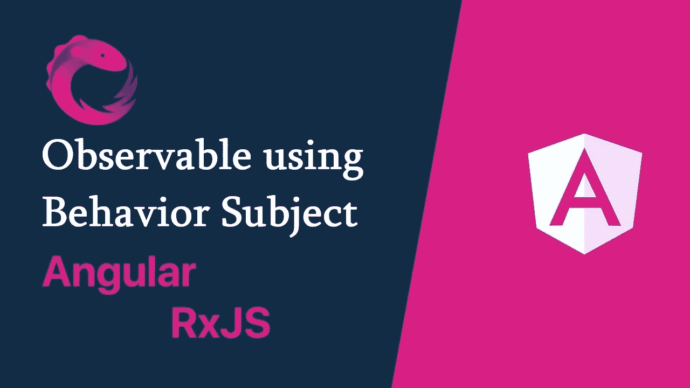

# 如何使用行为主体在角度上创建可观察对象

> 原文：<https://javascript.plainenglish.io/creating-observable-using-behavior-subject-in-angular-93a949f54d18?source=collection_archive---------1----------------------->

# **可观察到的**

Observable，也称为 ReactiveX 库，来自 RxJS*T5，它对于处理事件，尤其是订阅事件非常有用。例如，Angular 使用 observables 作为其核心功能的接口，例如:*

*   定义自定义事件以将输出数据从子组件发送到父组件。
*   通过 HTTP 模块处理 AJAX 请求和响应。
*   在角度路由器和表单模块中监听和响应用户输入事件。

在 Angular 中，RxJS 提供了 4 种类型的主题来创建可观察对象。这 4 种类型分别是*主体*、*行为主体*、*回放主体*和*异步主体*。可以通过观察他们对*订阅*的反应来区分他们。但是，在本文中，我们将讨论实现*行为主题*的方法，这是 Angular 中最常见的主题之一。

# 行为主体

首先，你需要对主体的工作原理有基本的了解。当您订阅主题时，您将获得在您订阅主题之后从主题**发出的每个事件。参考[这段](https://www.youtube.com/watch?v=_5n9p_2Ajvo&t=1s)视频。**

但是在 BehaviorSubject 中，它的工作方式似乎与 Subject 相同，只是它接收的是在订阅之前发生的最后一个事件。参考[这个](https://www.youtube.com/watch?v=ENluprrCpTU)视频。

所以，没有什么理由更喜欢行为主体而不是主体:

*   它将始终返回订阅的当前值(初始化时需要初始值)。
*   它有一个`**getValue()**`函数来获取当前值。
*   它确保组件总是接收最新的数据。

我们可以用组件间数据共享的例子来说明 BehaviorSubject 的实现。

首先，我们需要使用私有的 BehaviorSubject 创建一个服务，它将保存消息的当前值。我们定义了一个 *currentMessage* 变量来处理这个数据流，作为一个将被组件使用的可观察对象。之后，我们实现一个函数来调用`**next()**`函数来改变它的值。

接下来，让我们看看如何在父组件和子组件中使用这个*数据服务*。

在父组件中，在构造函数中注入*数据服务*。然后订阅*数据服务*的*current message*observable 以获取值变化。

然后，我们在子组件中创建一个 *changeMessage* 函数，为消息分配一个新值。重要的是，我们可以在任何组件中创建一个函数来改变消息，它会自动广播给所有订阅了*数据服务*的其他组件。

在上面的代码片段中，当用户点击新消息按钮后，触发 *changeMessage* 函数，并且*current Message*observable 通过`**next()**`函数从消息的新值中更新其值。因此，被订阅的父组件将收到新的消息值。此外，不仅父组件，而且子组件和被订阅的同级组件都将获得相同的待遇。

> BehaviorSubject 是一个非常简单，易于使用，但功能强大的创建可观察对象的方法。希望这篇文章能帮助你对 BehaviorSubject 有一个基本的了解。

*更多内容看* [***说白了. io***](http://plainenglish.io/) ***。*** *报名参加我们的**[***免费每周简讯这里***](http://newsletter.plainenglish.io/) ***。****