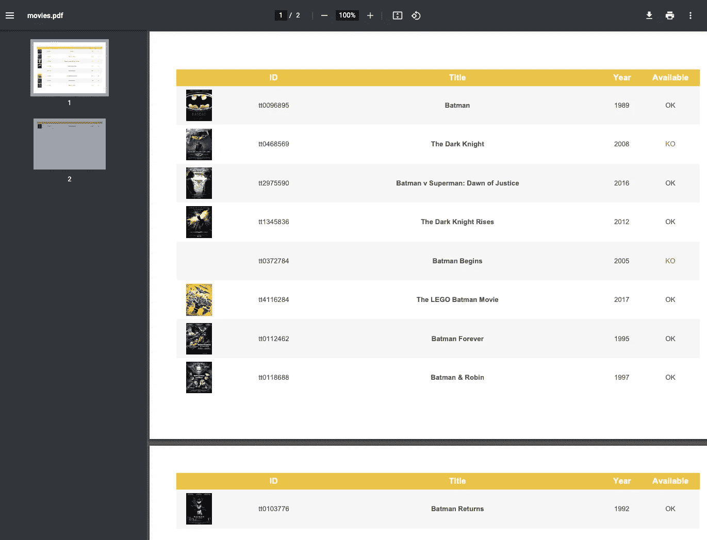
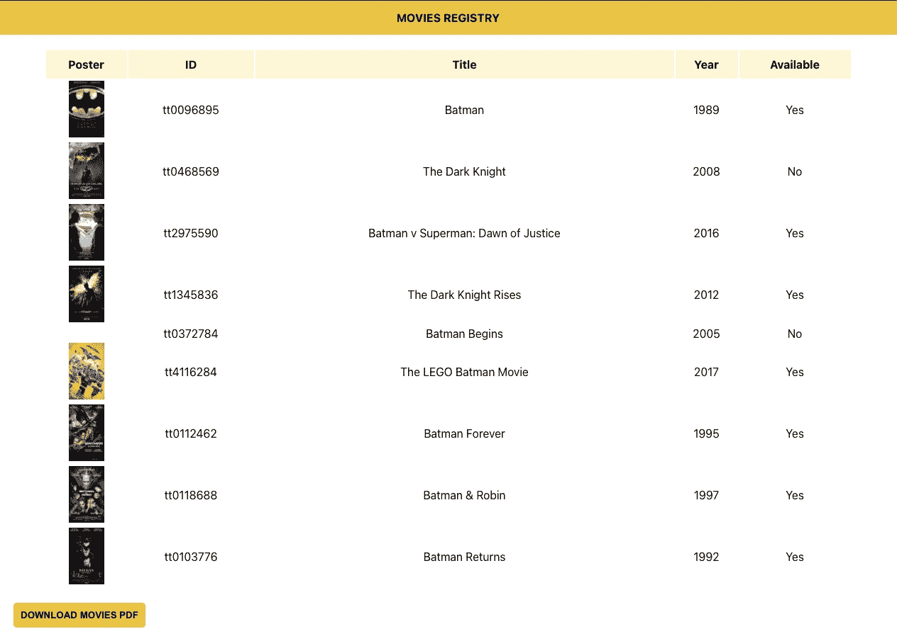

# 如何在 React 中创建 PDF

> 原文：<https://javascript.plainenglish.io/creating-pdf-report-just-using-react-379a5cc49244?source=collection_archive---------7----------------------->


Photo by [Soundtrap](https://unsplash.com/@soundtrap?utm_source=medium&utm_medium=referral) on [Unsplash](https://unsplash.com?utm_source=medium&utm_medium=referral)

你有多少次不得不为客户、为你自己或者仅仅是为了跟踪你的前端展示的东西而创建一份报告？

这当然是一个乏味的操作，特别是当我们必须显示的数据已经在我们亲爱的前端，我们不想通过后端创建一个特别的服务。

因此，在本文中，我们将在 React 中创建一个基本的前端，并在没有任何后端服务帮助的情况下生成一个 pdf 报告。

你准备好了吗？一步一步跟着我，在文章的最后让我知道你的想法。

## **准备我们的环境**

要在 React 中创建新的单页面应用程序，有三个基本点是必需的:

*   *JavaScript 基础知识；*
*   *节点版本*≥*10.16；*
*   版本 *npm* ≥ 5.6。

此时，我们可以按照以下步骤创建我们的“pdf-frontend-generator”项目:

```
npx create-react-app pdf-frontend-generator
cd pdf-frontend-generator
npm start
```

这可能需要几秒钟☕

## **你好字**

在`localhost:3000`上启动它之后，我们所要做的就是清除 starter 项目中为我们编写的所有代码。

因此，我们删除了`App.css`文件的所有内容，并确保在`App.js`中，我们的功能如下:

```
function App() {
   return (
     <div *className*="App"></div>
   );
}
```

## **我们的目标**

让我们想象一下，在一个电影库中，必须跟踪客户可以获得的电影。
因此，我们需要一个表格，包括电影代码，标题，年份，可用性，可能还有海报，还有一个按钮，允许我们从简单但超级酷的前端生成和下载报告。

## 让我们开始吧🚀

首先，让我们创建我们的第一个“主页”，我们将在其中插入表格和按钮。

创建以下文件:`src/pages/homepage.jsx`。

*记住“jsx”扩展名不是强制性的，但是它可以帮助我们区分模板文件和纯 javascript 文件。*

我们的`homepage.jsx`起初会是这个样子:

```
import React, { useEffect, useState } from "react";const MoviesHomepage = () => {
   const [movies, setMovies] = useState([]);

   useEffect(() => {
      const getAllMovies = *async* () => {
         try {
            *// Fetching movies in some way* } catch (err) {
            console.log(`Error fetching movies: ${err}`);
         }
      };
      getAllMovies();
   }, []); return (
      <div>
         {*/* TABLE HERE */*}
         <div *className*="row">
            <button *className*="btn">
               DOWNLOAD PDF MOVIES
            </button>
         </div>
      </div>
   );
};export default MoviesHomepage;
```

为了让这个页面变得生动，我们需要将它导入到`App.js`

```
import MoviesHomepage from './pages/homepage';function App() {
   return (
     <div *className*="App">
        <MoviesHomepage />
     </div>
   );
}
```

此时，返回到`localhost:3000`，我们将不会看到太多，因为我们缺少了这一页的基本部分:表格！

> **什么是钩子？**钩子是一个特殊的特性，它允许你“钩住”React 功能。例如，useState 是一个钩子，它允许您将 React 状态添加到函数组件中。
> 
> **`[**useEffect**](https://it.reactjs.org/docs/hooks-effect.html)`**是做什么的？**通过使用这个钩子，你告诉 React 你的组件需要在渲染后做一些事情。React 将记住您传递的函数(我们称之为“效果”)，并在执行 DOM 更新后调用它。在这种情况下，我们设置了文档标题，但是我们也可以执行数据获取或者调用其他一些命令式 API。**

## ****如何引人入胜的电影？****

**很明显，对于我们的测试，我们不会使用世界上所有的电影图表，而只是蝙蝠侠的一些章节🦇**

**为了做到这一点，一个网站来帮助我们，提供了对这些电影的虚假回应，其链接如下:**

```
*https://fake-movie-database-api.herokuapp.com/api?s=batman*
```

**但是，为了确保我们的响应也包含关于电影状态的信息，并且海报图像已经转换为 base64 格式，我们将创建一个`src/mock/film.mock.js`，您可以从 [**复制并粘贴其数据到这里的**](https://github.com/CoxxD/pdf-frontend-generator/blob/main/src/mock/film.mock.js) 。**

**现在我们已经有了数据，我们只需要将它保存在 try 的主体中**

```
setMovies(MOVIES_MOCK.Search);
```

**在顶部为 *MOVIES_MOCK* 常量添加导入。**

**注意:如果你想从本地以外的任何其他来源恢复数据，你必须安装`*axios*`依赖项**

```
npm i axios
```

**然后在*的正文中加上试*:**

```
*const response = await axios.get("https://fake-movie-database-api.herokuapp.com/api?s=batman");**setMovies(response.data.Search);*
```

## ****没有桌子，我们哪儿也去不了****

**是时候显示这些数据了，为此我们为我们的表创建一个新的特设组件:`src/components/table-movies.jsx`。**

```
import React from "react";const TableMovies = ({ *data* }) => { return (
      <div *className*="container">
         {data.length === 0 ? ("There are no movies") : (
         <table *className*="table" *id*="testTable">
            <thead>
               <tr>
                  <th *scope*="col">Poster</th>
                  <th *scope*="col">ID</th>
                  <th *scope*="col">Title</th>
                  <th *scope*="col">Year</th>
                  <th *scope*="col">Available</th>
               </tr>
            </thead>
            <tbody>
               {data.map(*el* => (
                  <tr *key*={el.imdbID}>
                     <td>{*/* LATER */*}</td>
                     <td>{el.imdbID}</td>
                     <td>{el.Title}</td>
                     <td>{el.Year}</td>
                     <td>{el.Available ? 'Yes' : 'No'}</td>
                  </tr>
               ))}
            </tbody>
        </table>)}
     </div>
   );
};export default TableMovies;
```

**在这个功能组件中，我们期望"*数据*"作为"*道具*"的属性，电影将在其中呈现。**

**如果没有电影，屏幕上将显示一条消息:“*没有电影*”。**

**PS。我们会尽快处理海报。**

**此时我们要做的是将新组件导入到我们的`homepage.jsx`中，传递电影作为输入。**

```
import TableMovies from "../components/table-movies";.
.
.
.return (
   <div>
      <TableMovies *data*={movies} />
      <div *className*="row">
         <button *className*="btn">DOWNLOAD PDF MOVIES</button>
      </div>
   </div>
);
```

## ****失踪的海报****

**为了使用 base64 并保持代码整洁，我们创建了一个新组件`src/components/image-base64.jsx`，它将图像源作为输入。**

```
const Image64 = ({ *data* }) => export default Image64;
```

**所以让我们回到我们的桌子，替换注释`{/* LATER */}`**

```
{el.Poster ? <Image64 *data*={el.Poster} /> : null}
```

## ****让我们生成报告****

**我们已经到了本教程的重点:生成 pdf 报告的时刻。**

**为此，您需要添加两个依赖项**

```
npm i jspdf jspdf-autotable
```

**要查阅报告生成库的文档，请参见页面 [jsPDF](https://github.com/mrrio/jspdf) 。**

**现在我们只需要按照文档中的指导方针创建`src/services/report-generator.js`文件。**

```
import jsPDF from "jspdf";
import "jspdf-autotable";const generatePDF = (*tableRows*, *columns*, *isLandscape*) => {
   const doc = new jsPDF({
      orientation: isLandscape ? "landscape" : 'portrait'
   });
   doc.autoTable({
      head: columns,
      body: tableRows,
      startY: 20, *// startY is basically margin-top* headStyles: {
         fillColor: [241, 196, 15],
         fontSize: 12,
         halign: 'center'
      },
      columnStyles: {
         0: { cellWidth: 30, cellHeight: 20, halign: 'center' },
         1: { cellWidth: 40, halign: 'center' },
         2: {cellWidth:'auto',halign:'center',fontStyle:'bold'},
         3: { cellWidth: 20, halign: 'center' },
         4: { cellWidth: 30, halign: 'center' }
      },
      styles: {
         valign: 'middle'
      },

      */* Use for customizing texts or styles of specific cells after they have been formatted by this plugin. This hook is called just before the column width and other features are computed.*/* didParseCell: function (*data*) {
          if(data.section === 'body') {
             data.row.height = 20;
          }
          if (data.column.dataKey === 'poster') {
             data.cell.text = '' *// Use an icon in didDrawCell instead* }
      },*/* Use for changing styles with jspdf functions or customize the positioning of cells or cell text just before they are drawn to the page.*/* willDrawCell: function (*data*) {
         if (data.row.section === 'body' && data.column.dataKey === 'available') {
            if (data.cell.raw === 'KO') {
               doc.setTextColor(231, 76, 60) *// Red* }
         }
      },*/* Use for adding content to the cells after they are drawn. This could be images or links. You can also use this to draw other custom jspdf content to cells with doc.text or doc.rect for example.*/* didDrawCell: function (*data*) {
        if (data.row.section === 'body' && data.column.dataKey === 'poster' && data.cell.raw) {
           doc.addImage(
              data.cell.raw,
              'PNG',
              data.cell.x + 5,
              data.cell.y + 2,
              13,
              16
           )
        }
     }
   }); *// we define the name of our PDF file.* doc.save(`movies.pdf`);
};export default generatePDF;
```

**显然，通过遵循您在[链接](https://github.com/simonbengtsson/jsPDF-AutoTable/blob/master/examples/examples.js)中找到的文档或非常有用的示例，您可以进行比我在报告中使用的更多的定制。**

**正如您在代码片段中看到的，有许多定制，通过`columnStyles`属性，我们已经能够为每一列指定样式。**

**这个库让我们感兴趣的是，在报告生成过程中可以动态修改报告内容的钩子。一个具体的例子是当条件`data.column.dataKey === ‘poster'`满足时，添加海报作为图像而不是文本。**

**此时，剩下的就是返回主页，导入`generatePDF`功能，为我们的 pdf 创建栏，并修改按钮，如下所示:**

```
import generatePDF from "../services/report-generator";const MoviesHomepage = () => {
   const [movies, setMovies] = useState([]);

   const columnsPDF = [{ poster: 'Poster', id: 'ID', title: 'Title', year: 'Year', available: 'Available' }].
.
.
.<button
   *className*="btn"
   *onClick*={() => generatePDF(movies.map(*m* => ({
      poster: m.Poster,
      id: m.imdbID,
      title: m.Title,
      year: m.Year,
      available: m.Available ? 'OK' : 'KO'
   })), columnsPDF, true)}
>
DOWNLOAD PDF MOVIES
</button>
```

## ****报告输出****

****

**PDF Report**

## ****应用程序样式****

**为了不使我们的应用程序成为风格的孤儿，让我们对代码做一些快速的修改:**

**`App.js`**

**让我们给组件添加标题**

```
function App() {
   return (
     <div *className*="App">
        <div *className*='header'>
           <span>MOVIES REGISTRY</span>
        </div>
        <MoviesHomepage />
     </div>
   );
}
```

**`App.css`**

```
*.header* {
  padding: 15px;
  text-align: center;
  background: #f1c40f;
  font-weight: bold;
}*.table* {
  width: 90%;
  margin: auto;
  margin-top: 20px;
}*.table* thead tr {
  height: 40px;
  background: #fff6d2;
}*.table* tbody tr td {
  text-align: center;
}*.btn* {
  margin-top: 20px;
  margin-left: 20px;
  background: #f1c410;
  padding: 10px;
  border: 0;
  border-radius: 5px;
  font-weight: bold;
}*.btn:hover* {
  background: #ffea94;
  cursor: pointer;
}
```

## ****最终输出****

****

**React App**

## ****关于它的想法****

**使用一个从前端开始生成报告的库无疑是我们的一把额外的箭，这使我们能够更快地使用一个额外的工具。像所有事情一样，显然你必须在一开始就问自己你要实现的目标的复杂性，然后评估最好的工具。**

**然而，在本教程结束时，如果用例是线性的，并且没有太复杂的数据，那么 JSPDF 解决方案不会被先验地抛弃，相反，它非常方便和令人满意。**

## ****源代码****

**如果你想回顾代码，请随时关注我的 [Github 账户](https://github.com/CoxxD/pdf-frontend-generator)上该项目的最新版本。**

**非常感谢你的阅读！**

***更多内容请看*[***plain English . io***](http://plainenglish.io)**