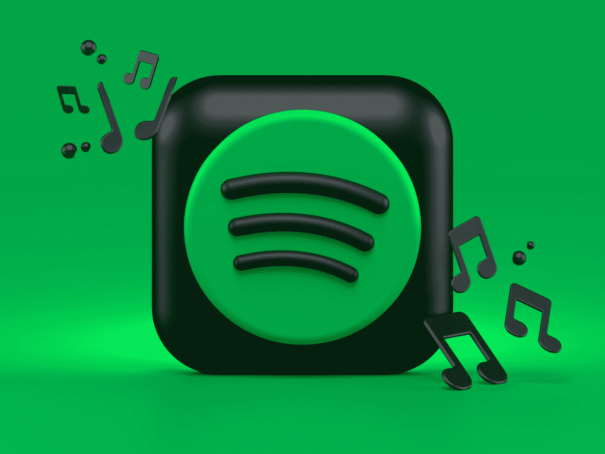
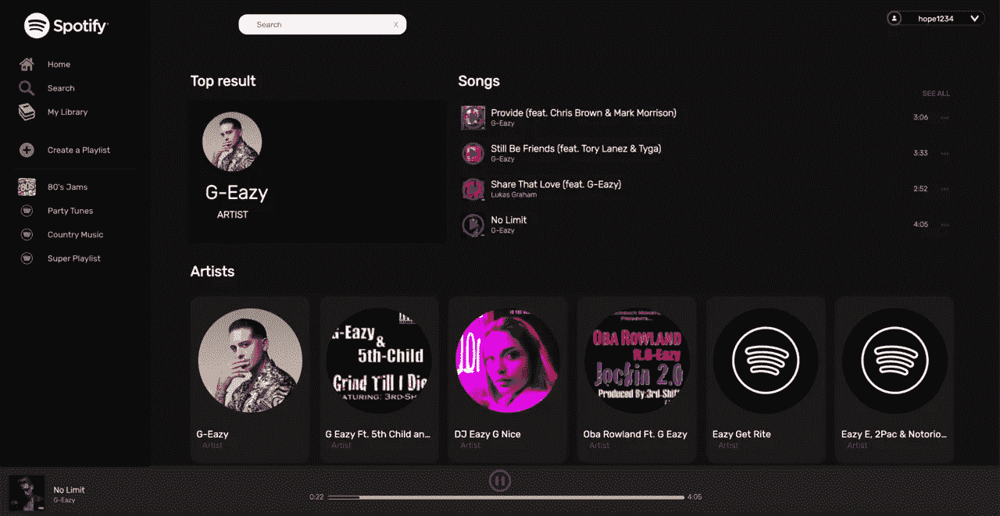

# 使用 Redux 从头开始创建 Spotify——React Redux 中回放功能的解释

> 原文：<https://javascript.plainenglish.io/creating-spotify-from-scratch-using-redux-an-explanation-of-playback-capability-in-react-redux-7f6653ea2ce8?source=collection_archive---------10----------------------->



Photo by [Alexander Shatov](https://unsplash.com/@alexbemore?utm_source=medium&utm_medium=referral) on [Unsplash](https://unsplash.com?utm_source=medium&utm_medium=referral)

作为程序员，我们的核心本能之一是渴望实际创建我们最喜欢的网站，了解它们是如何创建的，并自己构建它们——揭开我们每天使用的这些程序的神秘面纱。

就我个人而言，我花时间最多的网站是 Spotify。作为一名音频工程师和程序员，我经常使用该网站收听客户音乐，创建激发我工作的播放列表，并且在日常活动中享受音乐。

Spotify 是一个复杂的网站，所以我挑战自己用 Redux 做了一个类似的程序。虽然它不是一个精确的复制品；我模仿了 Spotify 的许多核心功能，创建了一个非常友好的用户界面。我对此感到有点兴奋，因此这方面的代码量太多，无法在一篇单独的博客文章中解释，所以我想谈谈我认为大多数开发人员在尝试创建 Spotify 应用程序时遇到的问题:实际上播放应用程序中的音乐。

对我来说，实现歌曲播放技术的一个巨大资源是在 Spotify 文档中找到的信息。我强烈建议任何打算在应用程序中播放音乐的开发人员通读 web API 和 SDK 上的文档，它们是从应用程序中播放音乐所必需的。我选择使用 Spotify 播放器和他们的 API 来播放歌曲，这样我就可以在我的应用程序中播放任何歌曲，而不仅仅是存储在我本地机器上的歌曲，我希望我的用户能够访问他们想要的任何歌曲，并在 React 应用程序中播放。



# 证明

使用 Spotify SDK 或网络播放器的第一步是认证。每个个人用户都需要有一个来自 Spotify 的令牌，允许他们访问 SDK 和 Spotify API。我没有指示我的用户去获取一个令牌并用它创建一个环境变量，而是决定通过 Spotify 使用一个身份验证端点来创建一个登录页面。这样，用户可以使用他们的 Spotify 凭据登录，而不必在网站上寻找认证令牌，令牌将在用户使用应用程序时存储。

如果应用程序呈现时 Redux 存储中没有存储有效的令牌，那么它将呈现组件 SpotifyAuthButton。点击 Spotify Auth 按钮时，将呈现以下 URI:

```
const hrefURI = `${authEndpoint}?client_id=${clientId}&redirect_uri=${redirectUri}&scope=${scopes.join(
            "%20"
          )}&response_type=token&show_dialog=true`
```

在我的 config.js 文件和 spotifyAuthButton 文件中，我配置了一个值为“https://accounts . Spotify . com/authorize”的 authEndpoint，以及一些可以在 Spotify 开发人员门户中配置的个性化信息，这些信息需要 clientId、redirectURI 和我在此应用程序中试图从 Spotify 使用的信息的范围。关于示波器的进一步阅读可以在这里找到: [Spotify 示波器文档](https://developer.spotify.com/documentation/general/guides/scopes/)。这包括适当的授权端点，用户可以登录到他们的 Spotify 帐户，并允许我的应用程序访问生成令牌的信息。令牌会立即从 Spotify 生成令牌的窗口位置保存下来，然后以 Redux 状态存储，以便可以在调用 Spotify API 和配置 Web 播放器时使用令牌。

```
componentDidMount() {
    const hash = window.location.hash
    .substring(1)
    .split("&")
    .reduce(function(initial, item) {
      if (item) {
        var parts = item.split("=");
        initial[parts[0]] = decodeURIComponent(parts[1]);
      }
      return initial;
    }, {});    
    let foundToken = hash.access_token;
    if (foundToken) {
      this.props.setToken(foundToken)

  }}

	const mapDispatchToProps = dispatch => {
  return {
    setToken: tokenText => dispatch({type: 'SET_TOKEN', payload: tokenText })
  }
}
```

当应用程序在状态中找到一个有效的令牌后，将从应用程序类中呈现 MusicPlayerContainer。

# 构建播放器容器

```
class App extends Component {

  componentDidMount() {
    const hash = window.location.hash
    .substring(1)
    .split("&")
    .reduce(function(initial, item) {
      if (item) {
        var parts = item.split("=");
        initial[parts[0]] = decodeURIComponent(parts[1]);
      }
      return initial;
    }, {});    
    let foundToken = hash.access_token;
    if (foundToken) {
      this.props.setToken(foundToken)

  }}
 isValidToken = () => {
    if (this.props.state.token){
      return true
    }
  } render(){
    return (
      <div className="App">
      {this.isValidToken() ? (
      <MusicPlayerContainer token={this.props.token}/>
      ) : ( <SpotifyAuthButton/>)}
      </div>  
    );
  }
} const mapStateToProps = state => {
  return {
    state
  }
} const mapDispatchToProps = dispatch => {
  return {
    setToken: tokenText => dispatch({type: 'SET_TOKEN', payload: tokenText })
  }
}export default connect(mapStateToProps, mapDispatchToProps)(App);
```

在 MusicPlayerContainer 中，第一步是从 Spotify 播放器资源加载脚本。在关于 SDK 的文档中，Spotify 给出了这个将播放器资源加载到项目中的例子。

```
<!DOCTYPE html>
<html>
<head>
  <title>Spotify Web Playback SDK Quick Start Tutorial</title>
</head>
<body>
  <h1>Spotify Web Playback SDK Quick Start Tutorial</h1>
  <h2>Open your console log: <code>View > Developer > JavaScript Console</code></h2> <script src="https://sdk.scdn.co/spotify-player.js"></script>
  <!-- We will insert our code here. -->
</body>
</html>
```

这对于某些类型的应用程序来说非常有效，但是这在 Redux 应用程序中引入了问题，在 Redux 应用程序中，我希望加载脚本源，然后使用该脚本并在我的应用程序中操纵它。我的解决方案是创建一个函数，加载 Spotify Web Player 脚本，将其附加到应用程序的主体，然后调用一个回调函数来创建一个 Player 对象，我可以将它存储在 Redux store 中，并通过我的应用程序进行访问。我用来做这件事的函数如下:

```
export const loadSpotifyScript = (callback) => {
          const existingScript = document.getElementById('spotify');
          if (!existingScript) {
            const script = document.createElement('script');
            script.src = 'https://sdk.scdn.co/spotify-player.js';
            script.id = 'spotify';
            document.body.appendChild(script);
            script.onload = () => { 
              if (callback) callback();
            };
          }
          if (existingScript && callback) callback();
        };
```

当 MusicPlayerContainer 组件挂载时，它会如此调用 loadSpotifyScript，为其提供 this.spotifySDKcallback 的回调函数:

```
componentDidMount() {
        loadSpotifyScript(this.spotifySDKCallback)
            }
```

在 Spotify SDK 文档中，它描述了使用如下代码创建播放器对象:

```
window.onSpotifyWebPlaybackSDKReady = () => {
  const token = '[My Spotify Web API access token]';
  const player = new Spotify.Player({
    name: 'Web Playback SDK Quick Start Player',
    getOAuthToken: cb => { cb(token); }
  });
```

我为 redux/react 设置改编的代码如下:

```
spotifySDKCallback = () => {
             window.onSpotifyWebPlaybackSDKReady = () => { let { Player } = window.Spotify;        
                const spotifyPlayer = new Player({
                    name: 'React Spotify Player',
                    getOAuthToken: cb => {
                        cb(this.props.state..token);
                    }
                });
                spotifyPlayer.addListener('player_state_changed', ({
                    position,
                    duration,
                    track_window: { current_track }
                  }) => {
                    console.log('Currently Playing', current_track);
                    console.log('Position in Song', position);
                    console.log('Duration of Song', duration);
                  });
                this.setState({
                    loadingState: "Loaded",
                    spotifyPlayer
                }, () => {
                    this.connectToPlayer();
                });
            }
         }
```

由于这个组件连接到 Redux 存储，所以我使用了存储的令牌并将其提供给播放器创建函数。我还添加了一些事件侦听器来帮助我稍后进行播放跟踪，最后调用我的函数 connectToPlayer。在 connectToPlayer 中，我对存储的播放器实例进行操作，并从播放器实例中寻找 deviceID。我没有给它一个特定的设备来连接，允许播放器链接到每个用户的默认播放设备。

```
connectToPlayer = () => {
            if (this.state.spotifyPlayer) {
                this.state.spotifyPlayer.addListener('ready', ({device_id}) => {
                    console.log('Ready with Device ID', device_id);
                    this.setState({
                        loadingState: "Player Ready",
                        spotifyDeviceId: device_id,
                        spotifyPlayerReady: true
                    }, () => {
                      this.notifyConnected()

                    });
                });
                this.state.spotifyPlayer.connect().then(success => {
                    if (success) {
                      console.log('The Web Playback SDK successfully connected to Spotify!');
                    }})}}
```

使用播放器文档中的方法，我在设备准备好之后连接上了。然后，我们正式设置开始播放。播放器和设备 ID 也存储在 Redux 存储中:

```
addPlayer: (player) => dispatch(addPlayer(player)),
    addDeviceID: (deviceid) => dispatch(addDevice(deviceid))
```

现在我们有了一个可以播放一些歌曲的设备 Spotify SDK 网络播放器的一个实例，这是我们完成的 MusicPlayerContainer。在存在有效的 deviceID 和 spotifyPlayer 之前，仪表板不会呈现。这是为了防止点击播放按钮等。当播放器仍在加载时，所有组件在渲染时都在处理一个活动的播放器。在所有这些过程发生并安装播放器之前，会呈现一个美观的加载屏幕。

```
class MusicPlayerContainer extends Component {
    constructor(props){
        super(props);
    this.state = {
        loadingState: "Loading",
        spotifyAccessToken: this.props.token,
        spotifyDeviceId: "",
        spotifyPlayerConnected: false,
        spotifyPlayerReady: false,
        spotifyPlayer: undefined
    };
    }
 componentDidMount() {
        loadSpotifyScript(this.spotifySDKCallback)
            } spotifySDKCallback = () => {
             window.onSpotifyWebPlaybackSDKReady = () => { let { Player } = window.Spotify;        
                const spotifyPlayer = new Player({
                    name: 'React Spotify Player',
                    getOAuthToken: cb => {
                        cb(this.props.state.token);
                    }
                });
                spotifyPlayer.addListener('player_state_changed', ({
                    position,
                    duration,
                    track_window: { current_track }
                  }) => {
                    console.log('Currently Playing', current_track);
                    console.log('Position in Song', position);
                    console.log('Duration of Song', duration);
                    this.props.changeTrackerSong(current_track)
                  });
                this.setState({
                    loadingState: "Loaded",
                    spotifyPlayer
                }, () => {
                    this.connectToPlayer();
                });
            }
         }

         connectToPlayer = () => {
            if (this.state.spotifyPlayer) {
                this.state.spotifyPlayer.addListener('ready', ({device_id}) => {
                    console.log('Ready with Device ID', device_id);
                    this.setState({
                        loadingState: "Player Ready",
                        spotifyDeviceId: device_id,
                        spotifyPlayerReady: true
                    }, () => {
                      this.notifyConnected()

                    });
                });
                this.state.spotifyPlayer.connect().then(success => {
                    if (success) {
                      console.log('The Web Playback SDK successfully connected to Spotify!');
                    }})}} notifyConnected = () => {
            this.props.addPlayer(this.state.spotifyPlayer)
            this.props.addDeviceID(this.state.spotifyDeviceId)
        } render(
    ){
        return(  
        <div>    
            {this.state.spotifyDeviceId && this.state.spotifyPlayer ? (    <div><Router>  <Redirect to="/dashboard" />
<Route exact path='/dashboard' render={routerProps => <Dashboard/> } /></Router></div>  
      ) : (<LoadingScreen/>)}</div> )}}const mapStateToProps = state => {
    return {state} 
  } const mapDispatchToProps = dispatch => ({
    addPlayer: (player) => dispatch(addPlayer(player)),
    addDeviceID: (deviceid) => dispatch(addDevice(deviceid)),
    changeTrackerSong: (song) => dispatch(changeTrackerSong(song))
 })

 export default connect(mapStateToProps, mapDispatchToProps)(MusicPlayerContainer)
```

# 播放特定的歌曲

然而，单独的网络播放器并不能让你做任何事情，只能从一个网页而不是 Spotify 网页上播放，只能播放你已经在 Spotify 网站上单独播放的内容，只是在不同的页面上播放。我想让它让你可以选择任何歌曲，并使用播放器来听这首歌，所以我也利用了 Spotify API。我在应用程序的几个不同地方使用了回放功能，但我们将讨论最基本的功能。如果你使用搜索页面查找碧昂斯，你会得到她的一些歌曲列表。你可以点击这些歌曲的播放按钮，它会在应用程序中播放。

这是 Song 类中播放/暂停图像的代码，它将更改 onClick，并调用从父组件 SongResult 作为道具传递下来的函数。

```

```

我将 callPlayback 方法放在所有 song 组件的父组件中，因为我希望将每个 Song 对象的播放/暂停图像作为一个整体来管理，这样，如果有人单击所有按钮(一次只单击一个),就不会在播放时标记所有的图像，并且我希望以一次只发送一个的方式来管理发送给播放器的请求。

```
callPlayback = (event) => {
      let savedInfo = event
        if (savedInfo.target.id !== this.state.currentSong){
          this.callPlaybackOnNewSong(savedInfo)
        }
        else if (savedInfo.target.id === this.state.currentSong){
         this.callPlaybackOnSameSong(savedInfo)
    }
   }
```

当你点击其中一个按钮时，调用 callPlayback 函数。首先，它会检查您调用的是正在听的歌曲的回放(从而恢复歌曲)还是一首全新的歌曲。

```
state = {
        selectedElement: "empty",
        songs: this.props.songs,
        currentSong: "empty"}
```

在 SongResult 类的状态下，currentSong 被初始化为空，所以如果我们第一次调用这个函数，this.callPlaybackOnNewSong 将被调用。

```
callPlaybackOnNewSong = (savedInfo) => {
    if(!this.props.state.playbackOn){
      let selectedElement = this.props.songs.splice(savedInfo.target.id, 1)[0]
 this.props.startPlayback(savedInfo.target.name, this.props.state.deviceID, this.props.state.token)
        this.props.songs.forEach(function (song) {
          song.open = false;
        })
      selectedElement.open = true;
     this.props.songs.splice(savedInfo.target.id, 0, selectedElement)   
     this.setState({songs: this.props.songs, selectedElement: selectedElement})
      }
      else if (this.props.state.playbackOn){
        let selectedElement = this.props.songs.splice(savedInfo.target.id, 1)[0] this.props.startPlayback(savedInfo.target.name, this.props.state.deviceID, this.props.state.token)
          this.props.songs.forEach(function (song) {
            song.open = false;
          })
        selectedElement.open = true;
       this.props.songs.splice(savedInfo.target.id, 0, selectedElement)   
       this.setState({songs: this.props.songs, selectedElement: selectedElement})
        } else if(!this.props.state.playbackPaused){
         this.props.pauseTrack(this.props.state.deviceID, this.props.state.token)
         this.props.songs.forEach(function (song) {
          song.open = false;
        })
    }
    this.setState({songs: this.props.songs, currentSong: savedInfo.target.id})   }
```

这个函数有一点内容，它不仅负责发送开始播放的请求，而且还调整歌曲的状态——如果 open 为 false，它将显示播放图片，如果 open 为 true，它将显示暂停图片，以直观地显示一次播放哪首歌曲。startPlayback 函数在我的 actions 文件夹中，它用于发送一个请求，使用我们已经加载的播放器播放一首歌曲，该播放器链接到我们的 deviceID。每首歌曲都使用存储的 uri 呈现，如下所示:

```
name={this.props.song.uri}
```

这允许 event.target.name 在我们的请求中将曲目的单个 uri 发送到 Spotify API。startPlayback、resumePlayback 和 pauseTrack 都使用 Thunk 中间件，它在该中间件中接收一个分派方法，并返回一个函数。一旦异步动作已经完成，dispatch 用于将同步动作分派给 reducer。Redux 商店中的 playbackOn 和 playbackPaused 的状态将影响我们的显示和歌曲跟踪栏。

```
const STARTPLAYBACKURL = "https://api.spotify.com/v1/me/player/play?"
const PAUSEURL = "https://api.spotify.com/v1/me/player/pause?"export const startPlayback = (spotify_uri, deviceID, token) => {
    console.log(spotify_uri)
    console.log(deviceID)
    return (dispatch) => {
    return fetch(STARTPLAYBACKURL +
          "device_id=" + deviceID, {
          method: 'PUT',
          body: JSON.stringify({uris: [spotify_uri]}),
          headers: {
              'Content-Type': 'application/json',
              'Authorization': `Bearer ${token}`
          }}).then((
            dispatch({type: 'PLAYBACK_ON', playbackOn: true}),
            dispatch({type: 'TURN_OFF_PAUSE', playbackPaused: false})
          ))}}
 export const resumePlayback = (deviceID, token) => {
    return (dispatch) => {
    return fetch(STARTPLAYBACKURL +
          "device_id=" + deviceID, {
          method: 'PUT',
          headers: {
              'Content-Type': 'application/json',
              'Authorization': `Bearer ${token}`
          }}).then((
            dispatch({type: 'PLAYBACK_ON', playbackOn: true}),
            dispatch({type: 'TURN_OFF_PAUSE', playbackPaused: false})
            ))}} export const pauseTrack = ( deviceID, token) => {
    return (dispatch) => {
    return fetch(PAUSEURL +
          "device_id=" + deviceID, {
          method: 'PUT',
          headers: {
              'Content-Type': 'application/json',
              'Authorization': `Bearer ${token}`
          }}).then((
            dispatch({type: 'PLAYBACK_OFF', playbackOn: false}),
            dispatch({type: 'TURN_ON_PAUSE', playbackPaused: true})
            ))}}
```

这两个使用存储在 Redux 状态中的 deviceID 和 token 的请求允许安装的播放器开始播放任何呈现的歌曲，因为歌曲将总是使用它们的 track uri 来呈现，这是 API 加载歌曲的回放信息所需要的。

这个歌曲跟踪器使用 Redux 存储状态，每半秒钟通过检查 playbackOn 的状态来检查播放是否开启。如果我们发送了一个 fetch 来开始回放，我们也通过 Thunk 中附加的调度函数在我们的 reducer 中将 playbackOn 更新为 true。

```
getCurrentlyPlayingS = (token) => {
          getCurrentlyPlaying(token).then((data) => {
                    this.setState({
                        data: data,
                      item: data.item,
                      duration_ms: data.item.duration_ms,
                      is_playing: data.is_playing,
                      width: ((data.progress_ms * 100 / data.item.duration_ms)*6),
                      progress_ms: data.progress_ms
                    })})
componentDidMount() {
       this.interval = setInterval(() => this.tick(), 500)}
 tick = () => {
         if(this.props.state.playbackOn === true){
        this.getCurrentlyPlayingS(this.props.state.token);  

}
```

当 playback 为 true 时，它向这个 fetch 发送一个请求，这个 fetch 使用我们存储的令牌和挂载的 Web 播放器来获取关于当前播放的歌曲的信息。

```
const PLAYERURL = `https://api.spotify.com/v1/me/player`export const getCurrentlyPlaying = (token) => {
    return fetch(PLAYERURL, {
          method: 'GET',
          headers: {
              'Accept': 'application/json',
              'Content-Type': 'application/json',
              'Authorization': `Bearer ${token}`
          }}).then(parseJSON)}
```

每半秒钟这个 tick 被调用一次，tick 将返回信息——最重要的是用户正在收听的确切位置。然后将用户收听歌曲的进度值添加到状态中，其中该值用于计算进度条相对于歌曲整体的宽度(以像素为单位),以给出用户收听歌曲的进度的可视表示。

```
const progressBarStyles =  {
            width: (this.state.width) + 'px'

          }; const progressBarStyles2 = {
            width: 600 + 'px'
          };

					   <div className="progress__bar2" style={progressBarStyles2} />
            <div className="progress__bar" style={progressBarStyles} />
```

所有这些结合起来允许回放，以及回放的一些视觉元素。到目前为止，弄清楚如何调整 SDK 和 Spotify API 的文档，使其在 React Redux 格式中易于工作是项目中最困难的部分，但最困难的部分总是产生最好的部分——到目前为止，我认为这个项目最好的部分是在与它交互时听音乐的能力。如果你们中的任何人对完整教程感兴趣或者有任何其他要求/建议，请留下评论或者通过我的链接树联系我！

[完整代码](https://github.com/hopegipson/Spotify_Clone)

# 演示

*更多内容尽在*[plain English . io](http://plainenglish.io/)