# 使用角度元素创建 Web 组件—角度 11

> 原文：<https://javascript.plainenglish.io/creating-web-component-with-angular-element-angular-11-1c53be854a07?source=collection_archive---------0----------------------->

通过这个循序渐进的指南，用 Angular 元素构建框架无关的定制元素。

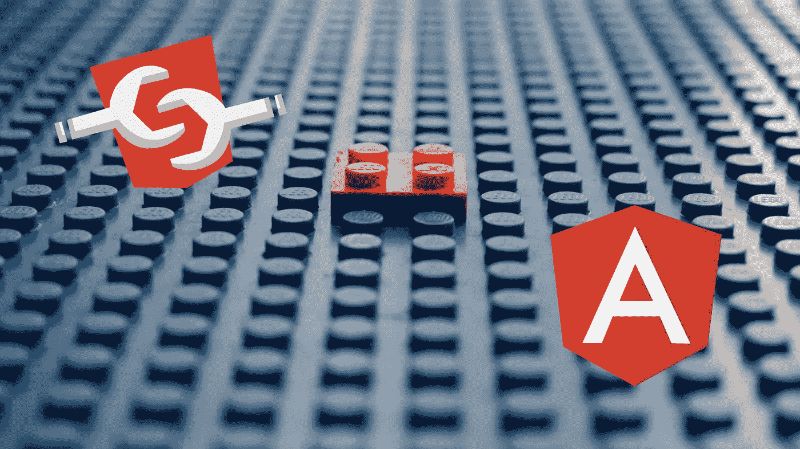

# 什么和为什么

如果我们有一些 React 应用程序，一些 Angular 内置的应用程序，以及其他普通的 JavaScript 应用程序，我们如何在所有这些应用程序中重用相同的公共组件？

这时我们需要一个 web 组件。

Web 组件遵循 W3C 制定的规范，允许我们定义新的定制 HTML 元素。它很有前途，因为它可以用在任何 JS 框架中，或者根本不用框架。

有一些关于 [web 组件](https://www.youtube.com/watch?v=R9o9js_HKwc) / [定制元素](https://www.youtube.com/watch?v=Z1gLFPLVJjY)的精彩讲座，我强烈推荐大家去看看。

# 我们如何构建 web 组件？

许多方法之一是使用角元素。有了 Angular Element，我们可以将 Angular 组件打包成 web 组件，并在 React、Vue.js 甚至普通的 JavaScript 中轻松使用它们。

让我们看看一些编码。

## 先决条件

> 这假设您已经有一个安装了 Angular CLI 的 Angular 11 项目。如果没有，只需在添加@angular/elements 之前运行以下代码来初始化项目。

```
**npm i -g @angular/cli
ng new web-demo**
```

# 1.添加@ angular/元素

```
**ng add @angular/elements**
```

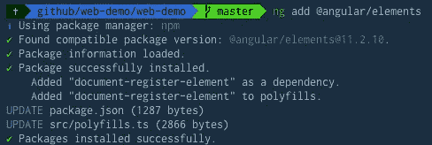

运行上面的命令将为我们添加必要的依赖项和 polyfills。

# 2.创建一个组件

如果您已经有一个想要打包为 web 组件的角度组件，则可以跳过此步骤。话虽如此，但在这样做之前，有一些注意事项值得研究(在页面末尾)。

为了简洁起见，让我们创建一个内联组件

```
**ng g c custom-list --inline-template --inline-style**
```

所有相关的样式都在`@Component`样式属性中定义。我们还添加了`@Input`、`@Output`来说明如何创建定制属性和定制事件。

最终的组件看起来像这样:

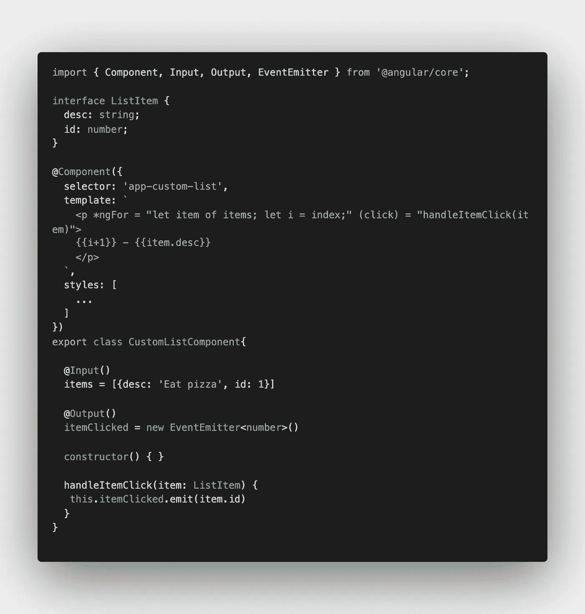

Code snippets [here](https://github.com/weihungchin/web-component/blob/482e98a9e2ce06f0d9f4ffd374c9e251c9a42a9b/src/app/custom-list/custom-list.component.ts)

# 3.转换成 web 组件/自定义元素

目前我们的`CustomListComponent`是在`app.module.ts`内部声明的。让我们创建一个单独的组件模块，`CustomListModule`，并在那里声明组件。

因为我们不会在最终构建中使用根 AppModule，所以我们必须在这里导入`BrowserModule`。由于`*ngFor`用于我们的`CustomListComponent`，所以`CommonModule`也是需要的。

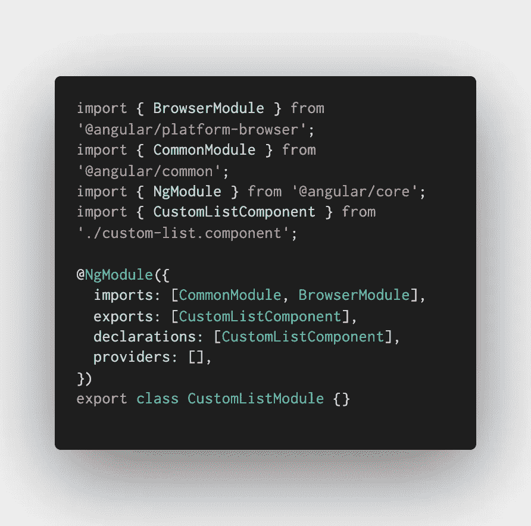

Code snippet [here](https://github.com/weihungchin/web-component/blob/482e98a9e2ce06f0d9f4ffd374c9e251c9a42a9b/src/app/custom-list/custom-list.module.ts)

这种单一组件模块模式使得后续步骤更加清晰。

要将`CustomListComponent`转换成自定义元素，我们需要 angular 元素的`createCustomElement`将我们的 Angular 组件转换成一个类，该类可以传递给浏览器的本机`customElements.define`方法。这与`injector`一起也绑定了组件输入和输出，并将它们转换成定制元素 API。

我们将在下一步把这个模块传递给 Angular 来做引导，因此这里需要`ngDoBootstrap`方法。

我们最终的`CustomListModule`看起来是这样的:

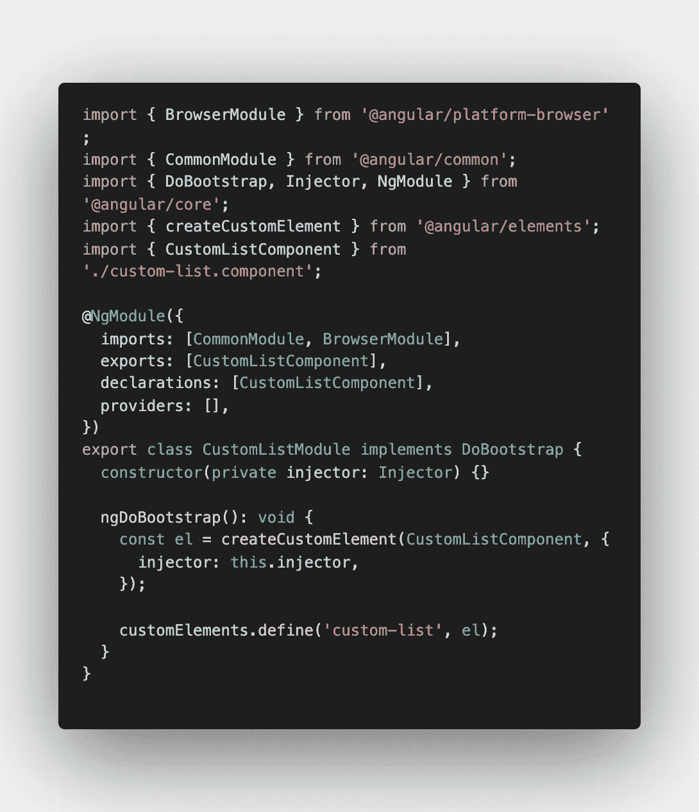

Code snippet [here](https://github.com/weihungchin/web-component/blob/482e98a9e2ce06f0d9f4ffd374c9e251c9a42a9b/src/app/custom-list/custom-list.module.ts)

# 4.引导 CustomListModule

在与`custom-list.module.ts`相同的目录下，创建一个新文件`custom-list.main.ts`。

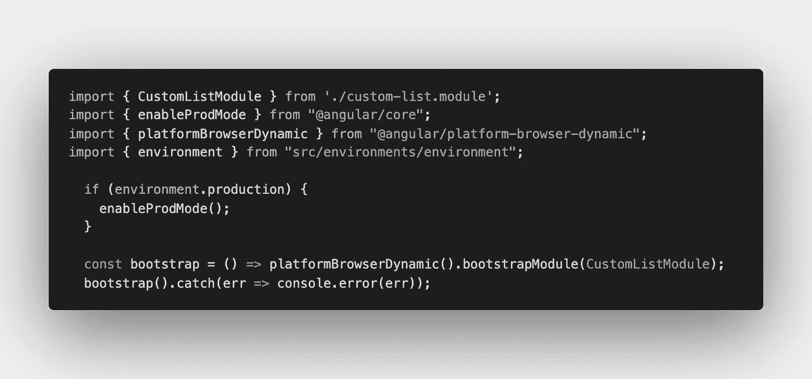

Code snippets [here](https://github.com/weihungchin/web-component/blob/482e98a9e2ce06f0d9f4ffd374c9e251c9a42a9b/src/app/custom-list/custom-list.main.ts)

这里，我们传入我们之前创建的`CustomListModule`并告诉 Angular 引导它。

同样，还有其他方法可以做到这一点，但我发现这个方法更干净。

# 5.添加项目配置和 tsconfig ⚙️

我们将添加一个单独的 tsconfig 文件，`tsconfig.custom-list.json`和`CustomListComponent`。

这里引用前面创建的`custom-list.main.ts`:

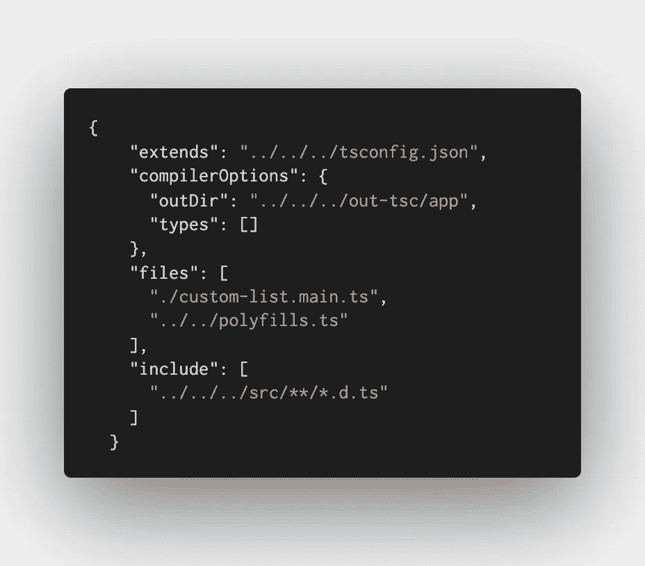

Code snippet [here](https://github.com/weihungchin/web-component/blob/482e98a9e2ce06f0d9f4ffd374c9e251c9a42a9b/src/app/custom-list/tsconfig.custom-list.json)

最终的文件结构如下所示:

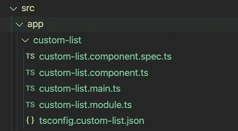

现在我们可以打开`angular.json`文件了。这个配置文件允许我们添加项目特定的配置和其他工作区配置。

我们将在现有的`projects`配置对象中添加一个新的项目配置`custom-list`:

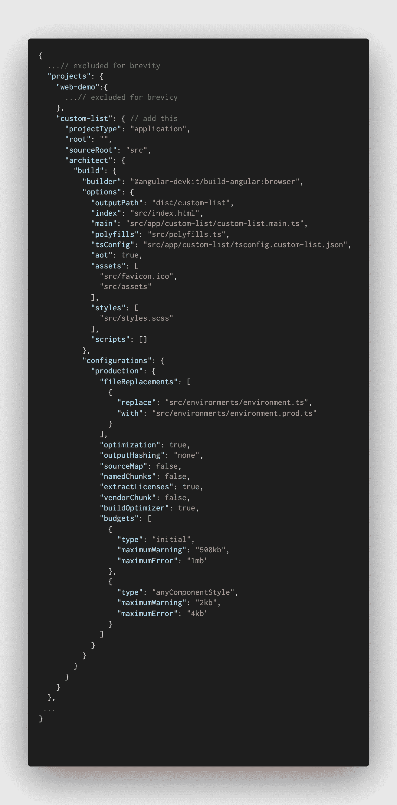

Code snippet [here](https://github.com/weihungchin/web-component/blob/482e98a9e2ce06f0d9f4ffd374c9e251c9a42a9b/angular.json)

> *注意，我们引用了之前创建的文件，config 对象中的* `*custom-list.main.ts*` *和* `*tsconfig.custom-list.json*` *。我们还将构建包的输出路径设置为* `*dist/custom-list*` *。其余键的值与现有的* `*web-demo*` *配置对象的值相同。*

# 建造和服务

我们现在准备构建我们的`custom-list` web 组件包。

```
**ng build custom-list --prod**
```

还记得在步骤 3 中，当我们使用`customElements.define`方法时，我们给了 web 组件一个`custom-list`名称标签。构建成功后，将`<custom-list>`元素添加到`dist/custom-list/index.html`中并保存更改。

我们这里只有一个普通的 HTML 文件，带有普通的 JS 脚本，没有任何其他的库。所有的角码都被传输到`main.js`包中。

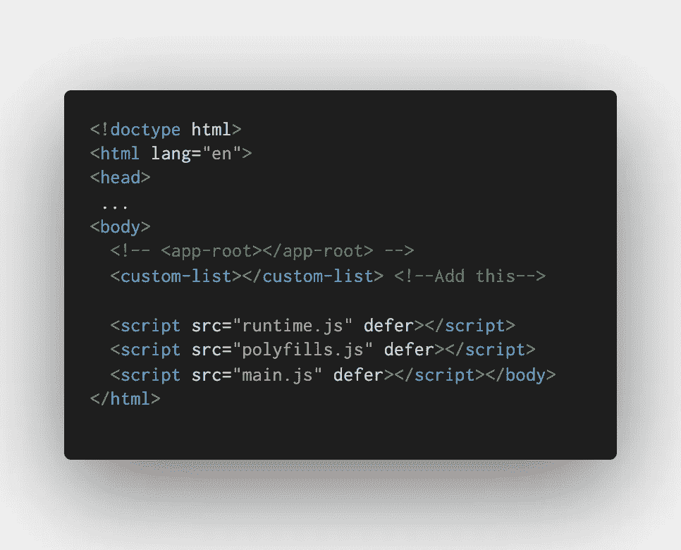

/dist/custom-list/index.html

让我们看看它的实际效果吧！

```
**npx http-server ./dist/custom-list**
```

服务我们的`index.html`

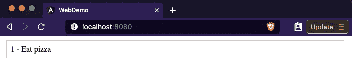

# **总结**

简而言之，我们有:

I)添加了 Angular 元素库
ii)创建了一个 Angular 组件并将其转换为 web 组件
iii)添加了引导并配置了一个单独的构建

在上面的例子中，我们使用一个简单的 Angular 组件来演示创建 web 组件的整个过程。

像往常一样，完整的代码可以在这里找到。

# 最终考虑

实际上，我们可能有更复杂的组件，并且有一些值得注意的事项。这包括为输入设置默认值和避免特定于上下文的输入。还需要处理依赖注入(需要包含整个依赖)，因此基于输入的解决方案是首选。

> *这个帖子到此为止。* ***在第 2 部分中，我们将看到如何发布这个 web 组件，通过传入输入和监听事件*** *，在整个单独的应用程序* *(例如在 Vue.js 中)* ***中使用它。***

如果你觉得你学到了新东西，请随意留下一些掌声或评论。

*更多内容请看*[*plain English . io*](http://plainenglish.io/)