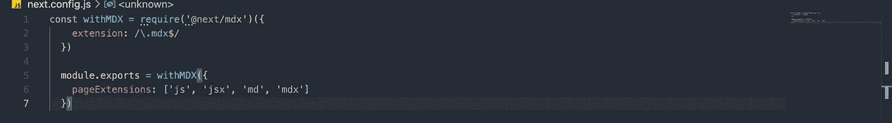
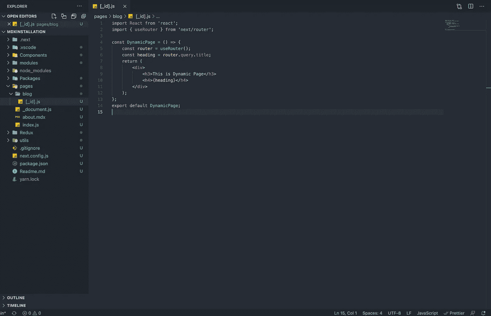
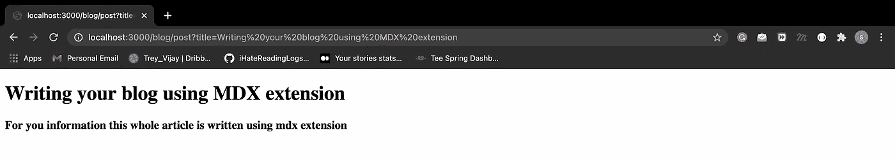
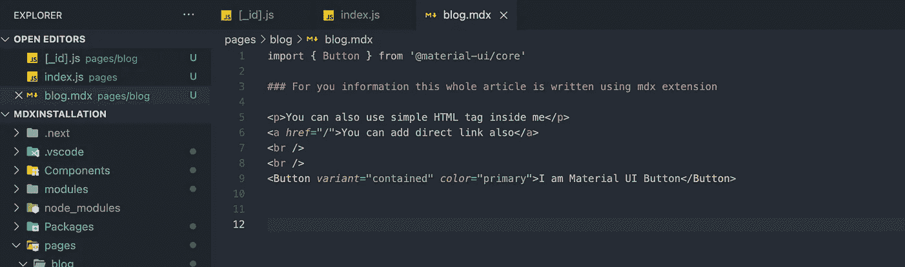
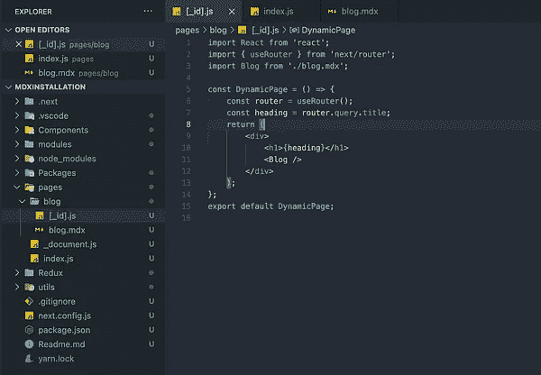
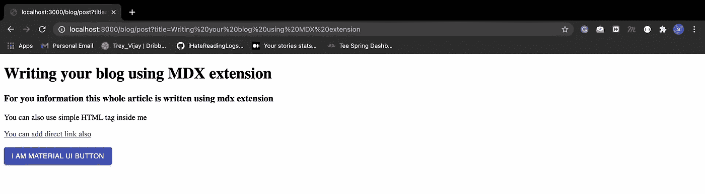
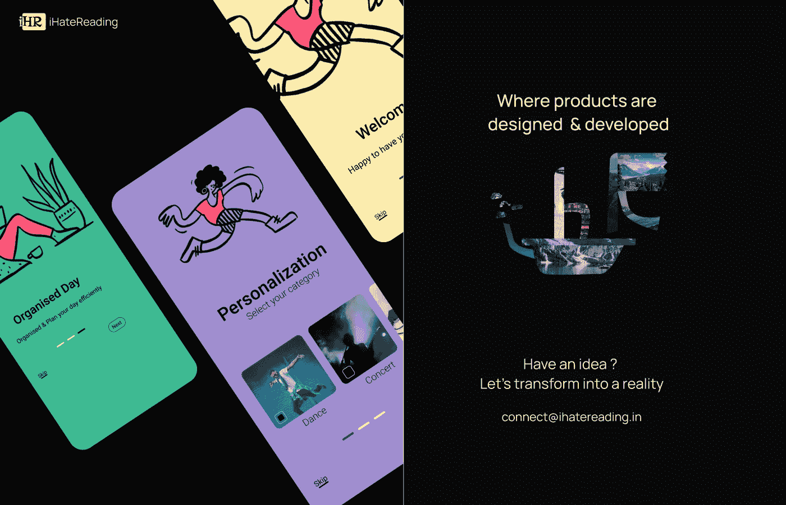

# 在 Next.js 中使用 MDX 开始博客

> 原文：<https://javascript.plainenglish.io/creating-your-blog-with-mdx-in-next-js-691a9368569b?source=collection_archive---------7----------------------->

## 使用 MDX 扩展创建您的第一个博客页面


[iHateReading](http://ihatereading.in/creativity)

# ***什么是 MDX 扩展？***

MDX 被称为 MarkDown Extension，一种在页面上嵌入 JSX 和简单文本的扩展。MDX 是另一种形式的文件。js。ts 附带扩展的功能，如编译在构建时进行时的快速编译、作为一个整体组件的默认导出、作为一个简单组件编写长格式等等。

```
You can read more about MDX here => [https://mdxjs.com/](https://mdxjs.com/)
```

# 装置

1.  我们将使用 next . js repository = >[https://github . com/shreyvijayvargiya/ihateredingglogs/tree/main/techlog/materiuiinstallation with next js](https://github.com/shreyvijayvargiya/iHateReadingLogs/tree/main/TechLogs/MaterialUIInstallationWithNextJS)
2.  为 mdx 添加 Next JS 加载器，为这个扩展注入内置的支持。
3.  为加载器配置 Next.js 配置文件。
4.  在 MDX 扩展中定义导出的组件
5.  导入并渲染 MDX 组件。

# 第一步

使用纱线或 npm 添加以下装载机。这些加载器是您接下来理解和阅读 MDX 文件所需要的。

```
yarn add @next/mdx @mdx-js/loader
```

# 第二步

在根存储库中创建***next . config . js***文件，为上述 npm 加载器添加加载器。



The next.config.js file

```
const withMDX = require('@next/mdx')({
  extension: /\.mdx$/
});

module.exports = withMDX({
  pageExtensions: ['js', 'jsx', 'md', 'mdx']
});
```

您需要在***next . config . js***文件中添加这些行。通过这样做，我们告诉 Next 框架从它的配置文件中使用 next/mdx 加载器并传输我们所有的。mdx 扩展文件在构建时转换成普通的 HTML。

# 博客的动态链接

您可以为您的博客文章创建一个动态链接，例如，假设我们的博客有一个标题— **使用带有 NEXT JS** 的 MDX 扩展编写您的博客，我们可以添加我们的博客网址，以便在网址中包含该标题作为查询。这被称为动态路由，因为组件是相同的，但是 URL 是不同的，并且每次用户在一个页面中使用不同的 URL 呈现相同的组件时。为了添加动态 URL，Next JS 提供了内置的支持。

```
--pages
 |-- blog
   |--[_id].js
```

此处 ***[_id]。js*** 是动态页面，我们可以把它当作一个简单的组件，但是只要用户到达*/博客/帖子，这个页面就会被渲染？title = { string } "**URL****。*** 在动态页面中，可以从 URL 中获取查询参数并进行渲染。唯一的区别在于，我们可以将相同的组件用于具有不同查询的多条路由。



Sample [_id].js file

我使用由 ***next/router*** 提供的“***user outer****”*钩子获取 URL 查询，并将其显示为标题。所以一旦到了"***localhost:3000/blog/post？title=" Heading" "*** 您可以获取此标题并在" ***DynamicPage"*** 中使用。

> 注意在 URL 中，查询参数是以“ ***标题*** ”为关键字、 ***“标题”*** 为值的对象。这是一个键值对

```
const router = { query: { title: 'Heading'}, pathname: 'blog/post' }
```



Dynamic Page inside the blog

# **应用**

现在我们已经安装了 MDX 扩展并理解了动态链接，我们将使用 [Material-UI](https://medium.com/u/9d99f1b2974b?source=post_page-----691a9368569b--------------------------------) 组件创建我们的第一个博客。在博客内部，我们创建了一个“ ***blog.mdx*** ”页面，每当用户到达我们的 URL“***blog/post 时，该页面都会被渲染。title="{string} " "。***



The left image is MDX extension for the blog, right image is importing the blog written in MDX



Dynamic blog post page with the title as a query.

# 结论

我们在 Next.js 中添加了一个 MDX 扩展，并使用了它的一个动态路由功能，当您需要一个 React 组件的多个路由时，这个功能非常有用。MDX 是轻量级的，易于安装，高度可扩展，因为我们可以嵌入 JSX，HTML 和纯反应组件，图表等。我们可以简单地导入 MDX 组件，就像导入 react 组件和 render 一样。

希望你喜欢这篇文章，下次再见，祝大家愉快。

这是代码库。

```
https://github.com/shreyvijayvargiya/iHateReadingLogs/tree/main/TechLogs/MDXInstallation
```



[Our Website](http://ihatereading.in)

## 让我们一起建造伟大的东西

我们可以帮助你把你的想法变成现实。给我们发电子邮件或访问网站进行联系。