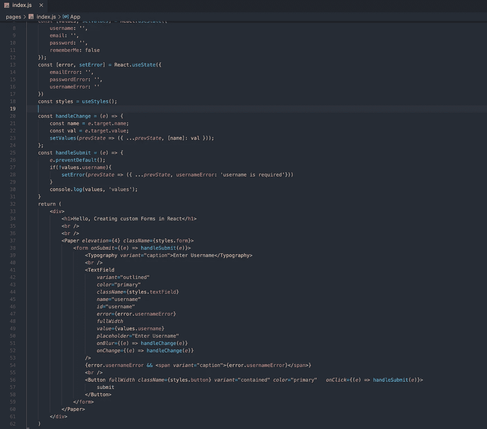
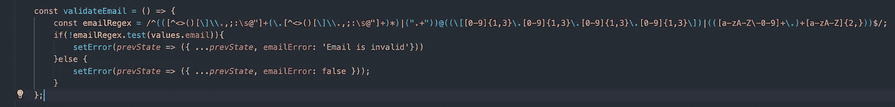
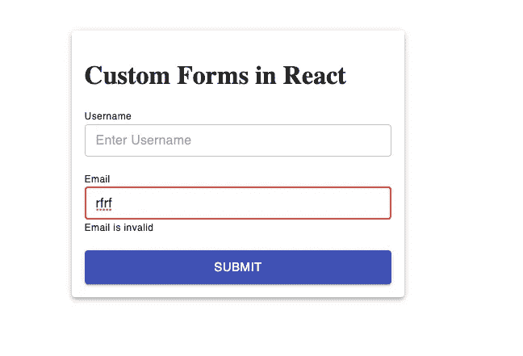
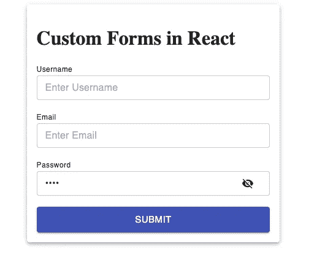
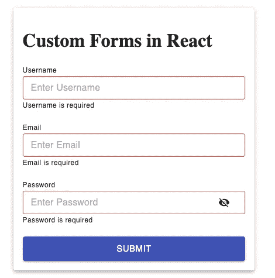
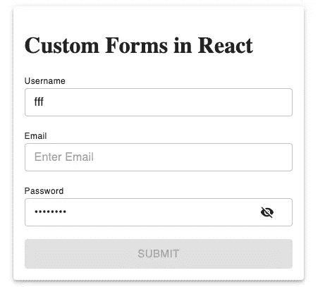

# 在反应中创建您自己的自定义表单

> 原文：<https://javascript.plainenglish.io/creating-your-custom-forms-in-react-6febdef592b3?source=collection_archive---------6----------------------->

## 创建自己的表单和验证，就像 Formik 一样


[React to our website](http://i-hate-reading-logs.vercel.app/)

创建带有验证的表单、提交表单值、像加载器一样显示 API 响应、错误是一项相当棘手的任务。表单在前端没有那么简单。开发人员通常会做的最基本的问题是将表单的每个值保存在状态管理存储区(如 Redux 存储区)或整个应用程序的全局状态中。
将整个表单值保存为全局状态没有问题，但是这个过程对于更新整个用户界面是不必要的。任何形式值的一个微小变化最终都会重新呈现整个应用程序，因为整个应用程序都订阅了我们的全局状态。

# **什么是 Formik？**

Formik 是一个**表单构建库**，这个库在创建表单时简化了一些繁琐的过程。Formik 提供了一种简单的方法来获取表单值，验证表单的值，例如，电子邮件验证、电子邮件是必需的验证以及创建简单的表单提交按钮。当我使用 Formik 时，我很喜欢它，而且它是一个非常小的 gzip 包(12KB)，很容易使用。

今天，我们将尝试通过所有必需的验证来制作我们自己的自定义表单。我将使用的第三方库是 material-UI。我已经在这个报告中安装了材料用户界面库。如果你想了解我是如何安装材料用户界面的，那就在下面添加代码库和文章链接。

```
**Article =>** [https://medium.com/nerd-for-tech/perfect-ui-library-with-react-813f41704584](https://medium.com/nerd-for-tech/perfect-ui-library-with-react-813f41704584)**Repository =>** [https://github.com/shreyvijayvargiya/iHateReadingLogs/tree/main/TechLogs/MaterialUIInstallationWithNextJS](https://github.com/shreyvijayvargiya/iHateReadingLogs/tree/main/TechLogs/MaterialUIInstallationWithNextJS)
```

Material UI 本身提供了许多表单验证方法，您可以在那里使用 FormControlAPI 来更好地理解。在此处阅读更多[。](https://material-ui.com/api/form-control/)

## 基本表单按材料控制-用户界面

Material UI 实际上为您提供了一个基本的包装器及其一些子 UI 组件，以便使用一些助手文本、错误/填充/聚焦输入为表单值创建输入。

```
<FormControl>
  <InputLabel htmlFor="my-input">Email address</InputLabel>
  <Input id="my-input" aria-describedby="my-helper-text" />
  <FormHelperText id="my-helper-text">
     We'll never share your email.     
  </FormHelperText>
</FormControl>
```

但是，我们不会使用这个 API 来创建我们的表单，相反，我们将创建我们的自定义表单并添加自定义验证。这个过程通常需要花费时间和精力，但是它可以完全控制表单的每一个细节，尤其是在验证方面，并且给用户一个良好的 API 响应。

# 执行

我们将从创建一个基本的输入开始，比如 Materila-UI 的 username 使用 TextField 组件，带有标签、提交按钮，并尝试为这个简单的 username 表单域添加一些验证。



Index.js for custom Form

我们有一个 useState 对象，它将收集表单元素中每个元素的所有值。然后，我们有一个单一的错误 useState 对象，它将陈述每种情况下的错误，如电子邮件、用户名、密码等。最后，我们有一个按钮，然后将提交所有的值，我们的按钮将涵盖所有的边缘情况，就像它将被禁用时，电子邮件或密码是错误的，或任何输入字段是空的。

## 电子邮件验证

对于电子邮件验证，最好使用正则表达式并禁用提交按钮，直到电子邮件根据正则表达式不正确。

```
Email Regex => /^(([^<>()[\]\\.,;:\s@"]+(\.[^<>()[\]\\.,;:\s@"]+)*)|(".+"))@((\[[0-9]{1,3}\.[0-9]{1,3}\.[0-9]{1,3}\.[0-9]{1,3}\])|(([a-zA-Z\-0-9]+\.)+[a-zA-Z]{2,}))$/;
```

我们将创建一个函数"***【validate email "***，该函数将检查电子邮件表达式是否正确，如果不正确，我们将把错误状态设置为 true，并禁用提交按钮，同时向用户显示错误消息。



ValidateEmail function will look like this now.



Error after writing an invalid email

另一种情况是提供一个密码字段，这个字段将具有显示和隐藏密码的功能。目前，我们不持有任何密码的正则表达式，如一个大写键，一个数字键等。但是你可以添加它们，就像我们有一个电子邮件一样。



Password Input with show and hide functionality

下一步是添加密码为空的错误边缘情况，密码字段也不应该为空，所以我们会处理它。对于所有的边缘情况，我们有一个公共的错误状态对象，它告诉我们整个表单的当前错误状态。



Password, Email & Username error condition our form

如果任何错误状态为真，您还可以添加禁用按钮的功能。怎么做很简单，使用输入的 **onBlur** 功能，并在每个输入的 **onBlur** 后添加检查是否所有的值都存在，还检查错误状态是否存在，如果任何错误状态存在，则将按钮的禁用设置为真。



Disabled button once email is not entered

每个错误状态都有能力禁用我们的提交按钮，这样用户就不能向我们的 API 发出请求，并且在向我们的后端发送数据之前，我们会在前端进行模式检查。我们也可以更喜欢使用 typescript，并在前端向每个状态对象添加类型，以再次添加严格的类型检查。

## 收集表单值

我们已经在一个状态中收集了所有的输入值，所以当用户点击提交按钮提交表单时，我们只需要获取整个值状态对象。这使得一切变得非常简单，我们可以将整个 values 对象作为主体添加到 API 请求中。

# 显示 API 响应

显示 API 响应总是一个好方法，在我们的例子中，在提交表单值之后，我们将从 API 得到一个响应，而不管 API 的响应体是什么。我们应该总是覆盖每一个边缘情况，就像我们上面对值检查所做的那样。
我们将在按钮上添加循环进度，指示用户等待我们的后端给出用户响应。我们需要给出一个适当的错误消息，以防用户输入错误的电子邮件或密码，或者用户没有在我们公司的数据库中创建帐户。在按钮中添加加载器状态，以在最后显示圆形进度条

```
<Button 
   *disabled*={disabled} 
   *fullWidth* 
   si*ze*=”large” 
   *className=*{styles.button} 
   *variant*=”contained”
   *color*=”primary”
    *onClick*={(*e*) =>  handleSubmit(*e*)}>
   {loader ? <CircularProgress *style*={{ color: ‘#eeeeee’ }} />
     :     
    "Submit"
    }
</Button>
```

# 结论

创建一个定制的表单并不困难，而且它给了你作为一个开发人员的充分自由，给用户一个更好的体验和反馈给每一个用户填写的表单。我已经创建了注册表单，在未来，我将涵盖另一篇文章，以填补长形式的东西，如浅野应用程序，我将涵盖如何存储这样长的形式的价值在实时。

直到，下一次，有一个美好的一天，人们。

```
Fell free to hit star button to our code Repository.
[Click to reach repository](https://github.com/shreyvijayvargiya/iHateReadingLogs/tree/main/TechLogs/CustomFormsInReact)
```

## 进一步阅读

[](/how-to-build-your-own-surveys-extend-them-with-custom-javascript-b4c7eb5648c4) [## 如何构建自己的调查&用自定义 JavaScript 扩展调查

### 一本关于如何使用自己的 JS 函数的入门书，以增强 SurveyJS 附带的条件逻辑和验证器。

javascript.plainenglish.io](/how-to-build-your-own-surveys-extend-them-with-custom-javascript-b4c7eb5648c4) 

*更内容于* [***普通英语***](https://plainenglish.io/) *。报名参加我们的* [***免费周报***](http://newsletter.plainenglish.io/) *。在*[***Twitter***](https://twitter.com/inPlainEngHQ)[***LinkedIn***](https://www.linkedin.com/company/inplainenglish/)*[***YouTube***](https://www.youtube.com/channel/UCtipWUghju290NWcn8jhyAw)*以及*[**T42 不和**](https://discord.gg/GtDtUAvyhW) *上跟随我们。**