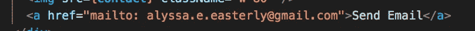
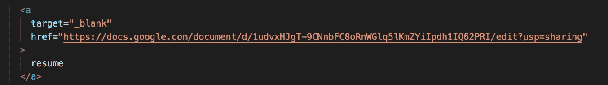
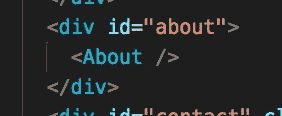
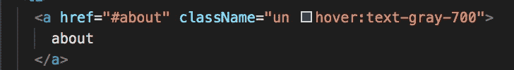

# 创建你的第一个作品集网站

> 原文：<https://javascript.plainenglish.io/creating-your-first-portfolio-website-following-the-yellow-brick-react-road-925dadfa1bc1?source=collection_archive---------7----------------------->

## 沿着黄砖路反应过来

Photo by [Umanoide](https://unsplash.com/@umanoide?utm_source=medium&utm_medium=referral) on [Unsplash](https://unsplash.com?utm_source=medium&utm_medium=referral)

我的开发者朋友们，这一周我学到的是，创建一个作品集网站可以有很多乐趣。

假设你最近从一个编码训练营毕业了？或者你可能想改变你的开发角色。不管是什么，现在可能是投资组合网站改头换面或彻底检修的时候了。

直到九月，我选择的网站创建者一直是 [Wix](http://Wix.com) 。它简单、易操作、可靠，而且看起来超级时髦！一个缺点是，你必须按月或按年付费。自从从我的软件工程训练营毕业后，我发现自己欣喜若狂，有点不知所措地创建自己的投资组合网站，因为它可以有无数的方向。经过一些仔细的考虑和计划，我找到了我的行动路线。

这里透露一点我的投资组合网站的发展。我将分享让我兴奋的事情，以及你可以把你的投资组合网站带入的其他可能方向的想法。

我的目标是简单，有 UX 界面，看起来干净，最重要的是，我需要在传递重要信息的同时注入我的创意。

让我们开始吧！

# **反应过来**

由于这个网站上没有数据库，我选择用 React 来构建。另一个可行的选择是加入 [Next.js](https://nextjs.org/) ，它被推荐给我，对投资组合网站的使用很有帮助。Next.js 是一个建立在 React 之上的框架，当你有一个像作品集这样的静态网站时，这个框架特别有用。Next.js 有内置的数据获取 API，当您获取数据时，生成的数据束是预先呈现的。这很好，因为这意味着网站用户更容易使用，也可以提高网站的搜索引擎优化。(我未来的目标之一是学习 Next.js，并落实到项目中)

# 部署:Netlify 诉 Vercel

Netlify 是我在这里的选择，如果你要使用 Next.js，请查看 Vercel 进行部署。Vercel 实际上创建了 Next.js，所以他们可以携手合作。

很好，所以 Netlify 很容易建立和运行。我建议在开始开发之前将 GitHub repo 链接到 Netlify。每次提交和推送都会节省 Netlify，并且您可以实时查看这些新的实时推送的提交。这消除了部署的压力。如果你需要一点网络生活的指导，看看这个有用的最新网络生活部署博客。

# **单页 App。**

*(更好的说法是温泉)*

请注意，是的，SPA 是一个令人放松的地方，有着美妙的气味，然而科技 Spa 有点不同。一个 **SPA 是一个单页 web 应用程序或网站**，它通过使用来自服务器的新数据动态重写当前网页来与用户进行交互。这与旧的开发方式形成对比，在旧的开发方式中，web 浏览器的默认方法是重新加载每个新页面。基本上，这里的目标是更快的网络过渡，因此更好的用户体验。

尽管如此，我一直是一个网站的长期粉丝，这些网站有一个长长的滚动页面，但也有一个导航栏，它坚持在顶部，让你通过点击相应的链接(即“关于”，“联系”)跳转到你想要的部分。我知道我想把它放在我的作品集页面上。如果你有一个更复杂的网站，这可能并不理想，因为你需要为用户组织信息。

# 我学到的东西。(谢谢谷歌。)

**邮件链接**

*   在我的联系人部分，我用以下代码将一个用户链接到我的电子邮件:

**简历链接**

*   我使用了一个标签直接链接到我的 google drive 简历文件，代码见此:

**点击跳转到不同的部分**

*   我的目标是有一个粘性导航栏，当滚动网页时，用户可以点击他们想跳转到的部分标题。我通过用一个编写我的 React 组件，然后给它一个 id(即来实现这一点。参见我的代码:

# 设计框架

我用的是 **Tailwind.css** 。这是一个实用至上的 CSS 框架，它允许你从他们创建的类库中提取名字，以此来构建你的网站。如果你想了解更多，请看我以前的博客。

我的开发者朋友们，希望这能给你一些想法，为你自己的作品集网站创作提供灵感。祝你黑客愉快，请分享你最近在投资组合网站世界中喜欢的技巧/趋势。