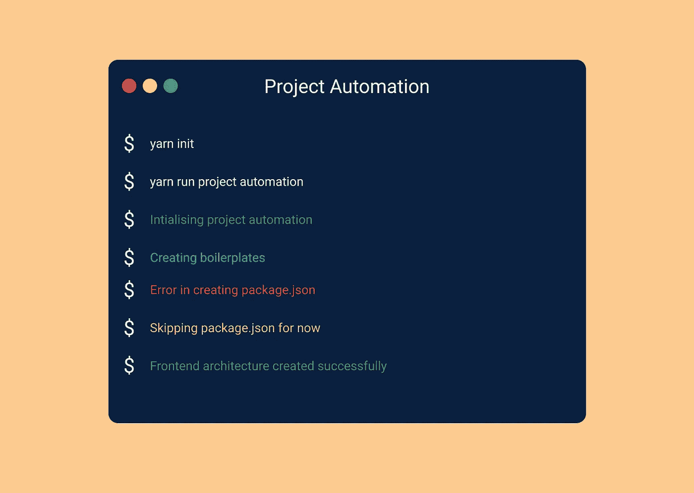
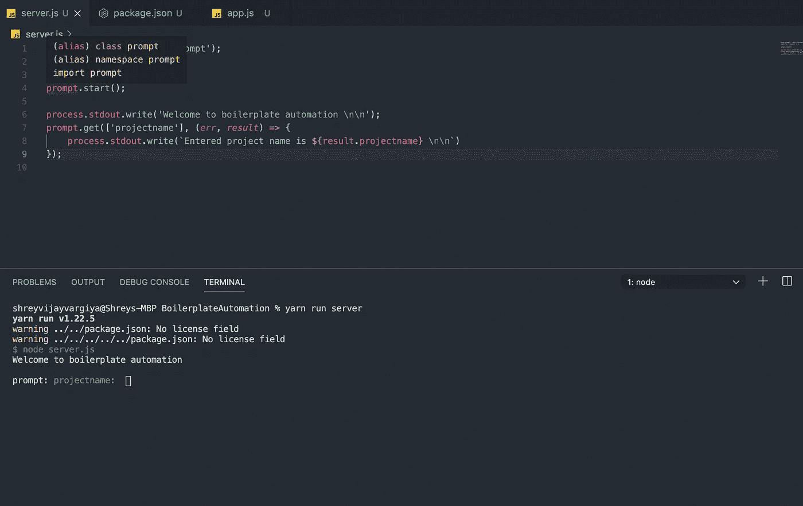

# 如何用一个函数创建整个前端样板文件？

> 原文：<https://javascript.plainenglish.io/creating-your-own-boilerplate-f28725568018?source=collection_archive---------4----------------------->

自动化创建前端样板文件的重复过程。



[Terminal UI design](http://ihatereading.in)

# 在后台

我和一些客户一起工作，开发他们的项目。我的大多数客户都需要一个前端接口。每次，我都会重复在 Github 上创建一个存储库，运行最初的 yarn 命令，然后创建或多或少相同的文件夹或架构。即使我使用不同的第三方，架构的概述仍然是相同的。

这个重复的过程耗费了大量的时间。作为开发人员，我们总是专注于一件事——改进我们的工作方式并为未来简化流程。这就是为什么我决定每次都自动化运行命令和生成代码架构的过程。

# 入门指南

这个想法是创建一个简单的命令或函数，一旦它执行，将为我们创建一个完整的前端样板文件。

我们将使用 Node.js `child`进程、`fs`(文件系统)模块和`**prompt**` npm 包。这是我们要做的:

*   向用户询问项目名称。
*   输入项目名称后，使用该名称创建一个文件夹。接下来，在根项目文件夹中添加一些文件夹和一个 **package.json** 。
*   创建`package.json`文件时，向其中添加所需的脚本。
*   最后，生成样板文件后，在本地运行整个前端项目。

# 编写代码

我们需要一个提示命令来询问用户终端中的项目名称。

我已经创建了一个存储库(下面提供了链接)，并添加了一个包含所有自动化代码的文件 **server.js** 。继续运行以下命令来安装所需的软件包。

```
yarn add prompt chalk cli-progress
```

# 第一步

提示包帮助用户提示终端中的输入字段。通过这种方式，用户可以像使用任何网站一样与终端进行交互。我们将使用 prompt `**get**` 方法，该方法接受模式并在回调中返回用户输入的值**。**



Simple prompt command to get the project name from the user.

server.js

我们上面定义的简单提示方法将在项目执行时询问用户项目名称。上面添加的截图显示了终端要求用户添加项目名称。

# 第二步

我们的第一步完成了。下一步是创建文件夹，将用户添加的名称作为项目名称。我们将使用 Node.js 的`**child_process**`模块来处理终端流程。

使用`**child_process**`，我们将创建名为项目名称的文件夹。为了更好的理解，我用粉笔给我们的终端文本着色。

server.js

我们使用 Node.js `**execSync**`命令创建一个文件夹，并输入项目名称。这个过程将命令作为第一个参数，并在回调中将结果返回为`**error**`、`**stdin**`和`**stdout**`。

我们使用`**mkdir**`命令创建了一个带有项目名称的文件夹，在回调中，我们简单地将输出给用户。一旦执行，我们的文件夹与项目名称将被创建在我们的根目录下。

这样，我们自动化的第一步就完成了。通过使用一个简单的函数，我们自动化了创建文件夹的过程。

# 第三步

我想要更多的自动化。例如，我希望这个自动化功能为任何前端项目创建一个 **package.json** 文件和所有必需的文件夹。

我是 Next.js 的忠实粉丝，我总是更喜欢在我的前端项目中使用 Next.js。因此，对于这个自动化任务，我将创建一个与 Next.js 完全一样的文件夹或架构。我们将使用如下所述的文件夹名称:

*   **公共** —资产文件夹。
*   **页面** —路线文件夹
*   **组件** —由所有页面的组件组成的文件夹。
*   **模块—** 可重用文件夹由 body、navbar 等组件组成。

我们将使用`**child_process**`方法在项目目录中移动并创建上述文件夹，这非常简单。第一步是进入目录，通过创建一个 **package.json** 或简单地运行 yarn 命令来初始化项目。

```
cd ${result.projectname} && yarn init
```

上面的命令是使用`**child_process**`执行的，在回调中，我们可以简单地给用户一个关于初始化项目存储库的消息。

下一步也是最后一步是在项目目录中移动并创建所需的文件夹——public、components、modules 和 pages。下面是我们希望在终端中运行的命令。

```
cd ${result.projectname} && mkdir pages components public modules
```

server.js

# 安装软件包

我们还需要一些第三方包，如 React、ReactDOM、Material-UI、Tailwind CSS 或样式组件，以及一些 Babel 插件。我们也可以自动安装，以防止重复。

我们有两个选择:

*   我们可以简单地要求用户给出他/她想要安装的软件包列表，然后一起安装它们。

**或**

*   我们可以自己安装所需的基本软件包。

```
cd ${result.projectname} && yarn add react raect-dom next
```

```
cd ${result.projectname} && yarn add @material-ui/core babel-plugin
```

server.js

# 展开性

您可以将自动化扩展到您想要的任何程度。例如，我们在`**pages**`目录中为`**index.js**`文件添加了基本代码，为`**package.json**`文件添加了`**scripts**`。

我还在最后增加了一个自动化，使用`**yarn run dev**`命令在本地运行我的代码。这整个自动化是高度可扩展的，因为您可以为您想要自动化的任何过程编写命令。

# 最终产品


Final product gif

# 结论

这是一个简单的函数，我们每次都需要运行它来创建我们自己的样板文件。我将链接附加到知识库，以便您了解这个自动化项目的基础知识。随时关注我的日常技术学习。

 [## shreyvijayvargiya/iHateReadingLogs

### 克隆 Repo Run yarn 安装运行 cd ReactProjectAutomation 运行节点 app.js 打开 localhost:3000 看网页…

github.com](https://github.com/shreyvijayvargiya/iHateReadingLogs/tree/main/TechLogsBackend/BoilerplateAutomation) 

下次见！祝大家愉快。

*更多内容请看*[*plain English . io*](http://plainenglish.io/)