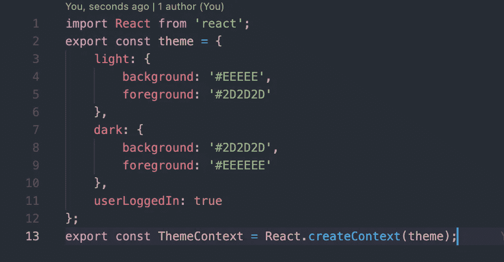
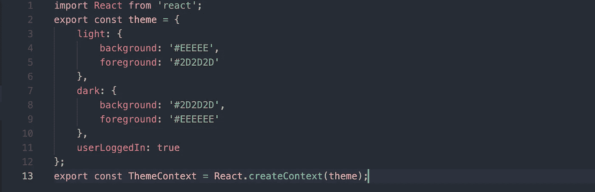
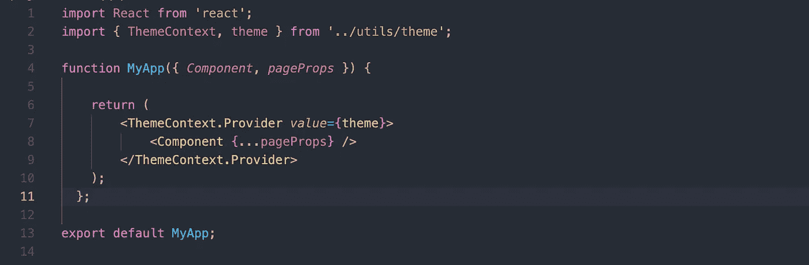
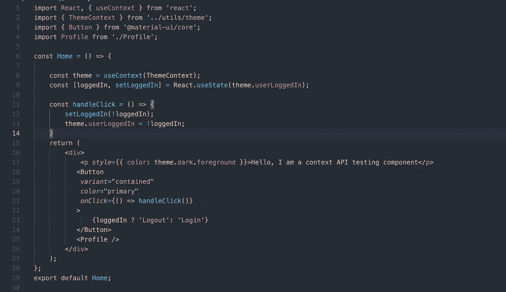
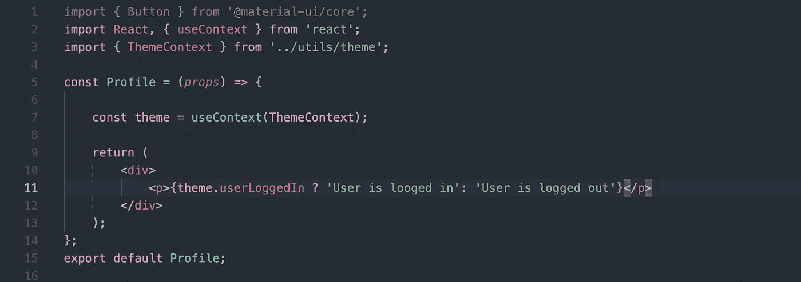
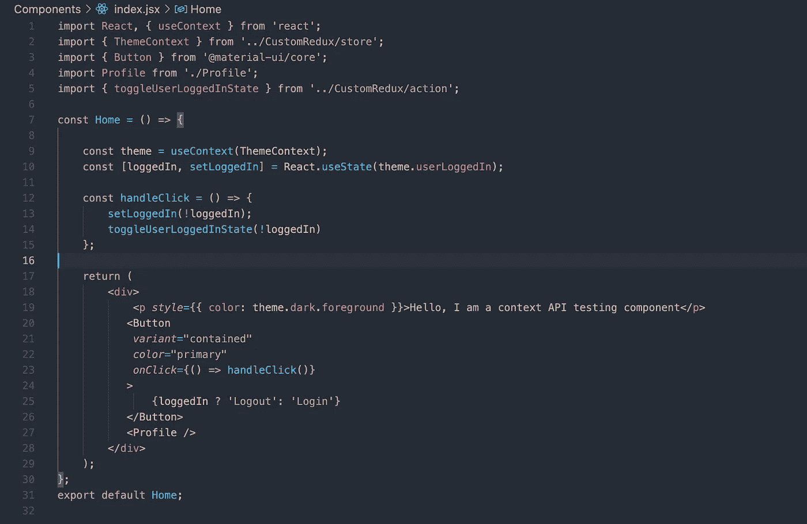

# 创建自己的反应状态管理

> 原文：<https://javascript.plainenglish.io/creating-your-own-state-management-1f0c894039d7?source=collection_archive---------5----------------------->

## 了解" ***"使用 Context"*** "和"***" create context***" API 创建自定义状态管理。



[iHateReading](http://ihatereading.in/creativity)

Redux 是一个很大的包，有时它会降低应用程序的性能。您可以通过使用 build 命令构建下一个 JavaScript 存储库来自己测试它，并查看 Redux 包在所有其他包中占据了多少空间。

```
**yarn run build**
```

# **背景**

Redux 是由 Don Abromov 在 2015 年准备 React Europe 会议时开发的，当时他试图与 Flux store 一起玩。我相信，redux 出现的一个坚实的原因是在深度嵌套的子组件之间和直接兄弟组件之间共享的公共属性和值。我个人在谷歌搜索一些模糊和随机的单词后，在直系兄弟姐妹之间传递更新的值时面临很多困难😁大约 2/3 个小时，我最终到达了所谓的“***【Redux】***字。

感谢地球上的某个人，他清楚地提到了下面的评论—

> “你需要一种叫做**国家管理的东西**我的朋友”

这就是为什么有时候阅读评论是有意义的😁。

# **React 上下文 API**

现在你可以对上述主张提出反驳。是的，我们可以把道具从父母传给孩子。但是这个选项是不可行的，因为节点树的最深和最低的子节点的道具数量将是最大的，并且该节点处理它的道具变得很麻烦。

但是，React 确实提供了另一种方法来将公共值传递给嵌套很深的子节点或兄弟节点。React 提供与 API 名为“ ***”的 React 上下文 API。*** 您可以从链接中了解更多

```
**React Context API =>** [https://reactjs.org/docs/context.html](https://reactjs.org/docs/context.html)
```

**了解上下文 API**
反应上下文在幕后做两件事:

1.它为您创建一个上下文对象，这是一个高阶组件(HOC)，如果您不知道 react 中的 HOC 是什么，那么简单地说，HOC 是一个包装器组件，它返回另一个组件，而不是返回值。

2.创建的 HOC 有两种方法: ***【提供者】******【消费者】*** 。顾名思义，提供者是向消费者提供应用程序全局状态的人，而消费者是读取和写入全局状态的人。

回到 React context HOC，这个上下文包装器然后被包装到应用程序的根。React Context API 创建了一个上下文特设，我从现在开始将这个上下文特设称为 **MyContext，因为它更容易键入。**

```
**MyContext = React.createContext(defaultValue)
React Context HOC = <MyContext />**
```

您可以创建多个 ***消费者&******供应商*** 。MyContext Component 接受“***global state”***作为道具，接受“***value”***作为密钥。

```
**<MyContext.Provider value={globalState}> // this is the Provider 
   <Component {...pageProps} /> // this is the Consumer 
</MyContext.Provider>**
```

`<Component />`组件将成为我们的 globalState 的消费者，并且它可以有多个深度嵌套的子组件。每个孩子都能进入全球之州。<组件/ >的每个子组件本身都被称为消费组件。另一个**加分点**是，当任何消费者组件编辑、更新或删除 globalState 的任何键值对时，所有其他消费者组件将获得 globalState 的最新值，并自动重新渲染。就像我们通过调度一个动作来使用减速器更新商店一样。

此外，每当 globalState 对象的任何值发生变化时，订阅 globalState get 的每个组件都会被重新呈现。要停止这种重新渲染，请使用“***reaction . usememo()”***方法，并围绕该组件创建记忆。反应时使用***object . is***方法的 JavaScript 来检测***global state***的变化。一旦通过***object . is***方法跟踪/记录了更改，该***global state***的所有订阅者都会获得最新的值，从而重新呈现。

# **应用**

我们将把 **MyContext** 包装在我们的***app . js***中，因为我们需要将我们的 globalState 传递给应用程序的每一页。 ***useContext()*** 方法采用默认值和参数，在我们的例子中，默认值是我们的 **globalState** 。

```
const globalState = {
       dark: {
            background: '',
            foreground: ''
       },
       light:{ 
            background:'', 
            foreground: '' 
       },
       userLoggedIn: true
};
const MyContext = React.createContext(globalState);
```



theme.js file for creating Context HOC using Context API

出于开发目的，我们的 globalState 将由一对键值组成，这对键值是“ ***userLoggedIn*** ”，其值是“**Boolean”**数据类型。这背后的主要议程是在其子组件中访问我们的根应用程序的全局状态，然后切换它。

我们将把这个全局状态对象作为上下文 API 的默认值，它将返回一个上下文特设(MyContext)。

```
import { ThemeContext, Theme } from 'theme.js'
<MyContext value={theme}>
   <Component {...pageProps} />
</MyContext>
```



_app.js

下一步是通过子组件或消费者组件子组件读取该全局状态，然后切换其中一个全局状态值(userLoggedIn)。

在任何消费者组件中访问这个 globalState 对象也很容易，您只需要使用由 React 提供的 Context 钩子，并在消费者组件中将您的 MyContext 对象传递给它。

```
import React, { useContext } from 'react';
import { ThemeContext} from 'theme.js'const theme = useContext(ThemeContext);
<MyContext.Consumer value={theme}>
   <p>{theme.userLoggedIn }</p>
</MyContext.Consumer>
```

**执行** 我已经创建了 2 个子组件(名为 Home 和 Profile)，Home 组件正在切换 userLoggedIn 值，而 Profile 组件正在读取 globalState 的最新值。在切换了 userLoggedIn 值之后，配置文件组件将重新呈现。例如，如果 userLoggedIn 为真，则将文本显示为“用户已登录”，因此将文本显示为“用户已注销”。



Home Component toggling the globalState **userLoggedIn** value



Profile Component reading the **userLoggedIn** value from globalState

# **自定义状态管理系统流程**

同样，在 **Redux** 中，我们可以创建调度函数来更新全局状态，或者在我们的自定义状态管理中更新所谓的应用程序存储。

我们还可以根据需要扩展整个体系结构。我将创建一个名为 CustomRedux 的单独文件夹，其中包含 action 和 store。我的商店将从"***【create context "***API 导出 globalState 对象，该操作将更新商店。

此外，我还可以创建 reducer，这是一种中间件功能，但在本例中，我将跳过它。

```
-- Custom Redux 
 |-- action.js
 |-- store.js
```

我们将从创建第一个定制动作开始，这是一个切换主题对象的布尔值“userLoggedIn”的简单动作。在我们的例子中，该操作将获取数据并简单地更新 store 对象。

```
// action.js 
import { ThemeContext, Theme } from CustomRedux/store'
export const toggleUserLoggedInState = (loggedInState) => {
  return theme.userLoggedIn = loggedInState
}
```

我们将使用此操作作为 dispatcher 函数来更新全局状态。

```
// store.js
const theme = {
       dark: {
            background: '',
            foreground: ''
       },
       light:{ 
            background:'', 
            foreground: '' 
       },
       userLoggedIn: true
};
const MyContext = React.createContext(theme);
```



Home Component using our Custom Redux

# **更换冗余**

我们真的可以取代 redux 提出这种架构，我认为这不是一个正确的时间来回答，如果是这样的话，它会取代 redux。但是这里肯定有一个问题，如果您在任何子组件中控制我们的 globalState 对象，我们将获得最新的状态，但是如果我们刷新浏览器，我们将返回到主题对象的原始状态，因此我们的"***user logged in "***将始终保持" ***true*** "一旦用户刷新页面，忽略它被切换的时间。Redux 也有这个问题，redux 确实提供了一个"***redux-persist "***或***redux-storage***NPM 包来保存最新的 redux store 或 globalState，因此即使在刷新之后，您也只能获得持久状态。

Redux-storage 或 Redux-persist 作为中间件，将全局状态对象存储在 ***RAM*** (随机存取存储器)中。我不确定，但是如果我们可以在我们的"*动作中添加一个中间件函数，使用插件/扩展将最新的全局状态存储到浏览器 ***RAM*** 中，那么我们可以很容易地解决这个问题，而不需要使用"***【Redux-Storage】***和"***Redux-Persist "***。*

```
*// action.js 
import { ThemeContext, Theme } from CustomRedux/store'
export const toggleUserLoggedInState = (loggedInState) => {
  // add and middleware function which will store the updated theme      in browser RAM or cache 
  return theme.userLoggedIn = loggedInState
}*
```

*我们有另一个解决方案，将更新后的 globalState 存储到我们的数据库中，并且只能使用头中带有令牌的安全 API 端点来访问它。但是这也暴露了一个边缘情况，即离线模式，一旦用户离线，用户就不能访问状态，只能在本地显示数据。*

# ***结论***

*我仍在测试这整个想法，但我对这种方法相当乐观，我已经完全完成了“***【Redux】***的工作，因为一旦我们创建更多的动作，它的大小就会不断增加。我将尝试添加更多使用" ***useContext"*** 和"***create context***" API 的教程。最后，也许我应该试试这个新的状态管理，叫做***【X-State】***，到目前为止，对大多数开发人员来说，这听起来很有前途。*

*下次再见，祝大家愉快。*

```
*Here is the code repository => [https://github.com/shreyvijayvargiya/iHateReadingLogs/tree/main/TechLogs/BasicsReactContext](https://github.com/shreyvijayvargiya/iHateReadingLogs/tree/main/TechLogs/BasicsReactContext)*
```