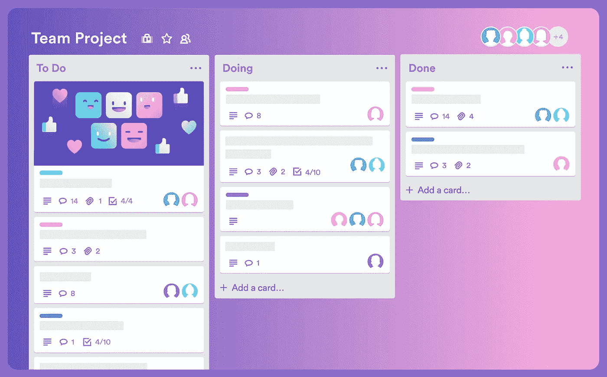

# 你可以从兼职项目中学到的重要经验

> 原文：<https://javascript.plainenglish.io/crucial-lessons-a-2-year-long-side-project-taught-me-bffb4bf3284f?source=collection_archive---------23----------------------->

## 在做了两年的副业后，我对结果和我的经历感到非常自豪，所以我想和你分享我学到的东西。

Photo by [Garrhet Sampson](https://unsplash.com/@garrhetsampson?utm_source=medium&utm_medium=referral) on [Unsplash](https://unsplash.com?utm_source=medium&utm_medium=referral)

两年前，我决定创建一个规划扑克应用程序。这是一个游戏化的评估工具，团队可以像玩游戏一样评估未来的任务。我之所以这么做，是因为大多数应用程序在客户的私人网络中被自动封禁为赌博网站。

后来，我开始规模化项目。我添加了不同的功能:在线回顾板、报告、多个 scrum masters 支持、聊天等等。

这些年后，我对这些成果和我的经历感到非常自豪，所以我想与你们分享我所学到的东西。即使是不赚钱的项目也会让你在多个方面增长技能，以下是方法。

# 学习想要的技术

好吧，你决定创建你的项目。它是你的，你是这里的老板。你可以选择任何技术，构建任何架构。如果你是一个科技公司的开发人员，你很可能会为你的项目/客户/团队使用最合适的技术栈。如果没有合理的理由，你只能尝试其他的东西。

但是在你的项目中，你可以自由地使用任何想要的技术。你可以试试 GCP，AWS，或者其他任何平台。任何编程语言，尝试新的前端框架。可能你会非常喜欢它，所以会决定改变你的主要项目。

# 全栈开发

不管你是前端开发者还是后端。既然你决定做你的项目，你需要自己做所有的事情，或者雇人。如果这是一个副业项目，而不是创业，你可能希望尽可能地省钱。在大多数情况下，你的目标是 0 美元的账单，所以你需要独自完成所有的事情。

这意味着你需要解决从购买域名到向用户收费的所有问题。你需要找到在哪里托管你的项目，连接到托管域，管理数据库，用户认证，搜索引擎优化，可能服务器端渲染(SSR)，设计，UX，整合计费系统，做报告，以及许多其他事情。

所有这些技术性的东西将极大地拓宽你的视野，让你成为一名更好的程序员。

# 把事情做完

即使你有足够的技能和知识，也不能保证你会推出你的 MVP。为什么？因为在工作过程中，你会收获越来越多的想法。稍后你可能会意识到重构或新技术可以显著改善你所做的事情。你需要专注于项目中最有价值的功能，完成它们，发布它们，然后再转向新功能。不要在它们之间切换。

Trello.com

我用 Trello 来区分任务的优先顺序，集中精力，一件一件去做。通常，对于 side hustle 项目，我会做一个有“Backlog”、“In progress”、“Done”、“Issues”和“Ideas”栏的公告板。然后，按优先顺序排列任务，最重要的从上往下。就这样，我看到了我现在应该做什么，下一步要做什么。而且是免费的。

# 获得营销经验

对我个人来说是最有挑战性的部分。仅仅创建一个友好的搜索引擎优化登陆页面和发布一个谷歌广告是不够的。你需要围绕你和你的产品建立一个观众群。因为现在很难吸引用户的注意力。

最好的方法之一——创建一个[产品搜寻](https://www.producthunt.com/)活动。但是，它需要强大的营销技巧来开发一个关于你的项目的成功公告。

此外，如果你能找到分析市场和接收用户反馈的方法，那将是最好的。最后，别忘了做一个社交活动，做做宣传片，做做新闻。

正如你所看到的，失败的机会很多，但是什么都不做的人永远不会犯错，因此也永远不会吸取教训。

**感谢您的阅读，祝您的 side hustle 之旅好运！**

你可以在 Medium 上关注我的更多科技文章，也可以在 [Twitter](https://twitter.com/golosay) 上找到我。