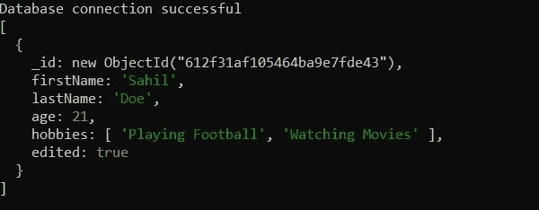

# 使用 MongoDB 的 CRUD 操作

> 原文：<https://javascript.plainenglish.io/crud-operations-using-mongodb-8ff4179b6d24?source=collection_archive---------12----------------------->


我们已经讨论了什么是 MongoDB，并在我们的系统上安装了它。我们正在实现 CRUD(创建、读取、更新、删除)操作。如果你想简单介绍一下 MongoDB 及其安装，建议你看一下[这篇](https://sahil-more.medium.com/what-is-mongodb-55194609df72)文章。😉

那我们继续吧。🙌

首先，您还必须在系统上安装 Node 的更新版本。你可以很容易地从[这里](https://nodejs.org/en/)得到。

确保在命令提示符下键入`mongo`命令后得到这个输出。如果没有，你必须先[安装](https://sahil-more.medium.com/what-is-mongodb-55194609df72)。保持这个命令提示符运行，它会在您的系统上创建一个 MongoDB 实例。


**Keep this tab running**

创建一个文件夹`mongo_crud`，我们将在其中执行所有操作。

执行命令`npm init -y`启动`mongo_crud`文件夹中的项目。

然后执行`npm install --save mongodb`来保存 MongoDB 驱动。


与 SQL 不同，在 SQL 中，我们需要在使用数据库之前创建数据库，MongoDB 在运行时创建数据库，不需要预定义的数据库。

# 连接到数据库

创建一个`connect-mongo.js`文件。

编写以下代码来创建连接。

```
const mongodb = require('mongodb');                       
const MongoClient = mongodb.MongoClient; // Connection URL                       
const url = 'mongodb://localhost:27017';// Database Name                       
const dbName = 'mydb'; // Use connect method to connect to the server                       MongoClient.connect(url, function (err, client) {                             
    if (err) {                               
          throw err;                           
    }                                                     
    console.log('Database connection successful'); // This objects holds the reference to the db                           
    const db = client.db(dbName);                                                         
    client.close();                       
});
```

使用`node connect-mongo.js`运行代码

如果您已经成功连接到数据库，您应该会看到输出:


否则，您会收到一条错误消息。检查服务器是否启动并运行，以及在这种情况下用户名和密码是否正确。

正如您在示例中看到的，`MongoClient.connect`方法有两个参数，数据库的 URL 和回调函数。

回调函数有两个参数:`err`和`client`。

如果存在任何网络问题或任何其他与连接到数据库有关的问题，第一个参数将包含一个错误。如果没有问题，错误将是`null`。

第二个参数是客户机对象，我们用它来与数据库交互。

`client`的`db`属性保存对数据库的引用。为了对数据库执行任何操作，我们使用这个引用。

# 创建文档

因为我们在 SQL 中有表，所以 MongoDB 允许使用集合。这些集合基本上以表的形式工作，但是以非结构化 JSON 对象的形式。

要创建文档，我们有两种方法:

1.  顾名思义，这个命令允许我们在数据库中一次插入一条记录。按照下面给出的代码片段，创建
    `insert-one.js`文件来实现代码。

```
const mongodb = require('mongodb');const MongoClient = mongodb.MongoClient;const url = 'mongodb://localhost:27017';const dbName = 'mydb';MongoClient.connect(url, function (err, client) {if (err) {throw err;}console.log('Database connection successful');const db = client.db(dbName);const collection = db.collection('mydb');// Insert one documentcollection.insertOne({firstName: 'Sahil',lastName: 'More',age: 21,hobbies: ['Playing Football','Watching Movies']}, (err, result) => {if (err) {console.log(err);return;}console.log(result);client.close();});});
```

回调的结果参数包含有关查询的信息。它有一个名为`result`的字段，看起来像:


在插入文档之前，您不必显式地创建名为`mydb`的数据库，或者名为`users`的集合。将自动创建数据库和集合。

2. **insertMany()**

有时我们需要同时添加多条记录。这个函数允许我们这样做。它类似于`insertOne()`功能。只需按照代码片段创建`insert-many.js`文件并实现代码。

```
const mongodb = require('mongodb');const MongoClient = mongodb.MongoClient;// Connection URLconst url = 'mongodb://localhost:27017';const dbName = 'mydb';MongoClient.connect(url, function (err, client) {if (err) {throw err;}console.log('Database connection successful');const db = client.db(dbName);const collection = db.collection('mydb');// Insert multiple documentscollection.insertMany([{firstName: 'John',lastName: 'Player',age: 21,hobbies: ['Watching Movies']}, {firstName: 'John',lastName: 'Doe',age: 20,hobbies: []}], (err, result) => {if (err) {console.log(err);return;}console.log(result);client.close();});});
```

我们需要提供一个 JSON 对象数组来插入多条记录。输出如下所示:


MongoDB 为我们添加到数据库中的每条记录分配一个惟一的`_id`。如果您想自己给自己一个惟一的 id，可以通过在 JSON 对象中定义字段`_id`来实现。

# 阅读文档

我们将通过编写下面`read-all.js`中给出的代码来获取集合中的所有文档:

```
const mongodb = require('mongodb');const MongoClient = mongodb.MongoClient;const url = 'mongodb://localhost:27017';const dbName = 'mydb';MongoClient.connect(url, function (err, client) {if (err) {throw err;}console.log('Database connection successful');const db = client.db(dbName);const collection = db.collection('mydb');collection.find({}).toArray((err, docs) => {if (err) {throw err;}console.log(docs)client.close();});});
```

正如您在示例中看到的，我们传递了一个空对象(`{}`)作为查询。

根据文档，`toArray()`方法返回一个数组，该数组包含游标中的所有文档。该方法完全迭代游标，将所有文档加载到 RAM 中并耗尽游标。

输出:


要根据某些属性过滤出结果，您只需提供一个存在于我们数据库中的 JSON 格式的键值对。在`read-one.js`中也可以这样做:

```
const mongodb = require('mongodb');const MongoClient = mongodb.MongoClient;const url = 'mongodb://localhost:27017';const dbName = 'mydb';MongoClient.connect(url, function (err, client) {if (err) {throw err;}console.log('Database connection successful');const db = client.db(dbName);const collection = db.collection('mydb');collection.find({firstName: 'Sahil'}).toArray((err, docs) => {if (err) {throw err;}console.log(docs)client.close();});});
```

输出:


显然，所有带有`firstName` `Sahil`的记录都被返回。

# 更新文档

为了更新文档，我们可以使用`updateOne()`和`updateMany()`功能。用如下代码创建一个`update-one.js`文件:

```
const mongodb = require('mongodb');const MongoClient = mongodb.MongoClient;const url = 'mongodb://localhost:27017';const dbName = 'mydb';MongoClient.connect(url, function (err, client) {if (err) {throw err;}console.log('Database connection successful');const db = client.db(dbName);const collection = db.collection('mydb');// Update one documentcollection.updateOne(// The query filter{firstName: 'Sahil'},// The update values{$set: {lastName: 'Doe',edited: true}},(err, result) => {if (err) {throw err;}console.log(result);client.close();});});
```

输出:



正如您在示例中看到的，`updateOne()`方法接受三个参数。第一个是查询过滤器。第二个是更新值。第三个是回调函数，它接受错误和结果作为参数。

同样，这里的结果通知我们状态(`true`)、选择更新的文档数(`matchedCount`)和更新的文档数(`modifiedCount`)。

如果用字段已有的值更新字段，则`matchedCount`可以大于`modifiedCount`。

使用这个查询，我们选择了一个文档，其中字段`firstName`是`Sahil`，我们已经将该文档的`lastName`更改为`Doe`。另外，我们还添加了一个名为`edited`的字段，并将其设置为`true`。请注意，在整个过程中，我们不需要指定或遵循任何模式。Mongo 只接受你发送的任何数据。

如果您使用的是`updateOne()`方法，查询将选择第一个具有匹配字段的文档。如果有多个文档具有相同值的字段，使用`updateMany()`方法将会更新所有文档，这在某些情况下可能不是我们想要做的。

`updateMany()`具有相同的实现，只是在上面给出的代码中用`updateOne()`替换它。但是在使用这种方法时要小心，它将更新所选集合中符合条件的所有记录。

## 删除文档

我们可以使用`deleteOne()`和`deleteMany()`方法从集合中删除记录。可以按如下方式完成:

```
const mongodb = require('mongodb');const MongoClient = mongodb.MongoClient;const url = 'mongodb://localhost:27017';const dbName = 'mydb';MongoClient.connect(url, function (err, client) {if (err) {throw err;}console.log('Database connection successful');const db = client.db(dbName);const collection = db.collection('mydb');// Delete one documentcollection.deleteOne(// The query filter{firstName: 'Sahil'},(err, result) => {if (err) {throw err;}console.log(result);client.close();});});
```

输出:


同样，与前面的示例类似，第一个接受的参数是过滤器查询，第二个参数是回调函数。回调函数返回错误或结果。

运行这段代码将删除一个匹配查询的文档——在本例中，这个文档的`firstName`字段是`Sahil`。同样，这只会删除与查询匹配的第一个文档。

您也可以使用`deleteMany()`方法删除所有符合`firstName`“Sahil”的文件。你只需要在上面给出的代码中用`deleteMany`替换`deleteOne`。同样，使用此方法时要小心，因为它将删除多个符合条件的条目。

> 所有文件都可以在我的 GitHub 上找到[这里](https://github.com/sahilmore-git/Mongo-CRUD)🚀

# 谢谢:)

希望你们喜欢这篇文章。🙌
请鼓掌让我知道。👏
在这里发表你对[新文章的建议。📬你也可以在这里给我买一杯咖啡。☕️](mailto:sahilmore19999@gmail.com)

*更多内容请看*[***plain English . io***](http://plainenglish.io/)