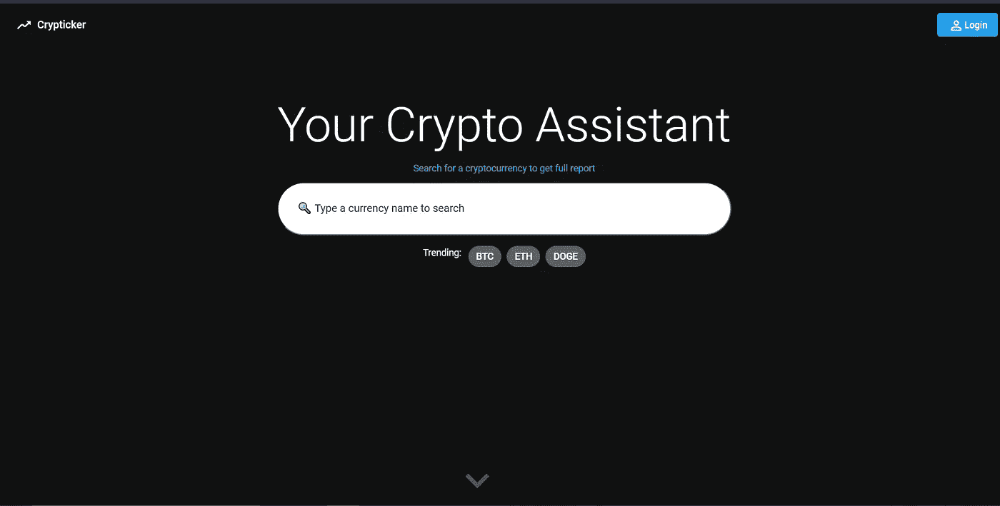

# 使用均值堆栈构建加密货币跟踪器

> 原文：<https://javascript.plainenglish.io/cryptocurrency-tracker-using-mean-stack-cbfb60c9c1d5?source=collection_archive---------17----------------------->

Crypticker ✈

由于加密货币目前非常受欢迎，并且增长如此之快，我对它非常着迷。在浏览加密货币网站后，我意识到加密货币非常不稳定，价格和交易量每秒都在变化，这取决于所执行的交易。

由于我正在学习 MEAN (MongoDB，Node.js，Express，Angular)堆栈，我认为实现一个显示货币详细信息并具有观察列表功能的个人项目是一个好主意。

由于这不是一个“如何做”的帖子，我将只记录项目的一些主要部分和一些代码片段。

# 步骤:

首先，建立一个带有错误记录器和请求记录器的 Express 应用程序来捕获错误和请求。

下一步是找到提供加密货币数据的 API。经过一番挖掘，我找到了由 WazirX 提供所有必要市场数据的加密货币 API(T0)和为创建图表提供历史数据的 alpha vantage API(T3)。

## 1.设置 Node.js 环境以与 WazirX API 交互。

由于 [CORS](https://developer.mozilla.org/en-US/docs/Web/HTTP/CORS) 的原因，不能从前端直接访问 WazirX API，所以建立了 Node.js 环境。我正在学习 Axios，因此我决定实现它并使用它与给定的路由链接进行交互。获取 WazirX 上所有货币的最新行情的一个简单例子是图 1。

Route to get all tickers from WazirX

## 2.设计一个简约的用户界面并连接 API。

设计了一个简单的 UI，包括一个搜索栏、一个显示应用程序名称的导航栏和一个登录按钮，在主页下方显示货币(滚动时可见)。

Minimal home page with navbar and search box

## 3.将用户界面连接到后端

这是通过使用 angular 应用程序中从后端访问路线的服务来完成的。这些服务可以作为依赖项注入到任何组件中，并且可以在需要时使用。HttpClient 模块帮助执行 API 调用。下面显示了一个服务文件示例。

Service using HttpClient Module in Angular 11

## 4.为登录和注册页面实现组件和后端操作。

对于这个具有监视列表特性的应用程序，登录和注册页面是必不可少的。后端认证的使用并不复杂，因为它只是一个附带项目，但理想情况下，人们必须使用安全的认证和授权技术，如 JWT，以避免网络攻击。这个应用程序使用 MongoDB 作为数据库来存储用户详细信息。连接 MongoDB 和 Node.js 是由 Mongoose 完成的。用户可以注册并登录来查看他们的监视列表。

Login Component

用于存储细节的数据库是 MongoDB。

## 5.创建一个货币详细信息组件，为股票图表动态获取市场数据和历史数据。

连接 alphavantage APIs 的过程类似于 Wazirx，但是这一次使用了一个 API 键。在创建后端之后，currency details 组件设计了一个显示历史数据(每周、每天、每月)的图表。对于图表，使用了 HighCharts.js。在页面初始化时，API 获取数据并创建图表，单击按钮即可动态更改图表。这个功能在很多股票交易应用和网站上都可以看到。

Currency Details Component

棱角分明的材料和高图表让用户界面和设计变得简单易行。订单历史和市场历史数据每 10 秒钟动态变化一次。

## 6.登录用户的监视列表组件。

只有登录后，用户才能向其观察列表添加和查看货币。我通过在会话存储中存储一个布尔值并在视图中验证它来执行此操作，但这也可以使用 AuthGuard 来完成。

“添加到观察列表”按钮出现在“货币详细信息”组件上，只需单击导航栏中的“书签”按钮，就会向用户显示观察列表。

使用 ngFor，整个列表可以在不超过 10 行代码中动态显示(不包括与用户界面相关的代码，如 card、table)。

## 7.用户界面和优化视图。

最后，提炼模板和编辑所有组件的 CSS 文件以使应用程序弹出的工作已经完成。为了显示加密货币图标，使用了一个名为 cryptocurrency-icons 的库。

欢迎在评论中提出任何改进、建议或反馈。

***整个项目(前端和后端)可以在这里找到*******。****

**

*Color Palette*

**更多内容请看*[*plain English . io*](http://plainenglish.io/)*