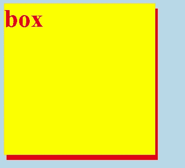
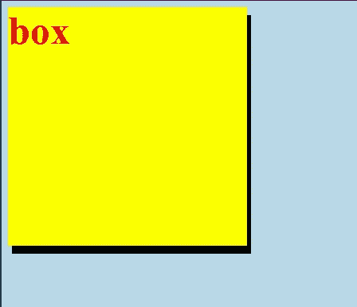
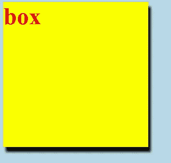
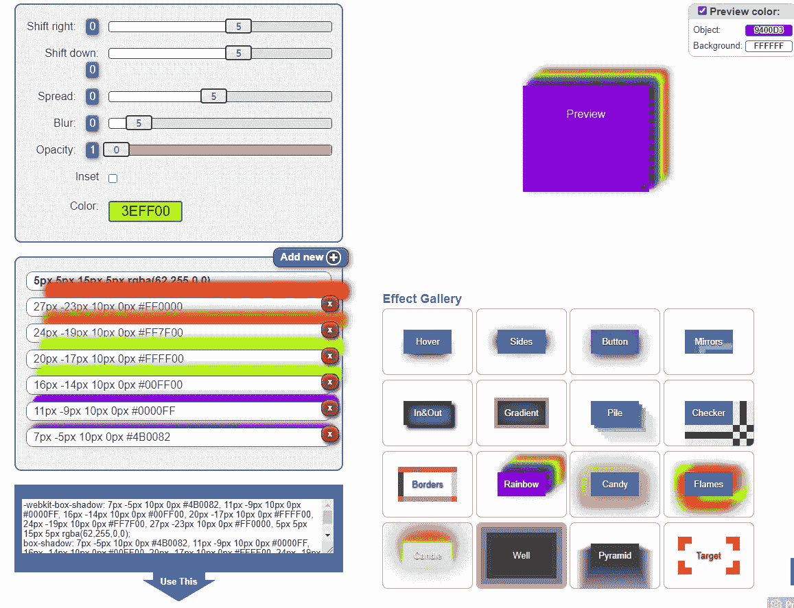
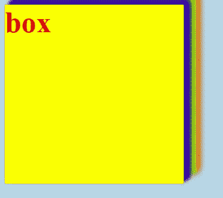

# CSS 基本:方框阴影

> 原文：<https://javascript.plainenglish.io/css-basic-box-shadow-ec7db288a761?source=collection_archive---------21----------------------->

## 给元素添加阴影

在这篇文章中，我们将讨论如何给元素添加阴影，以及如何定义阴影的样子。

源代码:

[https://www.udemy.com/course/a-complete-css-course/?referral code = d70f 3923 ff 6501 a 398 aa](https://www.udemy.com/course/a-complete-css-course/?referralCode=D70F3923FF6501A398AA)


Photo by [Martino Pietropoli](https://unsplash.com/@martino_pietropoli?utm_source=medium&utm_medium=referral) on [Unsplash](https://unsplash.com?utm_source=medium&utm_medium=referral)

在 HTML 页面上，我们只有一个简单的黄色框和红色文本。

```
<!DOCTYPE html><html lang="en"><head><meta charset="UTF-8"><meta http-equiv="X-UA-Compatible" content="IE=edge"><meta name="viewport" content="width=device-width, initial-scale=1.0"><title>Document</title><link rel="stylesheet" href="styles.css"></head><body><div>box</div></body></html>
```

在样式表内部

```
body{background-color: lightblue;}div{height: 300px;width: 300px;color: red;font-size: 50px;font-weight: bold;background-color: yellow;}
```

## 阴影偏移

要添加阴影，我们可以使用 box-shadow 属性，比如说

```
div{height: 300px;width: 300px;color: red;font-size: 50px;font-weight: bold;background-color: yellow;**box-shadow: 5px 10px;**}
```



第一个值是水平偏移，第二个值是垂直偏移。阴影的颜色遵循文本颜色。

## 阴影颜色

我们可以将阴影颜色改为黑色，方法是

```
box-shadow: 5px 10px black;
```



## 虚化

我们可以通过添加第三个值来添加模糊效果，比如说

```
box-shadow: 5px 10px 5px black;
```



5px blur


18px blur

值越高，阴影越模糊。

## 传播

第四个值定义了阴影的扩散，比如说

```
box-shadow: 5px 10px 18px 5px black;
```


5px spread


15px spread

该值越高，阴影的扩散程度越高。

## 简单方法

[我们可以使用一些网站来帮助我们生成 CSS 代码。](https://html-css-js.com/css/generator/box-shadow/)

我们可以调整我们想要的阴影，然后复制代码并粘贴到我们的项目中。



现在，我们可以看到这个美丽的阴影已经添加到框中。

关注我们: [YouTube](https://www.youtube.com/channel/UCu4-4FnutvSHVo9WHvq80Ww?sub_confirmation=1) ， [Medium](https://ckmobile.medium.com/) ， [Udemy](https://www.udemy.com/user/cyruschan2/) ， [Linkedin](https://www.linkedin.com/company/ckmobi/) ， [Twitter](https://twitter.com/ckmobilejavasc1) ， [Instagram](https://www.instagram.com/ckmobile8050)

*更多内容请看*[*plain English . io*](http://plainenglish.io/)