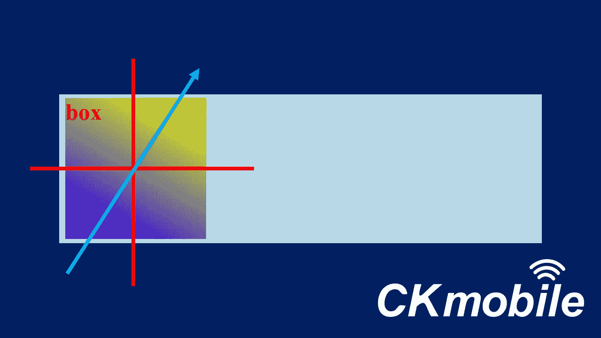

# CSS 基本:渐变

> 原文：<https://javascript.plainenglish.io/css-basic-gradient-6bd8d47b1b0b?source=collection_archive---------18----------------------->

## 向元素添加渐变颜色

在本文中，我们将添加线性颜色的元素。

源代码:

[https://www.udemy.com/course/a-complete-css-course/?referral code = d70f 3923 ff 6501 a 398 aa](https://www.udemy.com/course/a-complete-css-course/?referralCode=D70F3923FF6501A398AA)


Photo by [Gradienta](https://unsplash.com/@gradienta?utm_source=medium&utm_medium=referral) on [Unsplash](https://unsplash.com?utm_source=medium&utm_medium=referral)

在页面上，我们只有一个黄色的方框，上面有红色的文字。


index.html**内部**

```
<!DOCTYPE html><html lang="en"><head><meta charset="UTF-8"><meta http-equiv="X-UA-Compatible" content="IE=edge"><meta name="viewport" content="width=device-width, initial-scale=1.0"><title>Document</title><link rel="stylesheet" href="styles.css"></head><body><div>box</div></body></html>
```

在 CSS 文件中

```
div{height: 300px;width: 300px;color: red;font-size: 50px;font-weight: bold;background-color: yellow;}
```

如果要添加从下到上的渐变，可以指定方向为“到上”，它从蓝色到黄色开始。

```
background: linear-gradient(to top,blue, yellow); 
```


我们还可以改变方向，比如“到底部”、“到左侧”、“到右侧”，甚至是两个方向的组合，比如“到底部右侧”。


to bottom


to right


to left


to bottom right

## 角

我们也可以通过使用角度来设置渐变方向。


例如，0 度表示从下到上，270 度表示从右到左。

```
background: linear-gradient(270deg,blue, yellow);
```


270 deg

如果我们将角度设置为 30 度，渐变将从左下角开始到右上角。

```
background: linear-gradient(30deg,blue, yellow);
```



## 找到颜色的位置

我们可以定位颜色的位置。首先，我们把方向改回“向右”，这样更容易观察位置。它从蓝色开始，到宽度的 10%结束。然后从 10%的黄色开始。

```
background: linear-gradient(to right, blue  ,blue 10%, yellow 10% );
```


## 重复渐变

我们可以使用重复线性渐变来重复渐变。我们添加了 30%宽度的黄色结束。

```
background: repeating-linear-gradient(to right,blue  ,blue 10%, yellow 10% , yellow 30%);
```


## 简单的方法

[做渐变的一个简单方法是去一些网站生成渐变代码。](https://cssgradient.io/)


在我们选择了自己的梯度方法后，我们得到了下面的代码。

```
**background: rgb(2,0,36);**background: radial-gradient(circle, rgba(2,0,36,1) 0%, rgba(9,9,121,1) 35%, rgba(153,156,7,1) 52%, rgba(0,212,255,1) 100%);
```


在我们将 CSS 代码粘贴到项目中后，您应该会看到圆形渐变。

关注我们: [YouTube](https://www.youtube.com/channel/UCu4-4FnutvSHVo9WHvq80Ww?sub_confirmation=1) ， [Medium](https://ckmobile.medium.com/) ， [Udemy](https://www.udemy.com/user/cyruschan2/) ， [Linkedin](https://www.linkedin.com/company/ckmobi/) ， [Twitter](https://twitter.com/ckmobilejavasc1) ， [Instagram](https://www.instagram.com/ckmobile8050)

*更多内容请看*[*plain English . io*](http://plainenglish.io/)