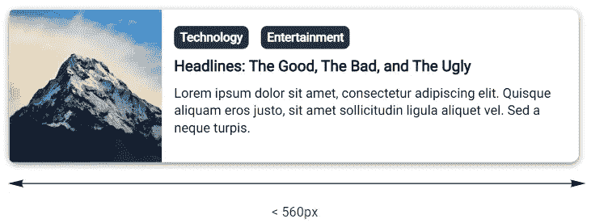

# CSS 容器查询:类固醇上的媒体查询

> 原文：<https://javascript.plainenglish.io/css-container-query-a-media-query-on-steroids-1cc9381aa670?source=collection_archive---------4----------------------->

Just a bunch of containers

她终于来了。嗯，差不多了。

最受欢迎的网络功能之一终于问世了。截至今天，container query 还在第一个**公开工作草案**中——这意味着这个特性已经被证明是必不可少的，并且被认为有可能包含在未来的版本中。

你现在甚至可以在谷歌浏览器上试用。在你的 Chrome 浏览器上进入`chrome://flags/#enable-container-queries`，设置为`enabled`，你就可以开始了。

# 容器查询

一个新的 CSS 查询，为后代元素提供了基于容器应用样式规则的可能性。

虽然媒体查询基于视口和媒体首选项应用特定的样式，但容器查询允许被包含的元素以容器元素为目标，从而更进一步。这为所包含的元素提供了更细粒度的控制。

下面是容器查询的简单用法，

Simple Container Query Example

这基本上是告诉浏览器，如果容器至少有 300 像素宽，就应用样式`background-color: blue` **。**

语法相当简单，非常类似于媒体查询的语法。容器查询附带了**三个额外属性**和**一个规则**。

首先，我们有`container-type`，该属性用于将元素建立为**查询容器**，这将允许子组件对其进行查询。

其次，`container-name`为容器设置一个名称，以便进一步过滤。有时我们可能不想把最近的祖先容器作为目标，这个属性作为一个出口。

最后，`container`被用作一个速记属性，可以用来在一个声明中同时设置`container-type`和`container-name`。

为了定位容器，我们使用`@container`来指定定位最近的包容上下文的规则。

@container Rule

这是非常令人兴奋的，因为子元素可以意识到它的周围环境，并可以自己决定如何反应。

# 高度模块化的组件

考虑一个**卡**组件，一个你以前可能见过的相当普通的元素。该组件具有以下属性:缩略图、标题、描述和一些标签。

我们希望组件能够适应不同的屏幕尺寸。在最小的视口中，缩略图和细节垂直堆叠。在稍大的视窗中，缩略图将位于左侧。最后，在最大的视窗中，我们的内容将位于缩略图之上。

让我们从 HTML 代码开始，

Card HTML

还有 CSS，

Card CSS

到目前为止还不错。我们的卡在较小的屏幕上看起来很好，与我们计划的完全一样。

在稍大的视口上，我们将使用容器查询来帮助我们处理转换，而不是媒体查询。

我们可以使用`display: flex;`水平堆叠内容，我们还对缩略图和细节做了一些小的调整，以确保它看起来仍然不错。

最后，在最大的视口上，我们更新了我们的缩略图来填充空间，在缩略图的顶部添加了一些黑色的覆盖层`background: linear-gradient(....);`，我们还将我们的`.card-detail`设置为`position: absolute;`并将我们的标题和描述的颜色更改为`#ffffff`

如果容器至少有`560px`宽，我们的卡现在看起来就像这样。

太棒了，我们的卡片组件在不同的视窗上看起来很棒。但更重要的是，容器查询的优势在于我们可以在更复杂的布局中重用相同的组件。

我创建了一个示例来演示容器查询的强大功能，

因此，

同一视口下的相同组件可以很好地适应不同的布局。如果没有容器查询，您将需要一个变通方法来使它工作，也许通过添加类名来区分选择器或者涉及 Javascript。

此外，通过媒体查询依赖全局视口使得我们的组件不那么模块化——换句话说，它们在不同的布局中更难重用。

# 尺寸和其他方面

我们可能并不总是提前知道维度。但是不用担心，容器查询附带了许多声明性查询类型，您可以使用它们来评估容器。

## 容器大小查询

第一种类型，即[容器大小查询](https://drafts.csswg.org/css-contain-3/#size-container)建立容器，以便根据其大小进行查询。这种类型的可能值有`size`、`inline-size`和`block-size`。

`size`类型根据内嵌轴和块轴的大小建立要查询的容器。

在 CSS 中，内嵌轴和块轴指的是文本在行内流动的方向。例如，在英语中，文本从左到右，从上到下流动。

设置为`size`类型的容器允许通过其`width`和`height`进行查询。同样，`inline-size`和`block-size`分别允许查询集装箱的`width`和`height`。

## 容器样式查询

第二种叫做[容器式查询](https://drafts.csswg.org/css-contain-3/#style-container)。这种类型提供了基于其单一的特定属性来查询容器的可能性。

## 容器状态查询

第三种类型，[容器状态查询](https://drafts.csswg.org/css-contain-3/#state-container)建立容器，以便能够对容器的“当前状态”进行查询，例如`position: sticky`容器是否“卡住”或者它当前是否在屏幕上可见。

最有可能的是，你只需要在正常情况下查询大小，但我不在这里判断😅。此外，这些仍然是草案，可能会在未来发生* *的变化。但是它确实让我们看到了容器查询的可能性。

# 结论

响应式设计的想法非常棒——一个如此多功能的用户界面，无论你在什么设备上，它总是看起来优雅而完美。到目前为止，这个想法在目前的技术水平下基本上是可以实现的。

我说主要是因为有些情况仅仅依靠媒体的询问是无法解决的。为了让组件优雅地适应复杂的布局，经常需要做许多小的调整。这些是 container query 想要解决的一些问题。

*最初发布于*[*https://frendy Guo . me*](https://frendyguo.me/css-container-query/)*。*

*更多内容看* [*说白了就是*](http://plainenglish.io/) *。报名参加我们的* [*免费每周简讯*](http://newsletter.plainenglish.io/) *。在我们的* [*社区不和谐*](https://discord.gg/GtDtUAvyhW) *获得独家获得写作机会和建议。*