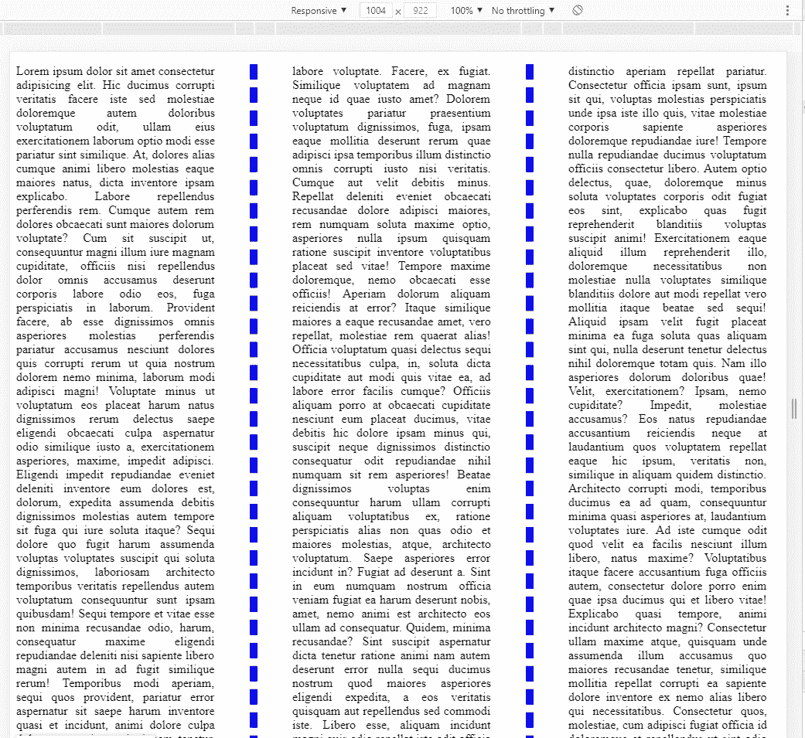

# CSS:不使用 Float 创建列

> 原文：<https://javascript.plainenglish.io/css-create-column-without-using-float-ace5a77edb44?source=collection_archive---------17----------------------->


Photo by [Pankaj Patel](https://unsplash.com/@pankajpatel?utm_source=medium&utm_medium=referral) on [Unsplash](https://unsplash.com?utm_source=medium&utm_medium=referral)

[上一次，](https://ckmobile.medium.com/css-create-columns-by-using-float-3c8cb2bcf74f)我们已经使用 CSS float 创建了列。这一次，我们将在不使用 float 的情况下创建列。

首先，我们创建 columns2 div。在 div 中，我们创建一个段落，并在其中放置一些文本。

```
<div class="columns2"><p>Lorem ipsum dolor sit amet consectetur adipisicing elit. Hic ducimus corrupti veritatis facere iste sed molestiae doloremque autem doloribus voluptatum odit, ullam eius exercitationem laborum optio modi esse pariatur sint similique. At, dolores alias cumque animi libero molestias eaque maiores natus, dicta inventore ipsam explicabo. Labore repellendus perferendis rem. Cumque autem rem dolores obcaecati sunt maiores dolorum voluptate? Cum sit suscipit ut, consequuntur magni illum iure magnam cupiditate, officiis nisi repellendus dolor omnis accusamus deserunt corporis labore odio eos, fuga perspiciatis in laborum. Provident facere, ab esse dignissimos omnis asperiores molestias perferendis pariatur accusamus nesciunt dolores quis corrupti rerum ut quia nostrum dolorem nemo minima, laborum modi adipisci magni! Voluptate minus ut voluptatum eos placeat harum natus dignissimos rerum delectus saepe eligendi obcaecati culpa aspernatur odio similique iusto a, exercitationem asperiores, maxime, impedit adipisci. Eligendi impedit repudiandae eveniet deleniti inventore eum dolores est, dolorum, expedita assumenda debitis dignissimos molestias autem tempore sit fuga qui iure soluta itaque? Sequi dolore quo fugit harum assumenda voluptas voluptates suscipit qui soluta dignissimos, laboriosam architecto temporibus veritatis repellendus autem voluptatum consequuntur sunt ipsam quibusdam! Sequi tempore et vitae esse non minima recusandae odio, harum, consequatur maxime eligendi repudiandae deleniti nisi sapiente libero magni autem in ad fugit similique rerum! Temporibus modi aperiam, sequi quos provident, pariatur error aspernatur sit saepe harum inventore quasi et incidunt, animi dolore culpa dolorem magni exercitationem tenetur. Voluptatem velit tempora maiores iusto hic vel nostrum quos dolor non veniam, explicabo voluptates consectetur labore consequatur repudiandae ab quis iure, deserunt illum ducimus expedita distinctio minus? Ratione placeat aliquam tempora et facere adipisci repellat officiis, eum amet quibusdam cum accusamus ducimus! Labore cupiditate amet mollitia tenetur placeat dolorum voluptatum culpa nemo natus praesentium corrupti assumenda aliquid numquam itaque, veritatis et asperiores ipsa illo dolorem at debitis ex ullam alias! Odit modi, enim officiis id quo repellat magni eum porro, voluptas sit autem, neque commodi omnis unde facere? Veniam, cum laborum rem, harum provident dignissimos possimus optio, nostrum ab delectus aliquid nam sed velit eaque voluptatum explicabo quaerat commodi molestias modi ad at labore voluptate. Facere, ex fugiat. Similique voluptatem ad magnam neque id quae iusto amet? Dolorem voluptates pariatur praesentium voluptatum dignissimos, fuga, ipsam eaque mollitia deserunt rerum quae adipisci ipsa temporibus illum distinctio omnis corrupti iusto nisi veritatis. Cumque aut velit debitis minus. Repellat deleniti eveniet obcaecati recusandae dolore adipisci maiores, rem numquam soluta maxime optio, asperiores nulla ipsum quisquam ratione suscipit inventore voluptatibus placeat sed vitae! Tempore maxime doloremque, nemo obcaecati esse officiis! Aperiam dolorum aliquam reiciendis at error? Itaque similique maiores a eaque recusandae amet, vero repellat, molestiae rem quaerat alias! Officia voluptatum quasi delectus sequi necessitatibus culpa, in, soluta dicta cupiditate aut modi quis vitae ea, ad labore error facilis cumque? Officiis aliquam porro at obcaecati cupiditate nesciunt eum placeat ducimus, vitae debitis hic dolore ipsam minus qui, suscipit neque dignissimos distinctio consequatur odit repudiandae nihil numquam sit rem asperiores! Beatae dignissimos voluptas enim consequuntur harum ullam corrupti aliquam voluptatibus ex, ratione perspiciatis alias non quas odio et maiores molestias, atque, architecto voluptatum. Saepe asperiores error incidunt in? Fugiat ad deserunt a. Sint in eum numquam nostrum officia veniam fugiat ea harum deserunt nobis, amet, nemo animi est architecto eos ullam ad consequatur. Quidem, minima recusandae? Sint suscipit aspernatur dicta tenetur ratione animi nam autem deserunt error nulla sequi ducimus nostrum quod maiores asperiores eligendi expedita, a eos veritatis quisquam aut repellendus sed commodi iste. Libero esse, aliquam incidunt magni quis odio repellat iste odit officia maxime laborum deleniti omnis alias voluptas optio. Saepe asperiores consequuntur reprehenderit itaque ipsa non tenetur quos assumenda eum perspiciatis doloremque eius ullam ipsam, optio quod. Eos porro, ducimus quod vel et doloremque delectus impedit illo voluptate aut corrupti dignissimos vitae blanditiis numquam dolorem cumque praesentium, molestiae culpa nesciunt ab nostrum! Fugit harum labore modi architecto, est omnis et blanditiis. Omnis quibusdam corporis optio nihil aspernatur repudiandae ea, error eveniet harum quaerat quos excepturi vero quia? Debitis asperiores labore in sunt. Sint perspiciatis illo assumenda dignissimos inventore quaerat soluta maxime repellendus consequuntur, exercitationem sed eos dolore hic ex corrupti nulla natus alias ad recusandae distinctio aperiam repellat pariatur. Consectetur officia ipsam sunt, ipsum sit qui, voluptas molestias perspiciatis unde ipsa iste illo quis, vitae molestiae corporis sapiente asperiores doloremque repudiandae iure! Tempore nulla repudiandae ducimus voluptatum officiis consectetur libero. Autem optio delectus, quae, doloremque minus soluta voluptates corporis odit fugiat eos sint, explicabo quas fugit reprehenderit blanditiis voluptas suscipit animi! Exercitationem eaque aliquid illum reprehenderit illo, doloremque necessitatibus non molestiae nulla voluptates similique blanditiis dolore aut modi repellat vero mollitia itaque beatae sed sequi! Aliquid ipsam velit fugit placeat minima ea fuga soluta quas aliquam sint qui, nulla deserunt tenetur delectus nihil doloremque totam quis. Nam illo asperiores dolorum doloribus quae! Velit, exercitationem? Ipsam, nemo cupiditate? Impedit, molestiae accusamus? Eos natus repudiandae accusantium reiciendis neque at laudantium quos voluptatem repellat eaque hic ipsum, veritatis non, similique in aliquam quidem distinctio. Architecto corrupti modi, temporibus ducimus ea ad quam, consequuntur minima quasi asperiores at, laudantium voluptates iure. Ad iste cumque odit quod velit ea facilis nesciunt illum libero, natus maxime? Voluptatibus itaque facere accusantium fuga officiis autem, consectetur dolore porro enim quae ipsa ducimus qui et libero vitae! Explicabo quasi tempore, animi incidunt architecto magni? Consectetur ullam maxime atque, quisquam unde assumenda illum accusamus quo maiores recusandae tenetur, similique mollitia repellat corrupti ea sapiente dolore inventore ex nemo alias libero qui necessitatibus. Consectetur quos, molestiae, cum adipisci fugiat officia id doloremque et repellendus ut sint odio delectus architecto reprehenderit dolorem possimus quaerat, minus voluptatem dolor quibusdam? Harum amet quia rerum aperiam quos dolorem, fuga consequatur obcaecati veniam corporis perspiciatis hic quisquam recusandae odit reprehenderit illo, sed velit expedita exercitationem? Quasi, tempora quia tenetur aliquam doloribus labore repellat modi, molestiae voluptatum dignissimos nemo expedita! Repudiandae, quisquam ducimus! Voluptates doloribus delectus quod nostrum nobis consectetur hic beatae sunt illo sequi voluptatibus enim porro laboriosam repellat reprehenderit tempora quae ipsam maiores officiis, dolorem deserunt. Aliquam nulla similique nobis tenetur a explicabo facilis error at quia velit.</p></div>
```

在 style.css 内部

```
.columns2 p{column-count: 3;text-align: justify;column-gap: 100px;column-rule: dashed blue 10px;}
```

Column-count 是用来设置列数的，我们还想添加 text-align 来调整以拉伸每行文本的宽度。我们还将列间距设置为 100 像素。在列之间添加一条 10px 的蓝色虚线。



## 关注我们:

YouTube:【https://www.youtube.com/channel/UCu4-4FnutvSHVo9WHvq80Ww? sub_confirmation=1

中:【https://ckmobile.medium.com/】T4

udemy:[https://www.udemy.com/user/cyruschan2/](https://www.youtube.com/redirect?event=video_description&redir_token=QUFFLUhqbm5PWHQ2NEoybEIxQmt5bElqMHRfcnVLYzZIZ3xBQ3Jtc0ttcWNMSGJQVklRazJBbzhySFJBMUx0WEdVMTZSYTlVVEtsX05iRkJJWlFDbUstWVdiNHFTMlUwaWhXbzkzOTMyRW5QclViRnZGeE9VR1Zha2ZIUXRBaU9pYlhZVDF0VzR0Z3BQWjZVSlZDdTRoRlNxaw&q=https%3A%2F%2Fwww.udemy.com%2Fuser%2Fcyruschan2%2F)

领英:[https://www.linkedin.com/company/ckmobi/](https://www.linkedin.com/company/ckmobi/?fbclid=IwAR24D0mLJg9cWKdGoCFc1nuWRlS2IXgDMQc_KO5lWkzQ6OCWcIMfcSQBJUA)

电报:[https://t.me/ckmobi](https://t.me/ckmobi?fbclid=IwAR0D_U1tH8OWWSEZKRrrNRFW7SeTqDLWsfQoy3hC5u__sEVhazJu9UAbq1M)

推特:[https://twitter.com/ckmobilejavasc1](https://twitter.com/ckmobilejavasc1)

*更多内容请看*[*plain English . io*](http://plainenglish.io/)