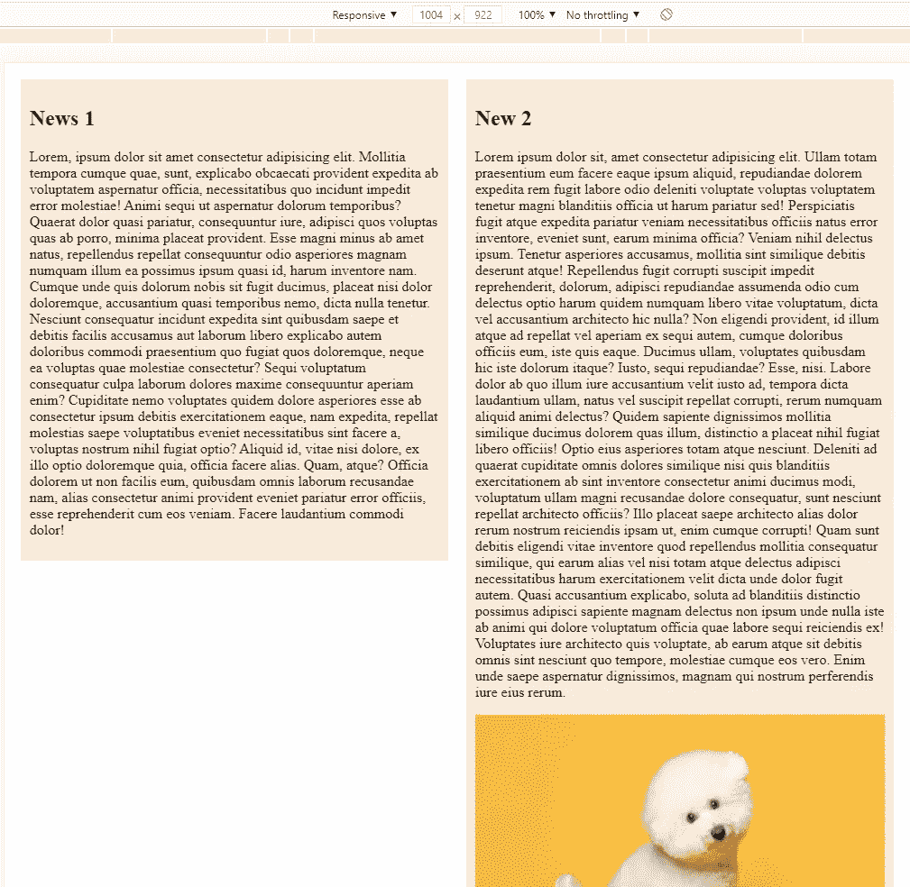

# CSS:使用 float 创建列

> 原文：<https://javascript.plainenglish.io/css-create-columns-by-using-float-3c8cb2bcf74f?source=collection_archive---------16----------------------->


Photo by [Pankaj Patel](https://unsplash.com/@pankajpatel?utm_source=medium&utm_medium=referral) on [Unsplash](https://unsplash.com?utm_source=medium&utm_medium=referral)

在本文中，我们将演示如何使用 float 创建列。

首先，我们创建 index.html 并添加以下代码。

```
<!DOCTYPE html><html lang="en"><head><meta charset="UTF-8"><meta http-equiv="X-UA-Compatible" content="IE=edge"><meta name="viewport" content="width=device-width, initial-scale=1.0"><title>Document</title><link rel="stylesheet" href="style.css"></head><body><div class="columns"><section><h2>This is column 1</h2><p>Lorem, ipsum dolor sit amet consectetur adipisicing elit. Mollitia tempora cumque quae, sunt, explicabo obcaecati provident expedita ab voluptatem aspernatur officia, necessitatibus quo incidunt impedit error molestiae! Animi sequi ut aspernatur dolorum temporibus? Quaerat dolor quasi pariatur, consequuntur iure, adipisci quos voluptas quas ab porro, minima placeat provident. Esse magni minus ab amet natus, repellendus repellat consequuntur odio asperiores magnam numquam illum ea possimus ipsum quasi id, harum inventore nam. Cumque unde quis dolorum nobis sit fugit ducimus, placeat nisi dolor doloremque, accusantium quasi temporibus nemo, dicta nulla tenetur. Nesciunt consequatur incidunt expedita sint quibusdam saepe et debitis facilis accusamus aut laborum libero explicabo autem doloribus commodi praesentium quo fugiat quos doloremque, neque ea voluptas quae molestiae consectetur? Sequi voluptatum consequatur culpa laborum dolores maxime consequuntur aperiam enim? Cupiditate nemo voluptates quidem dolore asperiores esse ab consectetur ipsum debitis exercitationem eaque, nam expedita, repellat molestias saepe voluptatibus eveniet necessitatibus sint facere a, voluptas nostrum nihil fugiat optio? Aliquid id, vitae nisi dolore, ex illo optio doloremque quia, officia facere alias. Quam, atque? Officia dolorem ut non facilis eum, quibusdam omnis laborum recusandae nam, alias consectetur animi provident eveniet pariatur error officiis, esse reprehenderit cum eos veniam. Facere laudantium commodi dolor!</p></section><section><h2>This is column 2</h2><p>Lorem ipsum dolor sit, amet consectetur adipisicing elit. Ullam totam praesentium eum facere eaque ipsum aliquid, repudiandae dolorem expedita rem fugit labore odio deleniti voluptate voluptas voluptatem tenetur magni blanditiis officia ut harum pariatur sed! Perspiciatis fugit atque expedita pariatur veniam necessitatibus officiis natus error inventore, eveniet sunt, earum minima officia? Veniam nihil delectus ipsum. Tenetur asperiores accusamus, mollitia sint similique debitis deserunt atque! Repellendus fugit corrupti suscipit impedit reprehenderit, dolorum, adipisci repudiandae assumenda odio cum delectus optio harum quidem numquam libero vitae voluptatum, dicta vel accusantium architecto hic nulla? Non eligendi provident, id illum atque ad repellat vel aperiam ex sequi autem, cumque doloribus officiis eum, iste quis eaque. Ducimus ullam, voluptates quibusdam hic iste dolorum itaque? Iusto, sequi repudiandae? Esse, nisi. Labore dolor ab quo illum iure accusantium velit iusto ad, tempora dicta laudantium ullam, natus vel suscipit repellat corrupti, rerum numquam aliquid animi delectus? Quidem sapiente dignissimos mollitia similique ducimus dolorem quas illum, distinctio a placeat nihil fugiat libero officiis! Optio eius asperiores totam atque nesciunt. Deleniti ad quaerat cupiditate omnis dolores similique nisi quis blanditiis exercitationem ab sint inventore consectetur animi ducimus modi, voluptatum ullam magni recusandae dolore consequatur, sunt nesciunt repellat architecto officiis? Illo placeat saepe architecto alias dolor rerum nostrum reiciendis ipsam ut, enim cumque corrupti! Quam sunt debitis eligendi vitae inventore quod repellendus mollitia consequatur similique, qui earum alias vel nisi totam atque delectus adipisci necessitatibus harum exercitationem velit dicta unde dolor fugit autem. Quasi accusantium explicabo, soluta ad blanditiis distinctio possimus adipisci sapiente magnam delectus non ipsum unde nulla iste ab animi qui dolore voluptatum officia quae labore sequi reiciendis ex! Voluptates iure architecto quis voluptate, ab earum atque sit debitis omnis sint nesciunt quo tempore, molestiae cumque eos vero. Enim unde saepe aspernatur dignissimos, magnam qui nostrum perferendis iure eius rerum.</p></section></div></body></html>
```

然后我们创建 style.css

```
section{float:left;width: 46%;padding: 1%;margin: 1%;background-color: antiquewhite;}
```

我们把宽度定为 46%，留出 4%作为填充和边距。



## 关注我们:

YouTube:[https://www.youtube.com/channel/UCu4-4FnutvSHVo9WHvq80Ww?sub_confirmation=1](https://www.youtube.com/channel/UCu4-4FnutvSHVo9WHvq80Ww?sub_confirmation=1)

中:【https://ckmobile.medium.com/】T2

乌迪米:【https://www.udemy.com/user/cyruschan2/】T4

领英:[https://www.linkedin.com/company/ckmobi/](https://www.linkedin.com/company/ckmobi/?fbclid=IwAR24D0mLJg9cWKdGoCFc1nuWRlS2IXgDMQc_KO5lWkzQ6OCWcIMfcSQBJUA)

电报:[https://t.me/ckmobi](https://t.me/ckmobi?fbclid=IwAR0D_U1tH8OWWSEZKRrrNRFW7SeTqDLWsfQoy3hC5u__sEVhazJu9UAbq1M)

推特:[https://twitter.com/ckmobilejavasc1](https://twitter.com/ckmobilejavasc1)