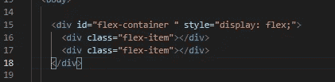
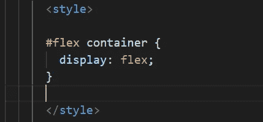
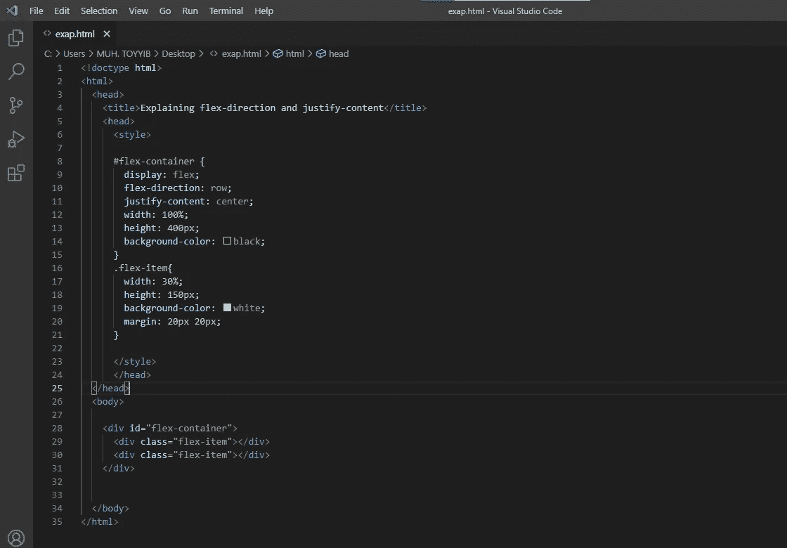
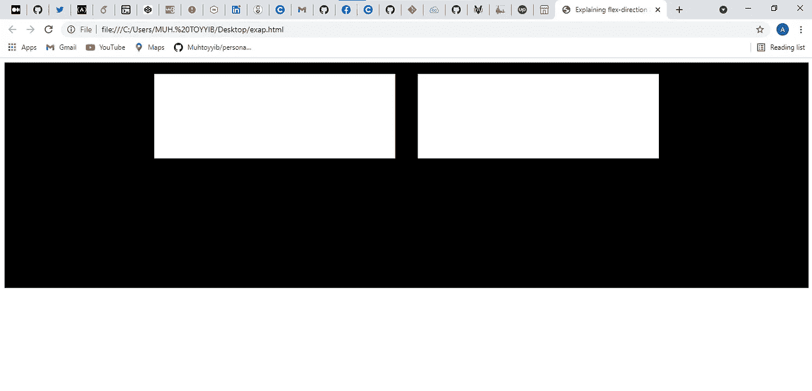
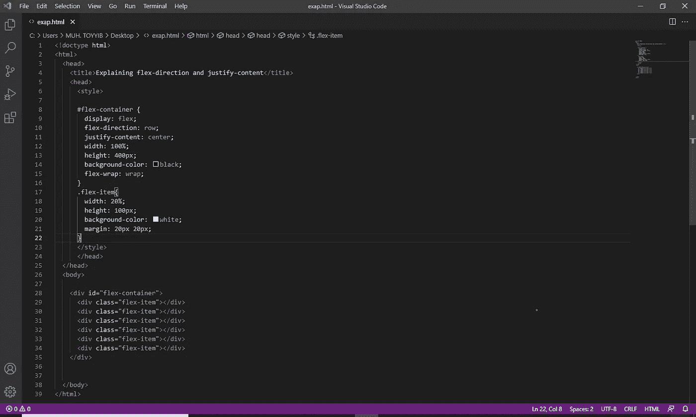
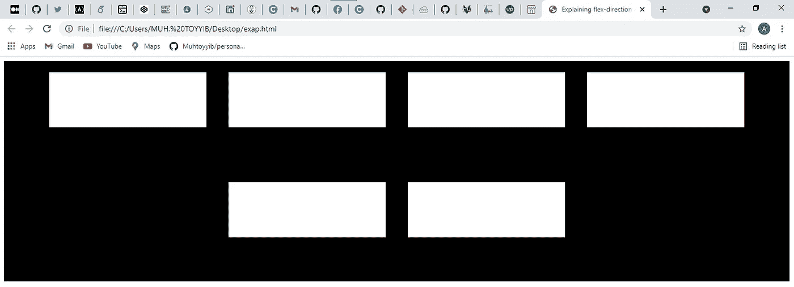

# CSS Flexbox 使用指南

> 原文：<https://javascript.plainenglish.io/css-flexbox-2b819e4c3d53?source=collection_archive---------7----------------------->

## CSS 3 引入了一个功能强大、支持良好、易于使用的布局方法，这就是 **Flexbox。**

Photo by [Ferenc Almasi](https://unsplash.com/@flowforfrank?utm_source=medium&utm_medium=referral) on [Unsplash](https://unsplash.com?utm_source=medium&utm_medium=referral)

使用 flexbox，开发人员会发现将元素放在页面的中心非常容易，并且可以创建更动态的用户界面，可以自动收缩和扩展。

**CSS Flexbox** 在创建一个反应灵敏的网站方面帮助很大。

# 使用

CSS flexbox 易于使用，你不需要为用它来创建一个有响应的网站而感到压力。

使用 flexbox 意味着您要替换一个特定容器中的许多容器，目标是使它们更加灵活。

假设您想将两个容器放入一个容器中，并使它们具有灵活性。实现这一点的第一个挑战是将容器的显示设置为 flex。

例如，

您可以简单地将**显示设置为 flex**style = " display:flex；"使用上面使用的 CSS 用法的内联方法。,

同样，您可以使用内部和外部 CSS 来应用您的样式。推荐使用外部 CSS，因为它使我们的代码易于理解。

id 和类规范将使使用外部和内部 CSS 变得容易。

样式将如下所示:

我希望我们都记得，你需要把你所有的代码放在一个 style****元素里面，才能使用**内部 CSS。*样式元素不与外部 CSS 一起使用。***

是的，id 为 *flex-container* 的 div 现在已经变成了一个 flex 容器。将 **display: flex** 添加到一个元素会将它变成一个 flex 容器。这使得将该元素的任何子元素对齐成行或列变得容易和可能。

你应该知道的一件事是 flex 容器有一个轴，它分为两类:

**1。主轴** -对于行，主轴是水平的，对于列，主轴是垂直的。

**2。横轴** -垂直用于行，水平用于列。

以下是使用轴原理的柔性盒的属性以及柔性项目的对齐和放置。

1.  **Flex-direction** 是一个用于将 Flex 容器的子元素设置为行和列的属性。

创建行将水平对齐子对象，创建列将垂直对齐子对象。(*主轴原理)*

伸缩方向的其他选项是行反转和列反转，而默认选项是行。

**2。justify-conten** t 是一个 CSS flexbox 属性，当 CSS 子元素没有填满容器中的所有空间时，它管理 CSS 子元素的空间和对齐。

它用来告诉 CSS 如何以某种方式对齐和分隔 flex 项目。

其中最常用的是 **justify-content:“居中”；**，将所有 flex 项目在 flex 容器内居中对齐。参见示例:

Input

边距设置为在弹性项之间留出空间。

OUTPUT

请注意，项目被移动到中心。

其他选项包括:

**flex-start** :将项目与 flex 容器的开头对齐。对于行，它将该项推到容器的左侧，对于列，它将该项推到容器的顶部。

如果没有指定对齐内容，这是默认的对齐方式。

**flex-end** :将项目对齐 flex 容器的末端。对于行，这会将项推到容器的右侧。对于列，这会将项推到容器的底部。

**space-between** :将项目与主轴中心对齐，项目之间留有额外空间。第一项和最后一项被推到 flex 容器的最边缘。示例:对于一列，第一项被推到顶部，最后一项被推到底部。其余项目平均共享剩余空间。

**space-around** :类似于 space-between，但是第一个和最后一个项目没有锁定到容器的边缘，空间分布在所有项目的周围，flex 容器的两端各有一半空间。

space-equally:在 flex 项目之间平均分配空间，在 flex 容器的两端各留一个完整的空间

**3。Align-items** -这类似于 justify-content，但它用于沿横轴对齐项目。

对于一行，它管理 CSS 如何在容器中上下移动整行中的项目。对于一个列，如何在容器中向左或向右推动所有的项。

**Align-items** 具有类似 justify-content 的值，它们是:

**flex-start** :将项目与 flex 容器的开头对齐。对于行，项被移动到容器的顶部。对于列，项被移动到容器的左侧。

**弯曲结束:**与弯曲开始相反。这会将行中的项与容器的底部对齐，将列中的项向右对齐。

**居中:**将元素置于中心。行中的项目垂直移动到中心，而列中的项目水平移动到中心。两边留出相等的空间。

**拉伸:**拉伸物品以填充柔性容器。例如，行项目被拉伸以从上到下填充 flex 容器。如果没有指定 align-items 值，这是默认值。

**基线**:将项目与其基线对齐。基线是一个文本概念，把它想象成字母所在的线。

## 上面的所有属性只允许我们创建一行或一列。我们如何创造一个倍数？

**Flex-wrap** 是使用的最佳选择。Flex-wrap 告诉 CSS 包装项目。项目换行时会移动到新的行或列。它们换行的断点取决于项及其容器的大小。

与所有其他属性一样，Flex-wrap 也有其价值，包括:

**1。nowrap:** 就像名字一样，nowrap 被施加在条目上，并且条目保持在一行中。这是默认值

**2。换行:**将项目换行到多行。对于行，它是从上到下，对于列，它是从左到右

**3。wrap-reverse** -是 wrap 的反义词。它从下到上将项目包装成多行，用于行；从右到左，用于列。

**参见示例:**

Input

OUTPUT

用其他属性值实践一下，看看它们是如何工作的。

flexbox 的其他属性包括伸缩、伸缩、伸缩、伸缩基础、伸缩、排序和自对齐。

## [阅读更多关于 CSS flexbox 的信息](https://www.w3schools.com/css/css3_flexbox.asp)。

## 感谢阅读。

在以下社交媒体上随时联系我: [***Twitter、***](https://twitter.com/devtoheeb)*[***脸书***](https://www.facebook.com/akande.olalekan.1238) ***、***[***insta gram******或***](https://www.instagram.com/muh_toyyib_0/)[***WhatsApp***](https://wa.me/message/BUW6NXAJ2A3HA1)*

**更多内容请看*[*plain English . io*](http://plainenglish.io/)*。报名参加我们的* [*免费周报*](http://newsletter.plainenglish.io/) *。在我们的* [*社区*](https://discord.gg/GtDtUAvyhW) *获得独家写作机会和建议。**