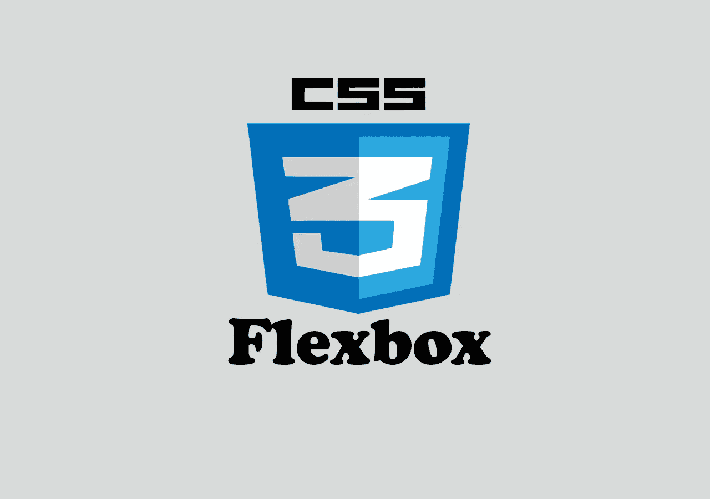
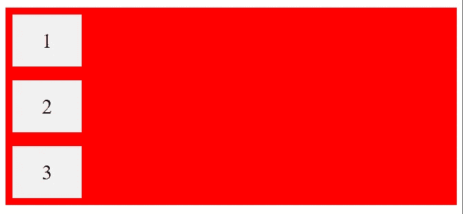

# CSS Flexbox 举例说明

> 原文：<https://javascript.plainenglish.io/css-flexbox-explained-with-examples-85efa38e4770?source=collection_archive---------0----------------------->

## 通过实例了解 CSS flexbox。



# 介绍

Flexbox 是 CSS 中最伟大的特性之一。它被设计成一维布局模型，并作为一种方法，可以在界面中的项目之间提供空间分布和强大的对齐功能。Flexbox 使得在不使用浮动或定位的情况下设计灵活的响应式布局结构变得更加容易。

在本文中，我们将通过一些实例来了解 CSS flexbox。让我们开始吧。

# 定义一个容器

要开始使用 flexbox，您需要定义一个容器`div`或一个父容器`div`，您将在其中包装所有子元素，如下所示:

```
<div class="container">
  <div>1</div>
  <div>2</div>
  <div>3</div>
</div>
```

通过将`display`属性设置为 *flex* ，父`div`或容器变得灵活:

```
.container {
  **display: flex;** background-color: red;
}.container div{
  background-color: #f1f1f1;
  margin: 10px;
  padding: 20px;
  font-size: 30px;
}
```

以下是输出:


A red container that contains three flexible divs.

如您所见，通过将属性`display`设置为 *flex，*容器的子元素会自动变成灵活的项目。现在你可以使用容器属性，比如`justify-content` `align-items`来使你的子元素在容器 div 中居中。我们将在下面的例子中介绍这一点。

# 伸缩方向属性

`flex-direction`属性定义了容器想要在哪个方向上堆叠 flex 项目(列或行)。

以下示例将伸缩方向设置为`column`(从上到下)。因此，容器 div 中的子元素将位于一条垂直线中。

看看下面的例子:

```
.container {
  display: flex;
  **flex-direction: column;**
  background-color: red;
}.container > div {
  background-color: #f1f1f1;
  width: 100px;
  margin: 10px;
  text-align: center;
  line-height: 75px;
  font-size: 30px;
}
```

以下是输出:



Column direction.

这是同一个例子，但是我们将属性`flex-direction`设置为`row`，这将使子元素在我们的容器中位于一条水平线中:

```
.container {
  display: flex;
  **flex-direction: row;**
  background-color: red;
}.container > div {
  background-color: #f1f1f1;
  width: 100px;
  margin: 10px;
  text-align: center;
  line-height: 75px;
  font-size: 30px;
}
```

输出:


Row direction.

您还可以通过将属性`flex-direction`设置为`column-reverse`或`row-reverse`来反转容器中子元素的顺序。

# flex-wrap 属性

属性`flex-wrap`指定伸缩项是否应该换行。

下面的例子有 12 个 flex 项，并将属性`flex-wrap`设置为`wrap`。为了更好地演示`flex-wrap`属性。我建议您将下面的代码放入您的文本编辑器或 Codepen 中，并调整浏览器窗口的大小，看看`flex-wrap`的威力。

```
HTml:
<div class="container">
  <div>1</div>
  <div>2</div>
  <div>3</div>  
  <div>4</div>
  <div>5</div>
  <div>6</div>  
  <div>7</div>
  <div>8</div>
  <div>9</div>  
  <div>10</div>
  <div>11</div>
  <div>12</div>  
</div>CSS:
.container {
  display: flex;
  **flex-wrap: wrap;**
  background-color: red;
}.container > div {
  background-color: #f1f1f1;
  width: 100px;
  margin: 10px;
  text-align: center;
  line-height: 75px;
  font-size: 30px;
}
```

如果希望子元素或 flex-items 不环绕，可以将属性`flex-wrap`设置为`nowrap`，如下所示:

```
.container {
  display: flex;
  **flex-wrap: nowrap;**
  background-color: red;
}
```

# 证明内容属性

`justify-content`属性用于对齐弹性项。您可以为该属性指定一些值，如:`center`、`flex-start`、`flex-end`、`space-between`等。

*居中*值将柔性项对齐在容器的中心:

```
.container {
  display: flex;
  **justify-content: center;**
}
```


*flex-start* 值对齐容器开头的 flex 项目:

```
.container {
  display: flex;
  **justify-content: flex-start;**
}
```


*伸缩端*值与容器末端的伸缩项对齐:

```
.container {
  display: flex;
  **justify-content: flex-end;**
}
```


*间距*值显示线与线之间有间距的柔性项:

```
.container {
  display: flex;
  **justify-content: space-between;**
}
```


# align-items 属性

`align-items`属性用于对齐弹性项。这与`justify-content`相同，但我们是垂直工作，而不是水平。这就是为什么我只举一个例子，而不是重复同样的例子。

下面是一个在容器内部垂直居中放置子元素的示例:

```
.container {
  display: flex;
  height: 300px;
  **align-items: center;**
  background-color: red;
}.container > div {
  background-color: #f1f1f1;
  width: 100px;
  margin: 10px;
  text-align: center;
  line-height: 75px;
  font-size: 30px;
}
```

产出:


Centering the child elements vertically.

物业`align-items`与`justify-content`价值相同。唯一的区别是，我们是垂直工作，而不是水平。

# 垂直和水平居中

现在，您可以同时使用`justify-content`和`align-items`轻松地将子元素垂直和水平居中。

下面是一个例子:

```
.container {
  display: flex;
  height: 300px;
  **align-items: center;
  justify-content: center;
 ** background-color: red;
}.container > div {
  background-color: #f1f1f1;
  width: 100px;
  margin: 10px;
  text-align: center;
  line-height: 75px;
  font-size: 30px;
}
```


Centering vertically and horizontally.

# 子元素

子元素还具有一些可以从中受益的属性，例如:

*   命令
*   弹性增长
*   伸缩收缩
*   弹性基准
*   弯曲
*   自对准

你可以在 [W3schools](https://www.w3schools.com/css/css3_flexbox_items.asp) 网站上了解他们。

# 结论

Flexbox 是一个令人敬畏的 CSS 特性，允许你轻松地设计一个灵活的响应布局结构。我强烈建议你练习这个特性，因为练习是唯一能让你变得更好的方法。

感谢你阅读这篇文章，希望你发现它有用。如果是这样的话，通过 [**订阅我们的 YouTube 频道**](https://www.youtube.com/channel/UCtipWUghju290NWcn8jhyAw?sub_confirmation=true) **获得更多类似内容吧！**

# 更多阅读

[](https://medium.com/javascript-in-plain-english/the-front-end-web-developer-roadmap-for-2021-bcf88c5d4ccd) [## 2021 年前端 Web 开发人员路线图

### 逐步引导成为一个现代化的前端网络开发者。

medium.com](https://medium.com/javascript-in-plain-english/the-front-end-web-developer-roadmap-for-2021-bcf88c5d4ccd)