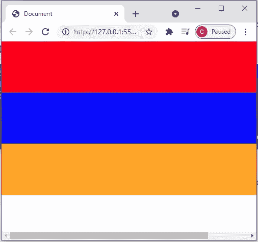

# CSS Flexbox:基于 flex

> 原文：<https://javascript.plainenglish.io/css-flexbox-flex-basis-232216ed1888?source=collection_archive---------24----------------------->

伸缩基准非常类似于最小宽度，它也定义伸缩项目的宽度。


Photo by [Lee Campbell](https://unsplash.com/@leecampbell?utm_source=medium&utm_medium=referral) on [Unsplash](https://unsplash.com?utm_source=medium&utm_medium=referral)

为了演示这种差异，最好将容器和项目的宽度都设置得更大。

```
.container{background-color: beige;max-width: 1800px;flex-wrap: wrap;margin: auto;display: flex;}.box{height: 100px;min-width: 600px;}
```

我们设置容器的最大宽度为 1800 像素，盒子的最小宽度为 600 像素。

当我们缩小窗户的宽度时。出现水平滚动条是因为我们将项目(框)的最小宽度设置为 600 像素。浏览器的宽度没有足够的空间来显示。



The horizontal scrollbar will appear when reduce the width of the screen

如果我们使用 flex-basis 而不是 min-width，当我们减少浏览器的宽度时，效果是一样的，只有当浏览器的宽度小于 600px 时，才会出现差异。不是显示滚动条让用户查看项目，而是缩小项目的宽度以适合浏览器的宽度。

关注我们: [YouTube](https://www.youtube.com/channel/UCu4-4FnutvSHVo9WHvq80Ww?sub_confirmation=1) ， [Medium](https://ckmobile.medium.com/) ， [Udemy](https://www.udemy.com/user/cyruschan2/) ， [Linkedin](https://www.linkedin.com/company/ckmobi/) ， [Twitter](https://twitter.com/ckmobilejavasc1)

*更多内容请看*[***plain English . io***](http://plainenglish.io/)