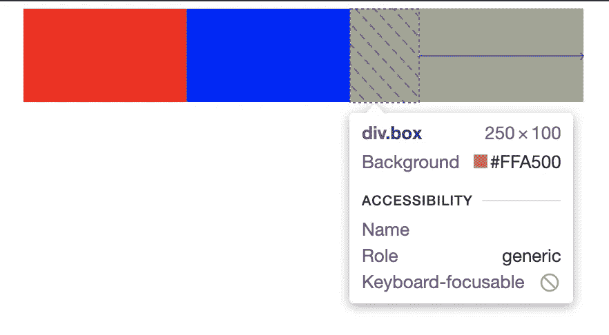
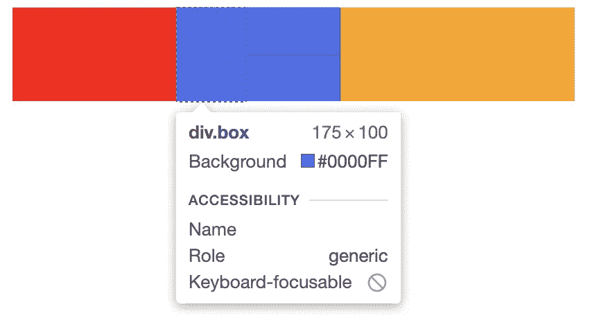

# CSS Flexbox:伸缩增长

> 原文：<https://javascript.plainenglish.io/css-flexbox-flex-grow-7fb7042cdb4a?source=collection_archive---------17----------------------->

## flex-grow 是什么意思？


Photo by [Maik Jonietz](https://unsplash.com/@der_maik_?utm_source=medium&utm_medium=referral) on [Unsplash](https://unsplash.com?utm_source=medium&utm_medium=referral)

在本文中，我们将讨论什么是 flex-grow。

Flex grow 指定该项相对于同一容器中的其他项增长多少。

最初，容器的宽度为 600 像素。


如果我们在红框处设置 flex-grow 等于 1，它将占据所有剩余的空间。

```
.red{background-color: red;flex-grow: 1;}
```


我们也可以用速记的方法来做。我们不使用 flex-grow，而是使用 flex。

```
.red{background-color: red;flex-grow: 1;}
```

## 所有项目都具有相同的弹性

如果所有项目的 flex-grow 值都设置为 1，那么所有的框在容器内都具有相同的宽度。这是因为它们都具有相同的伸缩性。


All boxes take up equal width

## 其中一个框 flex-grow 设置为 2

如果我们将橙色盒子的伸缩设置为 2，那么它将占据两倍于其他盒子的空间。



width of orange box change from 100px to 250px



width of blue box change from 100px to 175px

橙色盒子增长 150 像素，是其他增长 75 像素的两倍。

关注我们: [YouTube](https://www.youtube.com/channel/UCu4-4FnutvSHVo9WHvq80Ww?sub_confirmation=1) ， [Medium](https://ckmobile.medium.com/) ， [Udemy](https://www.udemy.com/user/cyruschan2/) ， [Linkedin](https://www.linkedin.com/company/ckmobi/) ， [Twitter](https://twitter.com/ckmobilejavasc1)

*更多内容请看*[*plain English . io*](http://plainenglish.io/)