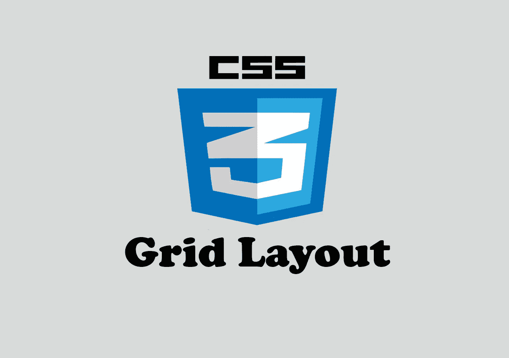
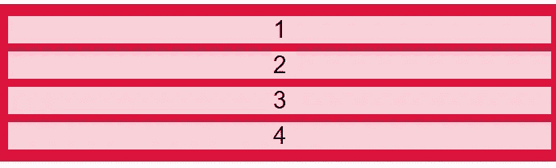
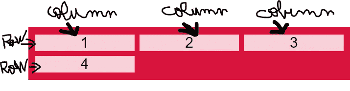
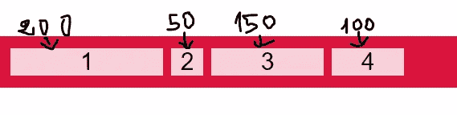
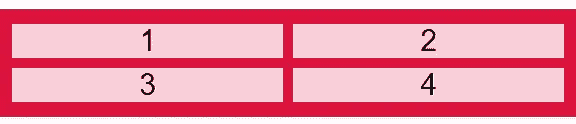
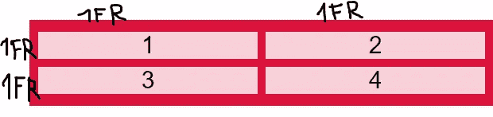
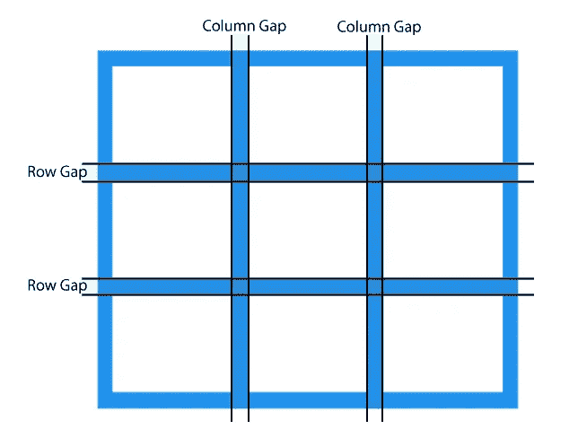
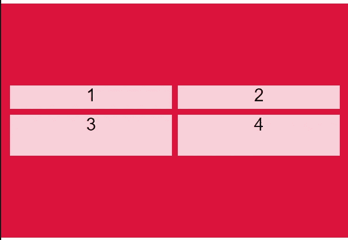

# 用例子解释 CSS 网格

> 原文：<https://javascript.plainenglish.io/css-grid-explained-with-examples-d64cf241e1cf?source=collection_archive---------8----------------------->

## 通过实例了解 CSS 网格。



Image created with ❤️️ By [author](https://mehdiouss315.medium.com/).

# 介绍

网格系统是 CSS 中最伟大的特性之一。它允许以一种简单的方式将元素对齐到列和行。CSS grid 使设计复杂且响应迅速的网页变得更加容易，而不必使用浮动、表格或定位。它还有很多更强大的能力，如果你大量练习就能发现。

在本文中，我们将通过一些实际例子来了解 CSS 网格，以帮助您理解。让我们开始吧。

# 定义一个容器

要开始使用网格系统，您需要定义一个容器`div`或一个父容器`div`，您将在其中包装所有子元素，如下所示:

```
<div class="**container**">
      <div class="child">1</div>
      <div class="child">2</div>
      <div class="child">3</div>
      <div class="child">4</div>
  </div>
```

当我们在 CSS 中将父 div 的显示设置为`grid`或`inline-grid`时，它就变成了一个网格容器。

这里有一个例子:

```
.container {
  **display: grid;**
  background-color: crimson;
  padding: 10px;
}.container > .child {
  background-color: rgba(255, 255, 255, 0.8);
  text-align: center;
  font-size: 30px;
  margin: 5px;
}
```

*输出:*



Grid container with child elements.

现在你可以使用容器属性，比如`justify-content` `align-items`来使你的子元素在容器 div 中居中。我们将在下面的例子中介绍这一点。

# 网格-模板-列

属性`grid-template-columns`用于定义网格容器中的列数。它还有助于定义每列的宽度。

假设您想在网格容器中定义 3 列。在这种情况下，您可以使用分数`**fr**`作为属性`grid-template-columns`的值。分数用于将网格布局分成列或行。

看看下面的例子:

```
.container {
  **display: grid;
  grid-template-columns: 1fr 1fr 1fr;**
  background-color: crimson;
  padding: 10px;
}.container > .child {
  background-color: rgba(255, 255, 255, 0.8);
  text-align: center;
  font-size: 30px;
  margin: 5px;
}
```

正如你在上面看到的，我们使用了 3 个分数`1fr`将网格容器分成 3 列。

*输出:*



Grid template columns.

属性也可以用来指定列的宽度。

```
.container {
  display: grid;
  **grid-template-columns: 200px 50px 150px 100px;**
}
```

*输出:*



Grid template columns.

除此之外，您还可以将属性`grid-template-columns`设置为`auto`。因此，它会根据您的屏幕大小自动拉伸列宽。

这里有一个例子:

```
.container {
  display: grid;
  **grid-template-columns: auto auto;**
}
```



Auto column’s width.

最棒的一点是，你可以使用`grid-template-columns` width 函数`minmax()`轻松制作自动响应布局，该函数根据屏幕大小选择最小宽度和最大宽度。

```
grid-template-columns: repeat**(auto-fit, minmax(200px, 1fr))**;
```

例如，假设您必须为一个电子商务应用程序显示产品列表。你的任务是让它具有响应能力，所以你决定在桌面上每列显示三个产品，在平板电脑上每列显示两个产品，在移动设备上每列只显示一个产品。看看下面的例子:

*HTML:*

```
<div class="grid">
 <div class="item">Product 1</div>
 <div class="item">Product 2</div>
 <div class="item">Product 3</div>
 <div class="item">Product 4</div>
 <div class="item">Product 5</div>
 <div class="item">Product 6</div>
</div>
```

*CSS:*

```
*{
 margin: 0;
 padding: 0;
 box-sizing: border-box;
 font-family: sans-serif;
}
body{
 height: 100vh;
 margin-top: 150px;
}
**.grid {
  display: grid;
  grid-template-columns: repeat(auto-fit, minmax(200px, 1fr));
}**
.item{
 background: red;
 padding: 20px;
 color: wheat;
 margin: 10px;
}
```

这也将根据您的屏幕大小自动定义列数。当屏幕宽度处于最小尺寸时，您将只有 1 列`1fr`。如果屏幕宽度太大，你会看到一堆宽度为 200 像素的列。

# 网格-模板-行

属性`grid-template-rows`用于定义网格容器中的行数。这和`grid-template-columns`很相似，唯一的不同是现在我们用行代替了列。

假设我们想要定义一个包含两列两行的网格容器。我们可以使用属性`grid-template-rows`和`grid-template-columns`来实现。下面是一个例子:

```
.container {
  display: grid;
  grid-template-columns: 1fr 1fr;
  **grid-template-rows: 1fr 1fr;**
}
```

*输出:*



Grid template rows.

您还可以使用属性`grid-template-rows`来定义行的宽度，或者像我们使用`grid-template-columns`一样自动拉伸它。没有区别，只是我们用行代替了列。

# 网格间隙属性

属性`grid-gap`在父元素中使用，以便设置列和行之间的间距。

```
.container{
 display: grid;
 grid-template-columns: auto auto;
 **grid-gap: 15px;** }
```



Image from [w3schools](https://www.w3schools.com/).

# 对齐内容属性

属性`align-content`用于垂直对齐容器内的所有网格。

这里有一个例子:

```
.container {
  display: grid;
  grid-template-columns: auto auto;
  grid-template-rows: 50px 80px;
  height: 400px;
  **align-content: center;**
  background-color: crimson;
  padding: 10px;
}
```

*输出:*



Centering the grid vertically.

还有一些其他值可以传递给`align-content`，例如:

`space-between`、`start`、`space-around`和`end`。您可以在您的文本编辑器上尝试它们，看看有什么不同。

# 网格项目

CSS grid 还有一些有用的属性，可以传递给 grid 容器的子元素，以便轻松设计复杂的网格布局。这些属性包括:

*   网格柱
*   网格行
*   网格区域

你可以在 W3schools 网站上了解它们，因为如果我想涵盖这篇文章中的所有内容，你将不得不一辈子滚动。

# 结论

Grid 是一个很棒的 CSS 特性，它允许你轻松地设计复杂的、响应性强的布局结构。我强烈建议您练习这个特性，因为练习是提高它的唯一途径。

感谢您阅读这篇文章。希望你觉得有用。

# 更多阅读

*如果你对 JavaScript 和 web 开发相关的更有用的内容感兴趣，也可以* [*订阅*](https://mehdiouss.ck.page/) *我的快讯。*

*下面是另一篇有用的文章，请点击链接查看:*

[](https://medium.com/javascript-in-plain-english/10-awesome-front-end-development-tools-to-boost-your-productivity-b1d2efc4c4ba) [## 10 个令人敬畏的前端开发工具来提高您的生产力

### 你可能需要用到的有用的前端开发工具。

medium.com](https://medium.com/javascript-in-plain-english/10-awesome-front-end-development-tools-to-boost-your-productivity-b1d2efc4c4ba)