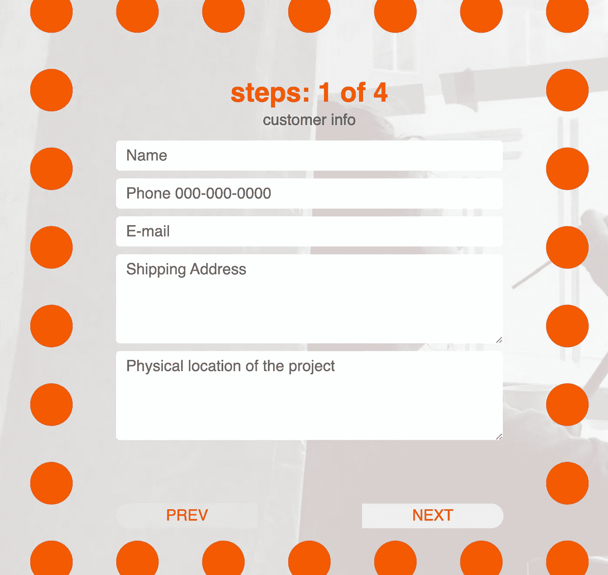
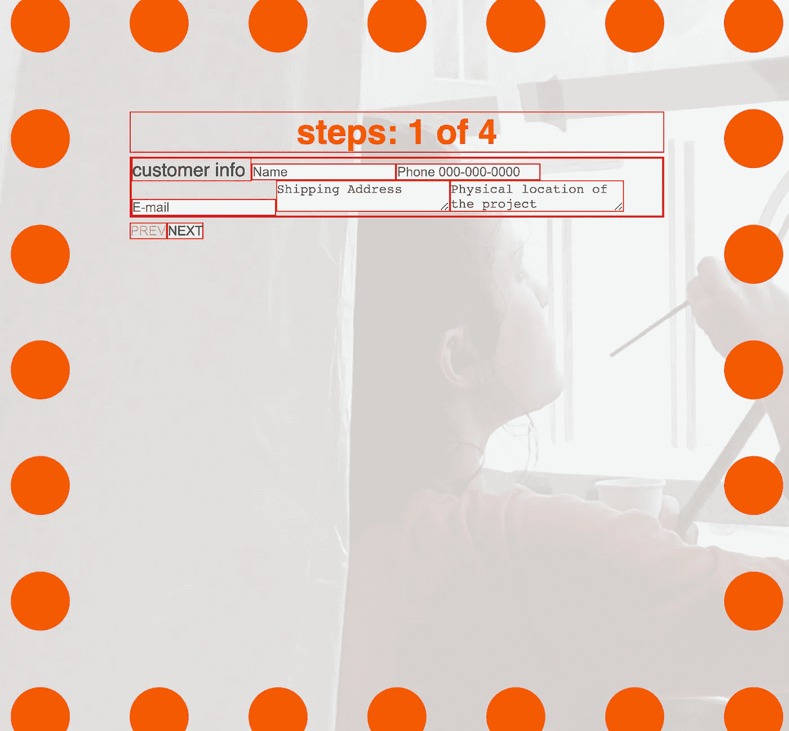

# 用 CSS 设计 React 表单的样式

> 原文：<https://javascript.plainenglish.io/css-learn-to-style-react-forms-with-css-2ce72c67c66f?source=collection_archive---------0----------------------->



**AFTER** : our goal for this blog. after styling react form


**BEFORE**: react Form before styling

你的[反应形式起作用](https://github.com/labradorescence/handsomehand/blob/main/src/components/Form.js)！恭喜你！但是现在呢？所有的 div 框都是一个挨着一个横向堆叠的，一点都不好看。

除非有人付钱让用户输入信息，否则用户不会愿意公开他们的信息。我们正在努力获得报酬，所以是时候添加一些造型了！

我们将使用这个简单的 JSX 文件来设计表单的样式。对于完整的 React 表单代码，这里是[链接](https://github.com/labradorescence/handsomehand/blob/main/src/components/Form.js)。

1.  在 React 文件中创建`Form.css`和`import ‘./Form.css’`。
2.  命名最父 div 类名`<div className = "form-box">`。

3.在 css 文件中，使用*和`box-sizing: border-box`选择全部，这样所有的框都没有默认的边距和填充空间。Do border: 1px 纯红，这样你可以看到你在处理什么。


*{box-sizing: border-box} and border: 1px solid red

4.定义最小值、最大值、宽度、高度、边框、边距、填充。


**5。**风格 h5。 **Text-align** center 使 h5 在中间，选择字体大小和颜色。当你处理页边距右上角左下角时，你可以通过列出所有四个数字来定义它们。

```
margin: top right bottom left;
margin:   0    0    5vh   0;
```



6.样式 ***标签*** 。

“客户信息”是这个上下文中的标签，它应该在步骤信息的正下方，所以让我们 ***显示:阻止*** ，将其居中，并调整文本大小，给出一些空白空间。


7. ***样式输入*** 区域和 ***textarea。***


这些*输入*和*文本区域*看起来已经更好了。当您将边框设置为 0 时，边框线会消失，因此它会给人一种现代感。当您将显示设置为块时，所有的输入框会很好地堆叠在一起。将宽度设置为 100%，使其填满父框的大小。给一些漂亮的空间填充，这样输入框就不会叠在一起了。

**8。按钮**

现在，让我们来设计按钮。我们有`prev`按钮、`next`按钮和`submit`按钮。首先让我们设计上一页和下一页按钮的样式。目前它们在左下角太小，所以如果我是用户，我不会想点击。让我们来解决这个问题。


before styling button

**按钮大小:**目前按钮太窄，用户会不小心点击“上一页”或“下一页”按钮，所以让我们把按钮的宽度改为父 div 框的 30%。让我们将高度设置为 2 米，这样它会更高。

**按钮位置:**这些按钮彼此靠得太近，不利于用户体验的流畅。这些按钮在彼此之上，所以让我们显示两个按钮`inline-block`为了将下一个按钮一直放在右下角，让我们使用`margin-left: 52%`我通过尝试多个数字来计算这个数字。

```
/*margin: top right bottom left;*/.nextBtn{    
     margin-left: 52%;
}
.prevBtn, .nextBtn{    
     margin: 1rem 0 1rem 0; 
     display: inline-block;   
}
```


button css

# 搞定了。

太好了！让我们简单地从全局选择器中注释掉`border: 1px solid red;`,看看它看起来怎么样。恭喜你。现在你有了一个更好的用户流反馈表单。


after styling react form


**BEFORE**: react Form before styling

*更多内容请看*[***plain English . io***](http://plainenglish.io)