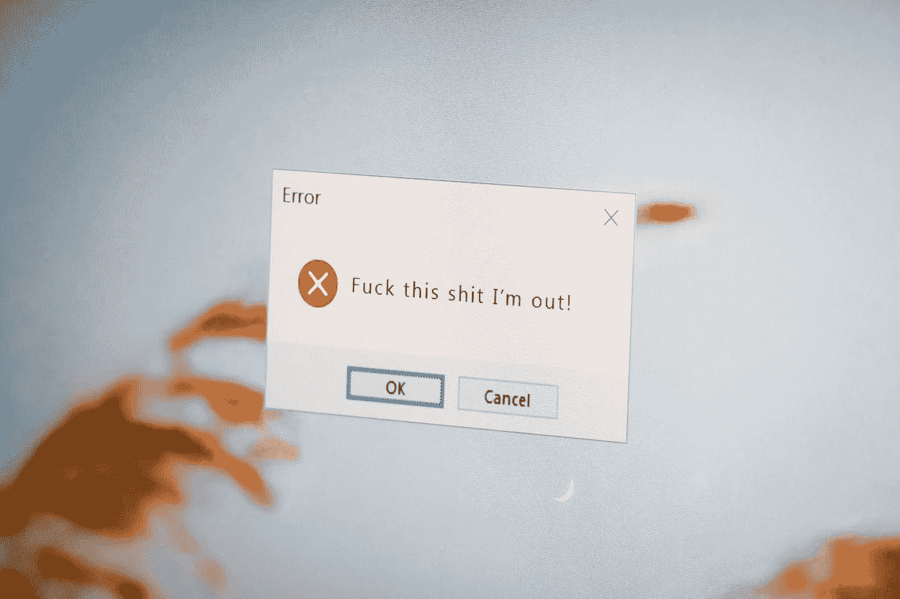

# 为了更高效的 Web 开发，您可以避免的 CSS 错误

> 原文：<https://javascript.plainenglish.io/css-mistakes-you-can-avoid-for-more-productive-web-development-f28283236a8f?source=collection_archive---------11----------------------->

## 通过识别这些错误来改进您的代码。

Photo by [Nong Vang](https://unsplash.com/@californong?utm_source=medium&utm_medium=referral) on [Unsplash](https://unsplash.com?utm_source=medium&utm_medium=referral)

当我们谈论 web 开发时，不可能不谈论 CSS，因为这种语言是定义应用程序的整个结构和设计的脚本。

当谈到 CSS 时，可以通过几种方式实现相同的效果:CSS3 的创新允许在语言本身中实现各种动画和效果，以前是通过 Javascript 执行的。

然而，我们不能滥用语言给予我们的自由。Web 应用程序足够宽容，可以让我们随心所欲地格式化自己的风格，但是良好的实践会带来很大的不同。

应用正确的技术可以避免让最有经验的界面程序员头疼的陷阱。

在本帖中，我们将涵盖你应该避免的常见 CSS 错误，并向你展示如何更优雅、更专业地获得相同的解决方案！

# **1。所有浏览器都很重要**

你的网站必须兼容所有的浏览器，或者至少兼容市场上的主流浏览器。尊重 CSS 中浏览器的特性就是尊重最终用户。

但是你怎么知道是否所有的浏览器都支持实现的代码呢？一个有趣的解决方案是通过 W3C 自己的标记服务来验证您的网站。在这个在线功能中，您的代码由管理接口标准的实体进行验证。之后，修改你的脚本，使其跨浏览器。

# **2。不要被内联 CSS 诱惑**

最常见也是最危险的错误之一是内联 CSS。当测试一个新的配置或解决一些紧急问题时，将样式代码直接写入 HTML 标签会非常方便和常见。但是，在将应用程序投入生产时，您需要格外小心！

今天的“快”在未来可能会变得相当慢。由于需要通过网络访问更多代码，用户的性能会有所下降，这可能会导致页面呈现速度变慢。

对于程序员来说，想象一下需要改变整个视觉标识的维护:内联 CSS 将不得不被逐个搜索和修改。最好让他们远离网站！

# **3。将 id 留给 Javascript**

避免脚本 id，因为它们不是为 CSS 语言设计的。让您的 Javascript 成为唯一一个通过 ID 操作元素的脚本。在这种情况下，处理风格的最好方法是通过类。

# **4。表格:只在需要的地方！**

基于表格的机构网站仍然很常见。加载这些元素的成本更高，但也有很多限制。通常，图像需要被裁剪以适合布局划分。一些布局元素不工作(比如使用高度:100%的子元素< td>)，使得开发和维护变得非常混乱和困难。如果您的目的不是明确的数据网格，那么在大多数情况下，有更好的方法来实现您的布局。

# **5。使用时一定要小心！重要**

所有 CSS 特性都有效。你需要明白的是，我们应该何时以及如何使用它们。“啊！重要”是我们在使用前应该谨慎对待的一个特性。CSS 选择器有细节，分配给# ids 的规则覆盖分配给。CSS Inline 中的类和规则更加具体。

用！重要的是，其他地方存在的任何格式都将被忽略。你必须非常小心，尤其是在使用的时候！在几个元素中出现的类上很重要，这样你就不会浪费时间去想为什么你的布局改变没有生效。

# **6。使用灵活的单位**

通常可以在 CSS 中找到一些缺失的数字。尽管固定的“px”属性可能是必要的，但一个高效而优雅的跨平台设计在可能的情况下会很好地利用百分比，无论是宽度、高度、边距还是更复杂的属性。

此外，您可以利用 Less 和 Sass 等预处理程序，并为大小和颜色设置变量，从而轻松地使用@media 创建响应性布局，同时保持标准化并使更改更容易。

可以使用单位“em”来代替“px”或“pt”来定义排版的相对字体大小。

# **7。尊重 HTML 标签**

CSS 样式结合 HTML 标签是可能的，但不推荐。创建更多的 CSS 类比将标签耦合到 CSS 要好。这样，您的代码更加独立，开发人员可以更自由地更改 HTML，而不会破坏页面布局。

# **8。评论一切**

干净的代码和保留的语义。这已经给 CSS 带来了极大的安全性和清晰性。但是毫无疑问，工作还没有完成！即使是有经验的开发人员也会害怕面对旧的脚本。

CSS 语言看起来很直观，但是需要小心。为了避免“挤压”，我们的想法是对每个 CSS 样式块所写的内容进行注释。这样，任何人都可以理解做了什么，包括创建脚本的人。在开发过程中，可以将代码分成多个文件，这样就很容易知道哪个元素应用了哪个效果。

值得注意的是，即使它们是语义化的、注释良好的代码，也不建议将它们直接放在生产环境中，因为文件重量更大。理想的情况是尽可能缩小所有东西，以便在加载时更好地执行(或者甚至从云中提供资源)。

最后，干净和优化编程的最好方法是深入了解语言背后的一切是如何工作的。

*更多内容看*[***plain English . io***](http://plainenglish.io/)