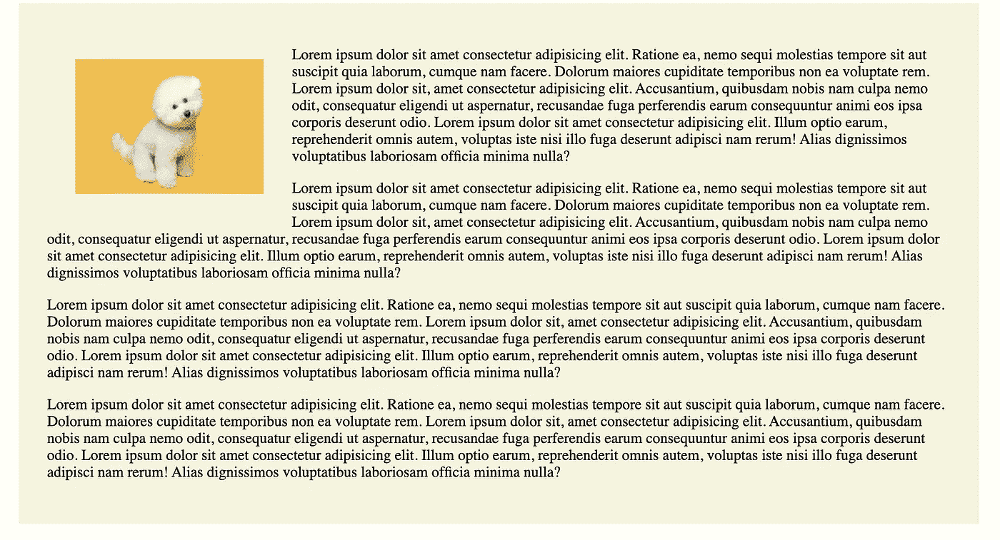
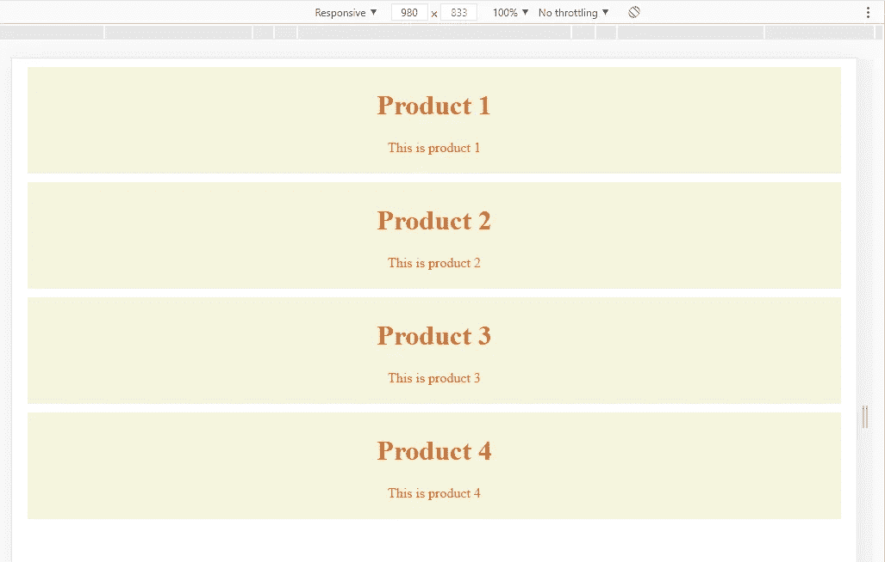
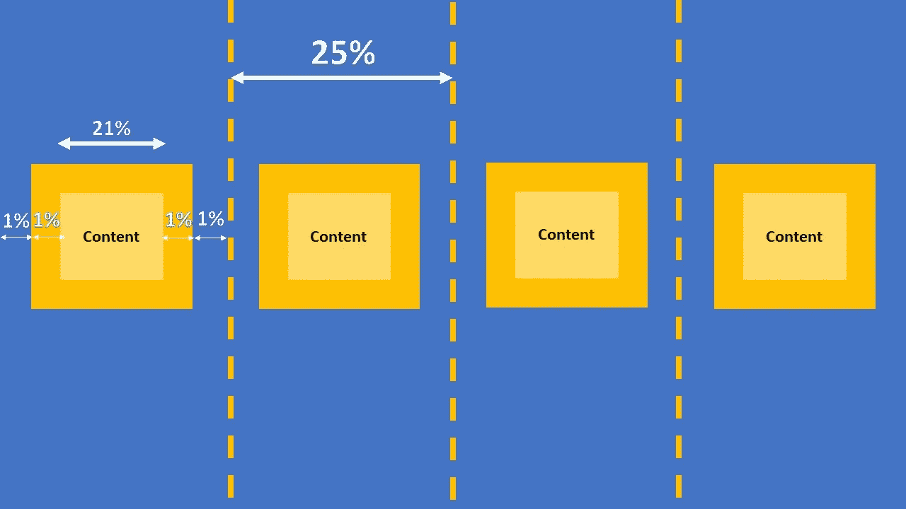

# 如何从 CSS 的正常流程中取出一个元素

> 原文：<https://javascript.plainenglish.io/css-normal-flow-and-float-30647c6c0e77?source=collection_archive---------16----------------------->

## CSS 正常流量和浮动

在这篇文章中，我们将讨论 CSS 位置和正常的浮动流

在 HTML 中，有两种类型的元素，一种是内嵌的，另一种是块。例如，我们用图像和段落创建一个**index.html**。

```
<!DOCTYPE html><html lang="en"><head><meta charset="UTF-8"><meta http-equiv="X-UA-Compatible" content="IE=edge"><meta name="viewport" content="width=device-width, initial-scale=1.0"><link rel="stylesheet" href="style.css"><title>Document</title></head><body><div class="wrapper"><p>Lorem ipsum dolor sit amet consectetur adipisicing elit. Ratione ea, nemo sequi molestias tempore sit aut suscipit quia laborum, cumque nam facere. Dolorum maiores cupiditate temporibus non ea voluptate rem. Lorem ipsum dolor sit, amet consectetur adipisicing elit. Accusantium, quibusdam nobis nam culpa nemo odit, consequatur eligendi ut aspernatur, recusandae fuga perferendis earum consequuntur animi eos ipsa corporis deserunt odio. Lorem ipsum dolor sit amet consectetur adipisicing elit. Illum optio earum, reprehenderit omnis autem, voluptas iste nisi illo fuga deserunt adipisci nam rerum! Alias dignissimos voluptatibus laboriosam officia minima nulla?</p><p>Lorem ipsum dolor sit amet consectetur adipisicing elit. Ratione ea, nemo sequi molestias tempore sit aut suscipit quia laborum, cumque nam facere. Dolorum maiores cupiditate temporibus non ea voluptate rem. Lorem ipsum dolor sit, amet consectetur adipisicing elit. Accusantium, quibusdam nobis nam culpa nemo odit, consequatur eligendi ut aspernatur, recusandae fuga perferendis earum consequuntur animi eos ipsa corporis deserunt odio. Lorem ipsum dolor sit amet consectetur adipisicing elit. Illum optio earum, reprehenderit omnis autem, voluptas iste nisi illo fuga deserunt adipisci nam rerum! Alias dignissimos voluptatibus laboriosam officia minima nulla?</p><p>Lorem ipsum dolor sit amet consectetur adipisicing elit. Ratione ea, nemo sequi molestias tempore sit aut suscipit quia laborum, cumque nam facere. Dolorum maiores cupiditate temporibus non ea voluptate rem. Lorem ipsum dolor sit, amet consectetur adipisicing elit. Accusantium, quibusdam nobis nam culpa nemo odit, consequatur eligendi ut aspernatur, recusandae fuga perferendis earum consequuntur animi eos ipsa corporis deserunt odio. Lorem ipsum dolor sit amet consectetur adipisicing elit. Illum optio earum, reprehenderit omnis autem, voluptas iste nisi illo fuga deserunt adipisci nam rerum! Alias dignissimos voluptatibus laboriosam officia minima nulla?</p><p>Lorem ipsum dolor sit amet consectetur adipisicing elit. Ratione ea, nemo sequi molestias tempore sit aut suscipit quia laborum, cumque nam facere. Dolorum maiores cupiditate temporibus non ea voluptate rem. Lorem ipsum dolor sit, amet consectetur adipisicing elit. Accusantium, quibusdam nobis nam culpa nemo odit, consequatur eligendi ut aspernatur, recusandae fuga perferendis earum consequuntur animi eos ipsa corporis deserunt odio. Lorem ipsum dolor sit amet consectetur adipisicing elit. Illum optio earum, reprehenderit omnis autem, voluptas iste nisi illo fuga deserunt adipisci nam rerum! Alias dignissimos voluptatibus laboriosam officia minima nulla?</p></div></body></html>
```

创建样式包装样式。

```
.wrapper{background-color: beige;padding: 30px;max-width: 960px;margin: auto;}
```

它会像这样显示。


由于 img 和 paragraph 元素都是块元素，所以它会开始一个新行。

所以如果我们想让文字绕过图片，这样图片就在文字的边上。我们可以添加下面的 css。这将使图像脱离正常流程。

```
img{float: left;margin:30px;}
```



## 创建三个盒子

CSS:

```
.wrapper{background-color: beige;padding: 30px;max-width: 960px;margin: auto;}.box{height: 100px;width: 100px;margin: 5px;}
```

创建三个 div，类等于 box。然后我们添加不同颜色的内嵌样式。


```
 <!DOCTYPE html><html lang="en"><head><meta charset="UTF-8"><meta http-equiv="X-UA-Compatible" content="IE=edge"><meta name="viewport" content="width=device-width, initial-scale=1.0"><link rel="stylesheet" href="style.css"><title>Document</title></head><body><div class="wrapper"><div class="box" style="background-color: blue;  "></div><div class="box" style="background-color: red; "></div><div class="box" style="background-color:orange; "></div></div></body></html>
```

如果我们把`float:left`一个一个加起来。

```
<div class="wrapper"><div class="box" style="background-color: blue; float:left; margin-left:1px; "></div><div class="box" style="background-color: red; "></div><div class="box" style="background-color:orange; "></div></div>
```


举个例子，如果我们给盒子加上`float:left`。它将占用红框的空间，红框将被隐藏。

我们可以看到，如果我们加上`margin-left:1px`。


```
<div class="wrapper"><div class="box" style="background-color: blue; float:left; margin-left:1px; "></div><div class="box" style="background-color: red; "></div><div class="box" style="background-color:orange; "></div></div>
```

如果我们将浮动添加到所有的框中，所有的 div 将从正常的流中取出，您可以看到包装器的高度变得更短，因为它现在只有填充。浮动元素在普通文档中不再占据任何高度。


```
<!DOCTYPE html><html lang="en"><head><meta charset="UTF-8"><meta http-equiv="X-UA-Compatible" content="IE=edge"><meta name="viewport" content="width=device-width, initial-scale=1.0"><link rel="stylesheet" href="style.css"><title>Document</title></head><body><div class="wrapper"><div class="box" style="background-color: blue; float:left; margin-left:1px;"></div><div class="box" style="background-color: red; float:left;"></div><div class="box"style="background-color:orange; float:left;"></div></div></body></html>
```

# 三种不同的产品

在这一部分，我们想要创建的是一个包含三种不同产品的布局。


现在，我们转到**index.html**并添加如下代码:

```
<!DOCTYPE html><html lang="en"><head><meta charset="UTF-8"><meta http-equiv="X-UA-Compatible" content="IE=edge"><meta name="viewport" content="width=device-width, initial-scale=1.0"><link rel="stylesheet" href="style.css"><title>Document</title></head><body><div style="text-align: center;"><div class="product"><h1>Product 1</h1><p>This is product 1</p></div><div class="product"><h1>Product 2</h1><p>This is product 2</p></div><div class="product"><h1>Product 3</h1><p>This is product 3</p></div><div class="product"><h1>Product 3</h1><p>This is product 3</p></div></div></body></html>
```

CSS:

```
.product h1, .product p {color:chocolate;}.product {background-color:beige;}
```

我们将文本颜色设置为巧克力色，产品背景颜色为米色。



现在我们添加浮动，宽度和空白。

```
.product {background-color:beige;float:left;width:21%;padding:1%;margin:1%;}
```

因为有四个盒子，我们希望每个盒子都有填充和边距，它们将占 100/4 = 25%

从上面的设置中，我们可以看到填充和边距都占 1%，因为两边都有填充和边距，所以总共占 4%。包括宽度为 21%的内容，总计为 25%



如果我们改为向右浮动，产品 1 将首先移动到右侧，另一个将堆叠在它上面。


就是这样！我们希望这对您有所帮助。如果是这样，一定要在评论中让我们知道。

**关注我们** : [YouTube](https://www.youtube.com/channel/UCu4-4FnutvSHVo9WHvq80Ww?sub_confirmation=1) ， [Medium](https://ckmobile.medium.com/) ， [Udemy](https://www.udemy.com/user/cyruschan2/) ， [Linkedin](https://www.linkedin.com/company/ckmobi/) ， [Twitter](https://twitter.com/ckmobilejavasc1)