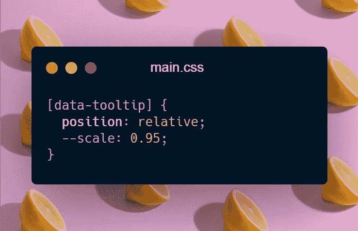

# 仅 CSS:创建具有完整功能的基本工具提示

> 原文：<https://javascript.plainenglish.io/css-only-create-a-basic-tooltip-with-full-functionality-6ab80dceb644?source=collection_archive---------15----------------------->

## JavaScript 是 web 开发中最受欢迎的男孩，但是如果你尝试一下 CSS，你会发现它实际上有多强大。

JavaScript 是在网络上创造奇特效果和功能的绝佳工具，一个没有 JavaScript 的功能性网站是不可想象的。这一切都很完美，但在某些情况下，您可能希望使用 CSS 而不是 JavaScript。

*   你是初学者，还没有学会 JavaScript。
*   你是 JavaScript 高手，知道 JavaScript 越多，网站越慢。
*   你只是好奇 CSS 能做什么。

在这个 *CSS Only* 系列中，我们将用 CSS 实现通常需要 JavaScript 的特性。在本教程中，我们将建立一个只有 CSS 的基本工具提示。即将播出的 *CSS Only* 将涵盖高级工具提示、抽屉、模态等。

**注意:**使用像 SASS 这样的 CSS 预处理器可能会非常方便，但是为了让任何人都可以访问本教程，我将使用普通 CSS。

# 基本工具提示

在教程的这一部分，我们将创建一个工具提示，它只包含字符串内容，仅此而已。这个工具非常适合信息少或缩写的工具提示。

Here is the final version of the tooltip.

首先，创建一个`index.html`和一个`main.css`，然后链接它们。在`index.html`中，创建一个`div.container`，并在里面创建一个带有可悬浮内容的`p`标签。在`p`标签上，我们将利用一个名为`data-tooltip`的自定义数据属性从 CSS 访问工具提示。

现在标记完成了，我们可以开始用 CSS 实现 tooltip 了。

打开`main.css`添加一些基本的样式到主体和容器到视口的中间段落。这部分和教程没有直接关系。

Some basic styling for body and container

`p`标签的样式将由两部分组成:一部分与`p`的外观相关，另一部分与工具提示相关。因此，在`p`选择器中，我们将放置与工具提示无关的样式，在`[data-tooltip]`选择器中，我们将样式化工具提示。

为了在 CSS 中选择自定义属性，我们使用了`[data-...]`选择器。我们可以使用`[data-tooltip]`选择具有自定义工具提示数据属性的标签。所以，让我们在 CSS 中选择它，并开始处理棘手的部分。

我们将利用`::after`伪元素创建工具提示，并相对于它的祖先标签定位它。所以要定位父母相对。

是时候创建伪元素并将我们已经传递给自定义属性的内容打印到屏幕上了。

为了实现这一点，我们必须将`::after`添加到工具提示选择器中，并使其内容成为自定义工具提示属性的内容。在这一步之后，我们现在能够看到传递到自定义属性中的字符串。我们唯一要处理的是`::after`伪元素的样式，这样它看起来就很迷人。你可以随心所欲地设计风格，但这里是我的工具提示风格。默认情况下，我将工具提示放在了`p`标签的底部。

当您检查上面的代码时，您会注意到一些意想不到的属性，如继承的 CSS 变量和零不透明度。这些属性用于本教程的下一步。我们必须隐藏工具提示，这样当用户没有悬停在`p`标签上时，它就不会显示出来；因此，工具提示的不透明度为零。我们将利用`:hover`伪类将这些属性重置为原始属性，工具提示会显示出来。

在`:hover`伪类中，我们将不透明度设置为 1，将`--scale`设置为 1。因此，工具提示出现在屏幕上。最初将它缩小到 0.95 的原因是为了在悬停上创建一个增长效果。

就是这样！现在，您已经用几行 CSS 创建了一个基本的工具提示。但是，如果您想给这个工具提示添加更多的功能和灵活性，您可以继续下一部分。

# 改进工具提示的功能

在这一部分中，我们将尝试在我们创建的工具提示中添加一些有用的功能，使其更加灵活和实用。以下是我们将实现的功能。

*   用于调整显示和退出时间的常规反应时间属性。
*   属性来确定工具提示的位置。

这些功能实现后，你就可以毫不犹豫地在你的酷站和项目上使用了。

## 1.一般反应时间

实现这个属性，我们在悬停一段时间后显示和隐藏工具提示。这让工具提示感觉更优雅，并防止意外泄露。

我们将为此创建一个名为`data-reaction`的自定义数据属性，选项有*快速、慢速*或*无。无*是该属性的默认值。慢速*的反应时间为 250 毫秒，快速*的反应时间为 500 毫秒。将要使用的属性是`transition-delay`。基于数据属性，我们将 CSS 变量设置为不同的值。**

首先，将`--delay`变量添加到工具提示中，并将其设置为 0。之后，在`::after`中从其父代继承。确保将`transition-delay`设置为`--delay`变量。

现在，是时候使用数据属性来控制它了。这个过程非常简单。我们将逐个选择每个选项，并相应地设置`--delay`变量。

最后，工具提示现在有了一个通用的反应时间属性。要使用它，只需将`data-reaction`属性传递给父标签。或者，如果您愿意，可以使用`style`属性传递自定义反应时间。

## 2.工具提示位置

另一个增强工具提示功能的属性是位置属性。实现这个，我们将能够使用一个名为`data-position`的简单属性来定位它。

`data-position`将有四个选项:*底部、顶部、左侧*和右侧*。底部*是默认值，根据属性值，我们将其相应地放置如下:

现在这个特性已经实现了，您可以利用它向标签添加一个`data-position`属性。

谢谢你们的阅读。你可以在这里找到完整的源代码。我希望您喜欢这篇文章，并且现在对 CSS 的功能和威力有了一些了解。我们将只使用 *CSS 来构建惊人的东西。如果你喜欢，请鼓掌，如果你有什么想补充的，请发表评论。*

下一个故事再见！

*供进一步阅读:*

 [## Vanta.js 入门:在几秒钟内创建迷人的动画背景

### 网格渐变在现代网站中使用，直到最近，我还不知道如何创建一个。然后我遇到了…

javascript.plainenglish.io](/how-to-get-started-with-vanta-js-create-glamorous-and-animated-backgrounds-in-seconds-c2a386516a73)  [## 使用语义元素让你的 HTML 有意义

### 停止错误地使用 HTML。HTML 的发明不是为了创造一些很酷的视觉效果，而是为了传递关于…

javascript.plainenglish.io](/let-your-html-make-sense-using-semantic-elements-34c9aa97a2fa)  [## 对于 React 应用程序，你应该选择 Vite 而不是 CRA，原因如下

### 对于许多初学者、中级甚至一些专家程序员来说，Create React App 是开始和…

medium.com](https://medium.com/codex/you-should-choose-vite-over-cra-for-react-apps-heres-why-47e2e7381d13) 

*更多内容请看*[***plain English . io***](http://plainenglish.io/)