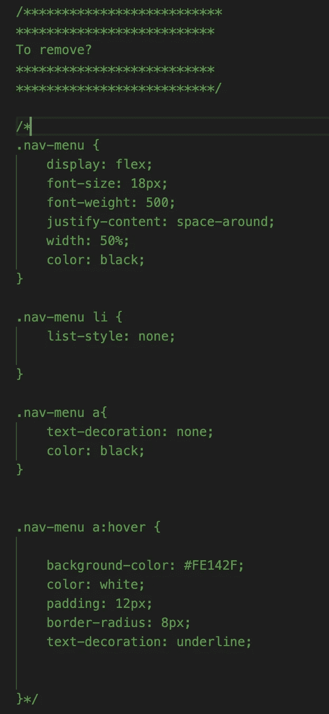

# CSS:好的、坏的和丑陋的

> 原文：<https://javascript.plainenglish.io/css-the-good-the-bad-and-the-ugly-575923f05684?source=collection_archive---------12----------------------->


与 HTML 一样，CSS 是最广为人知的计算机语言之一，即使对于非技术人员来说也是如此。后者致力于我们网站的布局。虽然它使用起来似乎不太复杂，但几年来(还记得 clearfix！)，尤其是感谢 Flexbox 和 Grid，编写干净且可维护的 CSS 可以非常非常复杂！

**我最近让一些学生整合了一个 CSS 项目**:多亏了他们的工作，**我才能够用 CSS 中要做的事情、要避免的事情和要摒弃的事情做一个实用的指南**。你可以在 [Github](https://github.com/tdimnet/the-good-the-bad-the-ugly) 上找到项目代码。

敬你的刷子！

# 好人

## 标准化你的 CSS


Importing the normalize.css file from HTML

Normalize.css 是我几年前开始学习 css 时最先学会的东西之一。那时我真的不知道它是做什么用的，我只是把它放在我的项目中。

几年过去了，但我仍然在我从事的每个项目中使用它。三言两语 Normalize.css 是由谷歌的一名工程师创建的(我想？):**这个想法是为了消除浏览器之间的差异**。与 CSS 重置相比，它的优点是在大小和计算上都更轻。

如果你想了解更多，请不要犹豫，阅读[项目](http://nicolasgallagher.com/about-normalize-css/)的自述；).

## 使用 CSS 变量


Variables in CSS

如果这个符号对你来说没有任何意义，那么你就是不熟悉 CSS 变量！CSS 的一个很好的发展，根据 CanIUse 网站:[https://caniuse.com/?search=variables](https://caniuse.com/?search=variables)。

它们给我们的老 CSS 带来了一点粗鲁的感觉。我认为它们在不使用 CSS-in-JS 或像 Sass 这样的预处理器的项目中非常有趣。

在上面的例子中，**你可以看到我用它来创建我的颜色变化以及一个边界半径值**。顺便说一句，如果你正在为你的颜色命名而苦恼，我邀请你访问这个精彩的网站:[https://chir.ag/projects/name-that-color/#6195ED](https://chir.ag/projects/name-that-color/#6195ED)

反正如果你还没有，我劝你试一试:)。

## 按字母顺序排序


CSS code sorted alphabetically

这当然是会让一些人尖叫的点之一！**是的，我是那些按字母顺序排列 CSS 的人之一**。我认识一些不理解这种方法的开发人员，他们告诉我把元素放在前面，其他的放在后面是很重要的，这种方法很愚蠢，等等。

对我来说，不同的开发者会有不同的优先级:有些人喜欢把位置放在前面(绝对的，相对的)，有些人喜欢把位置放在显示器前面(flex，grid，等等)。).字母顺序有公正和无脑的一面，可以避免提问。对了，VSCode 上有个[扩展也不是白来的；不然也可以在 Vim 上悄悄做。](https://marketplace.visualstudio.com/items?itemName=ue.alphabetical-sorter)

# 坏事

## 不要对空间过于苛求


Here, CSS can be rigorous in its writing

现在，我知道这听起来有点小题大做，但我认为这是一个应该遵循的基本规则。我强烈支持[破窗理论](https://en.wikipedia.org/wiki/Broken_windows_theory) : **你对代码越不严谨，你就越会引入一点混乱和难以维护的东西**。

对我来说，CSS 或任何其他编程语言都应该写得干净利落，换句话说:

*   **在 HTML 和 CSS 端使用烤肉串盒**。如果你有一个洞，它看起来像这样:主导航项目。还有许多其他命名约定。这里有一个不错的网站可以尝试这一切:[https://textcaseconvert.com/](https://textcaseconvert.com/)
*   不遵守行内和行间的间距规则。

```
// For me, CSS should be written like this
.main-nav {
  background-color: tomato;
}.main-nav-item { // Note that I leave a line above
  background-color: lightblue;
}// It shouldn't be written like this
.Main-Nav {}.mainNavItem {}// Or like that
.mainnav {}
.main-nav-item {}
```

*   **如果可能，使用 CSS 命名约定**。我不是 BEM 的超级粉丝(我想我从来没有见过任何人做得如此完美)，但这个约定有利于提高编写更干净 CSS 的意识(特别是与他的好友 Sass)。我想我更喜欢**实用程序优先 CSS** 运动。我可能会写一篇关于它的文章，但是如果你想更进一步，请随意阅读这篇文章:[https://frontstuff.io/in-defense-of-utility-first-css](https://frontstuff.io/in-defense-of-utility-first-css)


Here is an example of bad CSS

## 使用最大宽度


A media query with a max-width

看到大家都在说移动-第一，从集成商/开发者到营销人(小心，这不是对营销人刻薄！).这无疑是过去十年中最流行的词汇之一:**我们似乎每年都重新发现，整个世界，或者几乎整个世界都在通过手机查询网络**。

然而在现实中，我的印象是我们不知道如何在 CSS 方面做到这一点。我仍然不确定这是法国的问题，也就是说，法国人做的 CSS 不够多，或者没有学习基本规则，或者这是一个更全球化的问题。

无论如何，要做到移动优先，以下是基本规则:

*   首先开始为手机整合你的模型。这时的设计是最简单的(只有堆叠在彼此顶部的积木)**但也是最重要的**(你选择颜色、字体、文本和呈现的图像等。).
*   然后，转向平板电脑版本，最后是电脑版本。所有的基本元素都已经存在了，所以你可以在不修改太多基本元素的情况下进行布局。
*   使用最小宽度代替最大宽度。他们会让你逐步布局。您可以在下面的示例中看到一个应用程序。

```
.main-header {
   background-color: tomato;
}// Here I take care of the tablet versions
@media screen and (min-width: 768px) {
  .main-header {
     background-color: lightblue;
  }
}// Here, I take care of the desktop versions
@media screen and (min-width: 1024px) {
  .main-header { 
    background-color: yellow; 
  }
}
```

## 使用填充/边距的相对值


Percentage margins

**我不知道这种做法是好是坏**，但当我看到以百分比表示的边距和填充，而不是以像素、em 或 r em 表示时，我总是觉得很奇怪。事实上，百分比向我表明，margin 所理解的值会根据屏幕的对角线而变化，我觉得这很烦人，因为它不是很有预测性。

我远不是 em 或 rem 方面的专家:我认为它们对于框架或自制设计来说非常有趣，但对于“小”项目，我发现设置起来相当复杂。也就是说，百分比对于宽度是有用的，但是我稍后会再回到这个问题上来。

```
// At least here we know precisely the value taken by the margin
.main-nav {
  margin-left: 24px;
  margin-right: 24px;
}// Here we have no precise idea of this value!
.main-nav {
  margin-left: 5%;
  margin-right: 5%;
}
```

## 对其代码评论过多


Commented code

*啊啊啊*，关于评论的名言…

当我想到这一点时，它总是让我微微一笑:**我们第一次学习编码时，我们到处都读到我们必须考虑放置注释**，“因为，嗯，你知道，没有什么比糟糕的注释代码更糟糕的了”。

**然后，后来，我们被告知相反的情况:我们必须减少评论，只保留必要的内容**。一个新的黄金法则开始发挥作用，我们必须学会很好地命名我们的变量和函数，但是我们必须留下尽可能少的注释。

不过有一点是肯定的。**包含太多注释的代码读起来会很累，会让读者对本质内容失去兴趣**。此外，这有时也意味着命名做得不好，但这可能是未来文章的主题。

如果你想在这个主题上更进一步，你可能会对 Robert C. Martin 感兴趣:他是美国著名的开发者/理论家/传道者，在这个主题上做了很多工作。他最著名的书是《干净的代码》。也许有一天我会讲(读完的那一天；)).

# 丑陋的

## 留下死代码


Some Living dead code

还有比一段死代码，这里是 CSS，迷失在一个代码库中更美的东西吗？当我们看到这种事情时，我们总是对自己说:

*   为什么会在这里？
*   我应该删除它吗？
*   如果它在那里，我应该把它留下吗？
*   把它留在这里一定有原因。
*   好吧，当有疑问的时候，我会把它留在这里。

**这就是腐烂的代码库的方式！**它们充满了无用的代码，但这些代码被留在了那里，因为我们没有时间或没有花时间向同事询问。有时，该代码会变成包含死代码的注释，如下所示。



A block of commented code

为了避免这种小乐趣，最好的解决方案是定期清理代码(就像清理花园一样)。我认为这更像是一个实践、经验和开发者参与的问题。

## 使用奇怪百分比的宽度


A width with a strange percentage

还记得之前关于百分比的规则吗？该百分比以屏幕大小作为其值。换句话说，如果你有一个 320 像素宽的屏幕，你有一个 218 像素宽的屏幕。如果您的屏幕宽度为 480 像素，那么您的屏幕宽度为 327 像素。

就其本身而言，宽度随屏幕变化不是一件坏事。**但是，当我看到 68.2%的宽度时，我总觉得有问题**。对我来说，宽度应该是“圆形”值，比如 90%或 95%。

**然而，有一个例外是响应性设计，我认为有 33.33%** 是正常的，这允许制作铁拉网格。也就是说，我认为还有其他更优雅的解决方案(是的，是的，CSS Grid，我想到了你；) ).

## 使用身份证

在我所看到的一些不良做法之旅的最后一步:身份证(我并不是在说！重要)。

我最近订阅了前端硕士课程，并测试了一门针对初学者的课程。我重新发现了一个词:特异性。特异性是一个容易理解但使用非常糟糕的概念:每个元素都有一个特异性值，类比基本选择器有更多的特异性，id 比类有更多的值，等等。


Specificity in CSS

上面的图像允许可视化这种特异性。也就是说，它有点不完美，因为它意味着 10 乘以 10 的类可以有和 id 一样多的值，但事实并非如此。

通常，我倾向于主要使用类:它们允许我做出最灵活的设计，而不必太担心这种特殊性。


Here, too many IDs one after the other

在本文的最后，我们将介绍一些好的和不太好的 CSS 实践。如果您已经读到本文的结尾，我感谢您的时间和阅读。

如果你喜欢这个话题，或者这个语气，并且想读得更多，请让我知道:)，谢谢！

kittens ! Kittens everywhere !

*更多内容参见* [*简明英语. io*](http://plainenglish.io/)