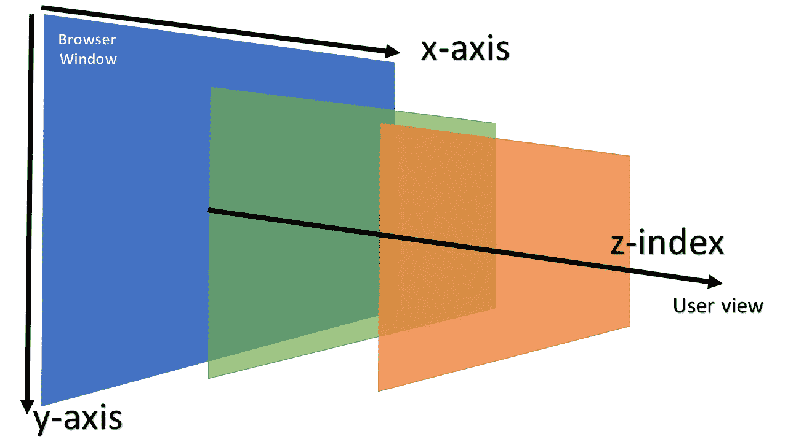
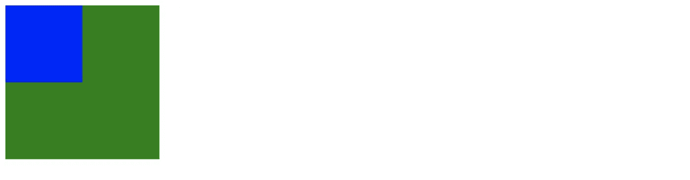
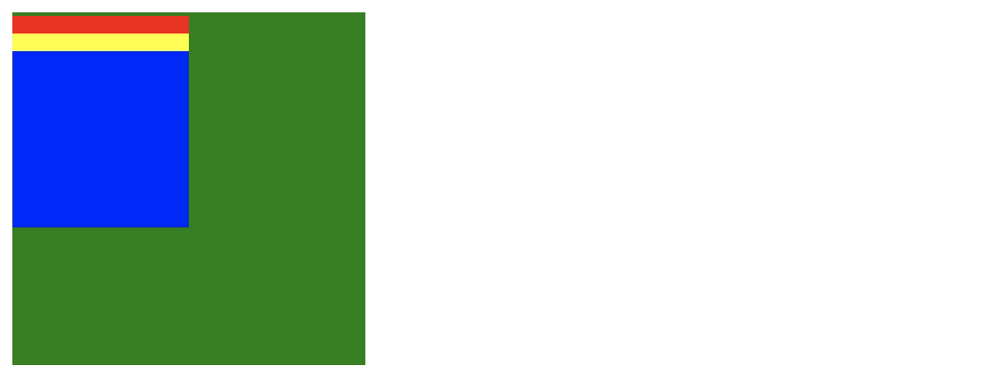
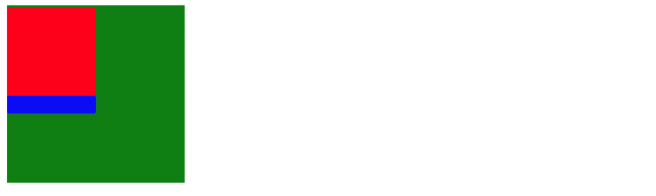

# CSS: z-index 不起作用？

> 原文：<https://javascript.plainenglish.io/css-z-index-not-working-d5c068b6861?source=collection_archive---------23----------------------->

## 更好地理解 z 索引、堆叠顺序、定位元素和非定位元素之间的关系。

很多人都在纠结 z 指数。有时候，z-index 似乎不起作用。即使将 z-index 设置为 999999999 也无助于使元素更靠近屏幕。在本文中，我们将讨论 z 索引、堆叠顺序、定位元素和非定位元素。



Z-index 用于根据相对深度来组织元素。z-index 是元素的顺序。指数越高，离观看者越近。较高索引的元素放置在具有较低 z 索引的元素之前。

## 开始项目

我们创建了四个 div，并准备创建四个盒子。

```
<body><div class="red box"></div><div class="yellow box"></div><div class="blue box"></div><div class="green bigbox"></div></body>
```

在 CSS 文件中，我们创建了四种颜色，box 和 bigbox 样式。

```
.box{height: 100px;width: 100px;}.bigbox{height: 200px;width: 200px;}.red{background-color: red;position: absolute;}.yellow{background-color: yellow;position: absolute;}.blue{background-color: blue;position: absolute;}.green{background-color: green;}
```



之后，我们将位置:绝对添加到红色、黄色和蓝色框中。正如我们所看到的，没有位置的绿色框将被放置在底部，蓝色框在顶部，这也意味着 div 越低，元素显示在屏幕上的位置就越高。

如果我们从顶部添加不同的空间，会更清楚。

```
.red{background-color: red;position: absolute;top:10px;}.yellow{background-color: yellow;position: absolute;top:20px;}.blue{background-color: blue;position: absolute;top:30px;}
```



我们可以看到红色的在底部，蓝色的在顶部。

如果我们想要红色的在顶部，我们可以设置 z-index 为 1。它会把红色的放在最上面。


如果我们试图将 z-index = 2 加到绿框中，

```
.green{background-color: green;z-index: 2;}
```



你可以看到没有任何影响。

因此，z 索引只适用于那些已定位的元素。

关注我们: [YouTube](https://www.youtube.com/channel/UCu4-4FnutvSHVo9WHvq80Ww?sub_confirmation=1) ， [Medium](https://ckmobile.medium.com/) ， [Udemy](https://www.udemy.com/user/cyruschan2/) ， [Linkedin](https://www.linkedin.com/company/ckmobi/) ， [Twitter](https://twitter.com/ckmobilejavasc1)

*更多内容请看*[*plain English . io*](http://plainenglish.io/)