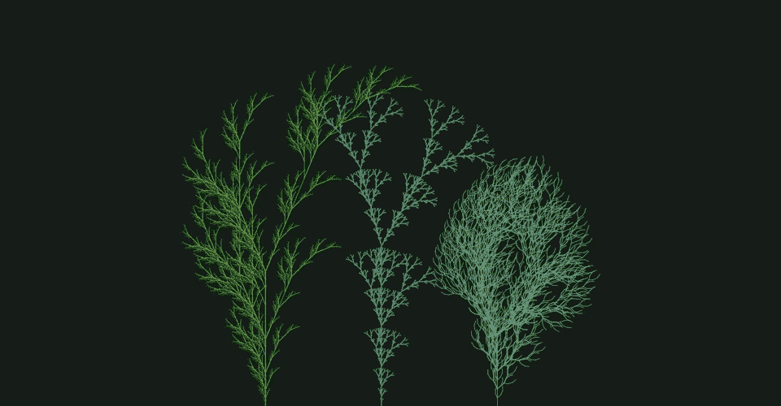
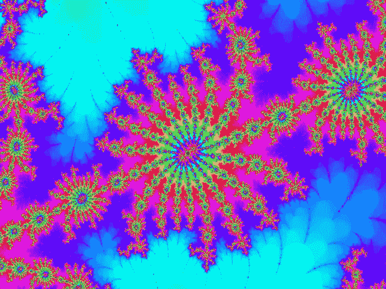

# 各种水平的开发人员面临的好奇的 JavaScript 挑战

> 原文：<https://javascript.plainenglish.io/curious-javascript-challenges-for-developers-of-all-levels-ddcb066c8c9?source=collection_archive---------9----------------------->

## 写音乐，画 3D 物体，甚至创造你自己的病毒。

[Iconscout](https://iconscout.com/illustration/concept-of-data-analysis-and-coding-1776188), edited by author

JavaScript 有时会令人困惑，甚至十分怪异，但是你可以用它做很多事情。学习 JavaScript 的开发人员通常将自己局限于编码挑战和经典的 web 项目，如投资组合网站或在线商店。但是为什么就此打住呢？

暂时忘掉无聊的练习，打开你的想象力。用 JavaScript 可以写很多东西。让我们找点乐子！

## 101 问候用语

“你好，世界”节目不仅仅是为初学者准备的。看看你有多有创造力，试着想出至少一些其他的方法来创建一个 JavaScript 程序，将那个著名的短语输出到屏幕上。如果你在这个 GitHub repo 中没有看到你的解决方案，那就去和别人分享吧！

 [## GitHub-georgemandis/101-hello-worlds:一个探索复杂事物的 Rube Goldbergian 练习…

### 探索简单问题的复杂解决方案的鲁布·戈德伯格练习。本次回购的目标是累积…

github.com](https://github.com/georgemandis/101-hello-worlds) 

## 创建 3D 对象

开始使用 JavaScript 进行 3D 渲染并不需要太多——对 JavaScript 和 Three.js 库有一些基本的了解就足够了。所有初学者都是从画一个 3D 立方体或球体开始，但之后就有可能创造出一些真正令人惊叹的东西。Three.js 也是 VR 和 AR 中经常使用的库，所以谁知道这个编码项目会把你带到哪里。

 [## Three.js 教程-如何在浏览器中渲染 3D 对象

### 如果你曾经想用 JavaScript 构建一个游戏，你可能会遇到 Three.js. Three.js 是一个库…

www.freecodecamp.org](https://www.freecodecamp.org/news/render-3d-objects-in-browser-drawing-a-box-with-threejs/) 

## 太空入侵者

当谈到不寻常的 JavaScript 挑战和项目时，YouTube 上的编码培训频道是一个真正的野兽。如果你是一个有点经验的开发者，我会推荐你自己开发这个游戏，然后比较结果。另一方面，初学者可以通过这个很棒的教程学习很多关于 JavaScript 和游戏开发的基础知识:

需要更多灵感？回到过去，我也用 C++创建了我的游戏版本。它是如此的简单，以至于我称之为“悲伤的太空入侵者”。然而，它成功了！

 [## GitHub-valeria mur/CPP _ Space _ Invaders:一个终端中的太空入侵者游戏，使用 ncurses 制作…

### 太空入侵者游戏在一个终端，使用 ncurses 库制作

github.com](https://github.com/ValeriiaMur/CPP_Space_Invaders) 

## 30 天的香草 JavaScript

你听说过 **JavaScript 疲劳吗？**它指的是无法跟上最新的工具和趋势，因为 JavaScript 几乎每天都在变化和发展。如果你和我们一样，厌倦了无数的包和库，可以看看这个每天都有挑战的普通 JavaScript 课程。太爽了。

 [## JavaScript 30

### 用香草 JS 在 30 天内用 30 个教程构建 30 个东西

javascript30.com](https://javascript30.com/) 

*课程的启动文件和完整解决方案可以在* [*这里*](https://github.com/wesbos/JavaScript30) *找到。*

## 蛇的游戏

根据这个人的说法，在 15 分钟内创建 JavaScript 版本的贪吃蛇游戏是完全可能的。加入挑战吧！

*顺便说一下，他有* [*一整个 YouTube 播放列表*](https://www.youtube.com/playlist?list=PLRqwX-V7Uu6ZiZxtDDRCi6uhfTH4FilpH) *致力于像这样有趣的编码挑战。*

## 分形树

是只有我这样认为还是分形有某种绝对神奇的东西？看看上面这些用 p5.js 库创建的树就知道了。这里有一个[分形和分形树的概述](https://davis.wpi.edu/~matt/courses/fractals/trees.html)，特别是让你开始；如果你需要一些额外的帮助，看看这个教程。

## 曼德勃罗集合

虽然我们仍在谈论分形的话题，但这是我第二喜欢的 Mandelbrot 集合(如果你想知道，我第三喜欢的是 Julia 集合)。尝试研究分形，先实现自己的版本；如果有些东西不工作，有很多有用的教程:

 [## Javascript 教程- Mandelbrot 集分形

### 分形是复杂的图像，其部分与整体相似。换句话说，如果你放大一个分形，你…

slicker .我](http://slicker.me/fractals/fractals.htm) 

## 康威的生活游戏

1970 年，数学家约翰·康威发明了生命游戏。这不是一个真正的游戏，而是一个迷人的数学模拟，可以用任何编程语言(包括 JavaScript)相当容易地实现。

 [## 用 JavaScript 创建康威的生活游戏- JavaScript 教程|麻辣酸奶

### 了解如何用 JavaScript 在 HTML5 画布上创建康威的《生活的游戏》。执行游戏规则并检查…

spicyyoghurt.com](https://spicyyoghurt.com/tutorials/javascript/conways-game-of-life-canvas) 

## 暴力黑客模拟器

这更像是一个前端的挑战，但是也有一些奇怪的小问题需要解决。

## 奎因

写一个 quine，一个自我复制的程序，当执行时打印程序本身，可能听起来像一个简单的练习。然而，如果你愿意，你可以把它变得更复杂。尽量先自己写，再去查别人的解答！

 [## JavaScript 中的一个查询

### 引用维基百科:蒯因是一个计算机程序，它不接受任何输入，生成自己源代码的副本作为它的…

2ality.com](https://2ality.com/2012/09/javascript-quine.html) 

## 自然模拟

可汗学院有一整个单元的免费编程课程致力于高级 JS 和自然模拟。先看他们的视频，然后完成挑战。如果你是初学者，你可能需要看一些前面的单元或者整个课程来加快速度。

 [## 高级 JS:自然模拟|计算机编程|可汗学院

### 一旦你学习了 JS 入门，你可以通过这个课程学习如何结合 JS，处理 JS，和…

www.khanacademy.org](https://www.khanacademy.org/computing/computer-programming/programming-natural-simulations) 

## 带声调的音乐. js

将音乐制作和 JavaScript 编程结合在一个有趣的项目中。创作音乐与编程的共同点比人们想象的要多得多；此外，Tone.js 库非常简单，使用起来并不困难。

 [## 如何用 Tone 创作音乐. js Devbridge

### 如果你和我一样，你喜欢编码。你喜欢当你解决一个复杂问题时的感觉，当你…

www.devbridge.com](https://www.devbridge.com/articles/tonejs-coding-music-production-guide/) 

## 一个有 TensorFlow.js 的 AI

JavaScript 并不是谈论 ML 和 AI 时首先想到的语言。然而，仍然可以使用 TensorFlow.js 库创建一些非常酷的东西。

 [## JavaScript 中的人工智能与 tensor flow . js-JavaScript January

### 虽然本文的主旨不会涉及这些算法是如何工作的，但了解这些算法的基本原理是很重要的

www.javascriptjanuary.com](https://www.javascriptjanuary.com/blog/artificial-intelligence-in-javascript-with-tensorflowjs) 

## 物理模拟

本教程有在线版本和 PDF 版本，请选择您最喜欢的版本。

## 病毒

最后，这是一个终极挑战——创建一个 JavaScript 病毒。当然，它不会是一个真正危险的东西，而是一些恶作剧和有趣的东西。但是，我打赌这将是一个令人兴奋的项目。

 [## GitHub - hacksparrow/virus:一个简单的 Node.js 病毒，演示数字病毒感染是如何工作的

### 一个简单的 Node.js 病毒来演示数字病毒感染是如何工作的。病毒代码会把自己复制给所有人。js…

github.com](https://github.com/hacksparrow/virus) 

**如果你喜欢这篇文章，这里还有一些你可能喜欢的文章:**

 [## 想试试创意编码？从这里开始

### 创造性编码的目标是创造美丽的东西，而不是实用的东西。

medium.com](https://medium.com/dare-to-be-better/want-to-try-creative-coding-start-here-35bb88c5fb04)  [## 面向开发者的十大 YouTube 频道

### 欢迎来到 YouTube 大学…

medium.com](https://medium.com/dare-to-be-better/top-10-youtube-channels-for-developers-dc7aaee77c72)  [## 实际上有趣且易于阅读的编程书籍

### 聪明是新的性感，这是事实。人们嘲笑书呆子相信…

medium.com](https://medium.com/dare-to-be-better/programming-books-that-are-actually-fun-and-easy-to-read-a7f8403427) 

*更多内容尽在*[***plain English . io***](http://plainenglish.io)

如果你喜欢这个故事，你可能也喜欢中等会员。一个月才 5 美元(一杯咖啡的价格！)但是它会在支持你最喜欢的作家的同时，给你无限的接触故事的机会。如果你注册使用[这个链接](https://medium.com/@valerie_m/membership)，我会赚一小笔佣金。谢谢！