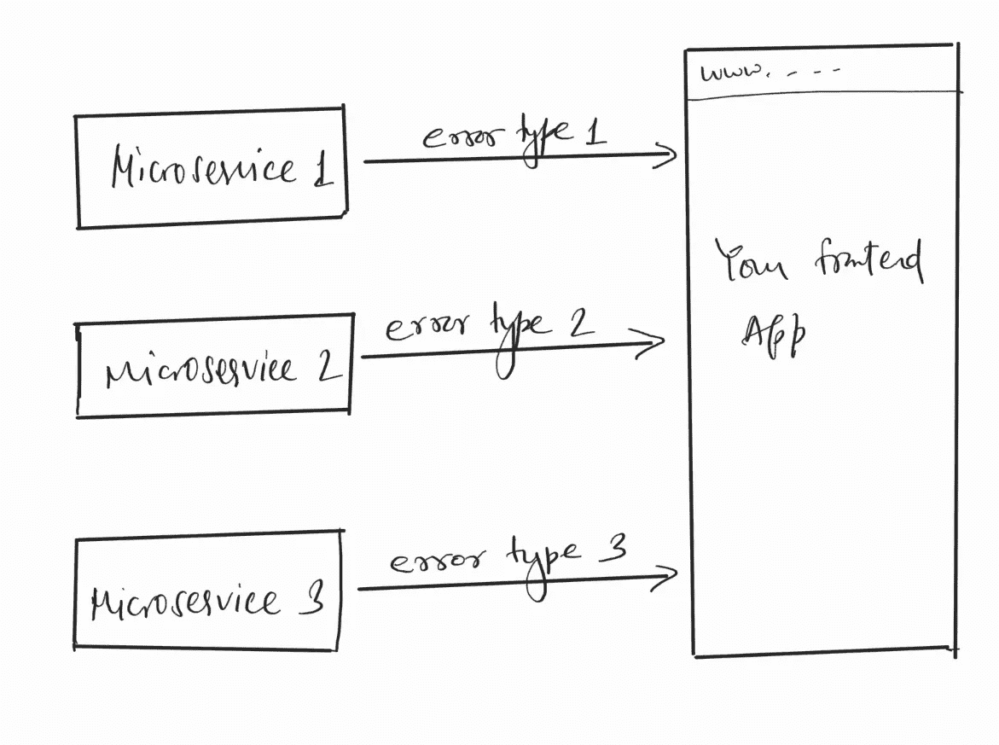
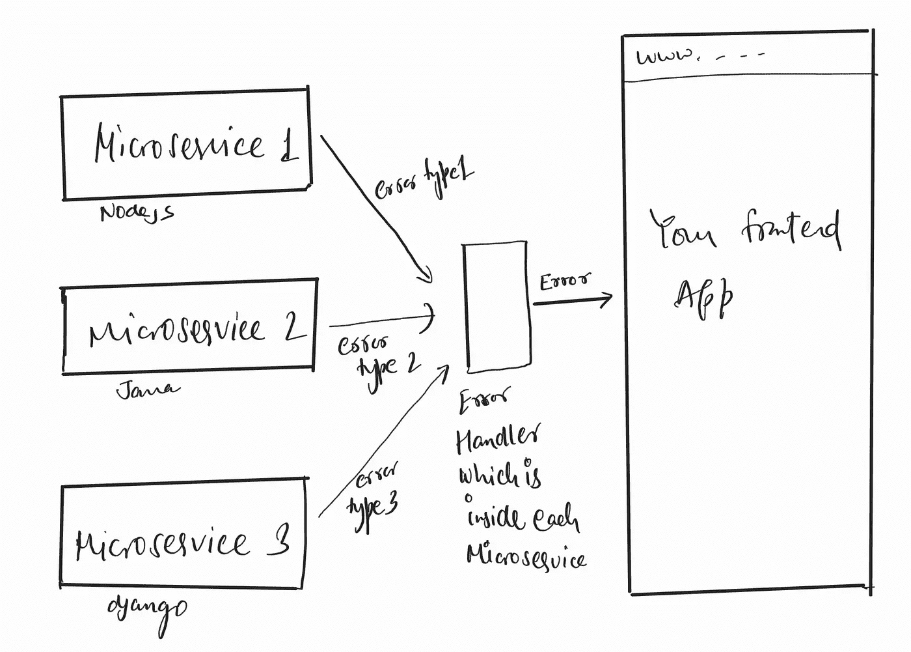
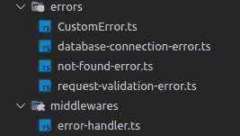

# 使用 Node.js 和 TypeScript 的自定义错误处理程序

> 原文：<https://javascript.plainenglish.io/custom-error-handler-using-nodejs-typescript-2ab744aa4ef7?source=collection_archive---------1----------------------->

当你在一个单片应用上工作时，不为你的应用构建一个定制的错误处理程序可能是可以的(这真的不行),但是当你在使用微服务时，那么就必须创建它，因为你的每个微服务可以使用不同的技术栈，并且开发者得到不同的错误模式。这不是表现你的错误的好方法。

这是之前，我们没有使用任何错误处理程序的时候。你可以看到每个微服务产生不同类型的错误。现在让我们看看当我们使用自定义处理程序时会发生什么——

现在你可以看到我们的开发人员很容易处理一种模式的错误。让我们来建造它—

开始之前，让我们看看文件夹结构，这样你会很容易理解。

先说说*错误*文件夹。我们有*customer error . ts*文件，其中包含抽象类(它用于维护你的子类的结构)。

在这个文件中，你可以看到我们刚刚在这里创建了一个所有错误类的结构，每个错误类都应该包含消息和状态代码，所有其他东西都只是模板和 JavaScript。

现在，让我们构建我们的第一个 ***数据库-连接-错误*** ，这非常简单。

现在，你可以看到我们导入了抽象类并将其扩展到当前类。因此它将检查代码结构。它有助于代码对称。当我们的微服务无法连接到数据库时，出现了数据库错误，其状态代码为 500。

现在是时候构建 ***未发现错误了。***

现在可以比较一下这个 NotFoundError 类和上面的抽象类了。它将符合所有的要求。

现在是最后一个，也是最普遍和最常见的一个，你会从这个得到错误， ***请求-验证-错误。***

我知道这有点难以理解，但是我们会像 JavaScript 一样一行一行地看。

首先，我们导入抽象类，然后导入 validationError，它包含验证错误的数组，我们将它放入构造函数的 errors 变量中，然后以适当的格式返回该方法，就像我们在抽象类中讨论的那样。

现在，我们终于达到了我们的错误处理中间件，主要的一个。

在这个中间件中，在 if 语句中，我们检查错误类型的实例。如果错误是我们在错误文件夹中定义的类型，那么它将捕获它。

当抛出一个错误时，我们简单地使用类名`throw new DatabaseConnectionError()` ，而不是`throw new Error()`。

*如果您对此有任何疑问，请在* [*Twitter*](https://twitter.com/xByZero) *上发表评论或给我发 DM。我将很乐意与您联系，并消除您的疑虑。；)*

*更多内容请看*[***plain English . io***](http://plainenglish.io/)