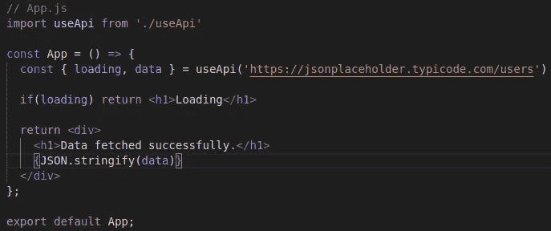
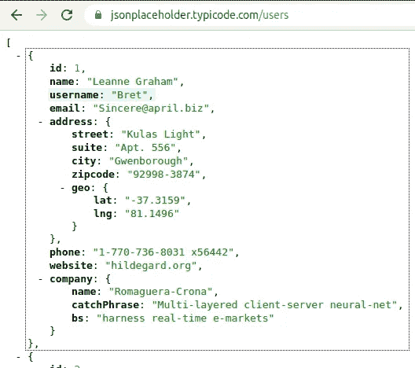
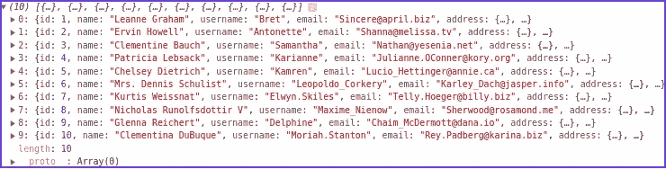

# React 中用于调用 API 的自定义挂钩— useApi

> 原文：<https://javascript.plainenglish.io/custom-hook-in-react-js-for-calling-api-useapi-7de24b42729c?source=collection_archive---------1----------------------->

custom hooks useApi

# 介绍

在这篇博客中，我们将了解什么是自定义钩子，并构建一个——use Api—用可重用的逻辑从 API 获取数据。

> *本博客最初发表于*[https://www . gyaanibuddy . com/blog/custom-hook-in-react-js-for-calling-API-use API/](https://www.gyaanibuddy.com/blog/custom-hook-in-react-js-for-calling-api-useapi/)
> **我也将很快发表于**[**geeks forgeeks**](https://www.geeksforgeeks.org/)

# 什么是自定义挂钩？

自定义钩子是一个 JavaScript 函数，它的名字以“ **use** 开始，并且可以调用其他钩子。自定义挂钩允许您将一些组件逻辑提取到一个可重用的函数中。

> *简单来说，它以 react 的方式编写可以在不同组件之间共享的可重用逻辑。*

# 我们在建造什么？

我们将构建一个名为 **useApi** 的定制钩子，它将使通常的重复 Api 获取代码可重用。

# 我们用的是什么 API？

我们将使用[**https://jsonplaceholder.typicode.com/users**](https://jsonplaceholder.typicode.com/users)这是一个免费的在线 REST API，你可以在任何时候需要一些虚假的用户数据时使用。

如果您访问上面提到的 URL，它将返回一个用户数组。首先，用户对象的结构如下所示。

# 为了理解定制钩子的好处，让我们看看如何进行 API 调用

我们需要的最基本的东西之一是调用从服务器获取数据的方法，当从服务器获取数据时，我们显示一个加载屏幕。我们通常需要在网站的不同地方重复这一点。

*所以我们在需要取数据的时候通常会做的是:
1。显示加载屏幕。
2。打电话给 API。
3。一旦我们从服务器上得到数据。
4。停止装载。
5。基于用例呈现/使用数据。*

如果您在浏览器控制台中打印数据，这就是 API 返回的内容。

> 嗯，一切看起来都很好，但是想想这样一种情况，我们在代码库的不同部分有许多 Api 调用，在这种情况下，我们需要一次又一次地编写这个 **fetchApi** 函数、**加载、响应数据逻辑**，也就是说，我们在重复自己。相反，我们可以做的是想出一种方法来重用逻辑。代码文件也会变得不必要的混乱。这就是为什么我们需要定制钩子。

# 定制挂钩方法

*   创建一个新文件“ **useApi.js** ”。注意，这个名字必须以“**开头，使用**”。
*   我们只是将我们的 **App.js** 代码粘贴到这个文件中，并做了一些修改。你可以看到的一个变化是，它返回一些变量，而不是 JSX。

要理解我们为什么需要这个文件，可以把它想象成一个包含**可重用代码**的文件。这是我们提取代码的地方，这些代码会在任何地方重复出现，但是现在都在一个文件中。

我们现在需要做的就是在 App.js 中调用这个 **useApi** ，并**移除**获取逻辑，因为我们已经将它提取到我们的自定义钩子 **useApi 中。**

**新 App.js**

我们清楚地看到代码行数减少了，代码看起来更整洁了。这就是定制钩子的力量。

您可以通过添加 fetch API 的不同参数(如方法、头、主体等)来使这个钩子高度可定制，但是现在，为了便于理解定制钩子的需要和概念，我将保持它的简单性。

**搞定！** *本博客到此为止。如果你觉得这个博客有帮助，鼓掌并与你的朋友分享。*

**参考文献:** 协同进化反应过来:

 [## 共同进化

### web 开发最新技术教程！

www.youtube.com](https://www.youtube.com/channel/UC80PWRj_ZU8Zu0HSMNVwKWw) 

本·阿瓦德反应过来:

*更多内容请看*[*plain English . io*](http://plainenglish.io/)