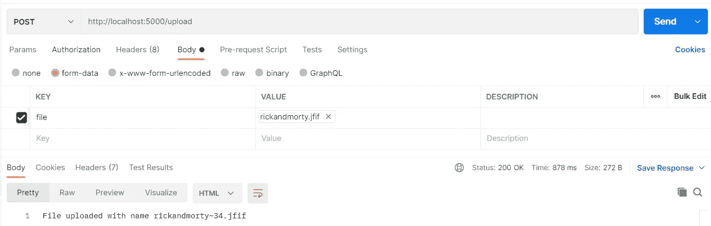

# 在 TypeScript 中为 Multer 创建自己的存储引擎

> 原文：<https://javascript.plainenglish.io/custom-storage-engine-for-multer-in-typescript-613ebd35d61e?source=collection_archive---------2----------------------->


Photo by [Danial Igdery](https://unsplash.com/@ricaros?utm_source=medium&utm_medium=referral) on [Unsplash](https://unsplash.com?utm_source=medium&utm_medium=referral)

在开始制作自己的存储引擎之前，让我们先讨论一下为什么我们需要它，以及它的一些应用。

> 下面是 GitHub repo 的[链接](https://github.com/Aryaman1706/storage-engine-multer),用于下面的教程。

至此，我假设您已经清楚 multer 是什么以及它的用途。这里是对 multer 的“开箱即用”形式的快速介绍

所以基本上 multer 用于解析来自 HTTP 请求的数据，其中
`Content-Type`头设置为`multipart/formdata`。HTTP 请求中的 Content-Type 头描述了网络上共享的资源类型。这些资源需要特殊的中间件来解析并在服务器端应用程序中可用。`application/json, application/x-form-www-urlencoded, text/html`的内容类型头可以通过[主体解析器](https://www.npmjs.com/package/body-parser)解析，但是`multipart/formdata`需要不同的中间件，即 [multer](https://www.npmjs.com/package/multer) 。`mutipart/formdata` Content-Type 意味着除了 JSON 或纯文本数据之外，资源还可能有 Blob 或文件类型字段。没有这些中间件，我们将无法使用用户发送的资源。如果没有这些中间件，我们在 express 应用程序中如此随意使用的`req.body`将总是返回一个空对象。

现在我们对 multer 有了一个合理的想法，让我们讨论一下定制存储引擎的需求，并使用 TypeScript 制作一个。

## Multer 中的存储引擎。

存储引擎基本上是在文件被解析后对其进行处理的类，包括存储、删除和修改原始文件。默认情况下，multer 附带 2 个存储引擎，DiskStorage 和 MemoryStorage。DiskStorage 将文件存储在磁盘上的给定位置，而 MemoryStorage 将文件内容作为缓冲区存储在应用程序的内存中。

## 需要定制存储引擎。

multer 附带的两个存储引擎对于一般情况很有用，但请想一想，您会将大型应用程序的文件存储在服务器的内存或磁盘中，还是宁愿使用 Google Cloud Storage 或 Amazon S3 这样的云存储选项？或者，您可能只想读取文件并将相关数据存储在数据库中，而不是保存整个文件。这就是为什么人们可能需要为 multer 编写自己的存储引擎。

现在，大多数东西可以通过内置的存储引擎本身来实现，但这种解决方案是乏味的，并增加了应用程序的负载。例如，你可能会在磁盘上保存一个文件，然后将其上传到云存储，然后删除该文件，但这就像是左转 3 次而不是右转，可能只有我一个人这样做，但这听起来像是太多的承诺和责任。

## 空谈不值钱，给我看看代码。

希望现在您已经认识到 multer 中自定义存储引擎的重要性和使用案例，并准备好创建自己的存储引擎。我假设您对 TypeScript 有一个很好的想法，所以没有任何进一步的麻烦，让我们直接进入它。在本教程中，我们将制作一个存储引擎，将文件直接上传到 Google 云存储中。

## 项目设置

创建一个文件夹，并在文件夹中运行以下命令来初始化 package.json 和 typescript 配置文件。

```
**$ npm** init --y && **tsc** --init
```

通过简单地编辑`tsconfig.json`来配置您的 typescript 编译器，并按照配置中的指定创建根目录。我将把这个`src`作为我的 rootDir，`lib`作为 outDir。[这里的](https://github.com/Aryaman1706/storage-engine-multer/blob/main/tsconfig.json)是我的`tscconfig.json`。

## 配置存储引擎

现在，在`src`里面添加一个新文件夹“config”和一个新文件“GcsEngine.ts”。存储引擎是具有两个负责操作文件的函数的类，这两个函数是`_handleFile`和`_removeFile`。`_handleFile`负责操作/上传文件。这基本上是沉重的升降机和大部分工作将在这个功能只完成。另一方面`_removeFile`负责删除文件，以防将来出现任何错误。

我们的 CustomStorageEngine 将[实现](https://www.typescriptlang.org/docs/handbook/2/classes.html#implements-clauses) multer 的 StorageEngine 接口。所以基本上 CustomStorageEngine 应该匹配下面给出的`multer.StorageEngine`的类型签名:-

现在，让我们定义我们自己的实现上述接口的类。请记住，我们的类中定义的函数的类型签名也需要与上述类型相匹配。

在继续之前，你应该知道的一件事是，在`_handleFile`函数中，`file`有一个属性`stream`，它是 node.js ReadableStream，这是我们将用来读取上传的文件并进一步处理它。

现在，我们需要定义这个类的一些成员。这些成员将有助于我们的文件处理。那么，让我们看看我们需要什么。
首先，我们需要一种上传`file`的方法，如前所述，我们可以通过`file.stream`访问上传文件的数据，这是一个可读取的流，但是我们要在哪里以及如何将它上传到云存储呢？

为了上传`file`，我们将首先使用云存储桶创建一个文件，然后使用这个在云上新创建的文件，我们将创建一个 node.js WritableStream，此外，我们将通过管道将数据从`file.stream`(一个 ReadableStream)传输到新创建的 WritableStream。迷茫？关于 [Google 云存储](https://cloud.google.com/storage/docs/how-to)、 [Node.js 云存储客户端](https://googleapis.dev/nodejs/storage/latest/)、[节点](https://www.freecodecamp.org/news/node-js-streams-everything-you-need-to-know-c9141306be93/)中可读可写流的详细介绍，请参考这些链接。

所以，现在很明显，我们需要云存储桶来处理文件的上传。但是，我们还需要上传文件的名称，以及创建可写流时所需的一些配置选项，这些选项在[此处](https://googleapis.dev/nodejs/storage/latest/global.html#CreateWriteStreamOptions)可用。好了，废话少说，让我们开始填充我们的自定义类。

## 构造函数

在这里，我们已经完成了我们的类的构造函数，它需要一个类型为`Options`的选项对象(opts)，这包括云存储桶、`bucket` (必需的)、用于创建可写流的选项、`options`(可选的)，以及一个文件命名函数、`nameFn`(可选的)。
`nameFn`会拿请求(request)和文件(Express。Multer.File)作为参数，以便用户可以决定如何构造并返回文件的唯一名称。如果用户不提供自己的命名功能，那么我们将使用`defaultNameFn`。现在让我们开始完成`_handleFile`功能。

## _handleFile 函数

`_handleFile`函数中的回调函数(`cb`)带两个参数，`error`和`info`。这里的`info`是一个对象，包含关于文件的额外信息(在我们的例子中，是 bucket 中文件的名称)，需要添加到文件的元数据中，并通过`req.file/req.files`提供给管道中的下一个请求处理程序。根据 multer 的类型定义。StorageEngine，这个`info`对象必须扩展`Partial<Express.Multer.File>`。
除此之外，在`_handleFile`函数中，我们首先使用`nameFn`为文件获取一个唯一的名称，在桶中创建一个同名的新文件，从该文件获取可写流，并将数据从`file.stream`通过管道传输到`fileWriteStream`，如果出现错误，则关闭可写流并删除文件(如果文件存在)。如果数据写入成功，我们只需在上传文件的元数据中添加一个新字段`name`。

## _removeFile 函数

`_removeFile`函数负责在将来出现错误时删除/移除文件。这个函数将接收到带有我们在`_handleFile`(在我们的例子中是 name)中添加的所有属性的`file`。因此，简单地说，如果在桶中找到了这个文件，我们就用`name = file.name`删除它。

## 正在包装 GcsEngine.ts

最后，我们将导出一个接收类型为`Options`的`opts`的函数，该函数将用于创建并返回我们类的一个新对象。

## 最后，这是我们的定制存储引擎:-

## Express 服务器示例

在`src`中创建一个名为“example”的新文件夹，并将以下代码写入新文件“server.ts”。

## 测试

打开终端，进入“src”中的“example”文件夹，运行以下命令启动服务器:-

```
**$ npx** ts-node server.ts
```

向`http://localhost:5000/upload`发送 post 请求，并在名为“file”的字段中附加一个文件。我正在使用 postman 进行测试，这里有一个相同的快照



## 包扎

就是这样。我们为 multer 做了一个简单的自定义存储引擎，可以直接上传文件到 Google 云存储。这里是包含所有代码的 GitHub repo 的[链接](https://github.com/Aryaman1706/storage-engine-multer)。

> [在这个 repo 中，](https://github.com/Aryaman1706/storage-engine-multer)我添加了一个验证器，在上传文件之前运行，以防止 req.body 无效时不必要的上传。我希望本教程简短而精确，因此我只在回购中做了一点额外的工作。

此外，查看 multer 的官方指南，创建一个定制的存储引擎[在这里](https://github.com/expressjs/multer/blob/master/StorageEngine.md)。

感谢您的阅读。祝您愉快！

*更多内容请看*[*plain English . io*](http://plainenglish.io/)