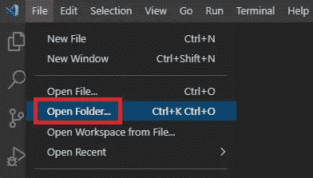
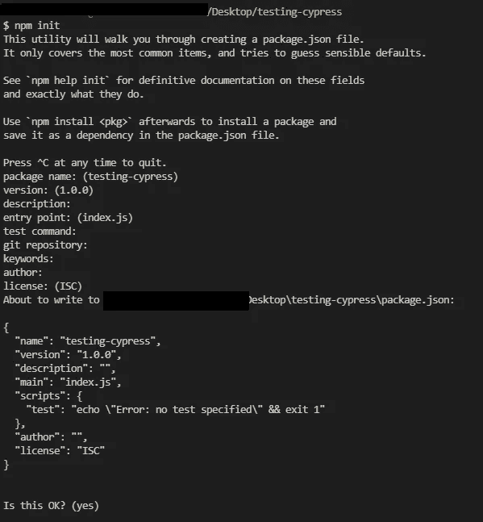
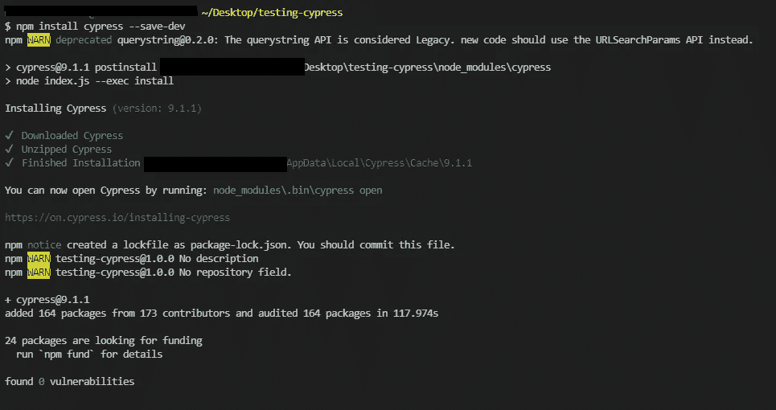
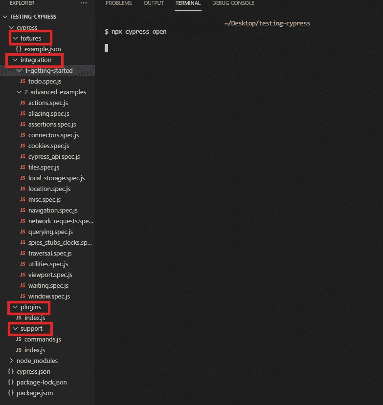
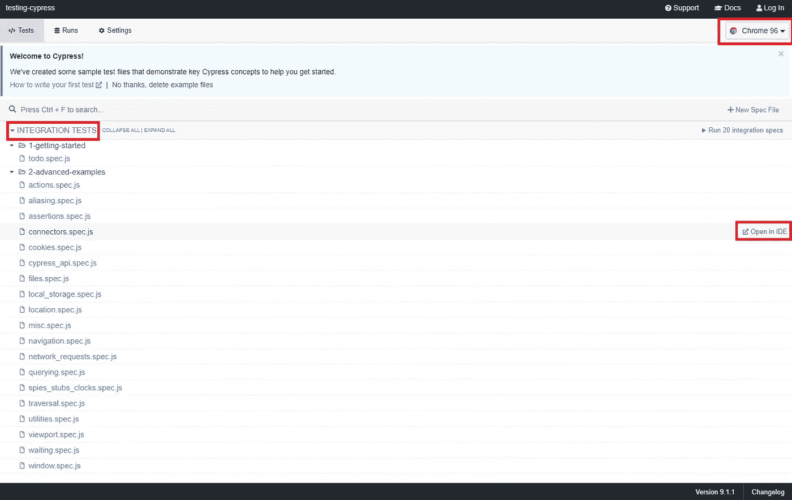
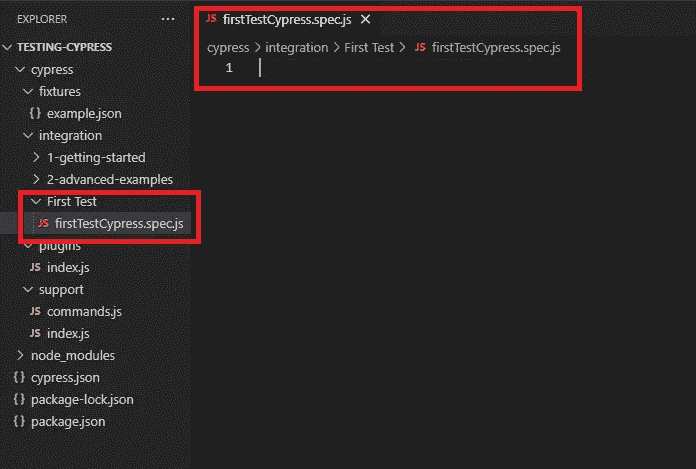
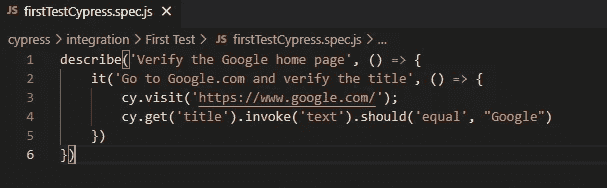
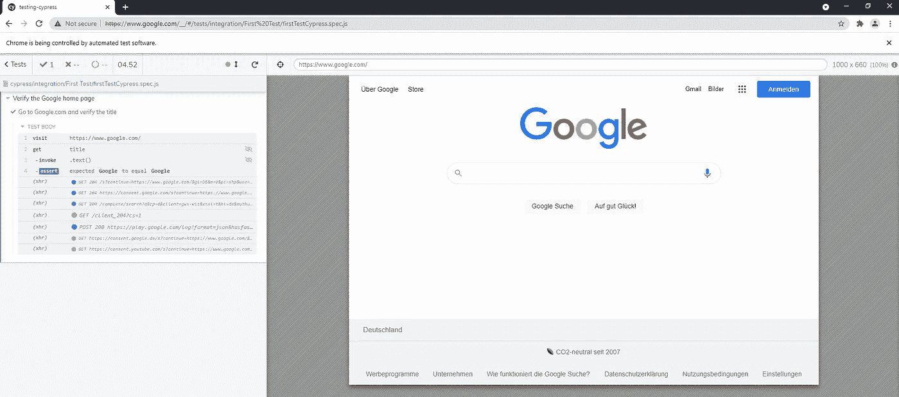

# 从零开始测试自动化的 Cypress

> 原文：<https://javascript.plainenglish.io/cypress-for-test-automation-from-scratch-f468cf3a0b09?source=collection_archive---------4----------------------->


# 柏树是什么？

Cypress 是一个纯粹基于 JavaScript 的前端测试工具，为现代网络而构建。它旨在解决开发人员或 QAs 在测试应用程序时面临的棘手问题。更多信息，请 [**点击这里**](https://www.cypress.io/) **。**

**你可以用 Cypress 编写下面的测试:**

1.  单元测试
2.  集成测试
3.  E2E 测试

## [**你也可以看我的柏树教程**](https://www.youtube.com/watch?v=7ZgIqwPu_n0&list=PLcokO8K_aejblw6s7eECCsQH9GoDqzE9x&ab_channel=Miktad%C3%96zt%C3%BCrk)

Cypress Tutorial by Miktad Ozturk

# 如何从零开始设置 Cypress 进行测试自动化？

让我们从 Cypress 开始自动化。为了开始，用户需要以下先决条件:

1.  [**下载，然后安装 Node.js**](https://nodejs.org/en/download/)
2.  [**下载，然后安装 Visual Studio 代码**](https://code.visualstudio.com/download)

注意:我将使用 Visual Studio 代码 IDE。但是，您可以使用任何 IDE。

## **1。创建空项目文件夹**

导航到所需的位置，并在其中创建一个空文件夹。在这个例子中， **testing-cypress** 是项目文件夹。

## 2.**在 Visual Studio 代码或任何其他 IDE 中打开文件夹**

进入 **Visual Studio 代码菜单** >点击**打开文件夹** >从**打开文件夹向导**中选择已创建的文件夹( **testing-cypress**



Open Folder from Visual Studio Code

## **3。创建 package.json**

让我们在 Visual Studio 代码菜单中创建**package . JSON .**Open**Terminal**，并键入下面的命令:

```
**npm init**
```



Create package.json

## **4。安装柏树**

我们可以通过 npm 安装 cypress 依赖项，将它直接包含在我们的项目中。

```
npm install cypress --save-dev
```



Installation Cypress

## 5.**打开柏窗**

当 Cypress 包被安装后，默认情况下，Cypress 会配置一些文件夹。当 QAs 或开发人员第一次打开 Cypress 时，将在 Cypress 文件夹中创建 4 个文件夹，即插件、支持、集成和设备。

要打开 Cypress 窗口，请使用以下命令之一:

```
node ./node_modules/cypress/bin/cypress open
```

**或**

```
npx cypress open
```



Opened Cypress Windows and displayed 4 Folders



Cypress Window

让我们快速检查一下这些文件夹，为什么需要它们:

*   **Fixtures:** 这个文件夹帮助保存数据文件，比如 **data.json，**这些文件可以在测试脚本中直接读取。
*   **整合:**这是一个重要的文件夹。所有的测试都应该位于这个文件夹中，因为默认情况下，Cypress 假设这是测试文件夹。测试人员可以在其中创建任意数量的子文件夹。
*   **插件:**帮助修改或扩展 Cypress 的内部行为。用户可以扩展这个框架或者自定义这个框架，超出 Cypress 默认提供的内容。
*   **支持:**支持文件夹包含常用文件(可重用代码、全局变量等。)需要在框架内部进行全局访问。

## 6.**创建文件夹和规格文件**

让我们在集成文件夹中创建一个文件夹。让它成为第一次考验。让我们在这个文件夹中创建一个规范文件:



First test with Cypress

## 7.**创建第一个测试**

Cypress 使用 Mocha 语法进行测试，所以它通常包含 describe()和 it()函数

**describe()** :充当 Cypress 中的测试套件
**it():** 充当 Cypress 中的测试用例
在 firstTestCypress.spec.js 中，复制粘贴下面的代码:

```
**describe**('Verify the Google home page', () => {
    **it**('Go to Google.com and verify the title', () => {
        cy.visit('https://www.google.com/');
        cy.get('title').invoke('text').should('equal', "Google");
    })
})
```



## 8.**执行 Cypress 测试**

让我们用 Cypress 执行第一个测试:

```
npx cypress open
```



First test and verified the title

# 定位器的类型

*   **cy . get(<标签名>’)**
*   **cy . get(' #<ID>')**
*   **cy.get('。<类名>’)**
*   **cy.get( '[ <属性名> ]' )**
*   **cy.get( '[class=" <类名> "]' )**
*   **cy . get([<自己创建的属性> = " <属性名>"]"**

# 柏树的优点

*   您可以快速找到失败测试的来源
*   当您对测试进行更改时，Cypress 将自动重启
*   Cypress 结合了功能测试和 API 检查
*   无论出于什么原因，您都不需要在您的测试中添加减速等待命令，Cypress 会自动执行它们
*   你可以在测试过程中自动截图或录像

# 结论:

那些刚接触自动化并且只知道编码基础的人，对他们来说这是一个易于使用的工具。使用 selenium 的测试人员也可以切换这个工具。它显示了脚本执行和浏览器中的错误。甚至它的仪表板也提供了脚本执行的完整报告。

感谢您的阅读！点击查看作者的其他文章:

[](https://medium.com/swlh/software-testing-and-methodologies-1fc519c98fdf) [## 软件测试和方法

### 在我的软件测试系列中，我将尝试讨论为什么测试是必要的，这些测试是如何执行的，如何…

medium.com](https://medium.com/swlh/software-testing-and-methodologies-1fc519c98fdf) [](/how-to-write-software-test-planning-for-successful-projects-f2df2b9412a0) [## 如何为成功的项目编写软件测试计划

### 成功测试过程的第一步是计划项目范围内的测试活动…

javascript.plainenglish.io](/how-to-write-software-test-planning-for-successful-projects-f2df2b9412a0) [](https://medium.com/swlh/software-testing-process-and-levels-of-testing-4274904ce655) [## 软件测试过程和测试级别

### 软件测试过程

medium.com](https://medium.com/swlh/software-testing-process-and-levels-of-testing-4274904ce655) 

另外，你可以订阅我的 YouTube 频道

[](https://www.youtube.com/miktad%C3%B6zt%C3%BCrk) [## 米克塔德·奥兹蒂尔克

### Bilim，Teknoloji，yaz lm ve VLOGüzerine Bir takm al malar。

www.youtube.com](https://www.youtube.com/miktad%C3%B6zt%C3%BCrk) 

# 来源

1.  [https://www.browserstack.com/guide](https://www.browserstack.com/guide)
2.  https://www.cypress.io/

*更多内容看* [***说白了就是***](http://plainenglish.io/) ***。*** *报名参加我们的* [***免费每周简讯点击这里***](http://newsletter.plainenglish.io/) ***。***