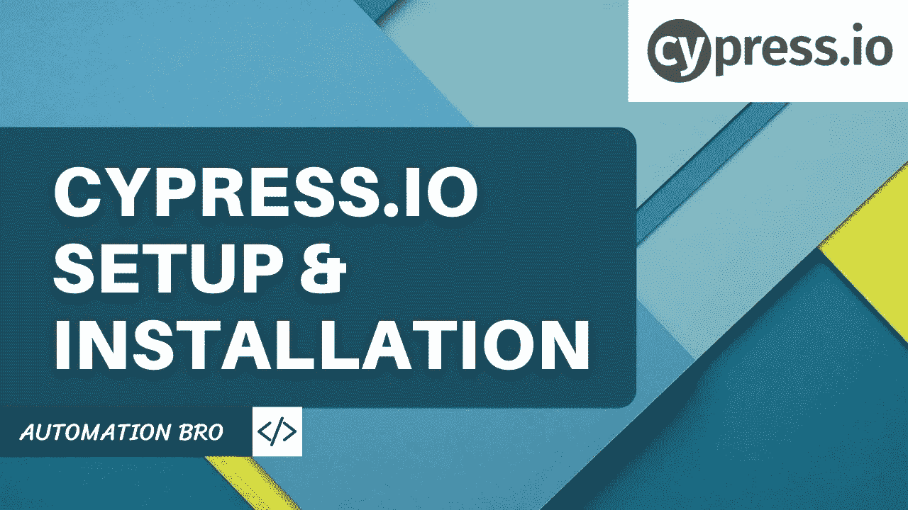

# Cypress 安装和设置

> 原文：<https://javascript.plainenglish.io/cypress-installation-setup-bd952fdbd5f4?source=collection_archive---------4----------------------->

在这个 Cypress 测试教程中，我们将在本地机器上进行设置和安装，以启动和运行 Cypress。
Cypress 的一个伟大之处在于，只需使用一个命令，您就可以安装所有必要的包，开始使用 Cypress 编写您的第一个测试。让我们来看看——

# 装置

要在本地安装 Cypress，您需要完成以下步骤

*   **创建新的 npm 项目:**
    `mkdir your_project_name && cd your_project_name`
    `npm init -y to initialize your project`
*   **装柏:**
    `npm install cypress --save-dev`

这将下载并解压缩 Cypress 桌面客户端，并为您安装所有必需的软件包。

一旦安装了 Cypress，您可以通过运行以下命令打开 Cypress 桌面应用程序

`npx cypress open`

这将为您打开 Cypress 应用程序，并列出所有初始预构建测试——

# 在 Cypress 测试运行程序中运行测试

点击任何一个预先构建的示例测试，它将启动 Cypress 测试运行程序并开始运行所有的测试—

# 柏树文件夹结构

当你安装 Cypress 时，它会自动为你设置文件夹结构

*   **Fixtures** :用于存储测试的所有外部静态数据，即 JSON 数据文件、图像等
*   **集成**:这是你所有测试文件存储的地方
*   **插件**:你可以利用 Cypress 构建的以及社区构建的插件来扩展 Cypress 的功能
*   **支持**:在 Support 文件夹中，您可以存储您的测试可以使用的定制命令
*   Cypress.json :这是默认的配置文件，你可以在其中存储诸如 baseUrl、env、port 等信息

查看下面的视频，了解如何在本地机器上设置和安装 Cypress:

感谢阅读！

*更多内容请看*[***plain English . io***](https://plainenglish.io/)