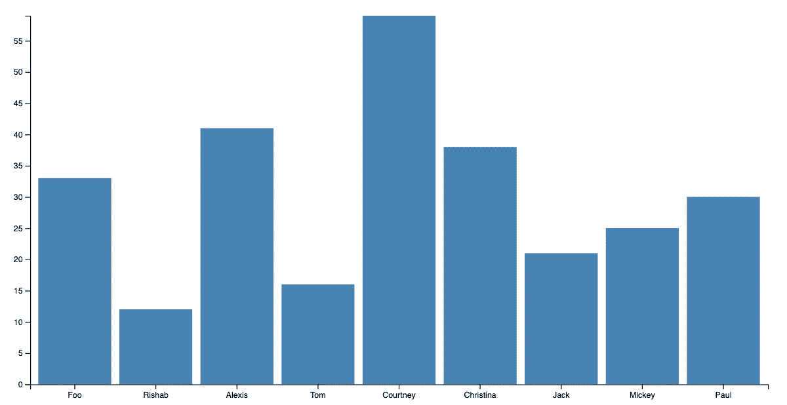

# D3.js 教程:构建您的第一个条形图

> 原文：<https://javascript.plainenglish.io/d3-js-tutorial-build-your-first-bar-chart-40088198320f?source=collection_archive---------9----------------------->


D3.js 是一个 JavaScript 库，使您能够在 web 浏览器中创建**动态数据可视化。它专门以可理解和交互的方式可视化大型数据集。D3.js 库因其核心特性(如 DOM 操作、动态属性和动画)而脱颖而出，成为前端开发人员的最佳数据可视化工具之一**。****

今天，我们将向您展示如何使用 D3.js 构建您的第一个条形图。让我们开始吧！

**我们将介绍**:

*   项目概述
*   初始设置
*   创建数据集
*   设置尺寸和边距
*   追加 SVG 元素
*   收集和格式化数据
*   添加条形
*   后续步骤

# 项目概述

今天，我们将使用 D3.js 构建一个条形图。这是一个伟大的项目，因为它允许您以一种实用的方式**练习您的 D3.js 数据可视化技能**。

条形图是比较不同组之间数据的一种有用且有效的方法。它们**提高可读性**，让你轻松识别数据中的模式或趋势。

D3.js 非常适合数据可视化，原因有很多，比如:

*   **视觉效果**:支持 HTML、CSS 和 SVG，因此不需要新工具
*   **动画**:允许你制作和修改页面元素的动画
*   **所有主流浏览器都支持**:在网络上工作，使视觉效果易于分享和发布
*   **灵活**:与现有的 web 技术配合良好，可以操作 DOM 的任何部分
*   可伸缩的:适用于大型数据集

# 初始设置

在创建条形图之前，我们需要做三件事:

1.  设置文档的页眉和正文
2.  设置 CSS
3.  加载 d3.js 库

它们都可以用下面的代码来完成:

```
<!DOCTYPE html>
<meta charset="utf-8">
<style> /* set the CSS */

.bar { fill: steelblue; }

</style>
<body>

<!-- load the d3.js library -->     
<script src="https://d3js.org/d3.v6.min.js"></script>
<script>
```

在代码的`<style>`部分，我们设置了条形颜色的样式。将样式放在代码的开头是可选的，但是尽早这样做很方便。

# 创建数据集

在开始制作条形图之前，我们需要数据。对于本教程，我们将使用一些来自名为`amounts.csv`的虚构外部 CSV 文件的样本数据。

该文件由一列名称和金额组成:

```
name,amounts
Foo, 33
Rishab, 12
Alexis, 41
Tom, 16
Courtney, 59
Christina, 38
Jack, 21
Mickey, 25
Paul, 30
```

我们将使用这些数据制作一个存储金额值的垂直条形图。

# 设置尺寸和边距

让我们设置将要用于图表和页边距的区域的大小。

```
// Set graph margins and dimensions
var margin = {top: 20, right: 20, bottom: 30, left: 40},
    width = 960 - margin.left - margin.right,
    height = 500 - margin.top - margin.bottom;
```

现在，我们将确定 x 和 y 域的范围:

```
// Set ranges
var x = d3.scaleBand()
          .range([0, width])
          .padding(0.1);
var y = d3.scaleLinear()
          .range([height, 0]);
```

# 追加 SVG 元素

下面的代码选择网页上的`body`,并将一个 SVG 对象附加到它上面。SVG 对象的大小由我们设置的`width`、`height`和`margin`决定:

```
var svg = d3.select("body").append("svg")
    .attr("width", width + margin.left + margin.right)
    .attr("height", height + margin.top + margin.bottom)
  .append("g")
    .attr("transform", 
          "translate(" + margin.left + "," + margin.top + ")")
```

# 收集和格式化数据

是时候将我们的数据加载到脚本体中了。我们将加载我们的 CSV 文件，然后遍历它以确保所有数据都被正确识别:

```
// Get data
d3.csv("amounts.csv").then(function(data) {

  // Format
  data.forEach(function(d) {
    d.amounts = +d.amounts;
  });
```

# 缩放域

在我们添加条形之前，让我们研究一下 x 和 y 数据，以确保它缩放到我们设置的域:

```
// Scale the range of the data in the domains
  x.domain(data.map(function(d) { return d.name; }));
  y.domain([0, d3.max(data, function(d) { return d.amounts; })]);
```

# 添加条形

是时候加杠了！我们编写的代码将创建条形，并将每个条形与一个数据集相关联。

```
// Append rectangles for bar chart
  svg.selectAll(".bar")
      .data(data)
    .enter().append("rect")
      .attr("class", "bar")
      .attr("x", function(d) { return x(d.name); })
      .attr("width", x.bandwidth())
      .attr("y", function(d) { return y(d.amounts); })
      .attr("height", function(d) { return height - y(d.amounts); });
```

我们需要做的最后一件事是添加我们的轴，然后我们可以检查完成的结果。

```
// Add x axis
  svg.append("g")
      .attr("transform", "translate(0," + height + ")")
      .call(d3.axisBottom(x));

  // Add y axis
  svg.append("g")
      .call(d3.axisLeft(y));
```

完整的代码应该是这样的:

```
<!DOCTYPE html>
<meta charset="utf-8">
<style> /* set the CSS */

.bar { fill: steelblue; }

</style>
<body>

<!-- load the d3.js library -->     
<script src="https://d3js.org/d3.v6.min.js"></script>
<script>

// Set graph margins and dimensions
var margin = {top: 20, right: 20, bottom: 30, left: 40},
    width = 960 - margin.left - margin.right,
    height = 500 - margin.top - margin.bottom;

// Set ranges
var x = d3.scaleBand()
          .range([0, width])
          .padding(0.1);
var y = d3.scaleLinear()
          .range([height, 0]);
var svg = d3.select("body").append("svg")
    .attr("width", width + margin.left + margin.right)
    .attr("height", height + margin.top + margin.bottom)
  .append("g")
    .attr("transform", 
          "translate(" + margin.left + "," + margin.top + ")");

// Get data
d3.csv("amounts.csv").then(function(data) {

  // Format data
  data.forEach(function(d) {
    d.amounts = +d.amounts;
  });

  // Scale the range of the data in the domains
  x.domain(data.map(function(d) { return d.name; }));
  y.domain([0, d3.max(data, function(d) { return d.amounts; })]);

  // Append rectangles for bar chart
  svg.selectAll(".bar")
      .data(data)
    .enter().append("rect")
      .attr("class", "bar")
      .attr("x", function(d) { return x(d.name); })
      .attr("width", x.bandwidth())
      .attr("y", function(d) { return y(d.amounts); })
      .attr("height", function(d) { return height - y(d.amounts); });

  // Add x axis
  svg.append("g")
      .attr("transform", "translate(0," + height + ")")
      .call(d3.axisBottom(x));

  // Add y axis
  svg.append("g")
      .call(d3.axisLeft(y));

});

</script>
</body>
```

这是我们完成的条形图:



# 后续步骤

祝贺您迈出 D3.js 数据可视化的第一步！条形图是一种很好的方式，它以一种易于理解且视觉上吸引人的方式来可视化大型数据集。关于 D3.js 库还有很多需要学习的地方，比如:

*   树形图
*   桑基图
*   绘图
*   还有更多

*快乐学习！*

*更多内容请看*[***plain English . io***](http://plainenglish.io)