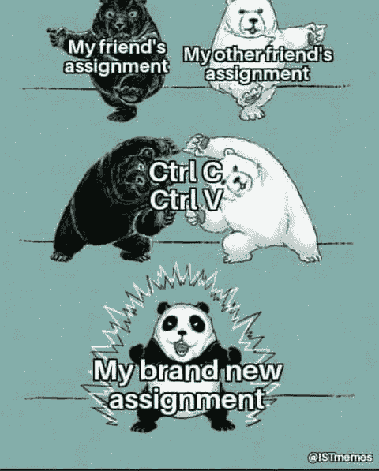
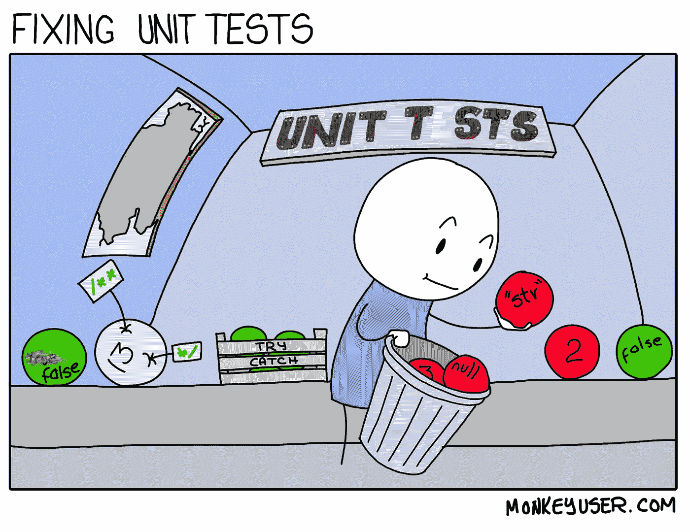
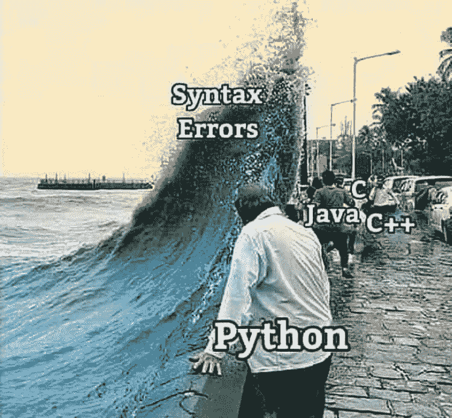
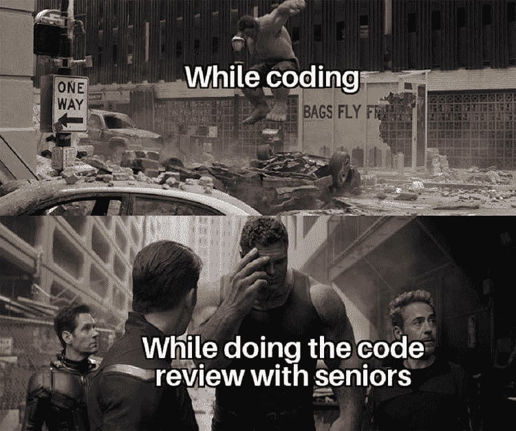

# 日常的编程笑话

> 原文：<https://javascript.plainenglish.io/daily-dose-of-programming-jokes-23033e597df5?source=collection_archive---------3----------------------->

## 程序员的周五动机

## 最佳编程迷因汇编(第八部分)

Photo by [Robert Collins](https://unsplash.com/@robbie36?utm_source=medium&utm_medium=referral) on [Unsplash](https://unsplash.com?utm_source=medium&utm_medium=referral)

***模因和快乐有什么联系吗？*** 如果你是我这种类型的人，那么你可能也爱在下班后查看手机。猜猜我在那里看到了什么？

我主要是在互联网上看到**视频、抖音和模因**。我不知道为什么，但这有助于我提神醒脑，减轻工作压力。这就是为什么我相信 *laugher 是人类最好的刷新按钮。*

在这篇文章中，我收集了一些我喜欢的网络迷因。

# 不要试图问愚蠢的问题…这里的完美答案…

[https://programmerhumor.io/programming-memes/actual-photo-of-the-stackoverflow-hiring-process/](https://programmerhumor.io/programming-memes/actual-photo-of-the-stackoverflow-hiring-process/)

# 哇！新定义…满栈表示我已经满了… LOL

[https://programmerhumor.io/programming-memes/i-love-me-a-good-full-stack-of-pancakes-%f0%9f%a5%9e/](https://programmerhumor.io/programming-memes/i-love-me-a-good-full-stack-of-pancakes-%f0%9f%a5%9e/)

# 我们不知道我们到底想要什么…但我们希望尽快——客户

[https://programmerhumor.io/programming-memes/yes-now/](https://programmerhumor.io/programming-memes/yes-now/)

# 这个图像可以制造很多迷因…让我们用编程一…

[https://programmerhumor.io/programming-memes/legacy-code-comments/](https://programmerhumor.io/programming-memes/legacy-code-comments/)

# 让我们通过添加注释使我的代码更具可读性，哈哈…

[https://programmerhumor.io/programming-memes/more-like-commenting-whole-code/](https://programmerhumor.io/programming-memes/more-like-commenting-whole-code/)

# 我的代码是我做的研究…它是工作，这就够了…

[https://www.facebook.com/photo/?fbid=515368519672176&set=gm.2881890155411868](https://www.facebook.com/photo/?fbid=515368519672176&set=gm.2881890155411868)

# 让我们重构变量名和方法名…这就足够了，因为逻辑可以是相同的

[https://www.facebook.com/photo/?fbid=912219536303209&set=gm.2881823462085204](https://www.facebook.com/photo/?fbid=912219536303209&set=gm.2881823462085204)

# 是啊。我也忘了办公室的衣服…

[https://www.facebook.com/javascriptJS/photos/2204497796354479/](https://www.facebook.com/javascriptJS/photos/2204497796354479/)

# 我爱你，我的朋友…你做得很好…

[https://www.facebook.com/ICT.LK99/photos/a.109557074287643/295998745643474/](https://www.facebook.com/ICT.LK99/photos/a.109557074287643/295998745643474/)

# 周五的一些动力？

[https://www.facebook.com/jokesvala/photos/a.2339158462775928/6317562231602178/](https://www.facebook.com/jokesvala/photos/a.2339158462775928/6317562231602178/)

# 说真的，不知何故这是真的…

[https://www.facebook.com/jokesvala/photos/a.2330223400336101/6283562938335441/](https://www.facebook.com/jokesvala/photos/a.2330223400336101/6283562938335441/)

# 奖励时间:

# 我不需要你…让我放下你，伙计…

[https://www.reddit.com/r/ProgrammerHumor/comments/oo16aa/im_sorry_dear_data/](https://www.reddit.com/r/ProgrammerHumor/comments/oo16aa/im_sorry_dear_data/)

# 不要教我写了什么…哈哈

[https://www.reddit.com/r/ProgrammerHumor/comments/oo4ttu/perplexed_obama/](https://www.reddit.com/r/ProgrammerHumor/comments/oo4ttu/perplexed_obama/)

# 需要经历几个阶段？

[https://www.monkeyuser.com/2017/code-review-stages/?sc=true&dir=random](https://www.monkeyuser.com/2017/code-review-stages/?sc=true&dir=random)

# 我还没想到土豆的这种深层次的激励信息…

[https://www.facebook.com/javascriptJS/photos/a.1387402908063976/2154381918032734/](https://www.facebook.com/javascriptJS/photos/a.1387402908063976/2154381918032734/)

# 乍一看，对我来说是一样的..然后发现括号是如何处理的…太旧了，可能因为我们现在已经格式化了…

[https://www.facebook.com/groups/programming.jokes](https://www.facebook.com/groups/programming.jokes)

# 当我的学长要求编写单元测试时…我相信我的程序也是这样做的…

[https://www.monkeyuser.com/](https://www.monkeyuser.com/)

# 语法错误，我们这里不这样做… python

Source:[https://www.facebook.com/programminggeeks.in](https://www.facebook.com/programminggeeks.in)

# 当你想象编程术语在我脑海中的样子…

[https://www.monkeyuser.com/](https://www.monkeyuser.com/)

# 可能需要两者的同等比例来平衡行业…

[https://www.facebook.com/techindustan/](https://www.facebook.com/techindustan/)

# 电影(三个白痴)中关于工资的一段很好的对话，非常适合软件行业…

[https://www.thecoderpedia.com/blog/programming-memes](https://www.thecoderpedia.com/blog/programming-memes)

# 谁能定义什么是最好的开发者？对我来说，大概是这样的…

[https://www.monkeyuser.com/](https://www.monkeyuser.com/)

# 当你和很多人打交道时…一切都是公平的…甚至谎言也是…哈哈

[https://www.facebook.com/javascriptJS/photos/a.1387402908063976/2150614578409468/](https://www.facebook.com/javascriptJS/photos/a.1387402908063976/2150614578409468/)

# 最糟糕的时刻是当你的学长要求一起审查我的代码，因为他什么也不懂…

[https://www.facebook.com/ProgrammersCreateLife](https://www.facebook.com/ProgrammersCreateLife)

# 进一步阅读

 [## 日常的编程笑话

### 最佳编程迷因汇编(第 4 部分)

javascript.plainenglish.io](/daily-dose-of-programming-jokes-6541eba98194)  [## 2021 年最佳编程幽默汇编

### 编程迷因可以减轻你的压力

blog.devgenius.io](https://blog.devgenius.io/best-programming-humor-compilations-2021-623473bfb0d)  [## 有趣的编程迷因会让你笑死

### 编笑话来点亮你的周五

blog.devgenius.io](https://blog.devgenius.io/funny-programming-memes-that-will-make-you-die-laughing-1ccd8e139040)  [## 编程迷因和幸福之间的联系

### 2021 年最佳编程迷因汇编

blog.devgenius.io](https://blog.devgenius.io/the-connection-between-programming-memes-and-happiness-d768ab85b83d)  [## 10 个能让你心情轻松的最佳编程笑话

### 你读过的关于编程迷因 2021 的最不可思议的文章

medium.com](https://medium.com/geekculture/10-best-programming-jokes-to-lighten-up-your-mood-8870dab2bff7)  [## 日常的编程笑话

### 最佳编程迷因汇编(第 1 部分)

javascript.plainenglish.io](/daily-dose-of-programming-jokes-cb9b74fcfa2e) 

*更多内容看*[***plain English . io***](http://plainenglish.io/)