# 日常的编程笑话

> 原文：<https://javascript.plainenglish.io/daily-dose-of-programming-jokes-44c294d10b93?source=collection_archive---------12----------------------->

## 日常节目幽默

## 最佳编程迷因汇编(第六部分)

Photo by [Juan Encalada](https://unsplash.com/@juanencalada?utm_source=medium&utm_medium=referral) on [Unsplash](https://unsplash.com?utm_source=medium&utm_medium=referral)

***模因和快乐有什么联系吗？*** 如果你是我这种类型的人，那么你可能也爱在下班后查看手机。猜猜我在那里看到了什么？

我主要是在互联网上看到**视频、抖音和模因**。我不知道为什么，但这有助于我提神醒脑，减轻工作压力。这就是为什么我相信 *laugher 是人类最好的刷新按钮。*

在这篇文章中，我收集了一些我喜欢的网络迷因。

# 最喜欢的诗？让我们做一个迷因。英雄联盟

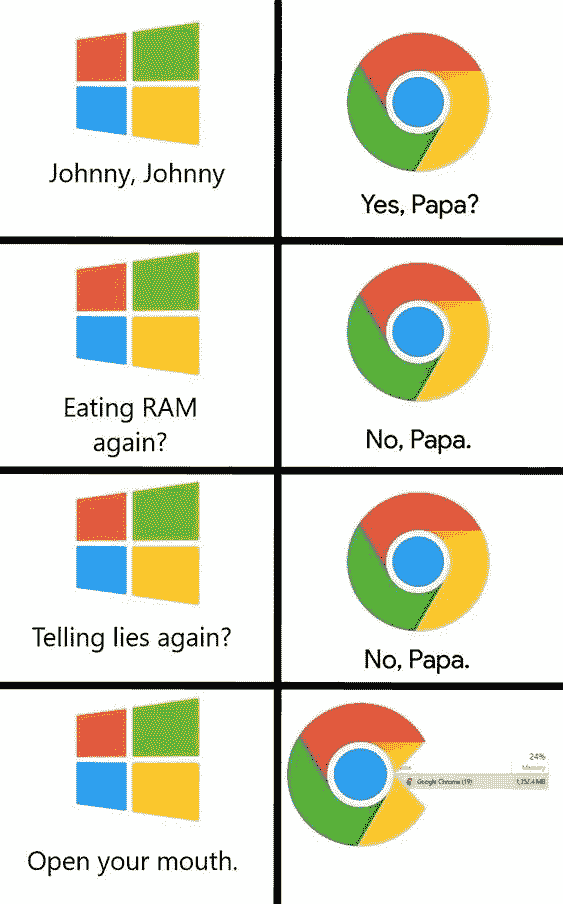

[https://www.reddit.com/r/ProgrammerHumor/comments/ooi4ov/haha/](https://www.reddit.com/r/ProgrammerHumor/comments/ooi4ov/haha/)

# 我可以做任何事…我喜欢在压力下工作…等等…

[https://www.reddit.com/r/ProgrammerHumor/comments/oorx87/halp/](https://www.reddit.com/r/ProgrammerHumor/comments/oorx87/halp/)

# 让我们完成这个简单的问题，不会花太多时间…

[https://www.reddit.com/r/ProgrammerHumor/comments/oog2m0/in_and_out_20_minute_adventure/](https://www.reddit.com/r/ProgrammerHumor/comments/oog2m0/in_and_out_20_minute_adventure/)

# 选谁？如此多的选择…

[https://www.reddit.com/r/ProgrammerHumor/comments/oorx87/halp/](https://www.reddit.com/r/ProgrammerHumor/comments/oorx87/halp/)

# 我知道怎么解决问题..因为我知道如何搜索…

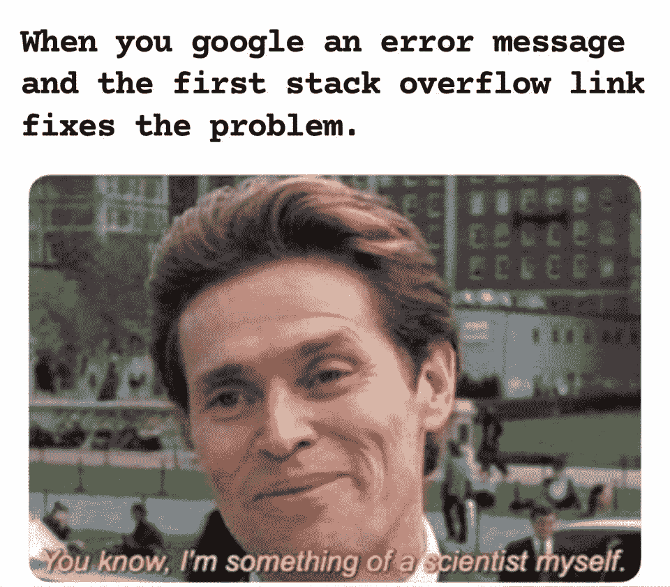

[https://www.reddit.com/r/ProgrammerHumor/comments/ooiodh/my_job_in_a_nutshell/](https://www.reddit.com/r/ProgrammerHumor/comments/ooiodh/my_job_in_a_nutshell/)

# 让我们一步一步来解决这个问题

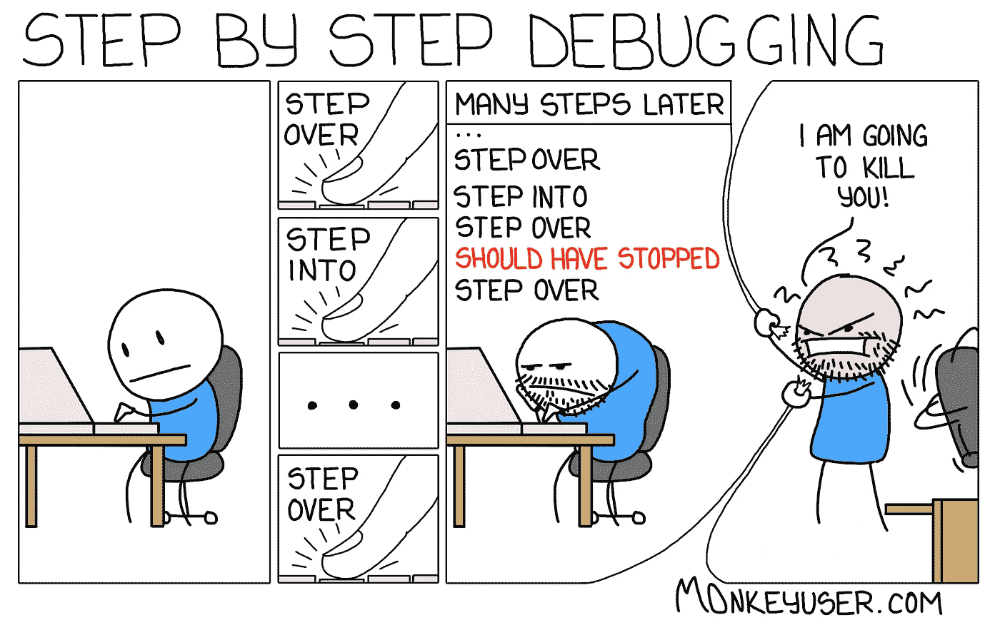

[https://www.monkeyuser.com/2017/step-by-step-debugging/?sc=true&dir=random](https://www.monkeyuser.com/2017/step-by-step-debugging/?sc=true&dir=random)

# 为什么代码中有这么多问题？因为你不听我们的…

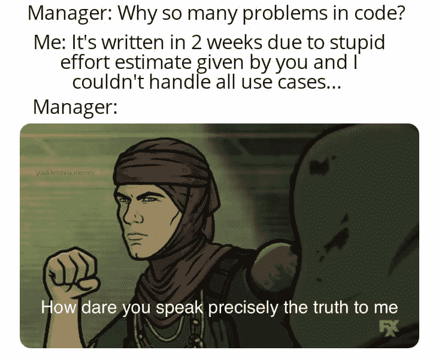

[https://www.facebook.com/yuva.krishna.memes/photos/a.105527467815845/376691704032752/](https://www.facebook.com/yuva.krishna.memes/photos/a.105527467815845/376691704032752/)

# 一旦你发出通知..没人关心你…

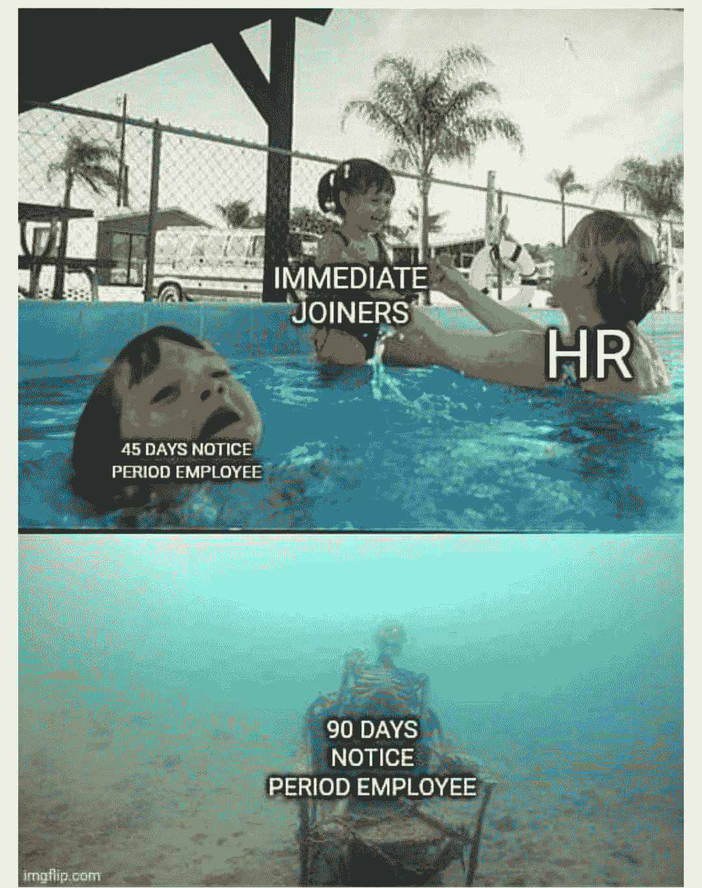

[https://www.facebook.com/MyTechUpdatez/photos/a.1538993499579197/2517427421735795/](https://www.facebook.com/MyTechUpdatez/photos/a.1538993499579197/2517427421735795/)

# 为什么介绍得太多了？

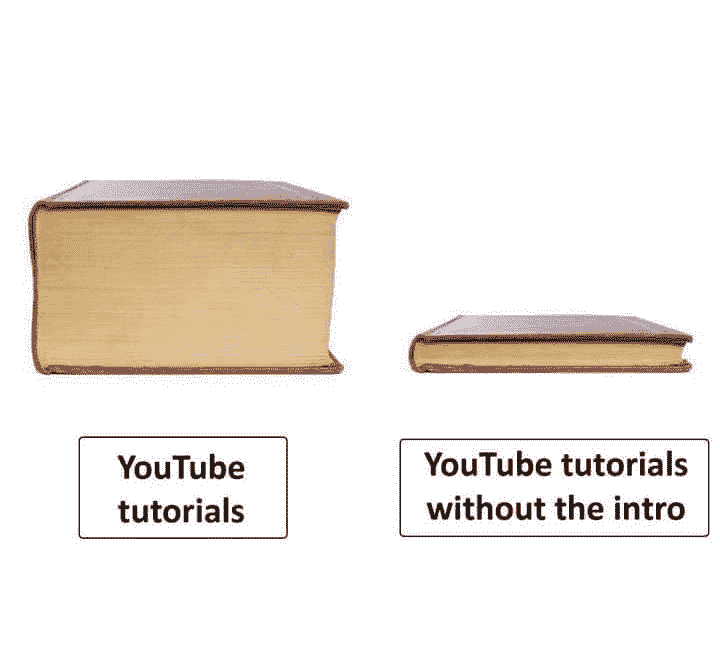

[https://www.facebook.com/photo/?fbid=884349669091127&set=gm.6440648632627533](https://www.facebook.com/photo/?fbid=884349669091127&set=gm.6440648632627533)

# 奖金时间

# 展示自己的作品总是更好… LOL

[https://www.facebook.com/DZoneInc/photos/a.336758034711/10159513354989712](https://www.facebook.com/DZoneInc/photos/a.336758034711/10159513354989712)

# 发生了很多次…我总是去不同的页面…

[https://www.facebook.com/DZoneInc/photos/a.336758034711/10159513354989712](https://www.facebook.com/DZoneInc/photos/a.336758034711/10159513354989712)

# 为什么编译器不够智能，无法自动修复所有问题？

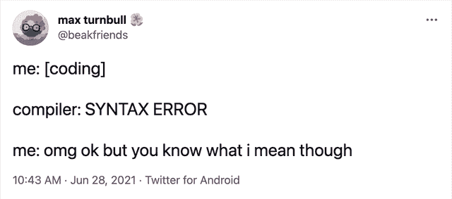

[https://www.facebook.com/DZoneInc/photos/a.336758034711/10159505422369712/](https://www.facebook.com/DZoneInc/photos/a.336758034711/10159505422369712/)

# 看起来很管用…那应该够了…哈哈…

[https://www.facebook.com/DZoneInc/photos/a.336758034711/10159501229644712/](https://www.facebook.com/DZoneInc/photos/a.336758034711/10159501229644712/)

# 我们周一继续吧…

[https://www.facebook.com/photo?fbid=2965577677092733&set=gm.2875612219372995](https://www.facebook.com/photo?fbid=2965577677092733&set=gm.2875612219372995)

# 时间是可以定义的，程序员

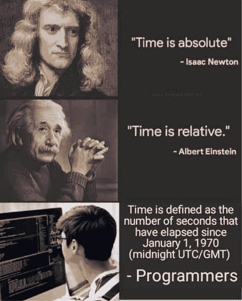

[https://www.facebook.com/photo?fbid=352070916544458&set=gm.2875632262704324](https://www.facebook.com/photo?fbid=352070916544458&set=gm.2875632262704324)

# 你身后藏着可怕的东西…

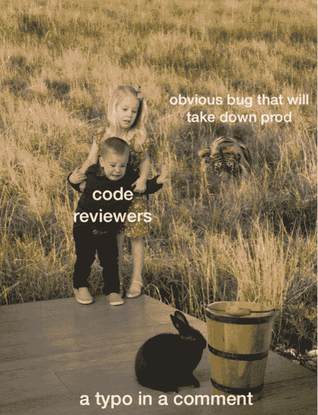

[https://www.facebook.com/DZoneInc/photos/10159479172079712](https://www.facebook.com/DZoneInc/photos/10159479172079712)

# 那种和平是无法想象的…

[https://www.facebook.com/javascriptJS/photos/a.1387402908063976/2251831714954420/](https://www.facebook.com/javascriptJS/photos/a.1387402908063976/2251831714954420/)

# 在家工作…饼图…老实说，不是真的…

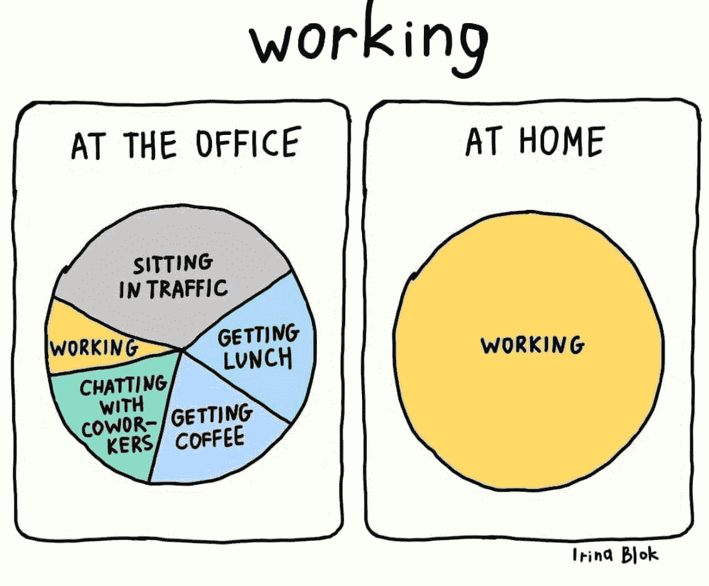

[https://www.facebook.com/yuva.krishna.memes](https://www.facebook.com/yuva.krishna.memes)

# 开发与质量保证版本…

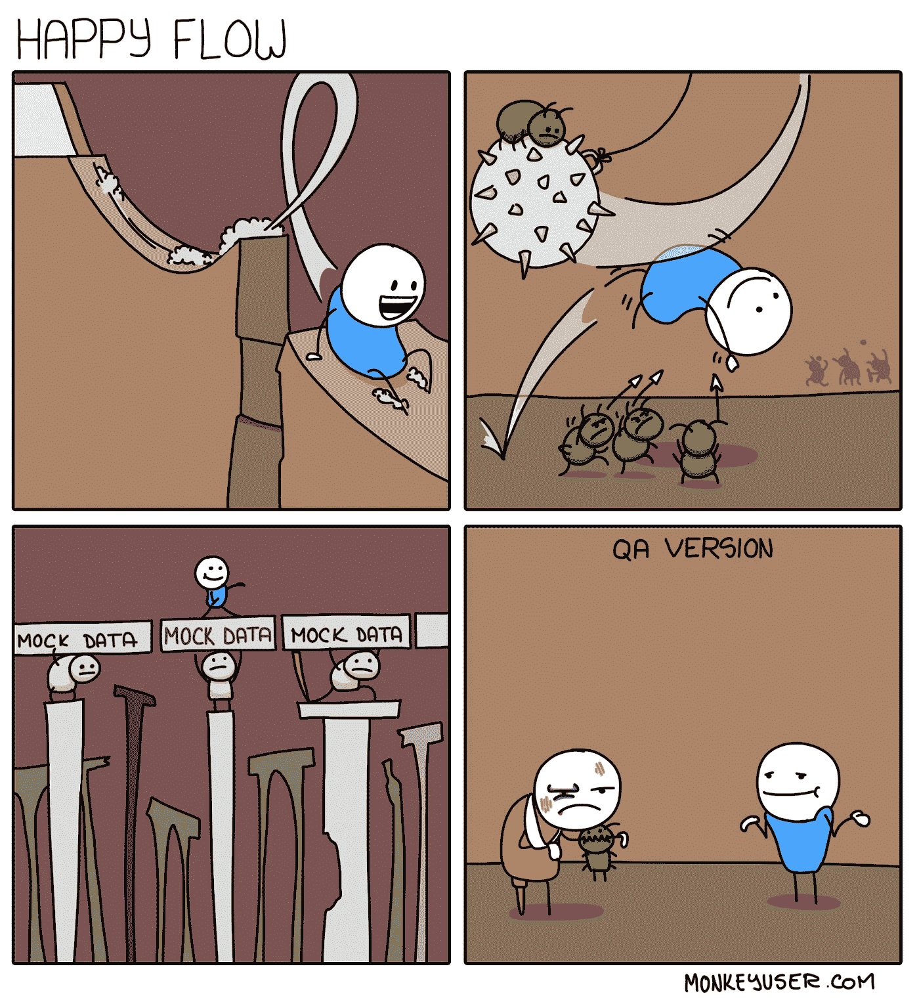

[https://www.monkeyuser.com/2018/happy-flow/?sc=true&dir=random](https://www.monkeyuser.com/2018/happy-flow/?sc=true&dir=random)

# 当任务管理器有责任关闭没有响应的东西时…

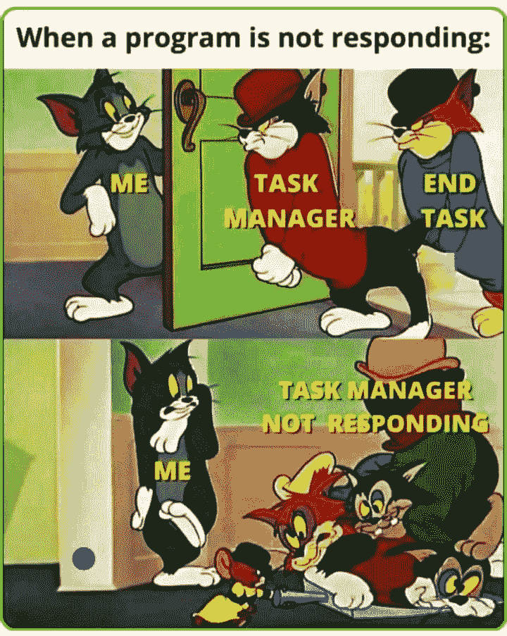

[https://www.facebook.com/photo?fbid=10159630257979673&set=gm.2870233513227290](https://www.facebook.com/photo?fbid=10159630257979673&set=gm.2870233513227290)

# 奖金时间

# 你喜欢幸运饼干吗？如果你收到这个，作为一个开发者你的反应是什么？

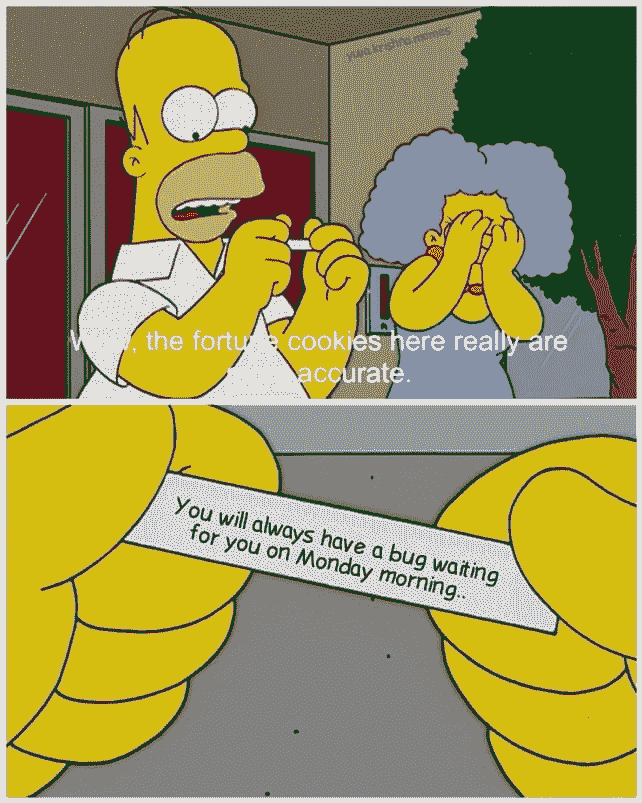

[https://www.facebook.com/yuva.krishna.memes](https://www.facebook.com/yuva.krishna.memes)

# 我也有同样的感觉…当我很少用纸和笔写字的时候…

[https://www.facebook.com/yuva.krishna.memes](https://www.facebook.com/yuva.krishna.memes)

# 我不在乎，我知道这是一种不好的态度，但让我享受这种感觉…

[https://www.facebook.com/yuva.krishna.memes](https://www.facebook.com/yuva.krishna.memes)

# 一切皆有可能..不管怎样，你都可以得到结果。

[https://www.facebook.com/yuva.krishna.memes](https://www.facebook.com/yuva.krishna.memes)

# 让我们来看看 Div 的虚拟世界…在我改变位置进行适当调整后，他们看起来是怎样的…

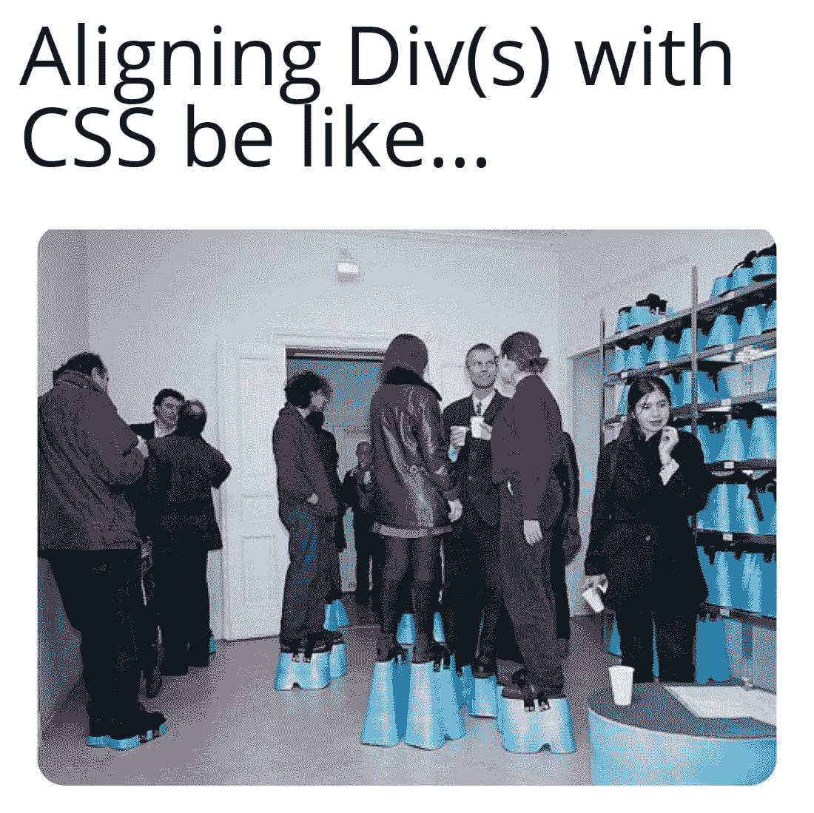

[https://www.facebook.com/yuva.krishna.memes](https://www.facebook.com/yuva.krishna.memes)

# 当我在代码中发现一个问题时，最常见的事情发生了…

[https://www.monkeyuser.com/](https://www.monkeyuser.com/)

# 下次我会试着写正确的代码…让我们今天就发出请求吧…

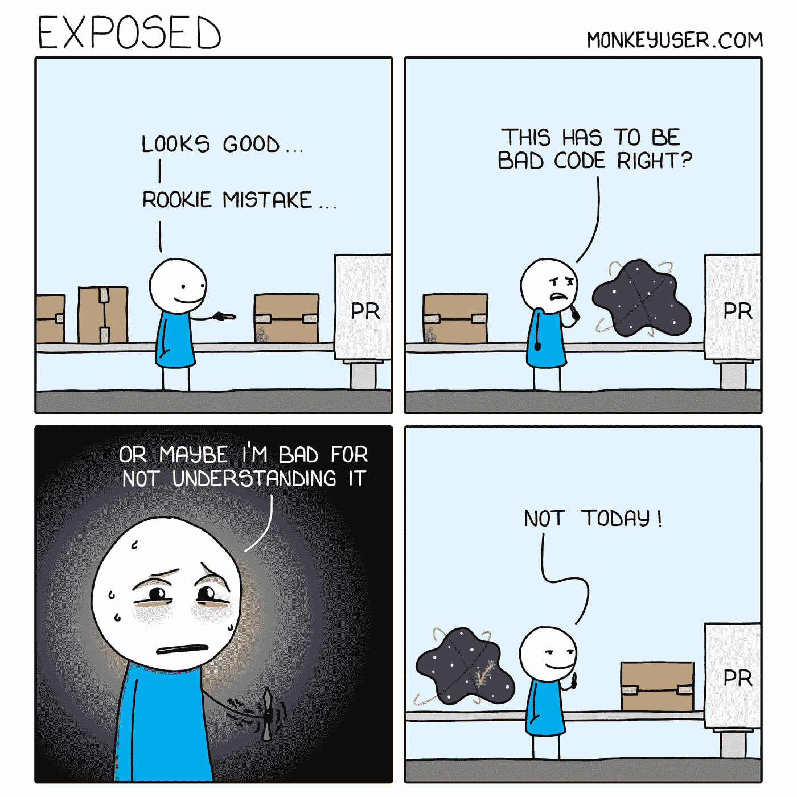

[https://www.monkeyuser.com/](https://www.monkeyuser.com/)

## 不需要信任…我知道你总是对的…

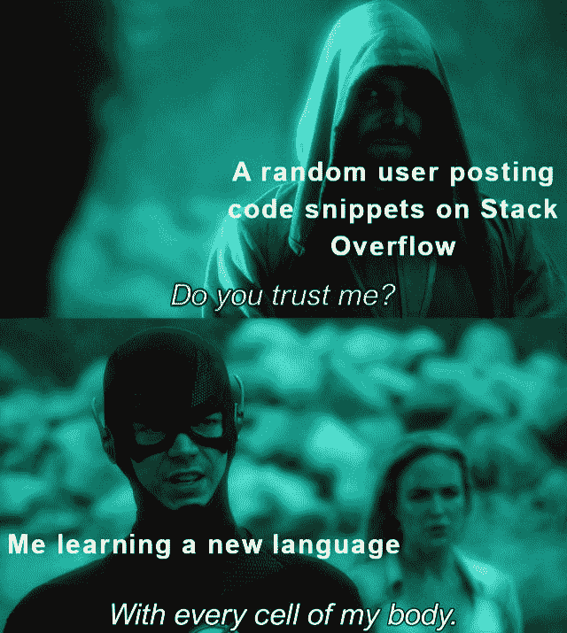

## 发生了很多…问了一个非常愚蠢的问题，但专家很乐意提供详细的答案…

## 耶！最好这样做，否则，你会因为重复的问题标志而失去一些分数…

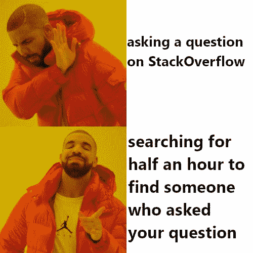

## 当一个人经历一些事情时，心跳会加快…

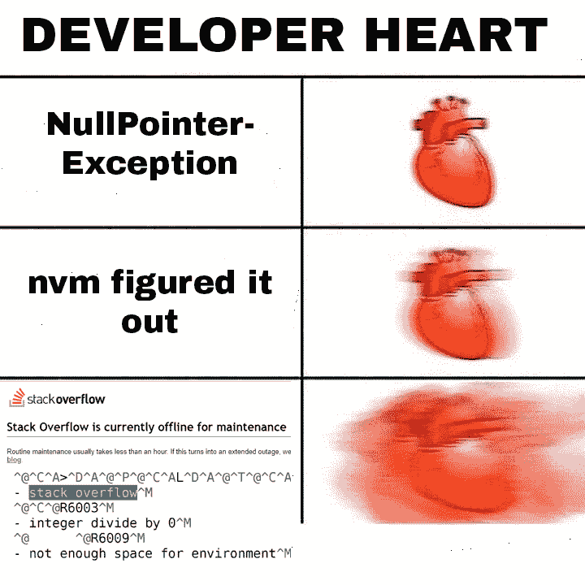

## 绝对需要一个每天早晚都能给我袖手旁观的人…

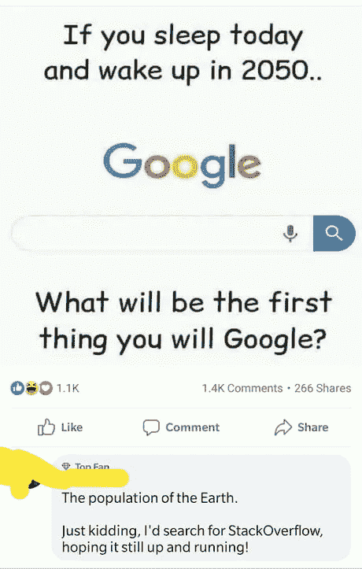

## 我的代码依赖于你伙计…

## 我的代码统计…

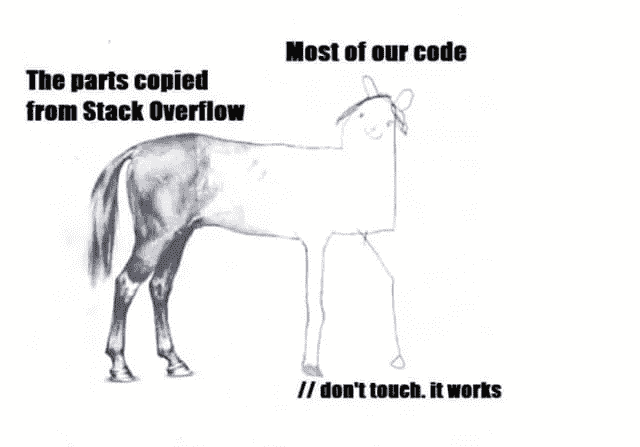

## 当我们得到一个负分时，最糟糕的噩梦…

## 有趣的内部机制。但是专家总是英雄…

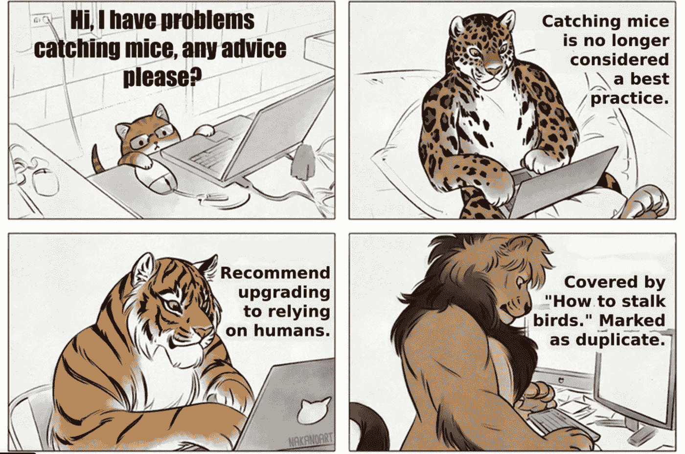

## 有时候…

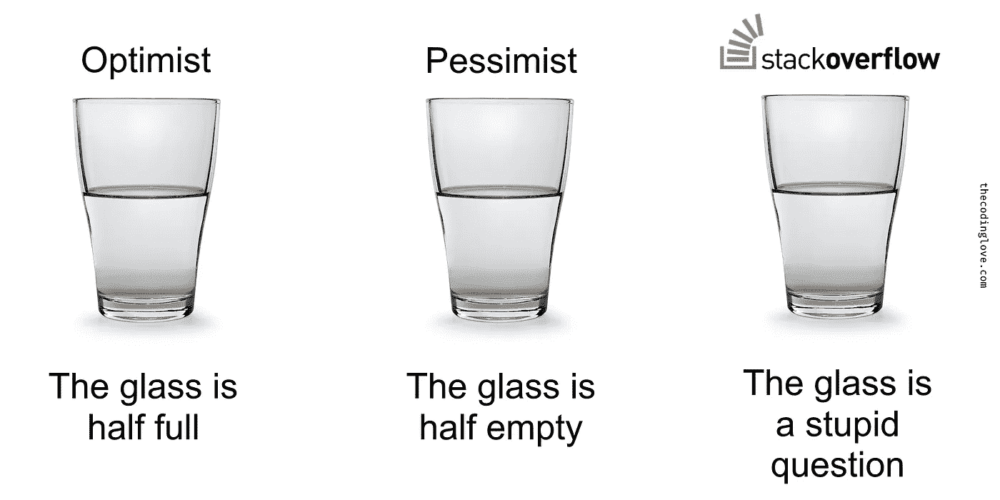

# 进一步阅读

 [## 日常的编程笑话

### 最佳编程迷因汇编(第 4 部分)

javascript.plainenglish.io](/daily-dose-of-programming-jokes-6541eba98194)  [## 11 个让你笑死的编程笑话

### 2021 年最佳编程迷因

javascript.plainenglish.io](/11-programming-jokes-that-will-make-you-die-laughing-df41d5547f11)  [## 2021 年最佳编程幽默汇编

### 编程迷因可以减轻你的压力

blog.devgenius.io](https://blog.devgenius.io/best-programming-humor-compilations-2021-623473bfb0d)  [## 有趣的编程迷因会让你笑死

### 编笑话来点亮你的周五

blog.devgenius.io](https://blog.devgenius.io/funny-programming-memes-that-will-make-you-die-laughing-1ccd8e139040)  [## 编程迷因和幸福之间的联系

### 2021 年最佳编程迷因汇编

blog.devgenius.io](https://blog.devgenius.io/the-connection-between-programming-memes-and-happiness-d768ab85b83d)  [## 10 个能让你心情轻松的最佳编程笑话

### 你读过的关于编程迷因 2021 的最不可思议的文章

medium.com](https://medium.com/geekculture/10-best-programming-jokes-to-lighten-up-your-mood-8870dab2bff7)  [## 日常的编程笑话

### 最佳编程迷因汇编(第 1 部分)

javascript.plainenglish.io](/daily-dose-of-programming-jokes-cb9b74fcfa2e) 

*更多内容看*[***plain English . io***](http://plainenglish.io/)