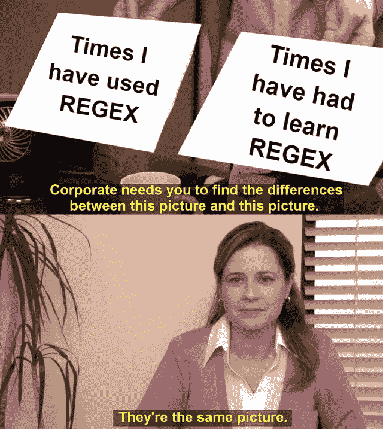
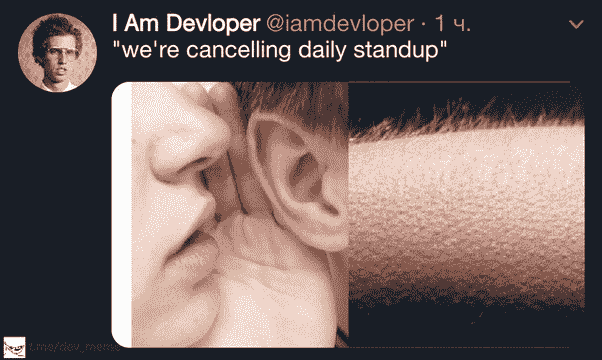
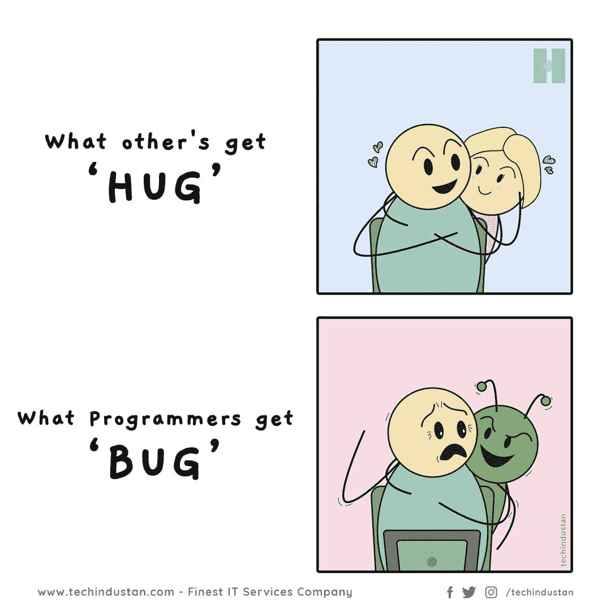
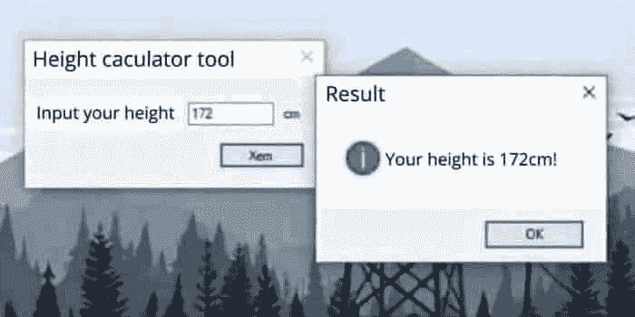
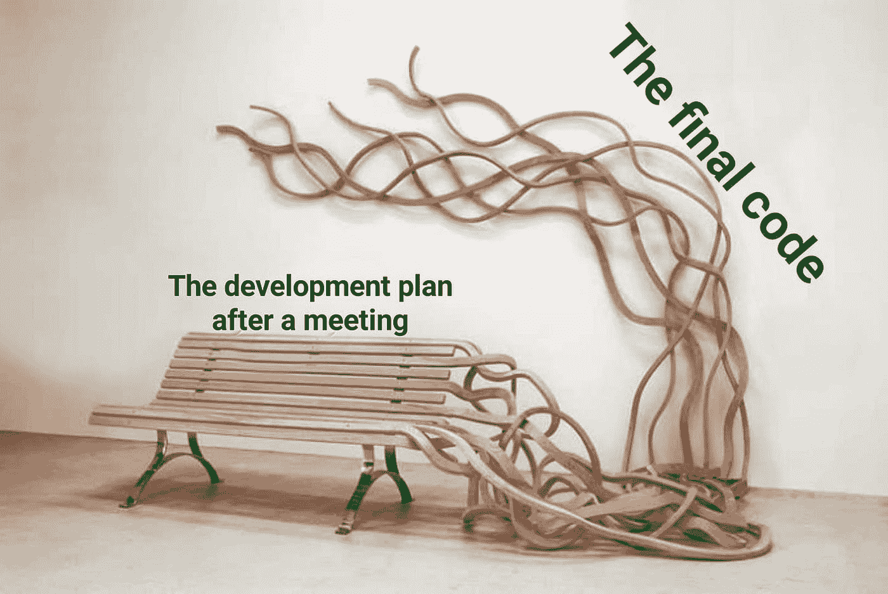

# 每日节目笑话剂量

> 原文：<https://javascript.plainenglish.io/daily-dose-of-programming-jokes-4bf75727f36d?source=collection_archive---------7----------------------->

## 日常节目幽默

## 最佳编程模因汇编(第七部分)

Photo by [Edward Cisneros](https://unsplash.com/@everythingcaptured?utm_source=medium&utm_medium=referral) on [Unsplash](https://unsplash.com?utm_source=medium&utm_medium=referral)

***模因与幸福有什么联系吗？*** 如果你是我喜欢的类型，那么你也可以在工作结束后检查你的手机。猜猜我在那边看到了什么？

我主要看 T4 视频、抖音和网络上发布的迷因。我不知道为什么，但它有助于**提神和减少工作压力**。这就是为什么我相信*笑是人类最好的刷新按钮。*

在这篇文章中，我汇编了一些我在网上喜欢的模因。

# 新员工根据市场获得工资，老员工根据市场获得加薪？？？

[https://www.monkeyuser.com/2020/new-hire/?sc=true&dir=random](https://www.monkeyuser.com/2020/new-hire/?sc=true&dir=random)

# 它直接进入我的大脑…

[https://www.facebook.com/photo/?fbid=319001836626514&set=gm.2881565295444354](https://www.facebook.com/photo/?fbid=319001836626514&set=gm.2881565295444354)

# 我需要问谁帮助了我…哈哈

[https://www.facebook.com/yuva.krishna.memes/photos/a.105527467815845/376844277350828/](https://www.facebook.com/yuva.krishna.memes/photos/a.105527467815845/376844277350828/)

# 从哪里开始？

[https://www.facebook.com/javascriptJS/photos/a.1387402908063976/2261895900614668/](https://www.facebook.com/javascriptJS/photos/a.1387402908063976/2261895900614668/)

# 在家工作或学习时，您可以考虑哪些交通方式？

[https://www.facebook.com/adultswholovecartoons/photos/a.105042201224485/361407612254608/](https://www.facebook.com/adultswholovecartoons/photos/a.105042201224485/361407612254608/)

# 现在让我们评论一下..我们稍后会修复它…

[https://www.facebook.com/jokesvala/photos/a.2330223400336101/6283557961669272/](https://www.facebook.com/jokesvala/photos/a.2330223400336101/6283557961669272/)

# REGEX 可以在网上找到…老实说，还没有尝试学习这个东西…

[https://www.facebook.com/DZoneInc/photos/10159094540494712](https://www.facebook.com/DZoneInc/photos/10159094540494712)

# 所以编程让你有所防备或者成为一名警卫？

[https://www.facebook.com/Coding000/photos/a.100326075349488/210613724320722/](https://www.facebook.com/Coding000/photos/a.100326075349488/210613724320722/)

# 她的眼睛诉说着一切…

[https://www.facebook.com/yuva.krishna.memes/photos/a.105527467815845/376834894018433/](https://www.facebook.com/yuva.krishna.memes/photos/a.105527467815845/376834894018433/)

# 测试人员无论如何都能发现臭虫…即使它是有效的或无效的…

[https://www.facebook.com/javascriptJS/photos/2210011465803112](https://www.facebook.com/javascriptJS/photos/2210011465803112)

# 为什么有人要问信息技术人员？他们应该叫医生…

[https://www.facebook.com/photo/?fbid=10159583001913436&set=gm.6450394781652918](https://www.facebook.com/photo/?fbid=10159583001913436&set=gm.6450394781652918)

# 你的地址是什么？让我们看看您的信息技术幽默……

[https://www.facebook.com/techwithcodex/photos/a.137007467972178/333269081679348/](https://www.facebook.com/techwithcodex/photos/a.137007467972178/333269081679348/)

# 奖励时间

# 当我开始为我的代码编写文档时..我感觉完全一样…

[https://www.facebook.com/programmemer](https://www.facebook.com/programmemer)

# 当我看到一些软件的免费试用，当我点击它时…他们问的第一件事是信用卡…

[https://www.facebook.com/ProgrammersCreateLife](https://www.facebook.com/ProgrammersCreateLife)

# 我应该推它吗？让我想想…嗯…嗯..耶！让我们开始吧…天哪…我做了什么？

[https://www.monkeyuser.com/](https://www.monkeyuser.com/)

# 当我的单口相声被取消时，我会有一种感觉……你有这种感觉吗？

[https://www.quora.com/What-are-some-of-the-best-programmer-jokes-and-memes-out-there](https://www.quora.com/What-are-some-of-the-best-programmer-jokes-and-memes-out-there)

# 这个是给单身我的..当我期待拥抱并得到臭虫…哈哈

[https://www.facebook.com/techindustan/](https://www.facebook.com/techindustan/)

# 这棵树应该结出所有的果实…因为它已经长满了果实…

[https://www.facebook.com/programminggeeks.in](https://www.facebook.com/programminggeeks.in)

# 您想修复 BUG 吗？开始重构…注意:这个并不像它看起来的那样有效:)

[https://www.monkeyuser.com/](https://www.monkeyuser.com/)

# 当我的老师要求我创建一个 VB 项目时…让我们通过输入你的身高来创建一个身高计算器…

[https://www.facebook.com/JokesTechnical](https://www.facebook.com/JokesTechnical)

# 它发生在我错过函数调用的大部分时间…

[https://www.facebook.com/javascriptJS/photos/a.1387402908063976/2193489080788684/](https://www.facebook.com/javascriptJS/photos/a.1387402908063976/2193489080788684/)

# 每个人都有不同的时间表。这和我小时候有关。哈哈，不是第一个，我是第二个…

[https://www.facebook.com/javascriptJS/photos/1573164949487770](https://www.facebook.com/javascriptJS/photos/1573164949487770)

# 有一个普遍的规则..无论您计划的是什么，看起来都和实际的实现不一样。

[https://www.facebook.com/photo/?fbid=10224400678155314&set=g.1803773613206624](https://www.facebook.com/photo/?fbid=10224400678155314&set=g.1803773613206624)

# 哈哈…在有严格的开发模式之前..这是我的代码的内部状态..当一个新的变量连接未使用的变量时…

[https://www.facebook.com/photo?fbid=899897387465482&set=gm.2799768736940435](https://www.facebook.com/photo?fbid=899897387465482&set=gm.2799768736940435)

# 作为初级开发人员，我学到的第一件事是..不要触摸工作正常的东西..它可以增加复述的努力，也可以打破其他东西…

[https://www.facebook.com/javascriptJS/photos/1861659490638313](https://www.facebook.com/javascriptJS/photos/1861659490638313)

# 进一步阅读

 [## 每日节目笑话剂量

### 最佳编程模因汇编(4)

javascript.plainenglish.io](/daily-dose-of-programming-jokes-6541eba98194)  [## 11 个会让你笑死的编程笑话

### 2021 年最佳节目迷因

javascript.plainenglish.io](/11-programming-jokes-that-will-make-you-die-laughing-df41d5547f11)  [## 2021 年最佳节目幽默汇编

### 可以缓解你压力的编程迷因

blog.devgenius.io](https://blog.devgenius.io/best-programming-humor-compilations-2021-623473bfb0d)  [## 有趣的编程迷因，会让你笑死

### 编笑话来点亮你的星期五

blog.devgenius.io](https://blog.devgenius.io/funny-programming-memes-that-will-make-you-die-laughing-1ccd8e139040)  [## 编程模因与幸福的联系

### 2021 年最佳编程迷因汇编

blog.devgenius.io](https://blog.devgenius.io/the-connection-between-programming-memes-and-happiness-d768ab85b83d)  [## 10 个能让你心情轻松的最佳编程笑话

### 你读过的关于编程迷因 2021 的最不可思议的文章

medium.com](https://medium.com/geekculture/10-best-programming-jokes-to-lighten-up-your-mood-8870dab2bff7)  [## 日常的编程笑话

### 最佳编程迷因汇编(第 1 部分)

javascript.plainenglish.io](/daily-dose-of-programming-jokes-cb9b74fcfa2e) 

*更多内容看*[***plain English . io***](http://plainenglish.io/)