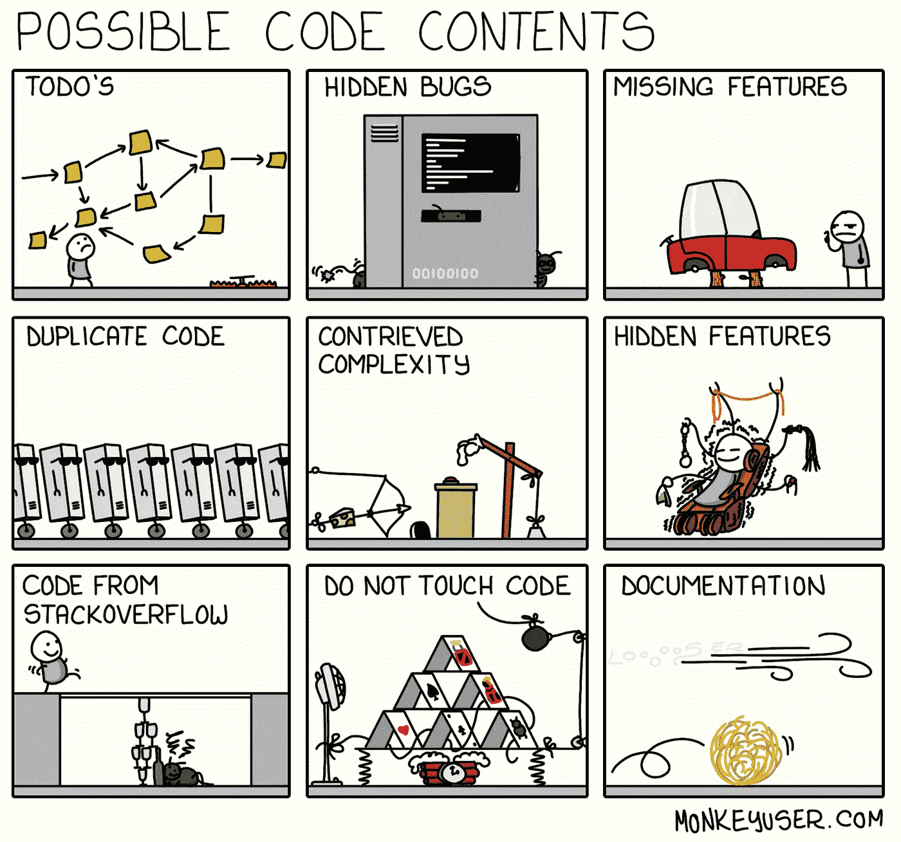
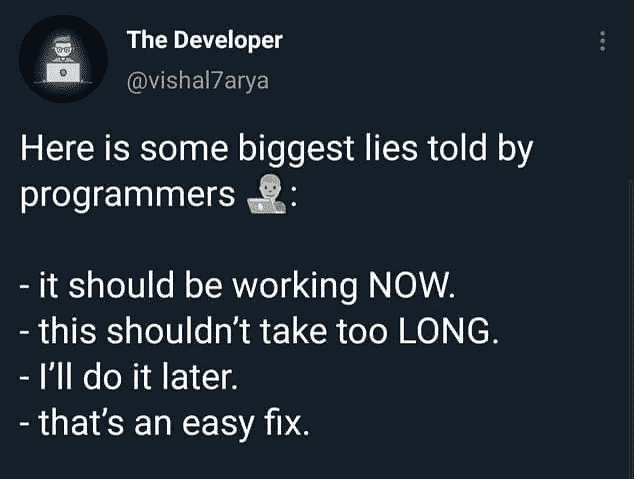

# 日常的编程笑话

> 原文：<https://javascript.plainenglish.io/daily-dose-of-programming-jokes-6541eba98194?source=collection_archive---------7----------------------->

## 日常节目幽默

## 最佳编程迷因汇编(第 4 部分)

Photo by [Caroline Hernandez](https://unsplash.com/@carolinehdz?utm_source=medium&utm_medium=referral) on [Unsplash](https://unsplash.com?utm_source=medium&utm_medium=referral)

***模因和快乐有什么联系吗？*** 如果你是我这种类型的人，那么你可能也爱在下班后查看手机。猜猜我在那里看到了什么？

我主要是在互联网上看到**视频、抖音和模因**。我不知道为什么，但这有助于我提神醒脑，减轻工作压力。这就是为什么我相信 *laugher 是人类最好的刷新按钮。*

在这篇文章中，我收集了一些我喜欢的网络迷因。

# 什么是递归？一个简单的答案。

[https://devrant.com/rants/1052316/this-is-how-recursive-functions-works](https://devrant.com/rants/1052316/this-is-how-recursive-functions-works)

# 其他人做的吗？

[https://www.facebook.com/photo/?fbid=2626573337649221&set=gm.2879879672279583](https://www.facebook.com/photo/?fbid=2626573337649221&set=gm.2879879672279583)

# 这是讽刺吗？是的…哈哈

[https://www.facebook.com/yuva.krishna.memes/photos/a.105527467815845/374844090884180/](https://www.facebook.com/yuva.krishna.memes/photos/a.105527467815845/374844090884180/)

# 一切皆有可能…什么都没有定义…一个晚上有几个小时？

[https://www.facebook.com/yuva.krishna.memes/photos/a.105527467815845/374439034258019/](https://www.facebook.com/yuva.krishna.memes/photos/a.105527467815845/374439034258019/)

# 我做了一些有用的事情，现在我可以把它添加到我的简历中

[https://www.facebook.com/jokesvala/photos/a.2330223400336101/6283529831672085/](https://www.facebook.com/jokesvala/photos/a.2330223400336101/6283529831672085/)

# 哇…这种感觉…

[https://www.facebook.com/photo/?fbid=10165386371885383&set=gm.837026157016641](https://www.facebook.com/photo/?fbid=10165386371885383&set=gm.837026157016641)

# 在 StackOverflow 上有人帮了你之后，世界是如此美好…

[https://www.facebook.com/jokesvala/photos/a.2330223400336101/6283493258342409/](https://www.facebook.com/jokesvala/photos/a.2330223400336101/6283493258342409/)

# 上传文件的物理方式是什么？

[https://www.facebook.com/Septatec/photos/a.3294457633926346/4250075005031266/](https://www.facebook.com/Septatec/photos/a.3294457633926346/4250075005031266/)

# 嗯…希望不会发生在任何人身上…如果是这样，这篇文章会对你有很大帮助…

[https://www.facebook.com/yuva.krishna.memes/photos/a.105527467815845/374823690886220/](https://www.facebook.com/yuva.krishna.memes/photos/a.105527467815845/374823690886220/)

# 谁干的？

[https://www.facebook.com/yuva.krishna.memes/photos/a.105527467815845/373596757675580/](https://www.facebook.com/yuva.krishna.memes/photos/a.105527467815845/373596757675580/)

# 调试就是以这样一种方式挤进去，缺陷会自己被注意到…

[https://www.facebook.com/yuva.krishna.memes/photos/a.105527467815845/373561211012468/](https://www.facebook.com/yuva.krishna.memes/photos/a.105527467815845/373561211012468/)

# 奖励时间:

# 我还没想到土豆的这种深层次的激励信息…

[https://www.facebook.com/javascriptJS/photos/a.1387402908063976/2154381918032734/](https://www.facebook.com/javascriptJS/photos/a.1387402908063976/2154381918032734/)

# 乍一看，对我来说是一样的..然后发现括号是如何处理的…太旧了，可能因为我们现在已经格式化了…

[https://www.facebook.com/groups/programming.jokes](https://www.facebook.com/groups/programming.jokes)

# 当我的学长要求编写单元测试时…我相信我的程序也是这样做的…

[https://www.monkeyuser.com/](https://www.monkeyuser.com/)

# 语法错误，我们这里不这样做… python

Source:[https://www.facebook.com/programminggeeks.in](https://www.facebook.com/programminggeeks.in)

# 当你想象编程术语在我脑海中的样子…

[https://www.monkeyuser.com/](https://www.monkeyuser.com/)

# 可能需要两者的同等比例来平衡行业…

[https://www.facebook.com/techindustan/](https://www.facebook.com/techindustan/)

# 电影(三个白痴)中关于工资的一段很好的对话，非常适合软件行业…

[https://www.thecoderpedia.com/blog/programming-memes](https://www.thecoderpedia.com/blog/programming-memes)

# 谁能定义什么是最好的开发者？对我来说，大概是这样的…

[https://www.monkeyuser.com/](https://www.monkeyuser.com/)

# 当你和很多人打交道时…一切都是公平的…甚至谎言也是…哈哈

[https://www.facebook.com/javascriptJS/photos/a.1387402908063976/2150614578409468/](https://www.facebook.com/javascriptJS/photos/a.1387402908063976/2150614578409468/)

# 最糟糕的时刻是当你的上司要求一起审查我的代码，因为他不明白其中的任何东西…

[https://www.facebook.com/ProgrammersCreateLife](https://www.facebook.com/ProgrammersCreateLife)

# 请随意分享您宝贵的掌声和评论，这样我就可以在未来提供更多类似的内容。

 [## 11 个让你笑死的编程笑话

### 2021 年最佳编程迷因

javascript.plainenglish.io](/11-programming-jokes-that-will-make-you-die-laughing-df41d5547f11)  [## 2021 年最佳编程幽默汇编

### 编程迷因可以减轻你的压力

blog.devgenius.io](https://blog.devgenius.io/best-programming-humor-compilations-2021-623473bfb0d)  [## 有趣的编程迷因会让你笑死

### 编笑话来点亮你的周五

blog.devgenius.io](https://blog.devgenius.io/funny-programming-memes-that-will-make-you-die-laughing-1ccd8e139040)  [## 编程迷因和幸福之间的联系

### 2021 年最佳编程迷因汇编

blog.devgenius.io](https://blog.devgenius.io/the-connection-between-programming-memes-and-happiness-d768ab85b83d)  [## 10 个能让你心情轻松的最佳编程笑话

### 你读过的关于编程迷因 2021 的最不可思议的文章

medium.com](https://medium.com/geekculture/10-best-programming-jokes-to-lighten-up-your-mood-8870dab2bff7)  [## 日常的编程笑话

### 最佳编程迷因汇编(第 1 部分)

javascript.plainenglish.io](/daily-dose-of-programming-jokes-cb9b74fcfa2e) 

*更多内容看*[***plain English . io***](http://plainenglish.io/)