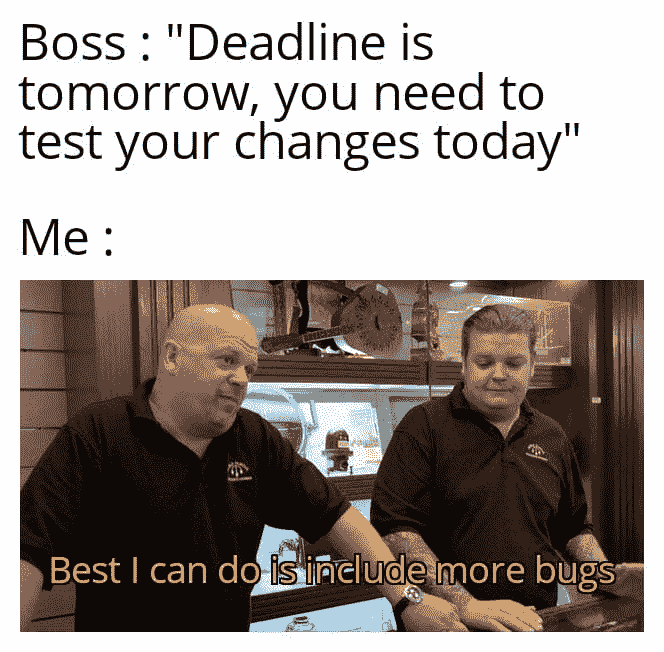
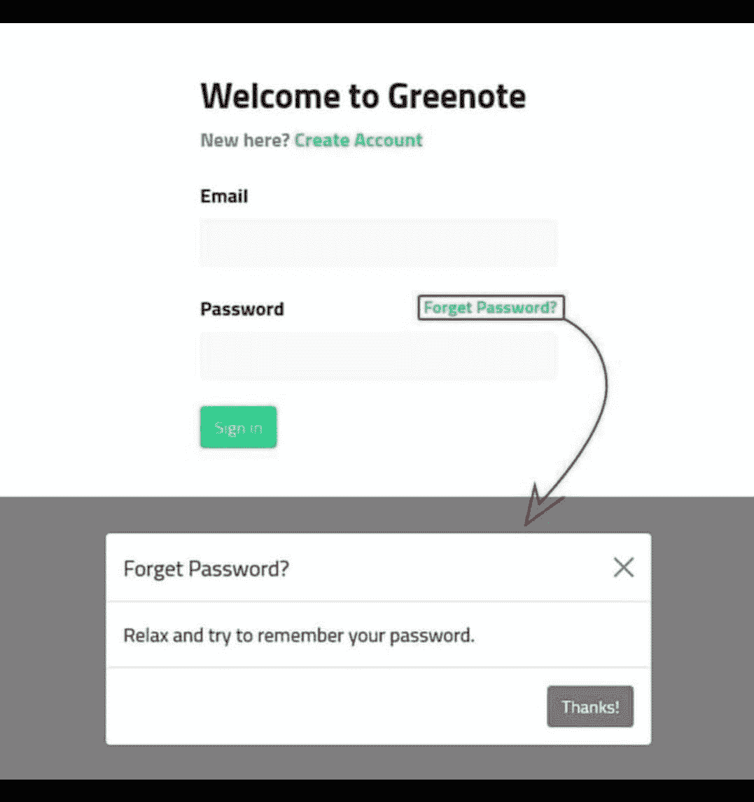
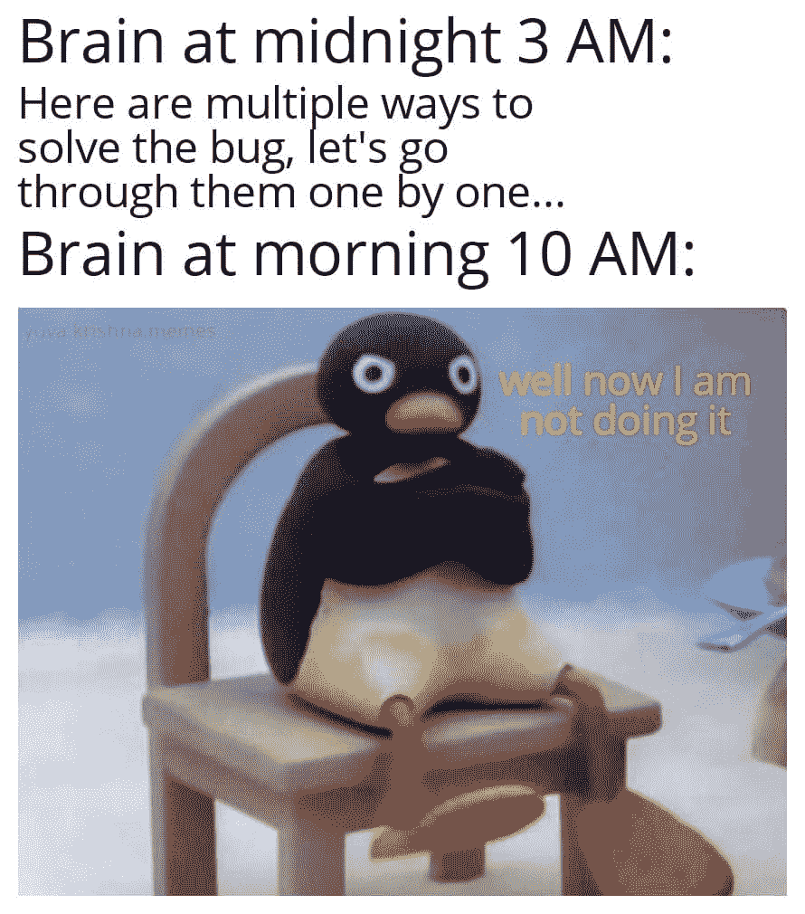
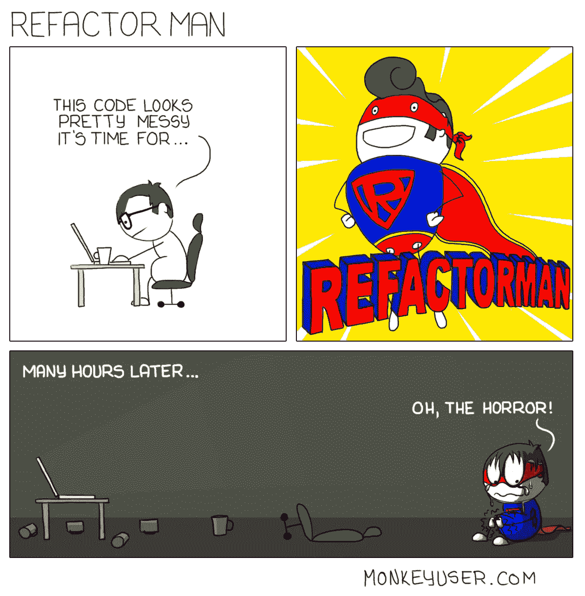
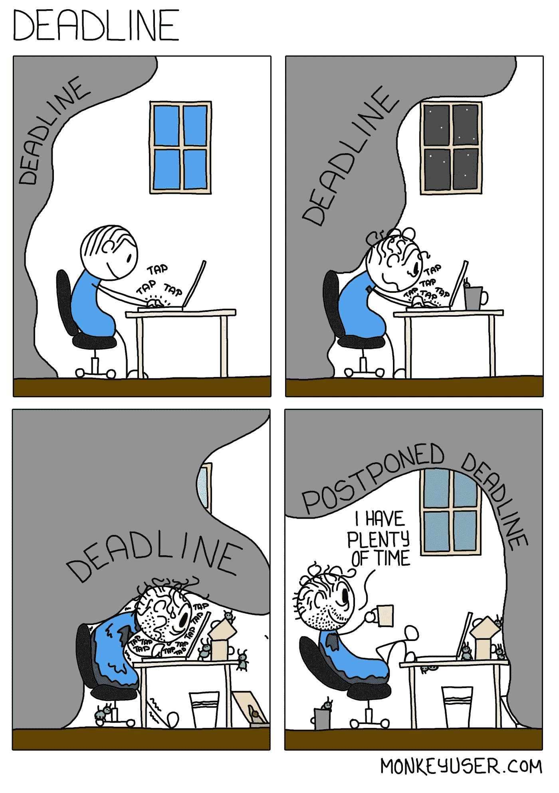
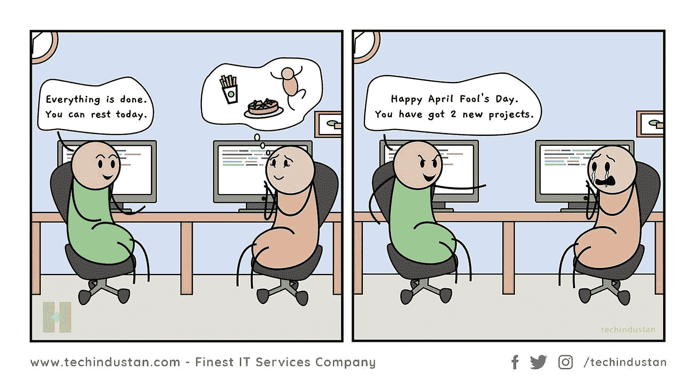

# 日常的编程笑话

> 原文：<https://javascript.plainenglish.io/daily-dose-of-programming-jokes-667fa12966bc?source=collection_archive---------1----------------------->

## 程序员的周一动机

## 最佳编程迷因汇编(第 9 部分)

Photo by [Aedrian](https://unsplash.com/@aedrian?utm_source=medium&utm_medium=referral) on [Unsplash](https://unsplash.com?utm_source=medium&utm_medium=referral)

***模因和快乐有什么联系吗？*** 如果你是我这种类型的人，那么你可能也爱在下班后查看手机。猜猜我在那里看到了什么？

我主要是在互联网上看到**视频、抖音和模因**。我不知道为什么，但这有助于我提神醒脑，减轻工作压力。这就是为什么我相信 *laugher 是人类最好的刷新按钮。*

在这篇文章中，我收集了一些我喜欢的网络迷因。

# “我能做的最好的事是……”——《典当之星》中最好的对白之一

[https://www.facebook.com/jokesvala/photos/a.2330223400336101/6284001301624938/](https://www.facebook.com/jokesvala/photos/a.2330223400336101/6284001301624938/)

# 不要担心…我们稍后会修复缺陷...让我们把重点放在特性上…

[https://www.facebook.com/jokesvala/photos/a.2330223400336101/6283984434959958/](https://www.facebook.com/jokesvala/photos/a.2330223400336101/6283984434959958/)

# 我感觉很幸运…哈哈

[https://www.reddit.com/r/ProgrammerHumor/comments/ort8im/i_got_your_back/](https://www.reddit.com/r/ProgrammerHumor/comments/ort8im/i_got_your_back/)

# 感觉棒极了…因为我现在必须开始…

[https://www.reddit.com/r/ProgrammerHumor/comments/oryzuy/github_stars_be_like/](https://www.reddit.com/r/ProgrammerHumor/comments/oryzuy/github_stars_be_like/)

# 如何知道自己写的代码好不好？让我们来看一个最好的测量结果…

[https://www.reddit.com/r/ProgrammerHumor/comments/os2nf8/how_code_reviews_happens/](https://www.reddit.com/r/ProgrammerHumor/comments/os2nf8/how_code_reviews_happens/)

# 如果你成为项目经理…

[https://www.reddit.com/r/ProgrammerHumor/comments/orwx1p/when_you_get_promoted_as_subproject_manager/](https://www.reddit.com/r/ProgrammerHumor/comments/orwx1p/when_you_get_promoted_as_subproject_manager/)

# 我知道捷径…但有时会出错…

[https://www.facebook.com/yuva.krishna.memes/photos/a.105527467815845/379862280382361/](https://www.facebook.com/yuva.krishna.memes/photos/a.105527467815845/379862280382361/)

# 填空:你正在编写真正的代码

[https://www.facebook.com/yuva.krishna.memes/photos/a.105527467815845/379491883752734/](https://www.facebook.com/yuva.krishna.memes/photos/a.105527467815845/379491883752734/)

# 当 BA 要求您添加您想要的文本时…

[https://www.facebook.com/photo/?fbid=2950599335268534&set=gm.6472478532777876](https://www.facebook.com/photo/?fbid=2950599335268534&set=gm.6472478532777876)

# 奖励时间:

# LOL…在拥有严格的开发模式之前，这是我代码的内部状态…当一个新变量加入未使用的变量时…

[https://www.facebook.com/photo?fbid=899897387465482&set=gm.2799768736940435](https://www.facebook.com/photo?fbid=899897387465482&set=gm.2799768736940435)

# 作为一名初级开发人员，我学到的第一件事就是不要碰工作正常的东西…这会增加重新测试的工作量，还会损坏其他东西…

[https://www.facebook.com/javascriptJS/photos/1861659490638313](https://www.facebook.com/javascriptJS/photos/1861659490638313)

# 有时候我的 div 元素隐藏的方式让 z-index 也无济于事…:)

[https://www.facebook.com/javascriptJS/photos/1599789793491952](https://www.facebook.com/javascriptJS/photos/1599789793491952)

# 当你看到这段对话时，你有没有更深入地思考这个问题？可能电脑在问大家关于它的家庭…谁知道…

[https://www.thecoderpedia.com/blog/programming-memes/](https://www.thecoderpedia.com/blog/programming-memes/)

# 如果一个常见的编码问题以这种方式问你会怎么样？

[https://www.facebook.com/DZoneInc/photos/10158915022879712](https://www.facebook.com/DZoneInc/photos/10158915022879712)

# 当我陷入某事时，我的大脑认为没有什么比满足感更重要…

[https://www.facebook.com/groups/programming.jokes](https://www.facebook.com/groups/programming.jokes)

# 你见过能帮助重构的超级英雄吗？抱歉，还没有人存在…

[https://www.monkeyuser.com/](https://www.monkeyuser.com/)

# 总是关注你所有行动的客户…

Source:[https://www.facebook.com/programminggeeks.in](https://www.facebook.com/programminggeeks.in)

# 当我的截止日期延长时，我也有同样的感觉..最佳水平的拖延症…

[https://www.monkeyuser.com/](https://www.monkeyuser.com/)

# 愚人节玩笑？是的，这可以适用于任何一个月…哈哈

[https://www.facebook.com/techindustan/](https://www.facebook.com/techindustan/)

# 我不需要你，让我放下你，伙计…

[https://www.reddit.com/r/ProgrammerHumor/comments/oo16aa/im_sorry_dear_data/](https://www.reddit.com/r/ProgrammerHumor/comments/oo16aa/im_sorry_dear_data/)

# 不要教我写了什么，哈哈

[https://www.reddit.com/r/ProgrammerHumor/comments/oo4ttu/perplexed_obama/](https://www.reddit.com/r/ProgrammerHumor/comments/oo4ttu/perplexed_obama/)

# 需要经历几个阶段？

[https://www.monkeyuser.com/2017/code-review-stages/?sc=true&dir=random](https://www.monkeyuser.com/2017/code-review-stages/?sc=true&dir=random)

# 我还没想到土豆的这种深层次的激励信息…

[https://www.facebook.com/javascriptJS/photos/a.1387402908063976/2154381918032734/](https://www.facebook.com/javascriptJS/photos/a.1387402908063976/2154381918032734/)

# 乍一看，对我来说是一样的..然后发现括号是如何处理的…太旧了，可能因为我们现在已经格式化了…

[https://www.facebook.com/groups/programming.jokes](https://www.facebook.com/groups/programming.jokes)

# 当我的学长要求编写单元测试时…我相信我的程序也是这样做的…

[https://www.monkeyuser.com/](https://www.monkeyuser.com/)

# 语法错误，我们这里不这样做… python

Source:[https://www.facebook.com/programminggeeks.in](https://www.facebook.com/programminggeeks.in)

# 当你想象编程术语在我脑海中的样子…

[https://www.monkeyuser.com/](https://www.monkeyuser.com/)

# 可能需要两者的同等比例来平衡行业…

[https://www.facebook.com/techindustan/](https://www.facebook.com/techindustan/)

# 电影(三个白痴)中关于工资的一段很好的对话，非常适合软件行业…

[https://www.thecoderpedia.com/blog/programming-memes](https://www.thecoderpedia.com/blog/programming-memes)

# 谁能定义什么是最好的开发者？对我来说，大概是这样的…

[https://www.monkeyuser.com/](https://www.monkeyuser.com/)

# 当你和很多人打交道时…一切都是公平的…甚至谎言也是…哈哈

[https://www.facebook.com/javascriptJS/photos/a.1387402908063976/2150614578409468/](https://www.facebook.com/javascriptJS/photos/a.1387402908063976/2150614578409468/)

# 最糟糕的时刻是当你的学长要求一起审查我的代码，因为他什么也不懂…

[https://www.facebook.com/ProgrammersCreateLife](https://www.facebook.com/ProgrammersCreateLife)

# 进一步阅读

 [## 日常的编程笑话

### 最佳编程迷因汇编(第 4 部分)

javascript.plainenglish.io](/daily-dose-of-programming-jokes-6541eba98194)  [## 2021 年最佳编程幽默汇编

### 编程迷因可以减轻你的压力

blog.devgenius.io](https://blog.devgenius.io/best-programming-humor-compilations-2021-623473bfb0d)  [## 有趣的编程迷因会让你笑死

### 编笑话来点亮你的周五

blog.devgenius.io](https://blog.devgenius.io/funny-programming-memes-that-will-make-you-die-laughing-1ccd8e139040)  [## 编程迷因和幸福之间的联系

### 2021 年最佳编程迷因汇编

blog.devgenius.io](https://blog.devgenius.io/the-connection-between-programming-memes-and-happiness-d768ab85b83d)  [## 10 个能让你心情轻松的最佳编程笑话

### 你读过的关于编程迷因 2021 的最不可思议的文章

medium.com](https://medium.com/geekculture/10-best-programming-jokes-to-lighten-up-your-mood-8870dab2bff7)  [## 日常的编程笑话

### 最佳编程迷因汇编(第 1 部分)

javascript.plainenglish.io](/daily-dose-of-programming-jokes-cb9b74fcfa2e) 

*更多内容看*[***plain English . io***](http://plainenglish.io/)