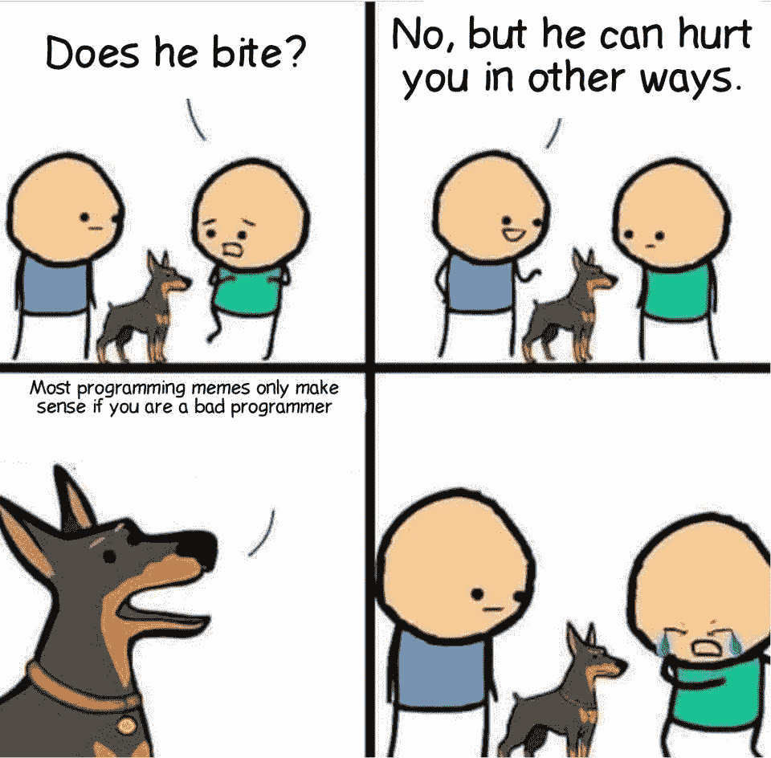
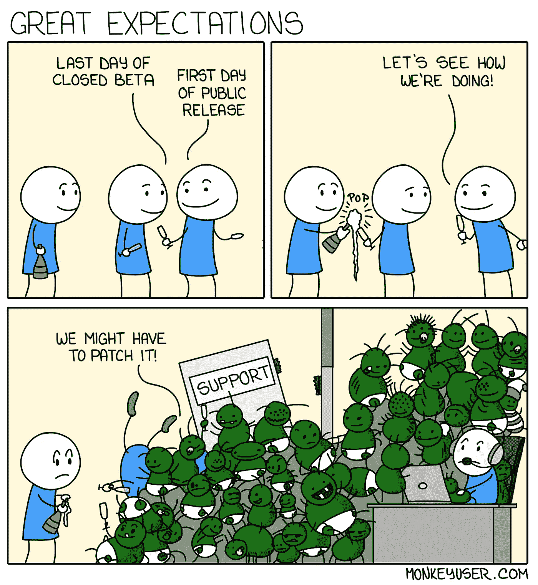
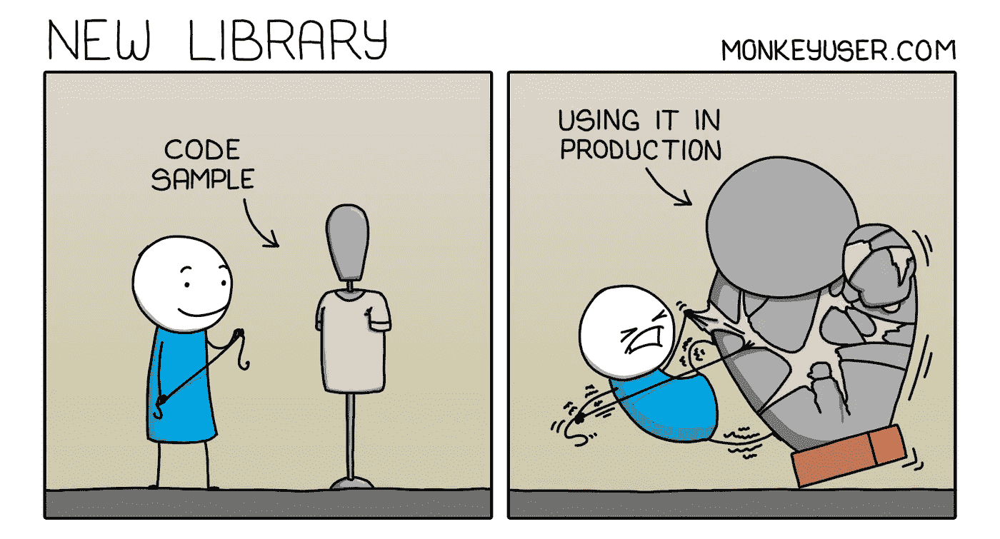

# 日常的编程笑话

> 原文：<https://javascript.plainenglish.io/daily-dose-of-programming-jokes-78c572b9f7f8?source=collection_archive---------5----------------------->

## 程序员的周五动机

## 最佳编程迷因汇编(第 10 部分)

Photo by [Tim Mossholder](https://unsplash.com/@timmossholder?utm_source=medium&utm_medium=referral) on [Unsplash](https://unsplash.com?utm_source=medium&utm_medium=referral)

***模因和快乐有什么联系吗？*** 如果你是我这种类型的人，那么你可能也爱在下班后查看手机。猜猜我在那里看到了什么？

我主要是在互联网上看到**视频、抖音和模因**。我不知道为什么，但这有助于我提神醒脑，减轻工作压力。这就是为什么我相信 *laugher 是人类最好的刷新按钮。*

在这篇文章中，我收集了一些我喜欢的网络迷因。

# 你感觉到任何超自然现象吗？每个人肯定都感受过一次…

[https://www.facebook.com/photo?fbid=2965032800448974&set=gm.2890010224599861](https://www.facebook.com/photo?fbid=2965032800448974&set=gm.2890010224599861)

# 哈哈…只是为了好玩…

[https://www.facebook.com/photo/?fbid=1282456812216206&set=gm.2886904718243745](https://www.facebook.com/photo/?fbid=1282456812216206&set=gm.2886904718243745)

# 金钱是第一动机…

[https://www.facebook.com/yuva.krishna.memes/photos/a.105527467815845/382625006772755/](https://www.facebook.com/yuva.krishna.memes/photos/a.105527467815845/382625006772755/)

# 聪明的家伙…

[https://www.facebook.com/yuva.krishna.memes/photos/a.105527467815845/382621070106482/](https://www.facebook.com/yuva.krishna.memes/photos/a.105527467815845/382621070106482/)

# 我们这里不这样做…

[https://www.facebook.com/yuva.krishna.memes/photos/a.105527467815845/382616893440233/](https://www.facebook.com/yuva.krishna.memes/photos/a.105527467815845/382616893440233/)

# 让我们看看你是否能猜出接下来的两个…

[https://www.facebook.com/yuva.krishna.memes/photos/a.105527467815845/382604443441478/](https://www.facebook.com/yuva.krishna.memes/photos/a.105527467815845/382604443441478/)

# 是的…我是值得的…

[https://www.reddit.com/r/ProgrammerHumor/comments/otsz33/reading_your_old_code/](https://www.reddit.com/r/ProgrammerHumor/comments/otsz33/reading_your_old_code/)

# 你有过类似的感觉吗？

[https://www.reddit.com/r/ProgrammerHumor/comments/otk8r3/me_choosing_stack_overflow_answers/](https://www.reddit.com/r/ProgrammerHumor/comments/otk8r3/me_choosing_stack_overflow_answers/)

# 这里缺少了一些东西…请在评论中告诉我…

[https://www.facebook.com/photo?fbid=3863966907046367&set=gm.844650382920885](https://www.facebook.com/photo?fbid=3863966907046367&set=gm.844650382920885)

# 我太老了…

[https://www.facebook.com/photo/?fbid=4220391241333272&set=gm.6478381755520887](https://www.facebook.com/photo/?fbid=4220391241333272&set=gm.6478381755520887)

# 奖励时间:

# 他们嫉妒我的幸福

[https://www.reddit.com/r/ProgrammerHumor/comments/oiiwi3/there_goes_away_one_more_sunday/](https://www.reddit.com/r/ProgrammerHumor/comments/oiiwi3/there_goes_away_one_more_sunday/)

# 不正确，但是让我们想想…

[https://www.reddit.com/r/ProgrammerHumor/comments/oinxee/the_truth_can_hurt_sometimes/](https://www.reddit.com/r/ProgrammerHumor/comments/oinxee/the_truth_can_hurt_sometimes/)

# 我到底做了什么来解决这个问题…也许什么也没做…

[https://www.reddit.com/r/ProgrammerHumor/comments/oimbw6/things_that_magically_work_but_you_dont_know_why/](https://www.reddit.com/r/ProgrammerHumor/comments/oimbw6/things_that_magically_work_but_you_dont_know_why/)

# 你需要学习交易…来处理 API

[https://www.reddit.com/r/ProgrammerHumor/comments/ohh9nv/200_ok/](https://www.reddit.com/r/ProgrammerHumor/comments/ohh9nv/200_ok/)

# 还有谁会因为认为警告有助于节省时间而忽视警告呢？

[https://www.reddit.com/r/ProgrammerHumor/comments/ofeexz/inner_peace/](https://www.reddit.com/r/ProgrammerHumor/comments/ofeexz/inner_peace/)

# 单元测试意味着增加覆盖率……(有时)

[https://www.reddit.com/r/ProgrammerHumor/](https://www.reddit.com/r/ProgrammerHumor/)

# 人工智能出错

[https://www.reddit.com/r/ProgrammerHumor/comments/ojf2eu/ai/](https://www.reddit.com/r/ProgrammerHumor/comments/ojf2eu/ai/)

# 重新编译…我怎么总是忘记？

[https://www.reddit.com/r/ProgrammerHumor/comments/ojdicf/it_happened_more_than_once/](https://www.reddit.com/r/ProgrammerHumor/comments/ojdicf/it_happened_more_than_once/)

# 一些噩梦…还是现实？

[https://www.monkeyuser.com/2019/great-expectations/?sc=true&dir=random](https://www.monkeyuser.com/2019/great-expectations/?sc=true&dir=random)

# 你最喜欢哪一个？我以前有一个新的文件夹系列…

[https://www.reddit.com/r/ProgrammerHumor/comments/ojxtdg/git/](https://www.reddit.com/r/ProgrammerHumor/comments/ojxtdg/git/)

# 有史以来最好的编程回复…对面可怜的人…

[https://www.facebook.com/photo/?fbid=1200115330452532&set=gm.2876702175930666](https://www.facebook.com/photo/?fbid=1200115330452532&set=gm.2876702175930666)

# 当我获得 Windows 更新时，我也有同样的感觉…

[https://www.facebook.com/photo?fbid=1070897396773567&set=gm.6406455706046826](https://www.facebook.com/photo?fbid=1070897396773567&set=gm.6406455706046826)

# 你是人类吗？是的，我确实注意到了一些小事…

[https://www.facebook.com/BlaxkerHacker/photos/a.122991386210034/333988921776945/](https://www.facebook.com/BlaxkerHacker/photos/a.122991386210034/333988921776945/)

# 每当我被从库中看到的简单代码所吸引，一旦我开始使用它…

[https://www.monkeyuser.com/2021/new-library/](https://www.monkeyuser.com/2021/new-library/)

# 黑暗模式是生活…

[https://www.reddit.com/r/ProgrammerHumor/comments/ojvsfq/light_attracts_bugs/](https://www.reddit.com/r/ProgrammerHumor/comments/ojvsfq/light_attracts_bugs/)

# 我绝对需要全部…

[https://twitter.com/PR0GRAMMERHUM0R/status/1415295034891591688/photo/1](https://twitter.com/PR0GRAMMERHUM0R/status/1415295034891591688/photo/1)

# JAVA 程序员就像…

[https://programmerhumor.io/programming-memes/thats-wrong-boy/](https://programmerhumor.io/programming-memes/thats-wrong-boy/)

# 当产品负责人不理解技术依赖并提出需求时…

[https://programmerhumor.io/programming-memes/his-product-owner-clearly-didnt-understand-what-a-technical-dependency-was-during-spring-gooming/](https://programmerhumor.io/programming-memes/his-product-owner-clearly-didnt-understand-what-a-technical-dependency-was-during-spring-gooming/)

# 进一步阅读

 [## 日常的编程笑话

### 最佳编程迷因汇编(第 4 部分)

javascript.plainenglish.io](/daily-dose-of-programming-jokes-6541eba98194)  [## 2021 年最佳编程幽默汇编

### 编程迷因可以减轻你的压力

blog.devgenius.io](https://blog.devgenius.io/best-programming-humor-compilations-2021-623473bfb0d)  [## 有趣的编程迷因会让你笑死

### 编笑话来点亮你的周五

blog.devgenius.io](https://blog.devgenius.io/funny-programming-memes-that-will-make-you-die-laughing-1ccd8e139040)  [## 编程迷因和幸福之间的联系

### 2021 年最佳编程迷因汇编

blog.devgenius.io](https://blog.devgenius.io/the-connection-between-programming-memes-and-happiness-d768ab85b83d)  [## 10 个能让你心情轻松的最佳编程笑话

### 你读过的关于编程迷因 2021 的最不可思议的文章

medium.com](https://medium.com/geekculture/10-best-programming-jokes-to-lighten-up-your-mood-8870dab2bff7)  [## 日常的编程笑话

### 最佳编程迷因汇编(第 1 部分)

javascript.plainenglish.io](/daily-dose-of-programming-jokes-cb9b74fcfa2e) 

*更多内容请看*[***plain English . io***](http://plainenglish.io/)